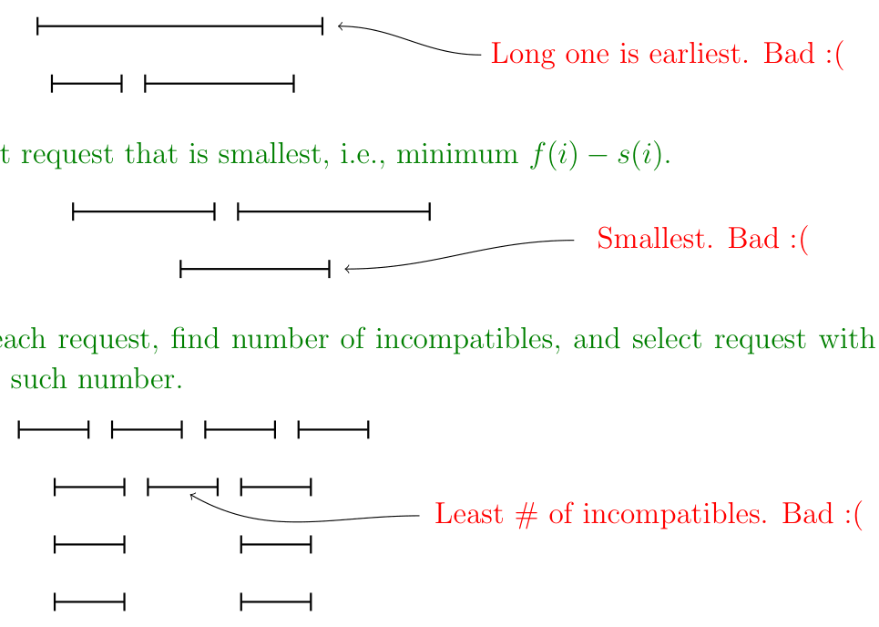

<!-- ===== PDF p1 ===== -->

<span style="color:#c0392b;">**6.046J / 18.410J　算法设计与分析（Design and Analysis of Algorithms）**</span>

<span style="color:#c0392b;">**讲次 1（Lecture 1）：引言（Introduction）**</span> <span style="color:#7f8c8d;">（Spring 2015，2015 春季学期）</span>

<span style="color:#2471a3;">**[section]**</span> <span style="color:#00838f;">**6.006 前置要求（pre-requisite）**</span>

6.006 课程的前置知识包括：
- 数据结构（data structures）：堆（heaps）、树（trees）、图（graphs）等；
- 算法（algorithms）：排序（sorting）、最短路（shortest paths）、图搜索（graph search）、动态规划（dynamic programming）等。

<span style="color:#2471a3;">**[section]**</span> <span style="color:#00838f;">**课程概览（Course Overview）**</span>

本课程涵盖若干模块（modules）：

1. 分治（Divide and Conquer）——FFT、随机化算法（randomized algorithms）
2. 优化（Optimization）——贪心（greedy）与动态规划
3. 网络流（Network Flow）
4. 难解性（Intractibility，以及如何应对它）
5. 线性规划（Linear programming）
6. 次线性算法（sublinear algorithms）、近似算法（approximation algorithms）
7. 高级专题（Advanced topics）

<span style="color:#2471a3;">**[section]**</span> <span style="color:#00838f;">**今日讲次的主题（Theme of today's lecture）**</span>

非常相似的问题可以具有非常不同的复杂度（complexity）。回顾：

- **P**：能在多项式时间（polynomial time）内求解的问题类，即对某个常数 $k$ 有 $O(n^k)$。例如，图（graph）中的最短路（shortest paths）可以在 $O(V^2)$ 内求出。
- **NP**：能在多项式时间内验证（verifiable）的问题类。有向图（directed graph）$G(V, E)$ 中的哈密顿回路（Hamiltonian cycle）是包含 $V$ 中每个顶点（vertex）的简单回路（simple cycle）。判定一个图是否存在哈密顿回路是 NP-complete 的，但验证一条回路确实是哈密顿回路却很容易。
- **NP-complete**：问题属于 NP，且与 NP 中任何问题一样难（as hard as any problem in NP）。如果任何 NPC 问题都能在多项式时间内求解，那么 NP 中的每个问题都有多项式时间解。

🎥 *Srinivas Devadas 在视频开头即点出本讲要传达的核心直觉*："very small changes in problem statements can end up with very different situations."（翻译：问题表述上的微小改动，最终可能导向截然不同的处境。）——这正是本讲「区间调度 vs 加权区间调度 vs 非相同机器」三连对比的用意所在。

> <span style="color:#1e8449;">**[note] Note（译者注）:**</span> P 与 NP 的直观区分是「求解 vs 验证」：P 类问题能在多项式时间内**找到**答案，NP 类问题只要求在给出一条候选解时能**快速核对**它是否正确。哈密顿回路是经典例子——要在 $n$ 个顶点里找出经过每个顶点恰好一次的回路，看起来要穷举 $n!$ 种顺序；但若有人给你一条回路，你只需要 $O(n)$ 时间就能检查它是否合法。这个「验证容易、求解可能困难」的落差，正是你在 6.006（CLRS 第 34 章 NP 完全性）里会正式建立的核心概念；本讲不展开证明，只把它当作「为什么有些问题难」的背景坐标。注意「NPC 可解 ⇒ 一切 NP 可解」是个蕴含方向：它说的不是「NPC 必须难」，而是「NPC 是 NP 中难度天花板」。

---

<!-- ===== PDF p2 ===== -->

<span style="color:#c0392b;">**区间调度（Interval Scheduling）**</span>

请求（requests）$1, 2, \ldots, n$，共享单一资源（single resource）。

- $s(i)$ 表示开始时间（start time），$f(i)$ 表示结束时间（finish time），且 $s(i) < f(i)$（对任意请求，开始时间必须小于结束时间）。
- 两个请求 $i$ 和 $j$ 是兼容的（compatible），当且仅当它们不重叠（don't overlap），即 $f(i) \le s(j)$ 或 $f(j) \le s(i)$。

在下图中，请求 2 与 3 兼容，请求 4、5、6 也彼此兼容；但请求 2 与 4 不兼容。

> <span style="color:#7f8c8d;">[原图说明] 原页附图给出 6 个请求区间（编号 1–6）的时间轴示意：1 与 2 重叠、2 与 3 恰好首尾相接（兼容）、4 与 5 与 6 依次排开互不重叠。图中用于直观展示「兼容」与「不兼容」的几何含义。</span>

<span style="color:#2471a3;">**[goal]**</span> 目标（Goal）：选择**大小最大**的兼容请求子集（compatible subset of requests of maximum size）。

<span style="color:#2471a3;">**[claim]**</span> 声明（Claim）：我们可以用贪心算法（greedy algorithm）求解该问题。

贪心算法是**近视**（myopic）的算法：它一次处理一段输入，看不出明显的前瞻（look-ahead）。

🎥 *Devadas 在视频中[用开车比喻解释「近视」]*："As the name implies, it's something that's myopic. It doesn't look ahead. ... Traffic is a good example — don't let anybody cut in front of you. You've got some room up there. Get up there."（翻译：正如其名，贪心是近视的，它不向前看。……开车就是个好例子——别让任何人插到你前面。你前面有空当，就开上去。）

<span style="color:#2471a3;">**[algorithm]**</span> **贪心区间调度（Greedy Interval Scheduling）**

1. 用一条简单规则（simple rule）选出一个请求 $i$。
2. 拒绝（Reject）所有与 $i$ 不兼容的请求。
3. 重复（Repeat），直到所有请求都被处理完毕。

---

<!-- ===== PDF p3 ===== -->

<span style="color:#c0392b;">**可能的规则（Possible rules）？**</span>

1. 选择**最早开始**的请求，即 $s(i)$ 最小的请求。 <span style="color:#c0392b;">糟糕（Bad）: (</span>
2. 选择**最短**的请求，即 $f(i) - s(i)$ 最小的请求。 <span style="color:#c0392b;">糟糕（Bad）: (</span>
3. 对每个请求统计其不兼容请求数（number of incompatibles），选择该数**最小**的请求。 <span style="color:#c0392b;">糟糕（Bad）: (</span>
4. 选择**最早结束**的请求，即 $f(i)$ 最小的请求。



> <span style="color:#7f8c8d;">[原图说明] 原页附图对应前三种失败规则各给一个反例：规则 1 选中一条「长且早开始」的区间（遮挡其后的多个短区间）；规则 2 选中一条「最短但居中」的区间（左右两侧都堵死）；规则 3 选中「不兼容数最少」的区间（但仍可能堵住关键位置）。三种反例的共性都是「局部最优选择牺牲了整体容纳量」。</span>

<span style="color:#2471a3;">**[theorem]**</span> <span style="color:#c0392b;">**Claim 1（声明 1）.**</span> 贪心算法输出的区间列表（list of intervals）

```math
\langle s(i_1), f(i_1) \rangle,\ \langle s(i_2), f(i_2) \rangle,\ \ldots,\ \langle s(i_k), f(i_k) \rangle
```

满足

```math
s(i_1) < f(i_1) \le s(i_2) < f(i_2) \le \cdots \le s(i_k) < f(i_k).
```

<span style="color:#2471a3;">**[proof]**</span> *Proof（证明）.* 简单的反证法（proof by contradiction）——若 $f(i_j) > s(i_{j+1})$，则区间 $j$ 与 $j+1$ 相交（intersect），这与算法第 2 步矛盾（contradiction）！

> <span style="color:#7f8c8d;">[说明] Claim 1 的证明极简，但它确立的是「输出合法性」：贪心算法产生的候选解本身必须是一列互不重叠的区间。反证法在这里只用一个关键事实——算法第 2 步「拒绝所有不兼容请求」保证了相邻被选区间必然首尾不交。这个「算法构造天然保证合法性」的观察，是后面 Claim 2（最优性）证明的前提。</span>

<span style="color:#2471a3;">**[theorem]**</span> <span style="color:#c0392b;">**Claim 2（声明 2）.**</span> 给定区间列表 $L$，采用最早结束时间（earliest finish time）规则的贪心算法产生 $k^*$ 个区间，其中 $k^*$ 是最优值（optimal）。

<span style="color:#2471a3;">**[proof]**</span> *Proof（证明）.* 对 $k^*$ 作归纳（Induction on $k^*$）。

**基础情形（Base case）**：$k^* = 1$——此情形平凡（easy），任意一个区间都可行。

**归纳步（Inductive step）**：假设声明对 $k^*$ 成立，并给定一个区间列表，其最优调度（optimal schedule）含 $k^* + 1$ 个区间，即

```math
S^{*}[1, 2, \ldots, k^{*} + 1] = \langle s(j_1), f(j_1) \rangle, \ldots, \langle s(j_{k^{*}+1}), f(j_{k^{*}+1}) \rangle
```

---

<!-- ===== PDF p4 ===== -->

<span style="color:#c0392b;">**Claim 2 证明（续）**</span>

设对某个一般的 $k$，贪心算法给出的区间列表为

```math
S[1, 2, \ldots, k] = \langle s(i_1), f(i_1) \rangle, \ldots, \langle s(i_k), f(i_k) \rangle
```

由构造方式（By construction），我们知道 $f(i_1) \le f(j_1)$，因为贪心算法挑选的是最早结束时间的区间。

现在我们可以构造一个调度（schedule）

```math
S^{**} = \langle s(i_1), f(i_1) \rangle,\ \langle s(j_2), f(j_2) \rangle,\ \ldots,\ \langle s(j_{k^{*}+1}), f(j_{k^{*}+1}) \rangle
```

因为区间 $\langle s(i_1), f(i_1) \rangle$ 与区间 $\langle s(j_2), f(j_2) \rangle$ 及其后的所有区间都不重叠。注意，由于 $S^{**}$ 的长度为 $k^{*} + 1$，这个调度也是最优的（optimal）。

接下来定义 $L'$ 为满足 $s(i) \ge f(i_1)$ 的区间集合（set of intervals）。

由于 $S^{**}$ 对 $L$ 是最优的，$S^{**}[2, 3, \ldots, k^{*}+1]$ 对 $L'$ 是最优的，这意味着 $L'$ 的最优调度规模为 $k^{*}$。

现在我们利用最初的归纳假设（inductive hypothesis）：在 $L'$ 上运行贪心算法应产生规模为 $k^{*}$ 的调度。因此，按我们的构造，在 $L'$ 上运行贪心算法给出 $S[2, \ldots, k]$。

这意味着 $k - 1 = k^{*}$（或等价地 $k = k^{*} + 1$），从而 $S[1, \ldots, k]$ 确实是最优的（optimal），证明完毕。

> <span style="color:#1e8449;">**[note] Note（译者注）:**</span> 这个证明是贪心正确性证明的经典模板——**交换论证（exchange argument）**。它的思路分三步：① 取贪心解 $S$ 与某个最优解 $S^*$，并让两者「对齐」：交换论证的第一步是把最优解的第一个区间 $j_1$ 换成贪心解的第一个区间 $i_1$，由于 $f(i_1) \le f(j_1)$，替换后解依然合法且规模不变；② 用归纳把「第一个区间已对齐」的好处传递下去，把原问题缩小到 $L'$（所有在 $f(i_1)$ 之后开始的区间）；③ 在 $L'$ 上递归套用同样论证，最终贪心解与最优解逐位一致。整套证明没有用任何「贪心选对了」的先验假设，而是证明「贪心每步的选择都不会劣于最优解」，这正是 6.042J 里你学过的强归纳（strong induction）在算法正确性上的直接应用。对比 CLRS §16.1 的活动选择问题（activity-selection problem），你会看到完全相同的「最早结束优先」策略与完全相同的交换论证——这个模板之后在最小生成树（Kruskal/Prim）、霍夫曼编码、Dijkstra 里会反复出现。

---

<!-- ===== PDF p5 ===== -->

<span style="color:#c0392b;">**加权区间调度（Weighted Interval Scheduling）**</span>

每个请求 $i$ 带有一个权重（weight）$w(i)$。目标是调度（schedule）一组互不重叠的请求子集，使其总权重最大（maximum weight）。

这里的一个关键观察（key observation）是：**贪心算法不再适用**（no longer works）。

<span style="color:#2471a3;">**[section]**</span> <span style="color:#00838f;">**动态规划（Dynamic Programming）**</span>

我们可以把子问题（sub-problems）定义为

```math
R_x = \{ j \in R \mid s(j) \ge x \}
```

其中 $R$ 是所有请求的集合。

若令 $x = f(i)$，则 $R_x$ 是「晚于请求 $i$」的请求集合（the set of requests later than request $i$）。

- 子问题总数（Total number of sub-problems）$= n$（每个请求对应一个）
- 每个子问题只需求解一次并记忆化（memoize）。

我们尝试把每个请求 $i$ 作为可能的第一个（first）。若挑选请求作为第一个，则剩余的请求为 $R_{f(i)}$。

> <span style="color:#7f8c8d;">[说明] 需要注意：即使存在与 $i$ 兼容、但不在 $R_{f(i)}$ 中的请求，我们仍把 $i$ 当作「第一个」请求，即按时间顺序推进。这是因为一旦选定第一个请求 $i$，所有开始时间早于 $f(i)$ 的请求都被排除，剩余的可行集就是 $R_{f(i)}$。</span>

<span style="color:#2471a3;">**[formula]**</span> **最优值递归（opt 递推）：**

```math
\mathrm{opt}(R) = \max_{1 \le i \le n} \big( w(i) + \mathrm{opt}(R_{f(i)}) \big)
```

总运行时间（Total running time）为 $O(n^2)$，因为每个子问题需要 $O(n)$ 时间来求解。

事实上，我们可以把整体复杂度降到 $O(n \log n)$。这一优化留作练习（exercise）。

> <span style="color:#1e8449;">**[note] Note（译者注）:**</span> 为什么加了权重贪心就失效？回顾规则 2 的「取最短」反例：在加权版里，一条「又长又重」的区间可能比许多条「短而轻」的区间更有价值，任何只看局部（长度、开始时间、结束时间）的贪心规则都会无视权重分布。动态规划的关键洞察是把问题**结构化**为「第一个请求选谁」：若选 $i$，收益就是 $w(i)$ 加上余下问题 $R_{f(i)}$ 的最优解——这形成了 $\mathrm{opt}(R) = \max_i(w(i) + \mathrm{opt}(R_{f(i)}))$ 的自相似递归，正是 6.006 里「子问题 + 记忆化（memoization）」的教科书案例（对应 CLRS §15.1 钢条切割与 §15.3 动态规划原理）。思考 $O(n^2) \to O(n \log n)$ 的优化方向：子问题间存在偏序（排序 + 二分查找），可以沿结束时间排序后用二分定位「不重叠的前驱」——这是 CLRS 里反复出现的「排序 + 二分把平方遍历降到对数」的通用优化手法（如最长递增子序列的 $O(n \log n)$ 解法），不过此处仅需意识到方向，不必现在完成。

---

<span style="color:#c0392b;">**非相同机器（Non-identical machines）**</span>

与之前一样，有 $n$ 个请求 $\{1, 2, \ldots, n\}$。每个请求 $i$ 关联一个开始时间 $s(i)$ 和一个结束时间 $f(i)$，并有 $m$ 种不同的机器类型（machine types）$\tau = \{T_1, \ldots, T_m\}$。

每个请求 $i$ 关联一个集合 $Q(i) \subseteq \tau$，表示请求 $i$ 可以**被服务**（can be serviced on）的机器集合。

每个请求权重为 1。我们希望最大化能在 $m$ 台机器上被调度的作业（jobs）数量。

- 该问题属于 **NP**，因为给定一个「作业 + 机器分配」的子集，我们可以明确地检查其合法性（legal）。
- 「能否调度 $k \le n$ 个请求？」——该**决策问题**是 **NP-complete**。
- 「应该调度的最大请求数是多少？」——该**优化问题**是 **NP-hard**。

<span style="color:#2471a3;">**[section]**</span> <span style="color:#00838f;">**应对难解性（Dealing with intractability）**</span>

1. **近似算法（Approximation algorithms）**：在多项式时间内保证达到最优解某个因子（factor）范围内。
2. **剪枝启发式（Pruning heuristics）**：在「真实世界」实例上减少（可能是指数级 exponential 的）运行时间。
3. **贪心或其它次优启发式（sub-optimal heuristics）**：在实践中表现良好，但不提供任何保证（guarantees）。

> <span style="color:#1e8449;">**[note] Note（译者注）:**</span> 这一节把本讲的「复杂度天壤之别」主题推到底：区间调度（贪心，$O(n \log n)$）→ 加权区间调度（DP，$O(n^2)$ 可优化到 $O(n \log n)$）→ 非相同机器（NP-complete/NP-hard），三者在问题描述上只差一点点，难度却从多项式跳到指数级。这里的 NP-hard vs NP-complete 区分值得记牢：NP-complete 是针对**决策问题**（是/否）的定义，而「求最大可调度数」是优化问题，它不在「验证一条答案」的框架里，所以称 NP-hard（不比 NP 中的任何问题容易，但未必属于 NP）。「应对难解性」的三条路（近似、剪枝、无保证启发式）正是后续讲次反复回扣的主题：近似算法（approximation algorithms）给出最坏情形保证，参数化算法（fixed-parameter algorithms）则把指数部分隔离到某个小参数上。

---

<!-- ===== PDF p6 ===== -->

<span style="color:#7f8c8d;">**MIT OpenCourseWare**</span>

<span style="color:#7f8c8d;">http://ocw.mit.edu</span>

<span style="color:#7f8c8d;">**6.046J / 18.410J 算法设计与分析（Design and Analysis of Algorithms）**</span>

<span style="color:#7f8c8d;">Spring 2015（2015 春季学期）</span>

<span style="color:#7f8c8d;">有关引用这些材料的信息或我们的使用条款（Terms of Use），请访问：http://ocw.mit.edu/terms。</span>
