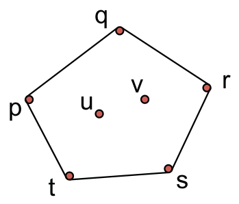
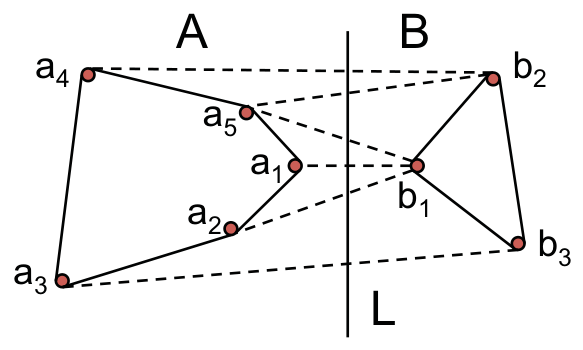
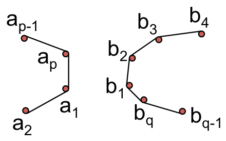
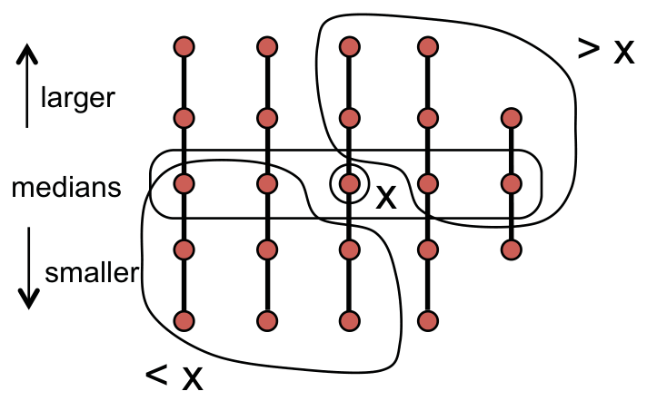
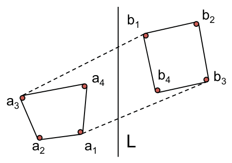

<!-- ===== PDF p1 ===== -->

<span style="color:#c0392b;">**讲次 2（Lecture 2）：分治（Divide and Conquer）**</span> <span style="color:#7f8c8d;">（Spring 2015，2015 春季学期）</span>

本讲大纲：
- 范式（Paradigm）
- 凸包（Convex Hull）
- 中位数查找（Median finding）

<span style="color:#2471a3;">**[section]**</span> <span style="color:#00838f;">**范式（Paradigm）**</span>

给定一个规模为 $n$ 的问题，把它分解为规模为 $\frac{n}{b}$ 的子问题（subproblems），其中 $a \ge 1,\ b > 1$。递归地（recursively）求解每个子问题，再把子问题的解合并（Combine）得到整体解。

```math
T(n) = aT\!\left(\frac{n}{b}\right) + [\text{合并的工作量 work for merge}]
```

<span style="color:#2471a3;">**[section]**</span> <span style="color:#00838f;">**凸包（Convex Hull）**</span>

给定平面上的 $n$ 个点

```math
S = \{(x_i, y_i) \mid i = 1, 2, \ldots, n\}
```

为方便起见，假设：任意两个点的 $x$ 坐标不同、任意两个点的 $y$ 坐标不同，且任意三点不共线（no three in a line）。

**凸包** $CH(S)$：包含 $S$ 中所有点的**最小多边形**（smallest polygon）。



> <span style="color:#7f8c8d;">[原图说明] 原页附图以点集 $\{p, q, r, s, t, u, v\}$ 示意：实线描出的多边形是它们的凸包，凸包顶点为其中一部分点，其余点位于多边形内部。图注还说明 $CH(S)$ 用边界上**顺时针顺序**（clockwise order）的点序列表示，存储为双向链表（doubly linked list）。</span>

---

<!-- ===== PDF p2 ===== -->

<span style="color:#c0392b;">**凸包（续）**</span>



> <span style="color:#7f8c8d;">[原图说明] 原页附图显示凸包的部分边界点 $p, q, r, s, t$，用于引出下面的暴力算法。</span>

<span style="color:#2471a3;">**[section]**</span> <span style="color:#00838f;">**凸包的暴力算法（Brute force for Convex Hull）**</span>

测试每一条线段（line segment），看它是否构成凸包的一条边（edge）：

- 若其余所有点都落在这条线段的**同一侧**（one side），则该线段位于凸包上。
- 否则，该线段不在凸包上。

共有 $O(n^2)$ 条边，每条边做 $O(n)$ 次测试 ⇒ 总复杂度 $O(n^3)$。

**我们能做得更好吗？**

<span style="color:#2471a3;">**[section]**</span> <span style="color:#00838f;">**分治凸包（Divide and Conquer Convex Hull）**</span>

- 按 $x$ 坐标对点排序（只排一次，$O(n \log n)$）。
- 对输入点集 $S$：
  - 按 $x$ 坐标把 $S$ 分为左半 $A$ 和右半 $B$（Divide，分解）。
  - 递归计算 $CH(A)$ 和 $CH(B)$（Conquer，征服）。
  - 把两半的凸包合并（merge step，合并步骤）。

<span style="color:#2471a3;">**[section]**</span> <span style="color:#00838f;">**如何合并（How to Merge）？**</span>

> <span style="color:#7f8c8d;">[原图说明] 原页附图：左凸包顶点 $a_1, a_2, \ldots, a_5$ 与右凸包顶点 $b_1, b_2, b_3$，$L$ 为分隔两半的竖直直线。图中标出两条关键连线：上切线（upper tangent, U.T.）$(a_4, b_2)$ 与下切线（lower tangent, L.T.）$(a_3, b_3)$。</span>

- 找到**上切线**（upper tangent）$(a_i, b_j)$。在示例中，$(a_4, b_2)$ 是 U.T.。
- 找到**下切线**（lower tangent）$(a_k, b_m)$。在示例中，$(a_3, b_3)$ 是 L.T.。

🎥 *Devadas 在视频中[强调合并是分治的精华所在]*："Generally, the divide and conquer, as I mentioned before, in most cases, the division is pretty straightforward. And that's the case here as well. **All the fun is going to be in the merge step.**"（翻译：正如我之前提到的，在大多数情况下，分解这一步都非常直接，这里也是如此。**所有的精彩都发生在合并步骤。**）——凸包正是「分解平凡、合并精巧」的典型：左右两个凸包各自递归算出，真正的技术含量在于如何把两条切线找出来。

---

<!-- ===== PDF p3 ===== -->

<span style="color:#c0392b;">**凸包合并（续）**</span>

- **剪切粘贴（Cut and paste）**，用时 $\Theta(n)$。
  先把 $a_i$ 连到 $b_j$，沿 $b$ 链表下行直到遇到 $b_m$，把 $b_m$ 连到 $a_k$，再沿 $a$ 链表继续走，直到回到 $a_i$。在示例中，这给出 $(a_4, b_2, b_3, a_3)$。

<span style="color:#2471a3;">**[section]**</span> <span style="color:#00838f;">**寻找切线（Finding Tangents）**</span>

假设 $a_i$ 是 $CH(A)$ 内 $x$ 坐标最大的点（$a_1, a_2, \ldots, a_p$），$b_1$ 是 $CH(B)$ 内 $x$ 坐标最小的点（$b_1, b_2, \ldots, b_q$）。

$L$ 是分隔 $A$ 与 $B$ 的竖直直线。定义 $y(i, j)$ 为直线 $L$ 与线段（segment）$(a_i, b_j)$ 的交点的 $y$ 坐标。

<span style="color:#2471a3;">**[claim]**</span> 声明（Claim）：$(a_i, b_j)$ 是上切线，当且仅当（iff）它**最大化** $y(i, j)$。

若 $y(i, j)$ 不是最大值，则线段 $(a_i, b_j)$ 两侧都有点，它不可能是切线（tangent）。

<span style="color:#2471a3;">**[algorithm]**</span> **算法：** 朴素的 $O(n^2)$ 算法会检查所有 $a_i, b_j$ 组合对，此时 $T(n) = 2T(n/2) + \Theta(n^2) = \Theta(n^2)$。

更好的做法——用「双指针」沿凸包边界移动：

```
1  i = 1
2  j = 1
3  while (y(i, j + 1) > y(i, j) 或  y(i - 1, j) > y(i, j))
4      if (y(i, j + 1) > y(i, j))    [ 右指针顺时针移动 move right finger clockwise
5          j = j + 1  (mod q)
6      else
7          i = i - 1  (mod p)        [ 左指针逆时针移动 move left finger anti-clockwise
8  return (a_i, b_j) 作为上切线 as upper tangent
```

下切线（lower tangent）同理（对称地把「最大化」换成「最小化」）。

于是：

```math
T(n) = 2T\!\left(\frac{n}{2}\right) + \Theta(n) = \Theta(n \log n)
```

> <span style="color:#7f8c8d;">[说明] 朴素「枚举所有点对」是 $O(n^2)$ 的合并，导致整体 $T(n) = 2T(n/2) + \Theta(n^2) = \Theta(n^2)$；而「双指针爬边界」把合并降到 $\Theta(n)$，整体才达到 $O(n \log n)$。这里再次印证：**分治的渐近复杂度往往由合并步骤决定**，能否把合并从平方降到线性，是设计的关键。</span>

<span style="color:#2471a3;">**[section]**</span> <span style="color:#00838f;">**合并为何正确的直觉（Intuition for why Merge works）**</span>



> <span style="color:#7f8c8d;">[原图说明] 原页附图：左凸包顶点 $a_1, a_2, a_{p-1}, a_p$ 与右凸包顶点 $b_1, b_2, b_3, b_4, b_q, b_{q-1}$，用于说明双指针移动时 $y(i,j)$ 单调变化的几何直觉。</span>

---

<!-- ===== PDF p4 ===== -->

<span style="color:#c0392b;">**合并直觉（续）**</span>

$a_1, b_1$ 分别是最右点与最左点。我们从 $a_1$ 出发**逆时针**移动，从 $b_1$ 出发**顺时针**移动。$a_1, a_2, \ldots, a_p$ 构成一个凸包，$b_1, b_2, \ldots, b_q$ 亦然。若对某个 $(a_i, b_j)$，从 $a_i$ 或 $b_j$ 任一方向移动都会使 $y(i, j)$ 减小，则线段 $(a_i, b_j)$ 上方没有点。

正式的证明相当复杂（quite involved），本讲不展开。

<span style="color:#2471a3;">**[section]**</span> <span style="color:#00838f;">**中位数查找（Median Finding）**</span>

给定 $n$ 个数的集合，定义 $\mathrm{rank}(x)$ 为集合中小于等于 $x$ 的数的个数。要找出 $\mathrm{rank}$ 为 $\left\lfloor \frac{n+1}{2} \right\rfloor$ 的元素（下中位数 lower median）与 $\mathrm{rank}$ 为 $\left\lceil \frac{n+1}{2} \right\rceil$ 的元素（上中位数 upper median）。

显然，排序（sorting）可以在 $\Theta(n \log n)$ 时间内完成。

**我们能做得更好吗？**

> <span style="color:#7f8c8d;">[原图说明] 原页附图：枢纽元 $x$ 把集合分成左部 $B$（$k-1$ 个元素）与右部 $C$（$n-k$ 个元素）。</span>

<span style="color:#2471a3;">**[algorithm]**</span> **Select($S$, $i$)** —— 找出 $S$ 中第 $i$ 小的元素：

```
1  挑选 x ∈ S  [ 要"聪明地"选 Pick x cleverly
2  计算 k = rank(x)
3  B = { y ∈ S | y < x }
4  C = { y ∈ S | y > x }
5  if k = i
6      return x
7  else if k > i
8      return Select(B, i)
9  else if k < i
10     return Select(C, i - k)
```

<span style="color:#2471a3;">**[section]**</span> <span style="color:#00838f;">**聪明地挑选 $x$（Picking $x$ Cleverly）**</span>

需要选 $x$ 使得 $\mathrm{rank}(x)$ 不是极端值（not extreme）。

- 把 $S$ 排成大小为 5 的列（columns，共 $\left\lceil \frac{n}{5} \right\rceil$ 列）。
- 对每列排序（较大的元素在上），线性时间（linear time）。
- 把「中位数的中位数」（median of medians）选为 $x$。

---

<!-- ===== PDF p5 ===== -->

<span style="color:#c0392b;">**中位数查找（续）**</span>



> <span style="color:#7f8c8d;">[原图说明] 原页附图：把 $x$ 定位在列的中位数层。图中上方标注 medians（各列中位数），左侧标注 larger、右侧 smaller；$x$ 左上方的点满足 $> x$，右下方满足 $< x$。</span>

**保证有多少个元素 $> x$？**

$\left\lceil \frac{n}{5} \right\rceil$ 组中**一半**的组贡献至少 3 个 $> x$ 的元素，除去 1 个不足 5 个元素的组和 1 个含 $x$ 的组。

于是至少有 $3\left(\left\lceil \frac{n}{10} \right\rceil - 2\right)$ 个元素 $> x$，且至少有 $3\left(\left\lceil \frac{n}{10} \right\rceil - 2\right)$ 个元素 $< x$。

**递推式（Recurrence）：**

```math
T(n) = \begin{cases}
O(1), & \text{for } n \le 140\\
T\!\left(\left\lceil \frac{n}{5} \right\rceil\right) + T\!\left(\frac{7}{10}n + 6\right) + \Theta(n), & \text{for } n > 140
\end{cases}
```

> <span style="color:#1e8449;">**[note] Note（译者注）:**</span> 这里「中位数的中位数」的巧妙之处在于把递归的两个分支都控制住：递归找 $x$ 本身（规模 $\frac{n}{5}$），以及最坏情况下 $x$ 只能剔除掉约 $\frac{3}{10}n$ 个「确定无用」的元素（所以最坏递归规模约 $\frac{7}{10}n$）。系数加起来 $\frac{1}{5} + \frac{7}{10} = \frac{9}{10} < 1$，这正是摊还地「每轮去掉至少一成的元素」——复杂度能保持线性。为什么用组大小 5？这是为了让「一半的组贡献 ≥ 3 个元素」成立：每组 5 个时中位数上方恰好有 2 个元素，两个中位数层之上的元素保证严格大于 $x$。组大小为 3 时系数会变成 $\frac{1}{3} + \frac{2}{3} = 1$，临界而无法保证线性；用 5 是最小的「安全」常数，这也是 CLRS §9.3 的经典选择。

---

<span style="color:#2471a3;">**[section]**</span> <span style="color:#00838f;">**求解递推式（Solving the Recurrence）**</span>

主定理（Master theorem）不适用（does not apply）。直觉：$\frac{n}{5} + \frac{7}{10}n < n$。

用归纳（induction）证明 $T(n) \le cn$，对某个足够大的常数 $c$ 成立。

- 对 $n \le 140$ 成立：取足够大的 $c$ 即可。
- 对 $n > 140$：

```math
\begin{aligned}
T(n) &\le c\left\lceil \frac{n}{5} \right\rceil + c\left(\frac{7n}{10} + 6\right) + an\\
&\le \frac{cn}{5} + c + \frac{7cn}{10} + 6c + an\\
&= cn + \left(-\frac{cn}{10} + 7c + an\right)
\end{aligned}
```

若 $c$ 足够大使得 $\frac{cn}{10} \ge 7c + an$，即 $c(n/10 - 7) \ge an$，亦即 $c \ge \frac{an}{n/10 - 7}$，则证明完成。对 $n \ge 140$，上式右端在 $n = 140$ 处取最大值 $20a$，故取 $c \ge 20a$ 即可。

> <span style="color:#1e8449;">**[note] Note（译者注）:**</span> 这展示了主定理失效时处理递推的通用思路——**猜测 + 归纳验证（guess and verify）**：先猜 $T(n) \le cn$，代入递推后把 $c$ 当作待定系数，只需满足某个关于 $c$ 的不等式即可「解出」$c$。这里把 $T\left(\frac{7n}{10} + 6\right)$ 中「+6」放缩为「$6c$」、把 $\left\lceil \frac{n}{5} \right\rceil$ 放缩为「$\frac{cn}{5} + c$」，都是处理天花板（ceiling）与常数项的惯用技巧：让误差项并入 $c$，再用「$n$ 足够大」兜底。你在 100B 实分析里学过的归纳法与这里本质是同一工具——只是放缩对象从实数函数换成了递归函数。注意「$c \ge 20a$」是充分条件而非精确解：递推分析只关心存在某个常数使上界成立，不追求最优常数。

---

<!-- ===== PDF p6 ===== -->

<span style="color:#c0392b;">**附录 1（Appendix 1）**</span> <span style="color:#7f8c8d;">（示例，Example）</span>



> <span style="color:#7f8c8d;">[原图说明] 原页附图：左凸包顶点 $a_1, a_2, a_3, a_4$ 与右凸包顶点 $b_1, b_2, b_3, b_4$，$L$ 为分隔线。图中标注：$(a_3, b_1)$ 是上切线，且 $a_4 > a_3,\ b_2 > b_1$（按 $Y$ 坐标）；$(a_1, b_3)$ 是下切线，且 $a_2 < a_1,\ b_4 < b_3$（按 $Y$ 坐标）。</span>

- $(a_3, b_1)$ 是上切线。按 $Y$ 坐标，$a_4 > a_3$、$b_2 > b_1$。
- $(a_1, b_3)$ 是下切线。按 $Y$ 坐标，$a_2 < a_1$、$b_4 < b_3$。

$(a_i, b_j)$ 是上切线，**并不意味着** $a_i$ 或 $b_j$ 是最高点（the highest point）。下切线同理。

> <span style="color:#1e8449;">**[note] Note（译者注）:**</span> 附录想纠正一个常见的直觉误区：上切线的「上」指的是**连线把整个点集压在下方**，而不是「端点必须是最高点」。切线 $(a_i, b_j)$ 的判定标准是「所有点都在该线段同侧」，而「$y(i,j)$ 最大化」只是把这一几何条件转化为可计算的数值判据（用分隔线 $L$ 上的截距做单调性检测）。这与凸分析/线性代数中的**支撑超平面（supporting hyperplane）**思想一脉相承：凸集边界上的切线/支撑面，正是「把集合压在某一侧」的临界平面；几何直觉（凸包 = 最小凸多边形）与代数判据（同侧性、截距极值）在这里互相印证。

---

<!-- ===== PDF p7 ===== -->

<span style="color:#7f8c8d;">**MIT OpenCourseWare**</span>

<span style="color:#7f8c8d;">http://ocw.mit.edu</span>

<span style="color:#7f8c8d;">**6.046J / 18.410J 算法设计与分析（Design and Analysis of Algorithms）**</span>

<span style="color:#7f8c8d;">Spring 2015（2015 春季学期）</span>

<span style="color:#7f8c8d;">有关引用这些材料的信息或我们的使用条款（Terms of Use），请访问：http://ocw.mit.edu/terms。</span>
