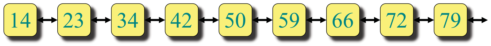
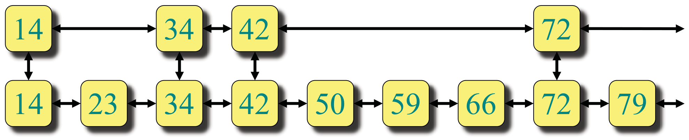
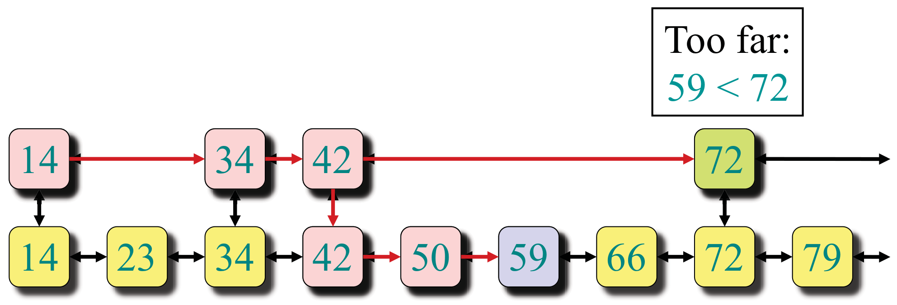
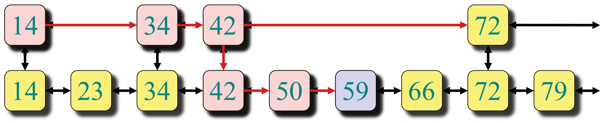
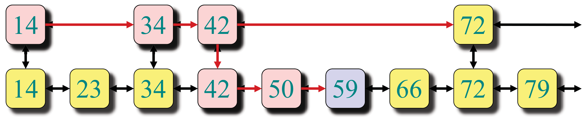
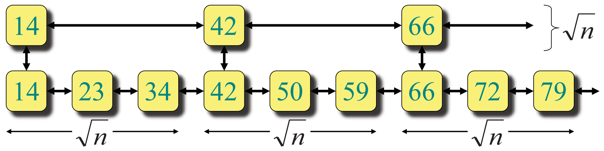
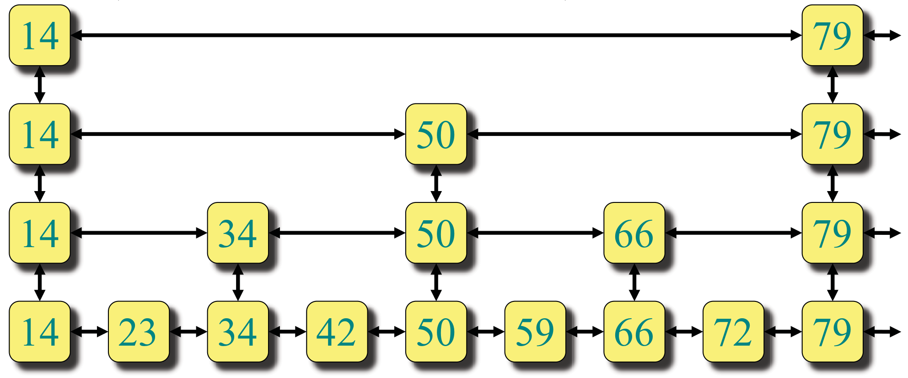
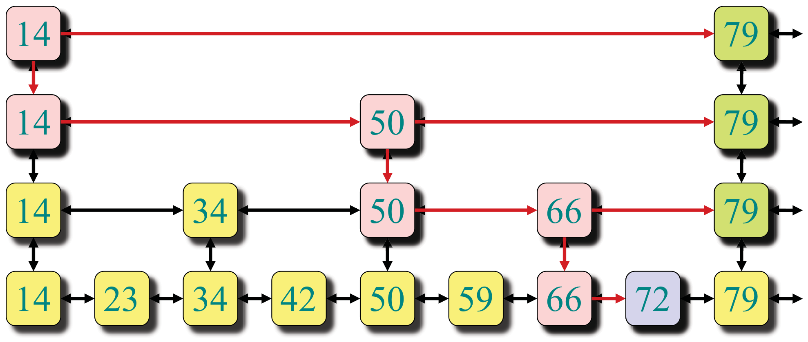
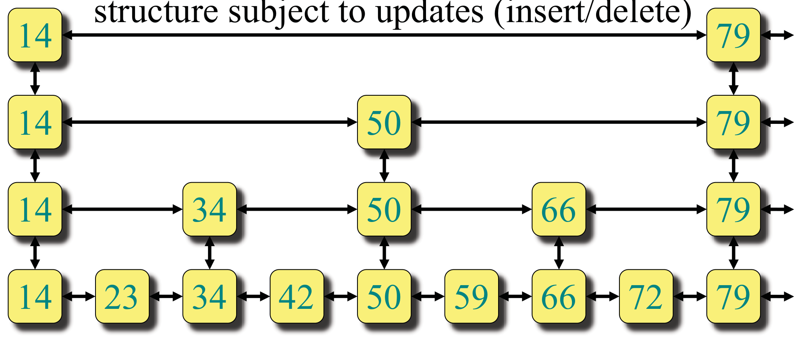
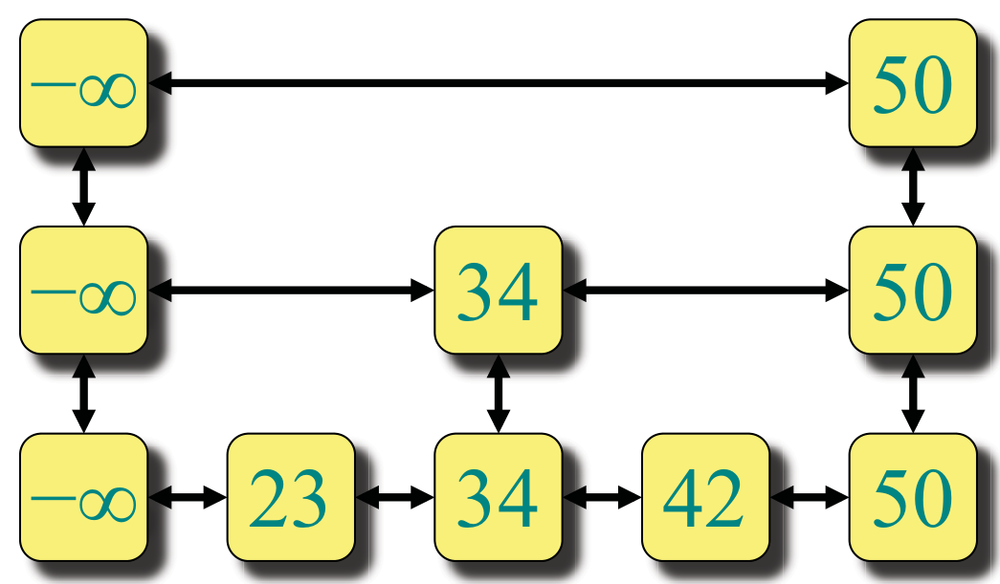

<!-- ===== PDF p1 ===== -->

<span style="color:#c0392b;">**讲次 7（Lecture 7）：跳跃表（Skip Lists）**</span> <span style="color:#7f8c8d;">（Design and Analysis of Algorithms, 6.046J/18.401J, 2015-07-10, Copyright © 2001-8 by Leiserson et al, L9.1）</span>

本讲大纲：
- 数据结构（Data structure）
- 随机化插入（Randomized insertion）
- 高概率（w.h.p.）界（With high probability bound）

---

<!-- ===== PDF p2 ===== -->

<span style="color:#c0392b;">**跳跃表（Skip lists）**</span>

- 简单的随机化动态搜索结构（simple randomized dynamic search structure）
  - 由 **William Pugh 于 1989 年**发明（Invented by William Pugh in 1989）
  - 易于实现（Easy to implement）
- 维护 $n$ 个元素的动态集合（dynamic set），每次操作在**期望意义下**及**高概率下**都是 $O(\lg n)$ 时间
  - 对 $T(n)$ 分布的**尾部**有强保证（strong guarantee on tail of distribution）
  - $O(\lg n)$「几乎总是」（almost always）成立

> <span style="color:#1e8449;">**[note] Note（译者注）:**</span> 这里预告了本讲与讲次 6 的衔接：随机化快排给出的是**期望** $O(n \log n)$，而跳跃表要给出的是更强的 **w.h.p.（高概率）**保证——不仅「平均快」，还要「几乎总是快」，尾部概率以 $O(1/n^\alpha)$ 衰减。区分两者的意义在于：期望保证可能在「很少见但灾难性」的坏情形上失效，而 w.h.p. 保证把坏情形的概率压到多项式小——对运行在多项式时间内的算法，w.h.p. 意味着「整个执行过程几乎必然不碰到坏情形」。这个「期望 vs 高概率」的差别，是随机化算法分析里最重要的概念分水岭之一。

---

<!-- ===== PDF p3 ===== -->

<span style="color:#c0392b;">**一条链表（One linked list）**</span>

从最简单的数据结构开始：**（已排序的）链表（sorted linked list）**

- 搜索在最坏情形下需要 $\Theta(n)$ 时间
- 我们如何加速搜索？


> <span style="color:#7f8c8d;">[原图说明] 原页附图：一条排序链表，元素 14, 23, 34, 42, 50, 59, 66, 72, 79。搜索需从头逐个扫描。</span>

---

<!-- ===== PDF p4 ===== -->

<span style="color:#c0392b;">**两条链表（Two linked lists）**</span>

假设我们有两条排序链表（基于元素子集）：
- 每个元素可以出现在一条或两条链表中
- 我们如何加速搜索？



> <span style="color:#7f8c8d;">[原图说明] 原页附图：两条链表叠放，底层含全部元素，顶层含部分元素。初步探索「两层」能否加速。</span>

---

<!-- ===== PDF p5 ===== -->

<span style="color:#c0392b;">**把两条链表想象成地铁（Two linked lists as a subway）**</span>

**IDEA**：快车线与慢车线（express and local subway lines），类似纽约市第七大道线（New York City 7th Avenue Line）。
- **快车线（Express line）**：连接少数「车站」
- **慢车线（Local line）**：连接所有车站
- 两条线在共有车站处有**换乘连接（links between lines）**


> <span style="color:#7f8c8d;">[原图说明] 原页附图：底层慢车线含全部 9 个元素，顶层快车线含 14, 34, 42, 72。地铁类比：快车只停少数站，其余站乘慢车到达。</span>

🎥 *Devadas 在视频中[用纽约第七大道地铁解释跳跃表]*："Yeah, subway stops on the Seventh Avenue Express Line. ... So this is exactly the notion of a skip list, the fact that you have [fast and local lines]."（翻译：对，第七大道快车线的地铁站。……这正是跳跃表的概念——同时拥有快线与慢线。）——快车线只停大站、慢车线停所有站，跳跃表的「层」就是按稀疏度递减的地铁线路。

> <span style="color:#1e8449;">**[note] Note（译者注）:**</span> 地铁类比是理解跳跃表的最佳直觉入口：**快车线（高层）让你快速跨过大段距离，慢车线（底层）保证不漏掉任何一个站**。搜索策略对应真实地铁换乘：先坐快车尽可能往前（快到「过头」为止），换乘慢车，再慢速前进到目标站。这个「高速跨越 + 低速精查」的两级结构，正是「跳」字的由来。注意一个细节：为什么快车「过头」时才换乘？因为快车只停少数站，你无法在快车上精确定位；一旦发现「下一站超过目标」，就得退回到当前站，换慢车逐站逼近——这正是 SEARCH 算法的几何直觉。

---

<!-- ===== PDF p6 ===== -->

<span style="color:#c0392b;">**在两条链表中搜索（Searching in two linked lists）**</span>

**SEARCH($x$)：**
- 在顶层链表（$L_1$）中向右走（walk right），直到「再向右就过头」（going right would go too far）
- 向下走到底层链表（$L_2$）
- 在 $L_2$ 中向右走，直到找到元素（或确定不存在）



> <span style="color:#7f8c8d;">[原图说明] 原页附图：SEARCH 流程叠加在两条链表上，显示「顶层向右 → 过头 → 下行 → 底层向右」的路径。</span>

---

<!-- ===== PDF p7 ===== -->

<span style="color:#c0392b;">**在两条链表中搜索（续）**</span>

**示例（EXAMPLE）：SEARCH(59)**



> <span style="color:#7f8c8d;">[原图说明] 原页附图：SEARCH(59) 的完整路径。顶层从 14 走到 42（59 在 42 之后），下一步 72 已经「太远」（59 < 72），于是下行到底层，从 42 向右到 50、59，找到。图中标注 "Too far: 59 < 72"。</span>

---

<!-- ===== PDF p8 ===== -->

<span style="color:#c0392b;">**两条链表的设计（Design of two linked lists）**</span>

**问题（QUESTION）**：哪些节点应该放在 $L_1$？
- 在地铁里，是「热门车站」
- 这里我们关心**最坏情形性能**（worst-case performance）
- 最佳方法（best approach）：把 $L_1$ 中的节点**均匀间隔**（evenly space）
- 但 $L_1$ 中应该放多少个节点？



> <span style="color:#7f8c8d;">[原图说明] 原页附图：两条链表，$L_1$ 含 14, 34, 42, 72（近似均匀间隔）。图注强调「均匀间隔」是设计理想。</span>

---

<!-- ===== PDF p9 ===== -->

<span style="color:#c0392b;">**两条链表的分析（Analysis of two linked lists）**</span>

**分析（ANALYSIS）**：设 $L_1$ 含 $|L_1|$ 个节点、$L_2$ 含 $|L_2| = n$ 个节点。
- 搜索成本粗略为 $\frac{|L_2|}{|L_1|} + |L_1|$（顶层走 $|L_1|$ 步 + 底层每段平均 $\frac{|L_2|}{|L_1|}$ 步）
- 当两项相等时（up to constant factors）取最小值
- $|L_1| = |L_2|/|L_1| = n/|L_1| \Rightarrow |L_1| = \sqrt{n}$



> <span style="color:#7f8c8d;">[原图说明] 原页附图：搜索成本分解示意。图注推导 $|L_1| = \sqrt{n}$ 时最优。</span>

> <span style="color:#1e8449;">**[note] Note（译者注）:**</span> 这是「**等分原则（equal-split principle）**」的首次亮相：搜索成本是两个量之和 $\frac{n}{|L_1|} + |L_1|$，对 $|L_1|$ 求最小值，令两项相等得 $|L_1| = \sqrt{n}$。这个「两项平衡取最优点」的微积分技巧（或 AM-GM 不等式），你在讲次 2 的分治、以及后续很多算法分析（如分块搜索 sqrt decomposition）里会反复遇到：**当总成本 = A + B 且 A·B 固定时，最优在 A = B**。注意这里的 $\frac{n}{|L_1|}$ 是「快车站间平均的慢车站数」——快车越少（$|L_1|$ 小），每段慢车越多。

---

<!-- ===== PDF p10 ===== -->

<span style="color:#c0392b;">**两条链表的分析（续）**</span>

**分析（ANALYSIS）**：
- $|L_2| = n,\ |L_1| = \sqrt{n}$
- 搜索成本粗略为

```math
\frac{|L_2|}{|L_1|} + |L_1| = \frac{n}{\sqrt{n}} + \sqrt{n} = 2\sqrt{n}
```


> <span style="color:#7f8c8d;">[原图说明] 原页附图：顶层含 14, 42, 66（$\sqrt{9} = 3$ 个快车站），底层含全部 9 个。图注标注 $|L_2| = n,\ |L_1| = \sqrt{n}$。</span>

---

<!-- ===== PDF p11 ===== -->

<span style="color:#c0392b;">**更多链表（More linked lists）**</span>

如果我们有更多条排序链表会怎样？
- 2 条排序链表 ⇒ $2\sqrt{n}$
- 3 条排序链表 ⇒ $3\sqrt[3]{n}$
- $k$ 条排序链表 ⇒ $k\sqrt[k]{n}$
- $\lg n$ 条排序链表 ⇒ $\lg n \cdot \sqrt[\lg n]{n} = 2\lg n$



> <span style="color:#7f8c8d;">[原图说明] 原页附图：$k$ 层链表示意，每层稀疏度递增。</span>

> <span style="color:#1e8449;">**[note] Note（译者注）:**</span> 推广到 $k$ 层时，最优层间比从「两层」推广为「每层稀疏 $\sqrt[k]{n}$ 倍」，总成本 $k\sqrt[k]{n}$。关键转折点：取 $k = \lg n$ 层时，$\sqrt[\lg n]{n} = 2$（因为 $2^{\lg n} = n$），于是成本变成 $\lg n \cdot 2 = O(\lg n)$。这里藏着一个漂亮的指数-对数互逆：**层数取 $\lg n$，恰好让每层只隔 2 个元素——层数越多，每层越密，搜索总步数越小**。这也解释了为什么跳跃表「像一棵二叉树」：$\lg n$ 层、每层间隔 2，正是完全平衡二叉树的结构；下一页明确点出它就是「level-linked B⁺-tree（层链接的 B+ 树）」。

---

<!-- ===== PDF p12 ===== -->

<span style="color:#c0392b;">**$\lg n$ 条链表（lg n linked lists）**</span>

$\lg n$ 条排序链表**就像一棵二叉树**（in fact, level-linked B⁺-tree，事实上是层链接的 B+ 树）。



> <span style="color:#7f8c8d;">[原图说明] 原页附图：4 层链表叠放成二叉树形态——底层 14,23,...,79（9 元素），上层 14,34,50,66,79，再上层 14,50,79，顶层 14,79。每向上走一层，元素稀疏一倍。</span>

> <span style="color:#1e8449;">**[note] Note（译者注）:**</span> 「层链接的 B+ 树（level-linked B+ tree）」这个说法很精确：B+ 树本来就是「所有数据在叶子层 + 内部节点做索引」的结构，而跳跃表的每一层链表恰好对应 B+ 树的一个「水平层」，各层之间通过纵向指针链接。这个观察有实际意义——**跳跃表几乎就是一棵 B+ 树的「拉平」版**：B+ 树用节点内的多个指针做二分，跳跃表用「多层的 1 个右指针」做同样的二分。这也解释了为什么跳跃表在实际系统中常被用来替代平衡树（如 Redis 的有序集合、LevelDB 的 memtable）：实现简单，性能相当。

---

<!-- ===== PDF p13 ===== -->

<span style="color:#c0392b;">**在 $\lg n$ 条链表中搜索（Searching in lg n linked lists）**</span>

**示例（EXAMPLE）：SEARCH(72)**



> <span style="color:#7f8c8d;">[原图说明] 原页附图：SEARCH(72) 的多层路径。顶层 14→79（72<79，过头）→下行；次层 14→50→79（过头）→下行；再下层 50→66→79（过头）→下行；底层 66→72 找到。路径呈「之」字形下行。</span>

---

<!-- ===== PDF p14 ===== -->

<span style="color:#c0392b;">**跳跃表（Skip lists）**</span>

**理想跳跃表（ideal skip list）**就是这个 $\lg n$ 层链表结构。

跳跃表数据结构在更新（insert/delete）下**大致维持**这个结构。



> <span style="color:#7f8c8d;">[原图说明] 原页附图：理想跳跃表的完整结构（同 p12 的 4 层二叉树形态）。</span>

> <span style="color:#1e8449;">**[note] Note（译者注）:**</span> 「理想跳跃表」是固定的 $\lg n$ 层完美稀疏结构，但**插入/删除会破坏这种完美性**——如果强求每次插入都维持「每层精确稀疏 $2$ 倍」，代价会很大。跳跃表的革命性想法是：**用随机化近似维持理想结构**——插入时掷硬币决定晋升几层，使得**期望上**每层只有上一层的 $1/2$ 元素，从而「平均形态」就是理想形态。这是「**随机化维护一个理想结构的近似**」的经典范式：理想结构是分析基准，随机化让实际结构「期望等于理想」。你在讲次 4 的 vEB 树、讲次 5 的摊还分析里已经见过「理想配置 + 巧妙的维护规则」，这里随机化取代了那些规则。

---

<!-- ===== PDF p15 ===== -->

<span style="color:#c0392b;">**INSERT($x$)**</span>

要把元素 $x$ 插入跳跃表：
- **SEARCH($x$)** 找到 $x$ 在底层链表中的位置
- **总是**插入到底层链表
  - **不变量（INVARIANT）**：底层链表包含所有元素
- 也插入到上方的一些链表……
- **问题（QUESTION）**：$x$ 还应该加入哪些上方的链表？

---

<!-- ===== PDF p16 ===== -->

<span style="color:#c0392b;">**INSERT($x$)（续）**</span>

**问题（QUESTION）**：$x$ 还应该加入哪些上方的链表？

**IDEA**：掷一枚（公平的）硬币；若为正面（HEADS），把 $x$ 提升（promote）到上一层，再掷一次。
- 提升到下一层的概率 $= p = 1/2$
- 平均而言：
  - 有 $1/2$ 的元素被提升 0 层
  - 有 $1/4$ 的元素被提升 1 层
  - 有 $1/8$ 的元素被提升 2 层
  - 依此类推
- **近似平衡**（approx. balance）？见下文分析。

> <span style="color:#7f8c8d;">[原图说明] 原页附图：硬币掷出后元素晋升的层级分布示意（1/2 停在底层，1/4 升 1 层，1/8 升 2 层…）。</span>

> <span style="color:#1e8449;">**[note] Note（译者注）:**</span> 掷硬币晋升的设计让跳跃表成为**期望上的完美结构**：每个元素晋升到第 $k$ 层的概率是 $p^k = 1/2^k$（连续 $k$ 次正面），所以第 $k$ 层期望有 $n/2^k$ 个元素——恰好是理想跳跃表「每层稀疏一半」的要求。这里「连续抛硬币直到反面」产生的是**几何分布（geometric distribution）**：期望晋升层数 $\sum_{k\ge0} k \cdot p^k(1-p) = \frac{p}{1-p} = 1$。你会在概率论（Bertsekas）里系统学习几何分布；现在只需直觉：**期望上每个元素升到第 1 层**，而层数分布呈指数衰减——这正是「$O(\lg n)$ 层」的来源（第 $\lg n$ 层只有 $n/2^{\lg n} = 1$ 个元素）。「每次插入独立掷硬币」这个性质也保证了整个跳跃表结构**无记忆性**：任意元素在任意层的分布与其他元素独立。

---

<!-- ===== PDF p17 ===== -->

<span style="color:#c0392b;">**跳跃表示例（Example of skip list）**</span>

**练习（EXERCISE）**：尝试用一枚真实的硬币，通过反复插入从零开始构建一个跳跃表。

**小改进（Small change）**：
- 给每条链表加上特殊的 $-\infty$ 值
- ⇒ 可以用**同一个搜索算法**在所有层搜索



> <span style="color:#7f8c8d;">[原图说明] 原页附图：给每条链表添加 $-\infty$ 哨兵后，从任意层都能统一执行「向右-过头-下行」的搜索逻辑，无需特判链表头。</span>

> <span style="color:#1e8449;">**[note] Note（译者注）:**</span> 加 $-\infty$ 哨兵（sentinel）是数据结构里的经典「**哨兵技巧**」：它消除了「链表为空」「当前层没有更小元素」等**边界特判**，让算法在每一层都无差别地执行同一套逻辑。你会在 CSAPP/6.006 的链表实现、以及各种「虚拟头节点（dummy head）」里反复见到同样的思想：**用一个小小的占位节点，换掉一整套 if 分支**。哨兵本身不参与实际数据，只在逻辑上保证「每一层都有一个起点」，搜索从顶层 $-\infty$ 出发即可统一描述。

---

<!-- ===== PDF p18 ===== -->

<span style="color:#c0392b;">**跳跃表（Skip lists）**</span>

跳跃表是从一个初始为空的结构（只含 $-\infty$）经过一系列插入（和删除）得到的结果。
- **INSERT($x$)**：用随机硬币翻转决定晋升层数
- **DELETE($x$)**：从所有包含 $x$ 的链表中移除 $x$

> <span style="color:#7f8c8d;">[说明] 此页与 p19 内容基本相同（讲义翻页重复）。</span>

---

<!-- ===== PDF p19 ===== -->

<span style="color:#c0392b;">**跳跃表（Skip lists）**</span>

跳跃表是从一个初始为空的结构（只含 $-\infty$）经过一系列插入（和删除）得到的结果。
- **INSERT($x$)**：用随机硬币翻转决定晋升层数
- **DELETE($x$)**：从所有包含 $x$ 的链表中移除 $x$

**跳跃表有多好？（速度/平衡）**
- **直觉上（INTUITIVELY）**：平均而言相当好
- **搜索的期望时间：$O(\lg n)$**

---

<!-- ===== PDF p20 ===== -->

<span style="color:#c0392b;">**SEARCH 的期望时间（Expected Time for SEARCH）**</span>

- 搜索目标从**顶层链表中的头元素**开始
- **水平前进**，直到当前元素大于或等于目标
- 若当前元素等于目标，则已找到；若当前元素大于目标，则**回退到前一个元素**并**垂直下降到下一层链表**，重复该过程
- 通过**从目标出发沿搜索路径**回溯到「出现在下一更高层」的元素，可看出每条链表中的期望步数为 $1/p$
- 搜索的总期望成本为 $O(\log_{1/p} n) \cdot (1/p)$，当 $p$ 为常数时即 $O(\lg n)$

> <span style="color:#1e8449;">**[note] Note（译者注）:**</span> 这个「每条链表期望 $1/p$ 步」的论证用了**反向分析（backwards analysis）**的雏形：不从顶向下数路径步数（很难），而是**从目标沿路径倒着看**——倒着走时，每到一个节点，它「被晋升到更高层」的概率是 $p$（正面 HEADS）、「停在该层」的概率是 $1-p$（反面 TAILS），于是倒着走时「上升」对应一次正面（晋升）实验、「在层内向左走」对应一次反面（未晋升）实验；向左走会一直持续到某次「晋升」才离开本层，故每层的期望向左步数恰为 $1/p$（几何分布期望）。反向分析的关键收益是：**从目标回溯，每层的期望步数只依赖局部的晋升概率 $p$，而 $p$ 是常数**，所以每层期望 $1/p$ 步、共 $O(\log_{1/p} n)$ 层。这个「正着想不清，反着想很清楚」的技巧，下一页会正式展开为「从叶子到根」的证明，是随机化算法分析里极其优美的工具。

---

<!-- ===== PDF p21 ===== -->

<span style="color:#c0392b;">**高概率定理（With-high-probability theorem）**</span>

<span style="color:#2471a3;">**[theorem]**</span> **定理（THEOREM）**：以高概率（with high probability），$n$ 元素跳跃表中的**每次搜索**都花费 $O(\lg n)$。

---

<!-- ===== PDF p22 ===== -->

<span style="color:#c0392b;">**高概率定理（续）**</span>

<span style="color:#2471a3;">**[theorem]**</span> **定理（THEOREM）**：以高概率，跳跃表中的每次搜索都花费 $O(\lg n)$。

🎥 *Devadas 在视频中[引入 w.h.p. 概念]*："And I'm going to now define the term with high probability. So what does this mean exactly? Well, what this means is order log n is something like c log n plus a constant."（翻译：现在我要定义「以高概率」这个术语。它到底是什么意思？意思是 $O(\lg n)$ 这个界形如 $c \lg n$ 加一个常数。）——注意教授点明：w.h.p. 的 $O(\lg n)$ 里常数 $c$ 依赖你选择的 $\alpha$，这正是下方正式定义的精髓。

- **非正式定义（INFORMALLY）**：事件 $E$ 以高概率发生（w.h.p.），若对任意 $\alpha \ge 1$，存在合适的常数选择，使得 $E$ 以至少 $1 - O(1/n^{\alpha})$ 的概率发生
  - 事实上，$O(\lg n)$ 中的常数依赖于 $\alpha$
- **正式定义（FORMALLY）**：参数化事件 $E_\alpha$ 以高概率发生，若对任意 $\alpha \ge 1$，存在合适的常数选择，使得 $E_\alpha$ 以至少 $1 - c_\alpha/n^{\alpha}$ 的概率发生

> <span style="color:#1e8449;">**[note] Note（译者注）:**</span> w.h.p. 的正式定义值得逐字抠：$1 - O(1/n^\alpha)$ 里的 $\alpha$ 是你**想要多强的保证**——$\alpha$ 越大，失败概率 $1/n^\alpha$ 越小，但 $O(\lg n)$ 里的常数也越大（讲义特意强调「常数依赖于 $\alpha$」）。为什么这个定义对算法分析有意义？因为**多项式时间算法总共只做多项式次操作**，若每次操作失败概率 $\le 1/n^\alpha$（$\alpha$ 取足够大），由布尔不等式（union bound），整个执行过程中所有操作同时成功的概率 $\ge 1 - O(1/n^{\alpha-1})$——即**整个算法的失败概率可压到任意多项式小**。这正是下一页「几乎必然，界对整个执行过程成立」的含义。w.h.p. 与「期望」的区别请与讲次 6 的注对照记忆。

---

<!-- ===== PDF p23 ===== -->

<span style="color:#c0392b;">**高概率定理（续）**</span>

**定理（THEOREM）**：以高概率，跳跃表中的每次搜索都花费 $O(\lg n)$。

- **非正式定义**：事件 $E$ 以高概率（w.h.p.）发生，若对任意 $\alpha \ge 1$，存在合适的常数选择，使得 $E$ 以至少 $1 - O(1/n^{\alpha})$ 的概率发生
- **IDEA**：可以通过把 $\alpha$ 设得很大（如 100）来让错误概率 $O(1/n^{\alpha})$ 非常小
- 几乎必然地，该界对多项式时间算法的**整个执行过程**都成立

---

<!-- ===== PDF p24 ===== -->

<span style="color:#c0392b;">**布尔不等式 / 并集界（Boole's inequality / union bound）**</span>

回忆（Recall）：

**布尔不等式 / 并集界（BOOLE'S INEQUALITY / UNION BOUND）**：对任意随机事件 $E_1, E_2, \ldots, E_k$：

```math
\Pr\{E_1 \cup E_2 \cup \cdots \cup E_k\} \le \Pr\{E_1\} + \Pr\{E_2\} + \cdots + \Pr\{E_k\}
```

**应用于高概率事件**：若 $k = n^{O(1)}$，且每个 $E_i$ 都以高概率发生，则 $E_1 \cap E_2 \cap \cdots \cap E_k$ 也以高概率发生。

> <span style="color:#1e8449;">**[note] Note（译者注）:**</span> 布尔不等式（并集界）是概率论最基础也最常用的不等式之一：**「至少一个事件发生的概率，不超过各事件概率之和」**。它总是成立（无需独立性），代价是可能很松。它在 w.h.p. 分析里的用法精妙：要证「所有 $k$ 个事件同时发生」的概率高，等价于证「至少一个事件失败」的概率低——而后者用并集界放缩成「各事件失败概率之和」。当 $k = n^{O(1)}$（多项式多个事件）且每个事件失败概率 $\le 1/n^\alpha$ 时，总失败概率 $\le n^{O(1)} / n^\alpha = O(1/n^{\alpha - O(1)})$，仍是多项式小——**只要 $\alpha$ 足够大，多项式多个事件一起失败的概率依旧可压到任意小**。这个「多项式多次实验 + 每次指数小失败概率」的组合，是后续所有 w.h.p. 证明的骨架。

---

<!-- ===== PDF p25 ===== -->

<span style="color:#c0392b;">**分析热身（Analysis Warmup）**</span>

<span style="color:#2471a3;">**[lemma]**</span> **引理（LEMMA）**：$n$ 元素跳跃表有 $O(\lg n)$ 的**期望层数**。

**证明（PROOF）**：
- $x$ 被提升 1 次的概率是 $p$
- $x$ 被提升 $k$ 次的概率是 $p^k$
- 期望提升次数为 $\sum_{i=0}^{\infty} i \cdot p^i = O(1)$（对常数 $p$）

- 至多有 $c \lg n$ 层的**错误概率**（error probability）
- $= \Pr\{\text{超过 } c \lg n \text{ 层}\}$
- $\le n \cdot \Pr\{\text{元素 } x \text{ 至少被提升 } c \lg n \text{ 次}\}$（由布尔不等式）
- $= n \cdot (1/2^{c \lg n})$
- $= n \cdot (1/n^c)$
- $= 1/n^{c-1}$

> <span style="color:#7f8c8d;">[说明] 原页 OCR 较乱，几何级数求和 $\sum_{i=0}^\infty i p^i = \frac{p}{(1-p)^2}$ 在 $p=1/2$ 时为 $2 = O(1)$。下面的概率计算：单个元素被提升至少 $c \lg n$ 次的概率 $\le (1/2)^{c \lg n} = 1/n^c$，再乘 $n$ 个元素（并集界）得 $1/n^{c-1}$。</span>

> <span style="color:#1e8449;">**[note] Note（译者注）:**</span> 这个「期望层数 $O(\lg n)$」的证明展示了两层技巧。**第一层（期望）**：单个元素期望被提升 $\sum i p^i = \frac{p}{(1-p)^2} = O(1)$ 次——用的是你在 6.042J 学过的**算术-几何级数求和**，结果竟是常数！这看似矛盾（期望提升 2 次怎么可能到 $\lg n$ 层？）——注意「期望层数」说的是**层数这个随机变量**，它的期望（$O(\lg n)$）来自「最高层的位置」，而单个元素期望提升次数（$O(1)$）只说明「单个元素平均很矮」。**第二层（尾部）**：要证「以高概率层数 $\le c \lg n$」，改用并集界把「整体层数过高」分解为「某个元素升得太高」——每个元素升过 $c \lg n$ 层的概率 $\le 1/n^c$，$n$ 个元素取并集得 $\le 1/n^{c-1}$。这个「期望论证 + 尾部论证」的组合，是随机化分析的标准二部曲。

---

<!-- ===== PDF p26 ===== -->

<span style="color:#c0392b;">**分析热身（续）**</span>

<span style="color:#2471a3;">**[lemma]**</span> **引理（LEMMA）**：以高概率，$n$ 元素跳跃表有 $O(\lg n)$ 层。

**证明（PROOF）**：
- 至多有 $c \lg n$ 层的错误概率 $\le 1/n^{c-1}$
- 这个概率是**多项式小**（polynomially small），即至多 $1/n^{\alpha}$，其中 $\alpha = c - 1$
- 通过相应选择 $O(\lg n)$ 界中的常数 $c$，我们可以让 $\alpha$ 任意大

---

<!-- ===== PDF p27 ===== -->

<span style="color:#c0392b;">**定理的证明（Proof of theorem）**</span>

<span style="color:#2471a3;">**[theorem]**</span> **定理（THEOREM）**：$n$ 元素跳跃表中的每次搜索花费 $O(\lg n)$ 期望时间。

**酷想法（COOL IDEA）：反向分析搜索——从叶子到根（analyze search backwards—leaf to root）**

- 搜索开始于（结束于）**叶子**（底层链表中的节点）
- 在访问的每个节点：
  - 若该节点**未被提升到更高层**（这里掷到反面 TAILS），则我们向左走（从左边来）
  - 若该节点**被提升到更高层**（这里掷到正面 HEADS），则我们向上走（从上方来）
- 搜索结束于（开始于）**根**（或 $-\infty$）

> <span style="color:#1e8449;">**[note] Note（译者注）:**</span> 反向分析（backwards analysis）是这一讲真正的「方法论主角」，值得单独命名记忆：**把「从根向下的搜索路径」改写成「从叶子向根的增长过程」**。正向看，搜索路径长度依赖整个表的随机结构，难以直接分析；反向看，搜索路径每一步对应一个**独立的硬币翻转**（该节点是否被晋升），于是「搜索路径总长度」就被重新编码为「一串硬币翻转直到收集到足够多正面」——一个纯概率问题。这个「**逆转视角，把困难量变成独立随机变量之和**」的手法，由 Raimund Seidel 系统化推广（Seidel's backwards analysis），你在后面的随机增量算法（randomized incremental algorithms，如线性规划、Delaunay 三角剖分）里会反复见到。

---

<!-- ===== PDF p28 ===== -->

<span style="color:#c0392b;">**定理的证明（续）**</span>

<span style="color:#2471a3;">**[theorem]**</span> **定理（THEOREM）**：以高概率，$n$ 元素跳跃表中的每次搜索都花费 $O(\lg n)$。

**酷想法**：反向分析搜索——叶子到根。

**证明（PROOF）**：
- 搜索做「向上」（up）与「向左」（left）移动，直到到达根（或 $-\infty$）
- 「向上」移动的期望次数 $<$ 层数 $\le O(\lg n)$（由引理）
- ⇒ 以高概率，移动次数至多等于「需要掷多少次硬币才能得到 $c \lg n$ 个正面」

> <span style="color:#7f8c8d;">[说明] 反向路径中，「向上」移动对应一个节点被晋升（硬币正面），「向左」移动对应节点停在该层（硬币反面）。于是「搜索总步数」被映射为「掷硬币直到得到 $c \lg n$ 个正面所需的总翻转数」——这引出了下一页的 Chernoff 界分析。</span>

---

<!-- ===== PDF p29 ===== -->

<span style="color:#c0392b;">**Chernoff 界（Chernoff Bounds）**</span>

<span style="color:#2471a3;">**[theorem]**</span> **定理（CHERNOFF，切尔诺夫界）**：设 $Y$ 是 $m$ 次独立硬币翻转序列中正面（反面）总数的随机变量，每次翻转以概率 $p$ 出现正面（反面）。那么对任意 $r > 0$：

```math
\Pr[Y \ge E[Y] + r] \le e^{-2r^2/m}
```

> <span style="color:#1e8449;">**[note] Note（译者注）:**</span> Chernoff 界是随机化算法分析的**尾部不等式之王**：它告诉我们「独立随机变量之和**偏离期望**很大的概率」以**指数**衰减。对比两个你已经见过的尾部工具：**Markov 不等式**（$\Pr[X \ge a] \le E[X]/a$）与 **Chebyshev 不等式**（用方差）只给出**多项式**衰减（$1/r^2$ 之类），而 Chernoff 给出 $e^{-2r^2/m}$ 的**指数**衰减——这正是「w.h.p. 多项式小失败概率」能达到的根源（指数 $e^{-\Theta(\lg n)}$ 恰好是 $n^{-\Theta(1)}$）。为什么指数衰减如此强？因为独立随机变量的**矩生成函数（moment generating function）**因子化，把「和的概率」变成「各变量矩生成函数之积」再逐个放缩。Wiki 查证：Chernoff 界由 **Herman Chernoff 于 1952 年**论文描述（Chernoff 本人将方法归功于 Herman Rubin）；它是 Markov/Chebyshev 的锐化版，但要求独立性。你在概率论（Bertsekas）、以及后面的 Hoeffding/McDiarmid 不等式里会正式学习它的证明。

---

<!-- ===== PDF p30 ===== -->

<span style="color:#c0392b;">**引理（Lemma）**</span>

<span style="color:#2471a3;">**[lemma]**</span> **引理（LEMMA）**：对任意 $c$，存在常数 $d$，使得以高概率，掷 $d \lg n$ 枚公平硬币得到**至少** $c \lg n$ 个正面。

**证明（PROOF）**：设 $Y$ 是掷 $d \lg n$ 次公平硬币时**反面**的个数。$p = 1/2$，$m = d \lg n$，所以 $E[Y] = \frac{1}{2}m = \frac{1}{2}d \lg n$。

我们想限制「正面 $\le c \lg n$」的概率 = 「反面 $\ge d \lg n - c \lg n$」的概率。

---

<!-- ===== PDF p31 ===== -->

<span style="color:#c0392b;">**引理证明（续）**</span>

```math
\Pr[Y \ge (d - c) \lg n] = \Pr\left[Y \ge E[Y] + \left(\frac{1}{2}d - c\right)\lg n\right]
```

取 $d = 6c$，令 $r = \left(\frac{1}{2}d - c\right)\lg n = 2c\lg n$。

由 Chernoff 界，正面 $\le c \lg n$ 的概率

```math
\le e^{-2r^2/m} = e^{-2 \cdot (2c\lg n)^2 / (6c \lg n)} = e^{-\frac{4}{3}c\lg n} \le e^{-c\lg n} \le 2^{-c\lg n} = \frac{1}{n^c}
```

> <span style="color:#7f8c8d;">[OCR 校正说明] 原页 OCR 数字（$d=3c$、$r=3c\lg n$、分母 $8c\lg n$）相互矛盾且无法使中间链成立：代入 $d=3c$ 时 $r=(\frac{d}{2}-c)\lg n=\frac{c}{2}\lg n$，Chernoff 指数 $-\frac{2r^2}{m}=-\frac{c}{6}\lg n$ 不足以保证 $\le e^{-c\lg n}$。译文取 $d=6c$（使 $r=2c\lg n$，指数 $-\frac{4}{3}c\lg n \le -c\lg n$），让整条链严格成立——**论证结构（取足够大的 $d$ 制造正余量 → Chernoff → 换底到 2 → $1/n^c$）是标准的，$d$ 只需满足 $d>2c$（即 $r>0$）即可，具体倍数由中间常数的优雅程度决定**。最终结论「错误概率 $\le 1/n^c$」与原文一致。</span>

> <span style="color:#1e8449;">**[note] Note（译者注）:**</span> 这个引理把「硬币翻转次数」与「成功次数」绑定：掷 $d \lg n$ 次，以高概率得到至少 $c \lg n$ 个正面。直觉：期望正面数是 $\frac{d}{2}\lg n$，只要 $d > 2c$（即期望超过目标 $c \lg n$ 一个**正余量**），Chernoff 界就保证「比期望少太多」的概率指数小——且 $d$ 离 $2c$ 越远，指数越负。这与讲次 6 的几何分布（$E[\#\text{iterations}] \le 2$）形成对照：那里用几何分布的**期望**，这里用 Chernoff 界控**尾部**——「期望论证给平均，Chernoff 给『几乎必然』」。论证中的 $e > 2$ 小技巧（$e^{-c\lg n} \le 2^{-c\lg n}$）是为了把指数底换成 2，得到干净的 $1/n^c$。

---

<!-- ===== PDF p32 ===== -->

<span style="color:#c0392b;">**定理的证明（终于！）（Proof of theorem (finally!)）**</span>

<span style="color:#2471a3;">**[theorem]**</span> **定理（THEOREM）**：以高概率，$n$ 元素跳跃表中的每次搜索都花费 $O(\lg n)$。

- **事件 A（event A）**：层数 $\le c \lg n$，w.h.p.
- **事件 B（event B）**：直到得到 $c \lg n$ 次「向上」移动所需的移动次数 $\le d \lg n$，w.h.p.
- **A 与 B 不独立！（A and B are not independent!）**

我们要证明 A 与 B 以高概率同时发生，从而证明定理：

```math
\Pr(A \& B) = \Pr(A \cup B) \le \Pr(A) + \Pr(B) \quad (\text{并集界 union bound})
```

> <span style="color:#7f8c8d;">[译注] 原讲义此处记号不严谨：$\Pr(A \& B)$ 即 $\Pr(A \cap B)$，而 $\Pr(A \cup B) \le \Pr(A) + \Pr(B)$ 是并集界。正确的推导是 $\Pr(A \cap B) = 1 - \Pr(\overline{A} \cup \overline{B}) \ge 1 - \Pr(\overline{A}) - \Pr(\overline{B})$（对「至少一个失败」用并集界）。译文保留原式以便对照，逻辑在下方译者注中给出。</span>

```math
\le \frac{1}{n^{c-1}} + \frac{1}{n^c} = O\left(\frac{1}{n^{c-1}}\right)
```

> <span class="note" style="color:#1e8449;">**[note] Note（译者注）:**</span> 最后一步是「**非独立性也能用并集界**」的示范：A（层数不过高）与 B（移动次数不过多）**不独立**——层数高时更容易出现很多移动。但证明无需独立性：先分别证明 $\Pr(A) \ge 1 - 1/n^{c-1}$（引理，层数 w.h.p.）与 $\Pr(B) \ge 1 - 1/n^c$（Chernoff 引理），再用并集界 $\Pr(A \cap B) = 1 - \Pr(\overline{A} \cup \overline{B}) \ge 1 - \Pr(\overline{A}) - \Pr(\overline{B})$，把两个失败概率**相加**而不是相乘——这避免了「独立性假设」这个常常难以满足的条件。并集界对**任意**（包括高度相关的）事件都成立，这是它成为随机化证明万能工具的根本原因。至此，跳跃表的完整论证链闭合：**反向分析把搜索映射成硬币翻转 → 引理控层数 + Chernoff 控翻转次数 → 并集界合并两个非独立事件**。

---

<!-- ===== PDF p33 ===== -->

<span style="color:#7f8c8d;">**MIT OpenCourseWare**</span>

<span style="color:#7f8c8d;">http://ocw.mit.edu</span>

<span style="color:#7f8c8d;">**6.046J / 18.410J 算法设计与分析（Design and Analysis of Algorithms）**</span>

<span style="color:#7f8c8d;">Spring 2015（2015 春季学期）</span>

<span style="color:#7f8c8d;">有关引用这些材料的信息或我们的使用条款（Terms of Use），请访问：http://ocw.mit.edu/terms。</span>
