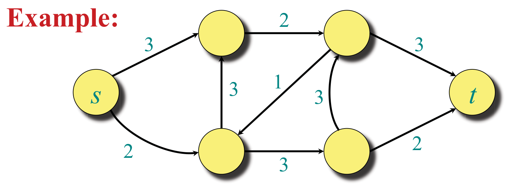
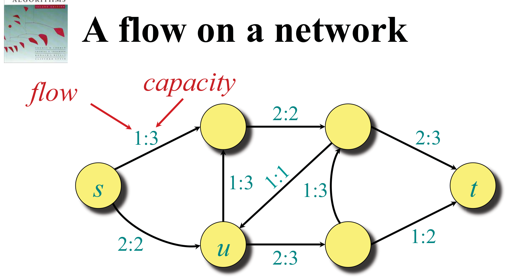
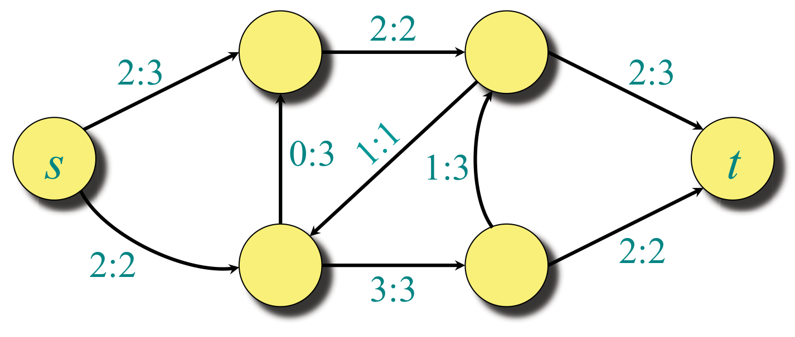
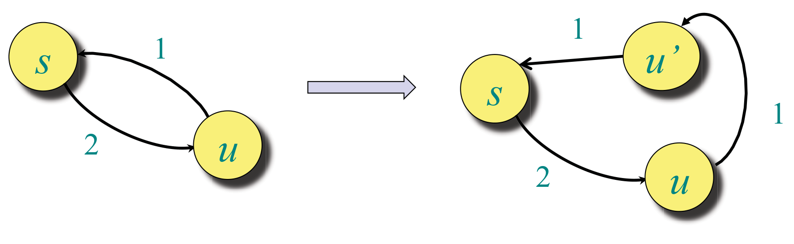
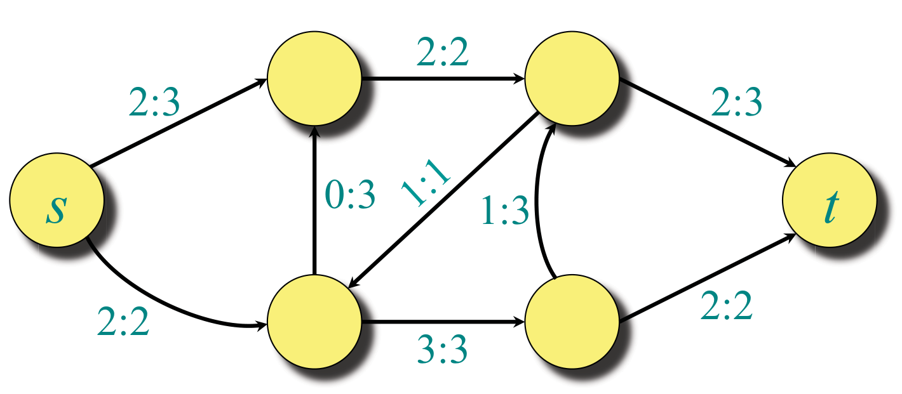
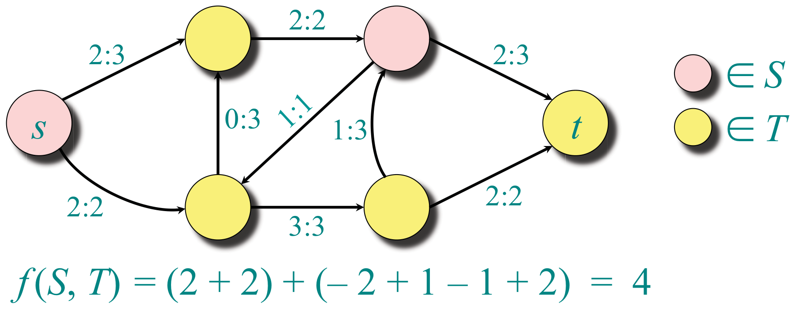
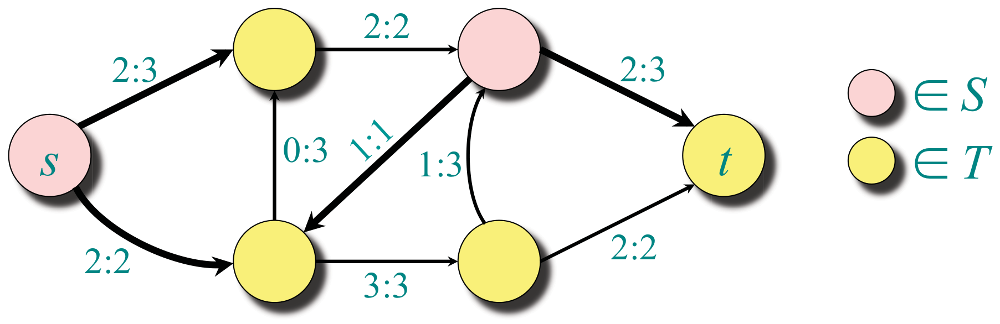
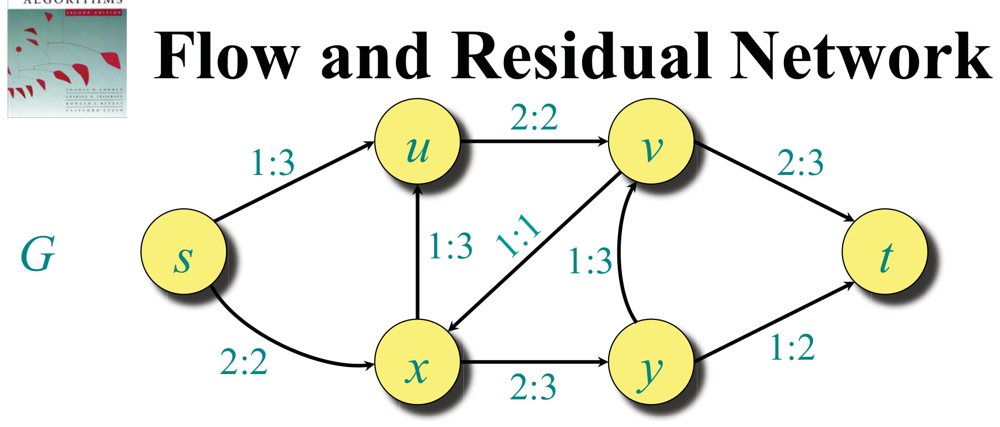
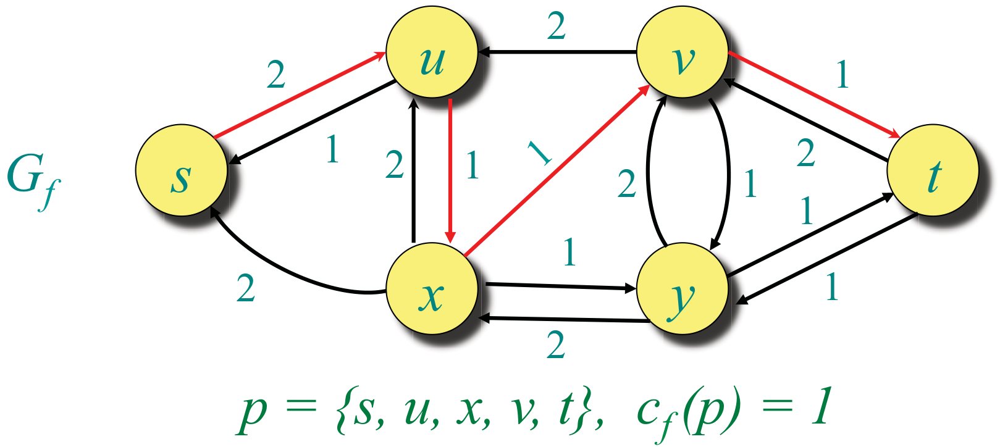
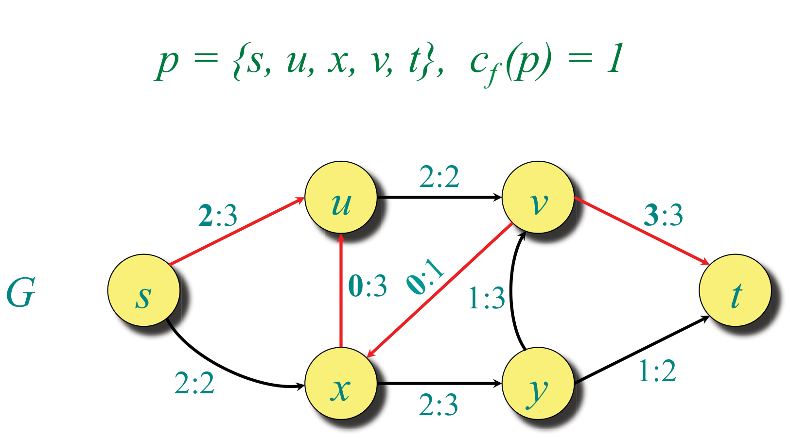

<!-- ===== PDF p1 ===== -->

<span style="color:#c0392b">**讲次 13（Lecture 13）：网络流（Network Flow）**</span> <span style="color:#7f8c8d;">（Design and Analysis of Algorithms, 6.046J/18.401J, © 2001–15 by Leiserson et al, L13.1）</span>

本讲大纲：
- 流网络（Flow networks）
- 最大流问题（Maximum-flow problem）
- 割（Cuts）
- 残量网络（Residual networks）
- 增广路径（Augmenting paths）
- 最大流最小割定理（Max-flow min-cut theorem）
- Ford-Fulkerson 算法（Ford Fulkerson algorithm）

---

<!-- ===== PDF p2 ===== -->

<span style="color:#c0392b">**流网络（Flow networks）**</span>

<span style="color:#2471a3;">**[definition]**</span> **定义（Definition）**：**流网络**（flow network）是一个有向图 $G = (V, E)$，带两个**特殊顶点**：**源（source）** $s$ 与**汇（sink）** $t$。每条边 $(u, v) \in E$ 有**非负容量（nonnegative capacity）** $c(u, v)$。若 $(u, v) \notin E$，则 $c(u, v) = 0$。



> <span style="color:#7f8c8d;">[示例说明] 原页附图：一个流网络示例（源 $s$、汇 $t$，边权为容量 1–3）。</span>

> <span style="color:#1e8449;">**[note] Note（译者注）:**</span> 流网络是「**管道网络**」的抽象：源是水库、汇是城市、边是管道、容量是每单位时间能通过的最大水量（或车流、人流）。两个关键约定：**容量非负**，且**不存在的边容量视为 0**（这样求和时无需特判）。本讲用「**网络流 = 单商品流**」模型——同一类东西（水/车/人）从源流向汇。注意与讲次 11 最短路问题中「边权」的对比：那里的「权重」是成本（可正可负），这里的「容量」是上界（必须非负）——**语义不同，数学结构也不同**。你会在 CSAPP/计算机网络里看到「带宽 = 容量」的实际对应。

---

<!-- ===== PDF p3 ===== -->

<span style="color:#c0392b">**网络上的流（A flow on a network）**</span>



> <span style="color:#7f8c8d;">[示例说明] 原页附图：流网络上的一个流，边标注「flow:capacity」（流:容量），如 1:3、2:2、2:3、1:3、1:2、2:3、1:3、2:2。</span>

**流守恒（Flow conservation）**（类似基尔霍夫电流定律 Kirchoff's current law）：
- 流入 $u$ 的流是 $2 + 1 = 3$。
- 流出 $u$ 的流是 $1 + 2 = 3$。

🎥 *Devadas 在视频中[用守恒律解释流]*："So you're going to have law of conservation associated with this commodity that's flowing, be water, or cars, or people."（翻译：你会有一条与正在流动的「商品」相关的守恒定律——无论是水、车还是人。）——流守恒适用于任何「物质流」：水、车流、人流，中间节点不增不减。

**直觉（INTUITION）**：把流视为**速率（rate）**，而不是数量（quantity）。

> <span style="color:#1e8449;">**[note] Note（译者注）:**</span> 「把流当速率而非数量」是理解网络流的关键心智模型：$f(u,v)$ 表示「单位时间内从 $u$ 流向 $v$ 的量」，所以**流守恒**（流入 = 流出）在中间节点上必须成立——否则就有物质在节点堆积或凭空消失。这与**基尔霍夫电流定律**（KCL）完全同构：电路中流入节点的电流等于流出节点的电流。你在 CSAPP 里学的电路基础、以及物理里学的质量守恒/电荷守恒，都是同一个「**守恒律（conservation law）**」。这个物理直觉后面会反复出现：**最大流 = 在守恒约束下尽量多送**。

---

<!-- ===== PDF p4 ===== -->

<span style="color:#c0392b">**最大流问题（The maximum-flow problem）**</span>

**最大流问题**：给定流网络 $G$，求 $G$ 上的**最大价值的流**（flow of maximum value）。



> <span style="color:#7f8c8d;">[示例说明] 原页附图：一个达到最大流的网络，边标注 flow:capacity（如 2:3、2:2、2:3、1:3、2:2、3:3、0:3、2:2）。图中最大流的价值为 4。</span>

---

<!-- ===== PDF p5 ===== -->

<span style="color:#c0392b">**流网络假设（Flow network Assumptions）**</span>

**假设（Assumption）**：若边 $(u, v) \in E$ 存在，则 $(v, u) \notin E$。
**假设（Assumption）**：不存在自环边（self-loop edges）$(u, u)$。



> <span style="color:#7f8c8d;">[原图说明] 原页附图：若存在反向边 $(u, s)$（原假设 $u \to s$ 与 $s \to u$ 方向冲突），可通过引入辅助顶点 $u'$ 消除：把反向边拆成 $u \to u' \to s$ 两条边。图注展示这种变换。</span>

> <span style="color:#1e8449;">**[note] Note（译者注）:**</span> 这两条假设是**技术性简化**而非本质限制：①「无反向边」保证每条有向边只有一个方向，否则「流」的符号约定会复杂；②「无自环」因为自环对最大流毫无贡献（送出去又回来，白费容量）。第①条假设的「消除反向边」技巧（引入辅助顶点把反向边拆成两跳）是网络流建模的常用手法——真实网络里双向链路很常见，但理论分析先假设单向，需要时再变换。这个「**先用简化假设，需要时用变换恢复一般性**」的做法，是算法理论的标准姿态——你会看到几乎所有流算法的证明都建立在「无反向边」假设上。

---

<!-- ===== PDF p6 ===== -->

<span style="color:#c0392b">**净流（Net Flow）**</span>

<span style="color:#2471a3;">**[definition]**</span> **定义（Definition）**：$G$ 上的一个**（净）流（net flow）**是满足下列条件的函数 $f : V \times V \to \mathbb{R}$：
- **容量约束（Capacity constraint）**：对所有 $u, v \in V$，$f(u, v) \le c(u, v)$。
- **流守恒（Flow conservation）**：对所有 $u \in V - \{s, t\}$，$\sum_{v \in V} f(u, v) = 0$。
- **斜对称（Skew symmetry）**：对所有 $u, v \in V$，$f(u, v) = -f(v, u)$。

> <span style="color:#7f8c8d;">[说明] CLRS 区分「正流（positive flows）」与「净流（net flows）」；在满足我们假设的流网络上两者等价。</span>

> <span style="color:#1e8449;">**[note] Note（译者注）:**</span> 三条公理的解读：**容量约束**是「不能超载管道」；**流守恒**是「中间节点不积累物质」（等价于上一页的「流入=流出」，用斜对称改写后写成 $\sum_v f(u,v) = 0$ 的紧凑形式）；**斜对称** $f(u,v) = -f(v,u)$ 是「净流」视角的核心——它说「$u$ 到 $v$ 的净流量」与「$v$ 到 $u$ 的净流量」互为相反数，把「正向流 + 反向流抵消后的净值」统一为一个数。这个「用净流而非正流」的约定让守恒律变得优雅：$f(u,V) = 0$ 表示「$u$ 的总净流出为 0」。斜对称还蕴含 $f(u,u) = 0$（自环），呼应上一页的无自环假设。这是你在 18.065/Strang 里会再次遇到的「**流 = 斜对称矩阵**」视角——网络流本质上是一个反对称矩阵，守恒律是它的行和为零。

---

<!-- ===== PDF p7 ===== -->

<span style="color:#c0392b">**记号（Notation）**</span>

<span style="color:#2471a3;">**[definition]**</span> **定义（Definition）**：流 $f$ 的**价值（value）**，记为 $|f|$，由下式给出

```math
|f| = \sum_{v \in V} f(s, v) = f(s, V)
```

**隐式求和记号（Implicit summation notation）**：算术公式中使用的集合表示对该集合元素求和。
- **示例——流守恒**：$f(u, V) = 0$ 对所有 $u \in V - \{s, t\}$。

> <span style="color:#1e8449;">**[note] Note（译者注）:**</span> 「隐式求和」$f(s, V) = \sum_{v \in V} f(s,v)$ 是网络流记号的核心简化：用「集合作为第二个参数」表示「对所有成员求和」。这个记号让守恒律、割流量、流价值都变得极简（$f(u,V)=0$、$|f| = f(s,V)$）。它是「**张量缩并（tensor contraction）**」思想的雏形——在 Strang 线性代数里，你常把「对某一指标求和」用矩阵乘法隐式表达；这里的 $f(S, T)$ 就是「对 $S \times T$ 的所有 $(u,v)$ 求和」。注意 $|f|$ 定义为「**流出源的总净流**」，直觉上就是「从源送入网络的量」——后面会证明它也等于「流入汇的总净流」（$|f| = f(V,t)$）。

---

<!-- ===== PDF p8 ===== -->

<span style="color:#c0392b">**流的简单性质（Simple properties of flow）**</span>

<span style="color:#2471a3;">**[lemma]**</span> **引理（Lemma）**：
- $f(X, X) = 0$，
- $f(X, Y) = -f(Y, X)$，
- 若 $X \cap Y = \emptyset$，则 $f(X \cup Y, Z) = f(X, Z) + f(Y, Z)$。

<span style="color:#2471a3;">**[theorem]**</span> **定理（Theorem）**：$|f| = f(V, t)$。

**证明（Proof）**：

```math
\begin{aligned}
|f| &= f(s, V)\\
&= f(V, V) - f(V-s, V) \quad (\text{省略花括号})\\
&= f(V, V-s)\\
&= f(V, t) + f(V, V-s-t)\\
&= f(V, t)
\end{aligned}
```

> <span style="color:#1e8449;">**[note] Note（译者注）:**</span> 这个证明是「**用守恒律 + 斜对称做代数化简**」的示范。逐步拆解每一步归因：$f(V,V) = 0$（斜对称使全集上的自求和为 0，因为 $f(u,v)$ 与 $f(v,u)$ 成对抵消）；$|f| = f(s,V) = f(V,V) - f(V-s,V)$ 这一步是**集合代数**而非守恒——把 $V$ 拆成 $\{s\} \cup (V-s)$，再用「不相交并的线性性」（引理的第三条性质）展开（注意 $V-s$ 含汇 $t$，$t$ 不满足流守恒，故此处不能归因守恒）；$f(V,V-s) = f(V,t) + f(V,V-s-t)$ 是又一次集合分解；**只有** $f(V, V-s-t) = 0$ 依赖「中间节点（非源非汇）守恒」。最后只剩 $f(V, t)$。结论 $|f| = f(V,t)$ 的意义很直观：**从源流出的净量 = 流入汇的净量**——流不会凭空消失，守恒律保证了「进 = 出」。这个「源-汇净流量守恒」是网络流最基本的恒等式，后面证明「任何割的流量 = 流价值」会再用到它。整套推导展示了记号 $f(S,T)$ 的威力：复杂的守恒论证变成一行行的集合代数。

---

<!-- ===== PDF p9 ===== -->

<span style="color:#c0392b">**流入汇的流（Flow into the sink）**</span>



> <span style="color:#7f8c8d;">[示例说明] 原页附图：同一最大流网络，标注 $|f| = f(s, V) = 4$ 且 $f(V, t) = 4$——验证「源流出 = 汇流入」。</span>

---

<!-- ===== PDF p10 ===== -->

<span style="color:#c0392b">**割（Cuts）**</span>

<span style="color:#2471a3;">**[definition]**</span> **定义（Definition）**：流网络 $G = (V, E)$ 的**割（cut）** $(S, T)$ 是 $V$ 的一个**划分（partition）**，使得 $s \in S$ 且 $t \in T$。若 $f$ 是 $G$ 上的流，则**跨越割的流（flow across the cut）**是 $f(S, T)$。



> <span style="color:#7f8c8d;">[示例说明] 原页附图：一个割 $(S, T)$，$S$ 含源侧顶点、$T$ 含汇侧顶点。计算 $f(S, T) = (2 + 2) + (-2 + 1 - 1 + 2) = 4$——跨越割的净流恰等于流价值。</span>

> <span style="color:#1e8449;">**[note] Note（译者注）:**</span> 割（cut）是把顶点分成「源侧 $S$」与「汇侧 $T$」两部分的划分——它和讲次 12 MST 里的「割」是同一个概念（顶点二分），但语义不同：MST 里割是「找最轻跨越边」，这里割是「衡量跨过边界的净流量」。注意 $f(S,T)$ 是**净流**：跨出 $S$ 的正流减去跨入 $S$ 的负流（斜对称），所以示例中 $f(S,T) = (2+2) + (-2+1-1+2) = 4$——既有正向也有负向贡献。**割是分析网络流的透镜**：后面会证明「任何割的净流都等于流价值」（流守恒的宏观体现），而「最小割容量」给出最大流的上界——这就是最大流最小割定理的雏形。

---

<!-- ===== PDF p11 ===== -->

<span style="color:#c0392b">**流价值的另一种刻画（Another characterization of flow value）**</span>

<span style="color:#2471a3;">**[lemma]**</span> **引理（Lemma）**：对任何流 $f$ 与任何割 $(S, T)$，我们有 $|f| = f(S, T)$。

**证明（Proof）**：

```math
\begin{aligned}
f(S, T) &= f(S, V) - f(S, S)\\
&= f(S, V)\\
&= f(s, V) + f(S-s, V)\\
&= f(s, V)\\
&= |f|
\end{aligned}
```

> <span style="color:#1e8449;">**[note] Note（译者注）:**</span> 这个引理把「流价值」从「$s$ 的流出量」推广为「**任何割的净流量**」——它是守恒律的宏观版本：无论你在哪个「截面」上量，跨过该截面的净流都等于总流价值。证明的每一步：$f(S,S)=0$（斜对称抵消）、$f(S-s, V)=0$（中间节点守恒，因为 $S-s$ 不含源汇）、$f(s,V)=|f|$。这个「**任意截面流量守恒**」的洞察是理解最大流最小割定理的钥匙：既然每个割的净流都等于流价值，而割的净流又被割容量（下一页）限制，那么「任何割容量 ≥ 流价值」——最小割容量就是最大流的天花板。你在 18.065/Strang 里学的「散度定理（divergence theorem）」正是这个思想的连续版本：**穿过任意闭合面的通量 = 内部源的散度积分**。

---

<!-- ===== PDF p12 ===== -->

<span style="color:#c0392b">**割的容量（Capacity of a cut）**</span>

<span style="color:#2471a3;">**[definition]**</span> **定义（Definition）**：割 $(S, T)$ 的**容量（capacity）**是 $c(S, T)$。



> <span style="color:#7f8c8d;">[示例说明] 原页附图：同一割，计算容量 $c(S, T) = (3 + 2) + (1 + 3) = 9$——与流 $f(S,T)=4$ 对比，容量 ≥ 流。</span>

> <span style="color:#1e8449;">**[note] Note（译者注）:**</span> 割容量 $c(S,T) = \sum_{u \in S, v \in T} c(u,v)$ 只累加「从 $S$ 到 $T$ 的正向边」的容量——**没有斜对称**，因为容量是物理上限而非净量。这是流与容量的关键区别：$f(S,T)$ 可正可负（净流，含反向抵消），$c(S,T)$ 恒非负（物理上限）。示例里 $c(S,T) = 9$ 而 $f(S,T) = 4$，差距正来自「容量算的是全部正向边的上限，流只用了其中一部分」。「**最小割 = 使 $c(S,T)$ 最小的割**」将在最大流最小割定理里登场——它是整个网络的「瓶颈」，类比管道系统里最细的一段管子决定总流量。

---

<!-- ===== PDF p13 ===== -->

<span style="color:#c0392b">**最大流价值的上界（Upper bound on the maximum flow value）**</span>

<span style="color:#2471a3;">**[theorem]**</span> **定理（Theorem）**：任何流的价值被任何割的容量**限制在上方**。

**证明（Proof）**：

```math
|f| = f(S, T) = \sum_{u \in S} \sum_{v \in T} f(u, v) \le \sum_{u \in S} \sum_{v \in T} c(u, v) = c(S, T)
```

> <span style="color:#1e8449;">**[note] Note（译者注）:**</span> 这是**最大流最小割定理的「平凡半边」**：任何流 ≤ 任何割容量（用「净流 ≤ 容量」逐项放缩）。推论：**最大流 ≤ 最小割容量**。整个最大流最小割定理要证明的是更深刻的反向：**存在一个割，它的容量恰好等于最大流**——即「瓶颈恰好卡住最大流」且「能同时找到最优流和最优割」。这个「上界平凡、反向深刻」的格局，与你在讲次 1 P/NP、以及线性规划对偶（讲次 15）里看到的「弱对偶平凡、强对偶深刻」完全同构——事实上，最大流最小割定理正是线性规划**强对偶定理（strong duality）**的特例，Wiki 查证确认了这一点。

---

<!-- ===== PDF p14 ===== -->

<span style="color:#c0392b">**残量网络（Residual network）**</span>

<span style="color:#2471a3;">**[definition]**</span> **定义（Definition）**：设 $f$ 是 $G = (V, E)$ 上的流。**残量网络**（residual network）$G_f(V, E_f)$ 是「**严格正残量容量**」的图：

```math
c_f(u, v) = c(u, v) - f(u, v) > 0
```

$E_f$ 中的边可以**容纳更多流**。

若 $(v, u) \notin E$，则 $c(v, u) = 0$，但 $f(v, u) = -f(u, v)$。

$|E_f| \le 2|E|$。

> <span style="color:#1e8449;">**[note] Note（译者注）:**</span> 残量网络是 Ford-Fulkerson 的灵魂：它回答「当前流 $f$ 还能怎么改进」。对每条边 $(u,v)$，残量容量 $c_f(u,v) = c(u,v) - f(u,v)$ 表示「还能再送多少」；而由于斜对称，反向残量 $c_f(v,u) = c(v,u) - f(v,u) = 0 - (-f(u,v)) = f(u,v)$ 表示「能撤回多少」——**残量网络天然包含了「撤销流」的能力**！这是网络流算法最精妙的设计：增广一条路径时，沿反向边「退流」等同于重新分配流量。$|E_f| \le 2|E|$ 因为每条原边最多贡献两条残量边（正向 + 反向）。这个「**给每个选择都留一条撤销路径**」的思想，是你 CSAPP 里「回滚/撤销」概念在算法里的体现。

---

<!-- ===== PDF p15 ===== -->

<span style="color:#c0392b">**流与残量网络（Flow and Residual Network）**</span>



> <span style="color:#7f8c8d;">[示例说明] 原页附图：左图为原网络 $G$（边标注 flow:capacity），右图为对应的残量网络 $G_f$（边标注残量容量 1 或 2）。残量网络包含「正向剩余容量」与「反向可退容量」两类边。</span>

---

<!-- ===== PDF p16 ===== -->

<span style="color:#c0392b">**增广路径（Augmenting paths）**</span>

<span style="color:#2471a3;">**[definition]**</span> **定义（Definition）**：$G_f$ 中**任何从 $s$ 到 $t$ 的路径**都是 $G$ 中关于 $f$ 的**增广路径（augmenting path）**。沿增广路径 $p$ 可以把流价值增加 $c_f(p) = \min_{(u,v) \in p} \{ c_f(u, v) \}$。



> <span style="color:#7f8c8d;">[示例说明] 原页附图：残量网络 $G_f$ 中的一条增广路径 $p = \{s, u, x, v, t\}$，其瓶颈容量 $c_f(p) = 1$。</span>

> <span style="color:#1e8449;">**[note] Note（译者注）:**</span> 增广路径是「**沿残量网络找一条还能加流的 $s \to t$ 路径**」：路径上的每条边都有正残量，可以整体增加 $\min c_f$（路径瓶颈）。关键直觉：**只要残量网络里还有 $s \to t$ 路径，当前流就不是最大**——因为能沿它增广。增广量取「瓶颈」是因为路径上最窄的边决定能送多少（又是「最细管道决定总流量」的直觉）。增广路径可以包含反向边（残量网络里的「退流边」），所以「增广」不只是「送更多」，也可能是「**重新路由**」——这正是 Ford-Fulkerson 能纠正之前错误分配的原因。这个「总是找可改进路径」的增量思想，是「incremental improvement」（本讲标题）的含义。

---

<!-- ===== PDF p17 ===== -->

<span style="color:#c0392b">**增广后的流网络（Augmented Flow Network）**</span>



> <span style="color:#7f8c8d;">[示例说明] 原页附图：沿 $p = \{s, u, x, v, t\}$（$c_f(p) = 1$）增广后的网络 $G$。边标注 flow:capacity（如 2:3、2:2、3:3、1:3、1:2、2:3、0:3、2:2）。最大流价值为 4。</span>

**注意（Note）**：有些边上的流**减小了**（decreased）。

> <span style="color:#1e8449;">**[note] Note（译者注）:**</span> 「有些边上的流减小了」是增广路径包含反向边（残量网络的退流边）的直接后果：沿 $p$ 增广时，若 $p$ 经过某条反向残量边 $(v,u)$，则原正向边 $(u,v)$ 上的流会减少 $c_f(p)$。这看似违反直觉（「增广」怎么还会减少流量？），但正是网络流算法优雅之处：**减少某些边上的流，是为了整体上增加从 $s$ 到 $t$ 的总流**——这等价于「重新路由」：把原本走某条路径的流改道，腾出容量给更优的路径。这个「局部退流、全局增流」的思想，是理解为什么 Ford-Fulkerson 必须用残量网络（而非只看原网络）的核心——**没有反向边，算法就无法纠正次优的初始分配**。

---

<!-- ===== PDF p18 ===== -->

<span style="color:#c0392b">**最大流最小割定理（Max-flow, min-cut theorem）**</span>

<span style="color:#2471a3;">**[theorem]**</span> **定理（Theorem）**：以下三命题**等价**：
1. 对某个割 $(S, T)$，$|f| = c(S, T)$。
2. $f$ 是最大流。
3. $f$ 没有增广路径。

**证明（Proof）**：下次再讲（Next time!）

> <span style="color:#1e8449;">**[note] Note（译者注）:**</span> 最大流最小割定理的「三等价」是理解网络流的支点，其证明循环（1→2→3→1）讲次 14 会补全：
> - **1→2**：若 $|f| = c(S,T)$，由「任何流 ≤ 任何割容量」知 $|f|$ 已达所有流的上界，故 $f$ 最大；
> - **2→3**：若 $f$ 有增广路径，就能增大 $|f|$，与「最大」矛盾；
> - **3→1**（最深刻）：若 $f$ 无增广路径，定义 $S = \{v \mid v \text{ 在 } G_f \text{ 中从 } s \text{ 可达}\}$，则 $s \in S$、$t \notin S$（否则有增广路径），且跨越割 $(S, V-S)$ 的所有边都饱和（$f = c$，否则残量网络里还有从 $S$ 到 $T$ 的边），故 $|f| = c(S, V-S)$——**无增广路径自动给出一个容量恰等于流价值的割**。
> 这个「从无增广路径构造最小割」的手法（可达集 $S$）是定理证明的点睛之笔，也是你理解「瓶颈」概念的关键。Wiki 查证：该定理是线性规划对偶的特例，可推导 Menger 定理与 König-Egerváry 定理。

---

<!-- ===== PDF p19 ===== -->

<span style="color:#c0392b">**Ford-Fulkerson 最大流算法（Ford-Fulkerson max-flow algorithm）**</span>

**算法（Algorithm）**：

```
f[u, v] ← 0 for all u, v ∈ V
while 存在关于 f 的增广路径 p（在 G 中）
    do 用 cf(p) 增广 f
```

> <span style="color:#1e8449;">**[note] Note（译者注）:**</span> Ford-Fulkerson 算法本身极简：**反复找增广路径、沿它加流，直到没有增广路径**——然后由最大流最小割定理（命题 2 ⇔ 3）保证当前流是最大的。为什么这么简单的循环正确？因为每次增广都保持「合法流」（容量约束 + 守恒），且流价值严格增加，终止于「无增广路径」=「最大流」。Wiki 查证：Ford-Fulkerson 由 **L. R. Ford Jr. 与 D. R. Fulkerson 于 1956 年**发表；它常被称为「方法（method）」而非「算法」，因为「如何找增广路径」未完全指定——不同的路径选择给出不同复杂度：若用 BFS（最短增广路径），就是 **Edmonds-Karp 算法**，$O(VE^2)$；若容量是整数且用「最大增广量」，$O(E \log C)$。这个「算法骨架 + 具体策略」的分层，是你在学习算法时值得留意的模式——**同样的贪心骨架，不同的实现策略，得到不同保证**。

---

<!-- ===== PDF p20 ===== -->

<span style="color:#7f8c8d;">**MIT OpenCourseWare**</span>

<span style="color:#7f8c8d;">http://ocw.mit.edu</span>

<span style="color:#7f8c8d;">**6.046J / 18.410J 算法设计与分析（Design and Analysis of Algorithms）**</span>

<span style="color:#7f8c8d;">Spring 2015（2015 春季学期）</span>

<span style="color:#7f8c8d;">有关引用这些材料的信息或我们的使用条款（Terms of Use），请访问：http://ocw.mit.edu/terms。</span>
