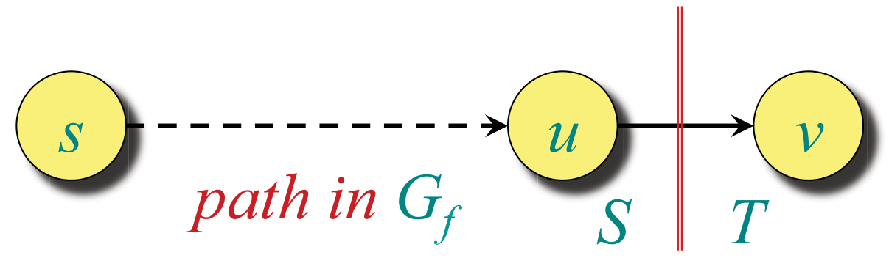
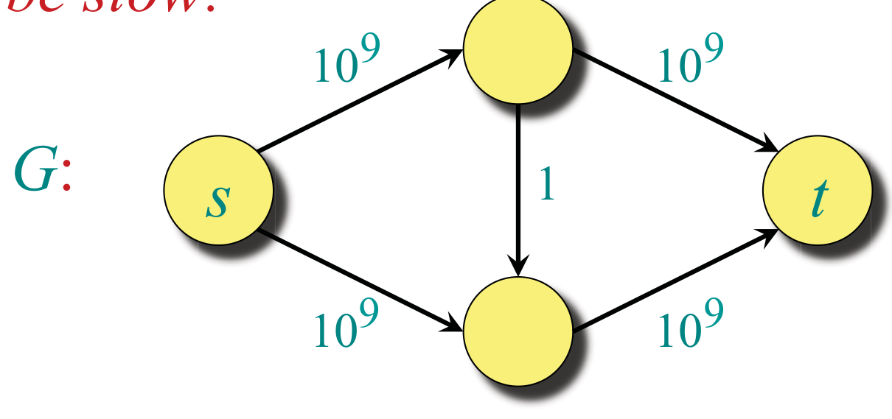
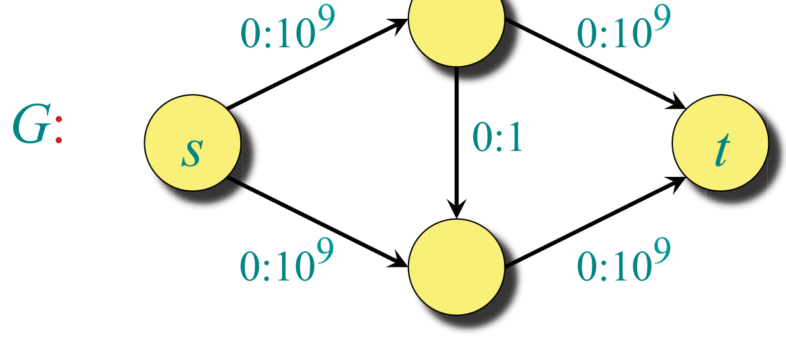
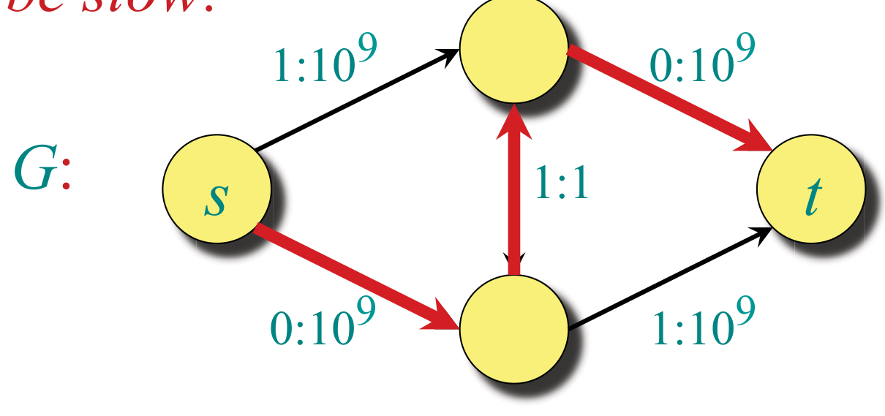
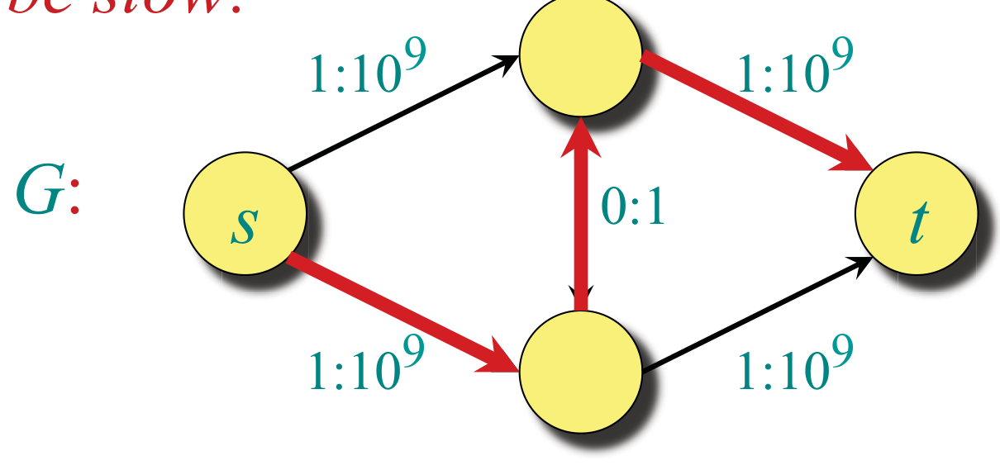
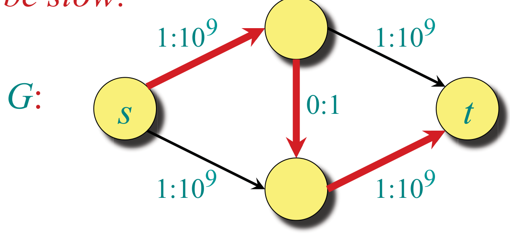
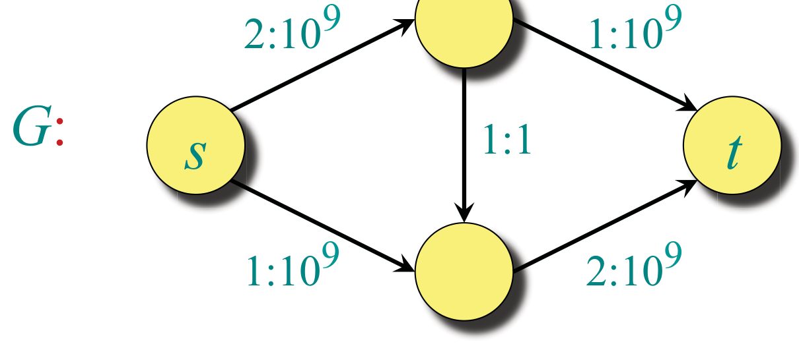

<!-- ===== PDF p1 ===== -->

<span style="color:#c0392b">**讲次 14（Lecture 14）：网络流与应用（Network Flow & Applications）**</span> <span style="color:#7f8c8d;">（Design and Analysis of Algorithms, 6.046J/18.401J, © 2001–15 by Leiserson et al, L14.1）</span>

本讲大纲：
- 回顾（Review）
- 最大流最小割定理（Max-flow min-cut theorem）
- Edmonds-Karp 算法（Edmonds Karp algorithm）
- 流整性（Flow Integrality）
- 第二部分：应用（Part II: Applications）

---

<!-- ===== PDF p2 ===== -->

<span style="color:#c0392b">**回顾讲次 13（Recall from Lecture 13）**</span>

- 流价值（Flow value）：$|f| = f(s, V)$。
- 割（Cut）：$V$ 的任意划分 $(S, T)$，使得 $s \in S$ 且 $t \in T$。
- **引理（Lemma）**：对任意割 $(S, T)$，$|f| = f(S, T)$。
- **推论（Corollary）**：对任意割 $(S, T)$，$|f| \le c(S, T)$。
- **残量图（Residual graph）**：图 $G_f = (V, E_f)$，其残量容量严格为正 $c_f(u, v) = c(u, v) - f(u, v) > 0$。
- **增广路径（Augmenting path）**：$G_f$ 中任何从 $s$ 到 $t$ 的路径。
- **增广路径的残量容量（Residual capacity of an augmenting path）**：$c_f(p) = \min_{(u,v) \in p} \{ c_f(u, v) \}$。

> <span style="color:#1e8449;">**[note] Note（译者注）:**</span> 本讲先快速回顾讲次 13 的全部定义，然后补完最大流最小割定理的完整证明（讲次 13 只给了三等价陈述，「Proof. Next time!」）。回顾清单里的两个关键等式——$|f| = f(S, T)$（任意割的净流 = 流价值）与 $|f| \le c(S, T)$（任何流 ≤ 任何割容量）——是接下来证明的两块基石。它们你已经见过，但注意「推论 $|f| \le c(S, T)$」是「弱对偶」，而下一页证明的「最大流 = 最小割」是「强对偶」——本讲要补的就是强对偶方向。

---

<!-- ===== PDF p3 ===== -->

<span style="color:#c0392b">**Ford-Fulkerson 最大流算法（Ford-Fulkerson max-flow algorithm）**</span>

**算法（Algorithm）**：

```
f[u, v] ← 0 for all u, v ∈ V
while 存在关于 f 的增广路径 p（在 G 中）
    do 用 cf(p) 增广 f
```

---

<!-- ===== PDF p4 ===== -->

<span style="color:#c0392b">**最大流最小割定理（Max-flow, min-cut theorem）**</span>

<span style="color:#2471a3;">**[theorem]**</span> **定理（Theorem）**：以下三命题**等价**：
1. 对某个割 $(S, T)$，$|f| = c(S, T)$。
2. $f$ 是最大流。
3. $f$ 没有增广路径。

**证明（Proof）**：
- **(1) ⇒ (2)**：由于对任意割 $(S, T)$ 都有 $|f| \le c(S, T)$，假设 $|f| = c(S, T)$ 意味着 $f$ 是最大流。
- **(2) ⇒ (3)**：若存在增广路径，流价值就能增加，与 $f$ 的最大性（maximality）矛盾。

> <span style="color:#1e8449;">**[note] Note（译者注）:**</span> 三等价证明的前两个方向都「平凡」：(1)⇒(2) 用「任何流 ≤ 任何割容量」——$|f|$ 若等于某个割容量，就达到了所有流的上界；(2)⇒(3) 用反证——有增广路径就能增大流。真正的难点是 (3)⇒(1)（下一页）：**无增广路径 ⇒ 存在一个割容量恰好等于流价值**。这个证明结构（两个平凡方向 + 一个深刻方向）与线性规划对偶的「弱对偶平凡、强对偶深刻」完全平行，也和讲次 11 的最短路/差分约束的论证风格一致。

---

<!-- ===== PDF p5 ===== -->

<span style="color:#c0392b">**证明（续）（Proof continued）**</span>

- **(3) ⇒ (1)**：假设 $f$ 没有增广路径。定义

```math
S = \{ v \in V : G_f \text{ 中存在从 } s \text{ 到 } v \text{ 的路径} \}
```

并令 $T = V - S$。观察到 $s \in S$ 且 $t \in T$，因此 $(S, T)$ 是一个割。

考虑任意顶点 $u \in S$ 与 $v \in T$：



> <span style="color:#7f8c8d;">[原图说明] 原页附图：残量网络 $G_f$ 中从 $s$ 到 $u$ 的路径示意，$u \in S$、$v \in T$。图注强调「$G_f$ 中的路径」。</span>

我们必须有 $c_f(u, v) = 0$，因为若 $c_f(u, v) > 0$，则 $v \in S$，而非假设的 $v \in T$。于是 $f(u, v) = c(u, v)$，因为 $c_f(u, v) = c(u, v) - f(u, v)$。对所有 $u \in S$ 与 $v \in T$ 求和得 $f(S, T) = c(S, T)$，又因为 $|f| = f(S, T)$，定理得证。

> <span style="color:#1e8449;">**[note] Note（译者注）:**</span> 这是网络流理论最重要的一段论证，值得逐字吃透。**可达集 $S$ 的构造**是点睛之笔：$S$ 定义为「在残量网络 $G_f$ 中从 $s$ 可达的所有顶点」。为什么 $t \notin S$？因为若 $t$ 可达，就存在 $s \to t$ 的增广路径，与「无增广路径」矛盾。现在看任意「跨割边」$(u,v)$（$u \in S, v \in T$）：若 $c_f(u,v) > 0$，则 $v$ 通过残量边 $(u,v)$ 从 $s$ 可达，故 $v \in S$，矛盾——所以 $c_f(u,v) = 0$，即 $f(u,v) = c(u,v)$：**所有跨割边都饱和**。于是 $|f| = f(S,T) = c(S,T)$。这个「**无增广路径自动给出最小割**」的论证，把三个看似独立的概念（流、割、增广路径）焊死在一起：最大流的存在即最小割的存在。你在讲次 18.065/Strang 学 LP 对偶时会再次见到「互补松弛（complementary slackness）」——饱和边正是互补松弛的网络流版本。

---

<!-- ===== PDF p6 ===== -->

<span style="color:#c0392b">**Ford-Fulkerson 最大流算法（续）**</span>

**算法**：

```
f[u, v] ← 0 for all u, v ∈ V
while 存在关于 f 的增广路径 p（在 G 中）
    do 用 cf(p) 增广 f
```

**可能很慢（Can be slow）**：


> <span style="color:#7f8c8d;">[原图说明] 原页附图：一个 4 顶点网络 $G$（$s \to u, s \to v, u \to v, u \to t, v \to t$），各边容量为 $10^9$ 或 $1$（如 $s \to u$ 容量 $10^9$、$u \to v$ 容量 $1$ 等）。这是展示 Ford-Fulkerson 最坏情形的经典例子。</span>

---

<!-- ===== PDF p7 ===== -->

<span style="color:#c0392b">**Ford-Fulkerson 最坏情形演示（Can be slow）**</span>



> <span style="color:#7f8c8d;">[图注说明] 原页附图：4 顶点网络 $G$ 的流状态第 1 帧，边标注 0:10⁹、0:10⁹、0:10⁹、0:1、0:10⁹（初始零流）。</span>

---

<!-- ===== PDF p8 ===== -->

<span style="color:#c0392b">**Ford-Fulkerson 最坏情形演示（续）**</span>


> <span style="color:#7f8c8d;">[图注说明] 原页附图：流状态第 2 帧，边标注 0:10⁹、0:10⁹、0:10⁹、0:1、0:10⁹（与 p7 相同——演示从空流开始）。</span>

---

<!-- ===== PDF p9 ===== -->

<span style="color:#c0392b">**Ford-Fulkerson 最坏情形演示（续）**</span>


> <span style="color:#7f8c8d;">[图注说明] 原页附图：流状态第 3 帧，边标注 1:10⁹、0:10⁹、1:10⁹、1:1、0:10⁹（沿第一条增广路径送 1 单位）。</span>

---

<!-- ===== PDF p10 ===== -->

<span style="color:#c0392b">**Ford-Fulkerson 最坏情形演示（续）**</span>



> <span style="color:#7f8c8d;">[图注说明] 原页附图：流状态第 4 帧，边标注 1:10⁹、0:10⁹、1:10⁹、1:1、0:10⁹（与 p9 相同）。</span>

---

<!-- ===== PDF p11 ===== -->

<span style="color:#c0392b">**Ford-Fulkerson 最坏情形演示（续）**</span>



> <span style="color:#7f8c8d;">[图注说明] 原页附图：流状态第 5 帧，边标注 1:10⁹、1:10⁹、1:10⁹、0:1、1:10⁹（沿第二条增广路径送 1 单位，注意 $u \to v$ 的流回落为 0）。</span>

---

<!-- ===== PDF p12 ===== -->

<span style="color:#c0392b">**Ford-Fulkerson 最坏情形演示（续）**</span>



> <span style="color:#7f8c8d;">[图注说明] 原页附图：流状态第 6 帧，边标注 1:10⁹、1:10⁹、1:10⁹、0:1、1:10⁹（与 p11 相同）。</span>

---

<!-- ===== PDF p13 ===== -->

<span style="color:#c0392b">**Ford-Fulkerson 最坏情形演示（续）**</span>


> <span style="color:#7f8c8d;">[图注说明] 原页附图：流状态第 7 帧，边标注 2:10⁹、1:10⁹、2:10⁹、1:1、1:10⁹（又沿第一条路径送 1 单位）。</span>

---

<!-- ===== PDF p14 ===== -->

<span style="color:#c0392b">**Ford-Fulkerson 最坏情形演示（续）**</span>



> <span style="color:#7f8c8d;">[图注说明] 原页附图：流状态第 8 帧，边标注 2:10⁹、1:10⁹、2:10⁹、1:1、1:10⁹。最终标注：**在一个只有 4 个顶点的图上进行了 20 亿次迭代！**（2 billion iterations on a graph with 4 vertices!）</span>

🎥 *Devadas 在视频中[强调最坏情形的荒谬]*："So 2 billion iterations for a graph with four vertices. Now that's performance for you."（翻译：所以，对一个只有 4 个顶点的图，要 20 亿次迭代。这可真够「高效」的。）——讽刺语气点出：Ford-Fulkerson 若增广路径选得不好（每次只增广 1 单位、路径反复震荡），复杂度可以极差——这正是下一节 Edmonds-Karp 要修复的。

> <span style="color:#1e8449;">**[note] Note（译者注）:**</span> 这个 4 顶点反例是 Ford-Fulkerson「未指定路径选择策略」的代价：若增广路径总选「绕远路」（经过容量 1 的中间边），每次只增广 1 单位，而两条可能的增广路径交替出现，就会震荡 $2 \times 10^9$ 次。直觉：**Ford-Fulkerson 的正确性（最大流最小割定理）与复杂度无关**——它保证「最终到达最大流」，但不保证「要多久」。路径选择策略决定复杂度：这是「方法（method）vs 算法（algorithm）」区别的实证。修复方案（Edmonds-Karp）非常简单：**总是选最短增广路径（BFS）**——下一页将证明这保证多项式时间。

---

<!-- ===== PDF p15 ===== -->

<span style="color:#c0392b">**Edmonds-Karp 算法（Edmonds-Karp algorithm）**</span>

**Edmonds 与 Karp** 注意到：许多人对 Ford-Fulkerson 的实现都沿**广度优先增广路径（breadth-first augmenting path）**增广——即 $G_f$ 中从 $s$ 到 $t$ 的**最短路径**（每条边权重为 1）。这些实现总是运行得相对较快。

由于广度优先增广路径可以在 $O(E)$ 时间内找到，他们的分析——它给出了最大流问题的**第一个多项式时间界**——聚焦于**限制增广次数**。（在独立工作中，**Dinic** 也给出了多项式时间界。）

> <span style="color:#1e8449;">**[note] Note（译者注）:**</span> Edmonds-Karp 的洞察看似平淡（「用 BFS 找最短增广路径」），却把最坏情形从「20 亿次」变成多项式。**为什么「最短路径」有效？** 关键在于单调性：每次增广后，从 $s$ 到任意顶点的最短路径距离**不会减少**（增广只会让某些边饱和/出现反向边，但不缩短已有最短路径），而「增广路径长度」最长为 $O(V)$。由此可证增广次数 $O(VE)$，每次 BFS $O(E)$，总计 $O(VE^2)$。Wiki 查证补充：严格说，**Dinitz（Dinic）于 1970 年先发表**了同一思想，Edmonds & Karp 于 1972 年独立发表；Dinic 算法额外用「分层网络 + 阻塞流」把复杂度降到 $O(V^2E)$。讲义原文的「(In independent work, Dinic also gave polynomial-time bounds)」表述忠实于「独立工作」，但按时间顺序 Dinitz 更早。

---

<!-- ===== PDF p16 ===== -->

<span style="color:#c0392b">**至今最好（Best to date）**</span>

- **Edmonds-Karp 最大流算法**运行在 $O(VE^2)$ 时间。
- 广度优先搜索需 $O(E)$ 时间
- 最坏情形下 $O(VE)$ 次增广
- 到 **2011 年为止**渐近最快的最大流算法，由 **King、Rao 与 Tarjan** 提出，运行在 $O\left(VE \log_{\frac{E}{V \lg V}} V\right)$ 时间。
- 最近 **Orlin** 提出了一个 $O(VE)$ 时间的算法！
- 一个变体使用快速矩阵乘法

> <span style="color:#1e8449;">**[note] Note（译者注）:**</span> 最大流算法的复杂度谱系是算法研究史的缩影：Ford-Fulkerson（1956 发表，无界最坏）→ Edmonds-Karp（1972，$O(VE^2)$）→ Dinic（1970，$O(V^2E)$）→ 更快的「预流推进（push-relabel）」族（Goldberg-Tarjan，$O(V^3)$ 或 $O(V^2\sqrt{E})$）→ King-Rao-Tarjan（对数级改进）→ **Orlin（2013，$O(VE)$）**。讲义说「Orlin recently」——它发表于 2013 年，对讲义写作时间（2015）而言确实是「最近」。这个「$\log$ 因子逐步消去」的进程与你在讲次 6 矩阵乘法、讲次 9 范围树看到的「对数因子优化」同主题。注意讲义提到「一个变体使用快速矩阵乘法」——最大流与矩阵乘法在理论上有深刻联系（如 $\tilde{O}(V^{\omega})$ 算法）。

---

<!-- ===== PDF p17 ===== -->

<span style="color:#c0392b">**流整性（Flow Integrality）**</span>

- **声明（Claim）**：假设流网络有**整数容量**。那么最大流将是**整数值**的。

**证明（Proof）**：先在所有边上设流为 0。使用 Ford-Fulkerson。初始时、以及在每一步，Ford-Fulkerson 都会找到一条残量容量为整数的增广路径。因此，算法过程中所有边上的流值始终保持**整数**（integral）。

> <span style="color:#1e8449;">**[note] Note（译者注）:**</span> 流整性定理是「**整数容量 ⇒ 整数最大流**」的保证，它的证明极其简单却极其重要：Ford-Fulkerson 从零流开始，每一步增广量 $c_f(p)$ 是所有残量容量的最小值——若所有容量是整数，所有残量容量也是整数，增广量就是整数，流始终保持整数。**为什么这个「显然」的定理如此关键？** 因为许多实际问题（二分匹配、棒球淘汰）需要通过构造一个「整数流网络」来归约（reduce）到最大流——若最大流可能取分数，归约就失去意义（「一个人不能被分成半个」）。流整性保证归约后得到的最大流能**解释成实际的整数解**。这是「**归约 + 整性保证**」双剑合璧的典范，下一页的应用正是它的用武之地。

---

<!-- ===== PDF p18 ===== -->

<span style="color:#c0392b">**应用（Applications）**</span>

- **棒球淘汰（Baseball Elimination）**
- **二分匹配（Bipartite Matching）**
- **流整性**对把这些问题归约到最大流**至关重要**（important to reducing these problems to max flow）！
- 棒球淘汰的更多说明见 L14 附加讲义（additional notes）

> <span style="color:#1e8449;">**[note] Note（译者注）:**</span> 本页预告了 L14 的两个经典应用，它们的共同点是「**把组合问题翻译成流网络**」：
> - **二分匹配**：左部（如应聘者）到右部（如职位）的匹配问题，构造「源→左部→右部→汇」的三层网络（容量全为 1），最大流 = 最大匹配数。流整性保证「流」对应真实匹配（整数），而不是「半个匹配」。
> - **棒球淘汰**：判断某队是否已无夺冠可能——构造一个流网络，用「剩余赛程的流量」与「其他队能达到的胜场上限」做可行性检验；若某队即使全胜也追不上（被「联合天花板」挡住），则它被数学性淘汰。
> 这两个应用都在讲次 14B（棒球淘汰）与后续内容中展开。这个「**组合问题 → 流网络 → 最大流 → 整数解**」的归约模式，是你理解「算法归约」威力的最佳教材——**看似无关的组合问题，共享同一个流结构**。

---

<!-- ===== PDF p19 ===== -->

<span style="color:#7f8c8d;">**MIT OpenCourseWare**</span>

<span style="color:#7f8c8d;">http://ocw.mit.edu</span>

<span style="color:#7f8c8d;">**6.046J / 18.410J 算法设计与分析（Design and Analysis of Algorithms）**</span>

<span style="color:#7f8c8d;">Spring 2015（2015 春季学期）</span>

<span style="color:#7f8c8d;">有关引用这些材料的信息或我们的使用条款（Terms of Use），请访问：http://ocw.mit.edu/terms。</span>
