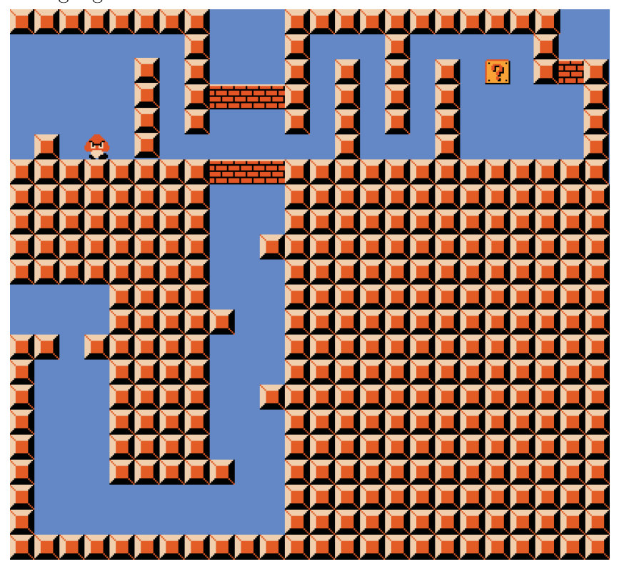

<!-- ===== PDF p1 ===== -->

<span style="color:#c0392b">**讲次 16（Lecture 16）：NP 完全性（NP-Completeness）**</span> <span style="color:#7f8c8d;">（Spring 2015，2015 春季学期）</span>

本讲将讨论 **NP 完全性（NP-Completeness）**。本讲大纲如下：

- **NP 困难性与 NP 完全性（NP-hardness and NP-completeness）**
- **3SAT**
  - **Super Mario Brothers**（超级马里奥兄弟）
  - **三维匹配（3 Dimensional Matching, 3DM）**
    - **子集和（Subset Sum，弱 weak）**
      - **划分（Partition，弱）**
        - **矩形装箱（Rectangle Packing，弱）**
    - **4-Partition（强 strong）**
      - **矩形装箱（Rectangle Packing，强）**
        - **拼图（Jigsaw Puzzles）**

<span style="color:#c0392b">**NP 困难问题与 NP 完全问题（NP-Hard and NP-Complete problems）**</span>

今天，我们讨论 NP 完全性。回顾 **6.006** 中的内容：

- **P** = 可在**多项式时间（polynomial time）**内求解的问题集合。若问题规模为 $n$，该问题应在 $n^{O(1)}$ 内求解。
- **NP** = 可在**非确定性多项式时间（nondeterministic polynomial time）**内求解的**判定问题（decision problems）**集合。这些问题的输出是 YES 或 NO 答案。**非确定性（Nondeterministic）**指的是：一个解可以从**多项式多个选项**中在 $O(1)$ 时间内被**猜出（guessed）**。如果**任意一个猜测**是 YES 实例，那么非确定性算法就会做出那个猜测。

在这种非确定性模型中，我们可以假设**所有猜测都先完成**。这等价于：为 YES 答案寻找一个**多项式时间的验证器（verifier）**，接受**多项式规模的证书（certificates）**。注意，**YES 输入与 NO 输入之间存在不对称性（asymmetry）**。

- 一个问题 $X$ 是 **NP 完全的（NP-complete）**，当且仅当 $X \in NP$ **且** $X$ 是 NP 困难的（NP-hard）。

> <span style="color:#1e8449;">**[note] Note（译者注）:**</span> 这里把 6.006 的 P/NP 定义**形式化**了：P 要求 $n^{O(1)}$（任何常数次多项式都算），NP 则允许「**先猜后验**」——算法可以先用 $O(1)$ 时间从多项式多个候选中「猜」一个解，再在多项式时间里验证。**关键洞见**（讲义下一句）：把所有猜测移到最前面之后，非确定性算法就变成一个「**验证器 + 证书**」对——证书就是那串猜测（如一组变量的赋值），验证器在多项式时间内检查它是不是合法解。这解释了为什么 NP 以**判定问题（YES/NO）**为定义：证书验证的对象只能是有明确答案的问题。🎥 *Devadas 开场的口头禅*："Polynomial good exponential bad."（翻译：多项式好，指数坏。）——这整讲都在围绕这条分界线展开。注意「若任意猜测为 YES 就选择该猜测」意味着 NP 只承诺「YES 实例有证书」；对 NO 实例，可能根本没有多项式规模的证书可给——这正是讲义强调的**不对称性**，也是 NP 理论最反直觉的地方。

> <span style="color:#1e8449;">**[note] Note（译者注，P vs NP）:**</span> 「P 是否等于 NP」是理论计算机科学**最重要且尚未解决**的问题，也是 Clay 数学研究所**千禧年七大难题（Millennium Prize Problems）**之一（奖金 100 万美元，与庞加莱猜想、黎曼猜想并列）。直觉上问的是：**「能快速验证答案的问题，是否一定能快速求解？」**如果 P ≠ NP（普遍相信如此），就意味着存在「验证容易、求解困难」的问题——密码学、算法研究、人工智能等领域都会因此获益或受损。普遍认为 P ≠ NP 主要归因于两大证据：几十年来无数聪明人针对大量 NP 完全问题都没找到多项式算法；以及 NP 完全问题之间通过归约相互联系，「一个在 P 中则全部在 P 中」的结构让人很难相信它们全部突然变易。这个问题与你在 6.042J 学过的逻辑与图论没有直接关系，但它的证明语言（多项式归约、判定问题）正是本讲要建立的。

---

<!-- ===== PDF p2 ===== -->

<span style="color:#c0392b">**NP 完全性（续）**</span>

- 一个问题 $X$ 是 **NP 困难的（NP-hard）**，如果 **每个** 问题 $Y \in NP$ 都能归约（reduce）到 $X$。
  - 若 $P = NP$，则 $X \notin P$。
- 从问题 $A$ 到问题 $B$ 的**归约（reduction）**是一个**多项式时间算法**，把问题 $A$ 的输入转换为问题 $B$ 的**等价输入**。等价（Equivalent）意味着：对原输入与转换后的输入，问题 $A$ 与问题 $B$ 必须输出**相同的 YES 或 NO 答案**。
  - 若 $B \in P$，则 $A \in NP$
  - 若 $B \in NP$，则 $A \in NP$
  - 若 $A$ 是 NP 困难的，则 $B$ 是 NP 困难的。

我们可以通过以下步骤证明一个问题 $X$ 是 NP 完全的：

1. **证明 $X \in NP$**：通过找出一个非确定性算法来证明 $X \in NP$，或给出一个针对证书的合法**验证器（verifier）**。
2. **证明 $X$ 是 NP 困难的**：从已知的 NP 完全问题 $Y$ 归约到 $X$。这是充分的，因为所有问题 $Z \in NP$ 都能归约到 $Y$，而该归约表明 $Y$ 的输入可以被改造成 $X$ 的输入，从而推出 $X$ 是 NP 困难的。一个**完整的归约（complete reduction）**必须演示以下性质：
   - (a) 给出从 $Y$ 输入到 $X$ 输入的多项式时间转换。
   - (b) 若 $Y$ 的答案是 YES，则 $X$ 的答案是 YES。
   - (c) 若 $X$ 的答案是 YES，则 $Y$ 的答案是 YES。

最后，**图件（gadget）**把一个输入问题中的特征转换为输出问题中的特征。

> <span style="color:#1e8449;">**[note] Note（译者注，归约的三个推论与两处笔误）:**</span> 归约是整讲的**主轴工具**，它的三条推论把「难易关系」沿归约方向传递：**易则更易**（$B \in P \Rightarrow A$ 也不难）、**NP 成员性传递**（$B \in NP \Rightarrow A \in NP$）、**难则更难**（$A$ 是 NP 困难 $\Rightarrow B$ 也 NP 困难）。这里有两处**原讲义笔误**，都需要代数/逻辑仲裁：**①** 第一条写的是「若 $B \in P$，则 $A \in NP$」——逻辑上虽然成立（$P \subseteq NP$，故 $A \in P \subseteq NP$），但它**弱化得没有意义**；按归约的用途，这里应是想说**更强的「若 $B \in P$，则 $A \in P$」**（即「容易的问题归约过去的那个问题也容易」）。对照后面两条的对称性（一条关于 NP 上界、一条关于 NP 困难下界），第一条显然是「$A \in P$」的笔误。**②** NP 困难定义下那条「若 $P = NP$，则 $X \notin P$」逻辑上**自相矛盾**：若 $P = NP$，则 NP 完全问题 $X \in NP = P$，必有 $X \in P$；正确的表述是**「若 $P \neq NP$，则 $X \notin P$」**（否则 $X \in P$ 会让所有 $Y \in NP$ 通过归约也跟着进 P，迫使 $P = NP$）。**归约的方向感**要抓牢：我们想证明 $X$ 难，就**从已知难的问题 $Y$ 归约到 $X$**（$Y \le_p X$），让 $X$ 继承 $Y$ 的困难性——而不是反方向。步骤 (b)(c) 合起来是「$Y$ 有解 $\iff$ $X$ 有解」，保证归约的**双向保答案**，漏掉任何一边都可能是无效归约（只证了单方向）。

<span style="color:#c0392b">**3SAT**</span>

3SAT 在 1971 年被 **Cook** 发现是 NP 完全的。

<span style="color:#2471a3;">**[definition]**</span> **定义 1（Definition 1）·3SAT**：给定一个布尔公式，形如

```math
(x_1 \lor x_3 \lor \bar{x}_6) \land (\bar{x}_2 \lor x_3 \lor \bar{x}_7) \land \ldots
```

是否存在对变量取 **True 或 False** 的赋值，使得整个公式求值为 True？

> <span style="color:#1e8449;">**[note] Note（译者注，Cook-Levin 定理）:**</span> 精确的历史是：**Cook（1971）**在论文 *The complexity of theorem proving procedures*（STOC 会议）中证明了**布尔可满足性问题 SAT 是 NP 完全的**；**Karp（1972）**随后在 *Reducibility among combinatorial problems* 中给出 **21 个 NP 完全问题**的清单（含 3SAT、3DM、子集和等本讲主角），并正式引入「多项式时间多一归约（many-one reduction）」这一如今的标准归约概念；两人因此分别获得**图灵奖（Turing Award）**。讲义说「3SAT 由 Cook 在 1971 年发现 NP 完全」在**精神上正确**（Cook 的证明直接适用于 SAT，3SAT 的 NP 完全性由 Karp 的归约确立）——若想精确，应说「SAT 由 Cook 证明 NP 完全，3SAT 由 Karp 通过归约证明」。这是**第一个**被证明 NP 完全的「自然」问题，被称作 **Cook-Levin 定理**，是整个 NP 完全性理论的地基。

---

<!-- ===== PDF p3 ===== -->

<span style="color:#c0392b">**3SAT（续）**</span>

我们注意到，一个**文字（literal）**形如 $\{x_i, \bar{x}_i\}$，文字的两种形式都对应同一个变量 $x_i$。一个**子句（clause）**由 **3 个文字的 OR** 组成，一个**公式（formula）**是子句的 **AND**。

**3SAT ∈ NP**，因为我们可以为证书创建一个验证器。对 3SAT 的一个给定实例，一个证书对应每个变量的一组赋值列表，验证器可以计算该实例是否被满足（即能否求值为真）。因此验证器是多项式时间的，证书是多项式长度的。

重要的是要注意：这个验证器**只保证一个 3SAT 实例是可验证的（verifiable）**。要确保一个 3SAT 实例**不可**验证（即答案应为 NO），算法必须检查**每一个**变量赋值——这无法在多项式时间内完成。

**3SAT 也是 NP 困难的**。我们给出这个结论的一些直觉。考虑 NP 中的任意问题。因为它属于 NP，存在一个求解该问题的非确定性多项式时间算法，或一个检查解的验证器。验证器是一个算法，可以**实现为一个电路（circuit）**。现在，这个电路由 **AND、OR 和 NOT** 门组成，可以表示为一个公式。这个公式可以转换为 3SAT 形式（每个子句有 3 个文字），且与原公式等价。因此 NP 中的所有问题都可以转换为 3SAT，原问题的输入与转换后 3SAT 的输入等价，故 3SAT 是 NP 完全的。

> <span style="color:#1e8449;">**[note] Note（译者注，验证器直觉）:**</span> 「3SAT ∈ NP」的验证器很朴素：证书就是一组赋值（$x_1 = \text{T}, x_2 = \text{F}, \ldots$），验证器逐个子句检查「是否至少有一个文字为真」——线性时间完成。为什么这样就是「NP」？因为非确定性算法可以**先猜**这组赋值（猜 $O(n)$ 个比特），再跑这个验证器；若存在一组能通过的赋值，非确定性猜测保证会选到它。🎥 *Devadas 用「朋友证明」的比喻讲透了验证与求解的区别*："Your friend claims this 3SAT formula is satisfiable... they give you the guesses. And then you don't have to be convinced that those are the right guesses, you can check that it's the right guess. You can compute this formula in linear time."（翻译：你朋友声称这个 3SAT 公式可满足……他把猜测给你，你不必先相信这些猜测是对的，而是可以检查它是不是对的——在线性时间内算出这个公式。）——**求解难，验证易**，这正是 NP 的定义性特征。而「不可验证性」那一句点出不对称的根源：要证明一个实例**不可**满足，需要排除全部 $2^n$ 种赋值，没有捷径。

> <span style="color:#1e8449;">**[note] Note（译者注，NP 困难直觉 = Cook-Levin 核心）:**</span> 这一段「NP 困难」的直觉其实是 **Cook-Levin 定理证明的骨架**，值得拆开理解：**(1) 电路化**——NP 的验证器本质上是一个（多项式大小的）布尔电路；**(2) 公式化**——电路由 AND/OR/NOT 门组成，每个门都可以写成一个小公式，整电路可展开成一个布尔公式；**(3) 3-化**——把子句拆成「每个子句 ≤ 3 个文字」的形式（引入辅助变量即可，这是 3SAT 与一般 SAT 等价的技巧）。于是**任何 NP 问题的实例都能被翻译成一个 3SAT 公式**，且「NP 问题有解 ⟺ 对应 3SAT 可满足」——这就是「所有 NP 问题归约到 3SAT」。这里展示的是**归约的方向逻辑**（从任意 NP 问题到 3SAT），而不是具体构造。它与你在 6.006 学过的**电路/逻辑门**知识直接衔接：电路是硬件层面的「计算」，公式是软件层面的「描述」，两者可以无损互换——这一互换正是「计算与逻辑等价」的第一性原理。

---

<span style="color:#c0392b">**Super Mario Brothers**</span>

[Aloupis, Demaine, Guo, Viglietta 2014]

我们通过给出一个从 3SAT 的归约来证明 **Super Mario Brothers 是 NP 困难的**。这个版本的 Super Mario Brothers 被**推广到任意的 $n \times n$ 屏幕大小**，因此我们去掉对屏幕上物品数量的限制。我们有如下问题定义：

<span style="color:#2471a3;">**[definition]**</span> **定义 2（Definition 2）·Super Mario Brothers**：给定一个 Super Mario Brothers 的关卡，我们能**进入下一关**吗？

因为我们从 3SAT 归约，给定一个 3SAT 实例，我们必须生成一个与该 3SAT 实例对应的 Super Mario Brothers 关卡。

我们通过为 3SAT 公式中的**每个变量构造图件（gadget）**来构造关卡，如图 1 所示。Mario 从岩架上跳下，**无法跳回**。他可以选择向左或向右落下，分别对应把该变量赋值为 **True 或 False**。关卡的其余部分被设计成**这个选择无法被撤销**。

我们还为子句创建如下**图件**。在为给定变量选择赋值后，Mario 会访问所有具有相同文字值的子句图件，

---

<!-- ===== PDF p4 ===== -->

**图 1（Figure 1）**：Super Mario Brothers 的图件。



> <span style="color:#7f8c8d;">[图注说明] 原页附图（© Nintendo. All rights reserved）：Super Mario Brothers 的三个图件——(a) 变量图件（variable gadget）：Mario 从高处跳下、落入一个不可逆的选择通道，向左 = False、向右 = True；(b) 子句图件（clause gadget）：进入后可释放一颗星星；(c) 交叉图件（crossover gadget）：两条通道交叉而不连通，防止 Mario 在非允许处切换图件。</span>

> <span style="color:#7f8c8d;">© Nintendo. All rights reserved. 此内容被排除在我们的 Creative Commons 许可之外。更多信息见 http://ocw.mit.edu/fairuse。</span>

<!-- ===== PDF p5 ===== -->

<span style="color:#c0392b">**Super Mario Brothers（续）**</span>

然后移动到下一个变量图件。通过访问一个子句，Mario 可以**释放一颗星星（star）**。最后，在访问完所有变量图件后，Mario 必须**重新穿过**子句图件。如果该子句图件之前被访问过，就会有一颗星星可用，他可以穿过火焰；否则，他将无法穿过该子句图件而**死亡**。

因此，**通关等价于在第二遍穿过所有子句图件**。Mario 只有在这些子句都**被某个变量赋值满足**的情况下，才能穿过所有子句图件。遍历各个变量图件的动作对应于 3SAT 公式的解，所以如果 Mario 能通关，我们就有了 3SAT 问题的解。

最后一个需要的图件是**交叉图件（crossover gadget）**。它确保 Mario **不会在不允许的情况下**在变量图件与子句图件之间切换。所有这些图件的总大小都在归约所需的**多项式规模**内。

因此，**Mario 能通关，当且仅当**原来的 3SAT 公式可满足。于是我们从 3SAT 完成了归约，**Super Mario Brothers 是 NP 困难的**。

> <span style="color:#1e8449;">**[note] Note（译者注，Super Mario 归约的设计哲学）:**</span> 这个归约是「**用游戏机制模拟逻辑电路**」的教科书级示范，三种图件各司其职：**变量图件**负责「选值」（不可逆的下落 = 一旦选定无法反悔，模拟变量的赋值）；**子句图件**负责「检查」（子句里三个文字，只要被赋值覆盖的那个文字被访问到就释放星星——对应「子句至少一个文字为真」）；**交叉图件**负责「布线」（模拟导线跨越，让不同变量/子句的信号互不干扰）。而「第二遍穿越」的设计尤其巧妙：第一遍只负责「点亮」被满足的子句（每访问一个子句放一颗星星），第二遍必须全部通过——**「所有子句都被点亮」恰好就是公式被满足**。这完美对应归约双向性：Mario 能通关 ⟺ 存在使所有子句为真的赋值。🎥 *Devadas 在现场画图讲变量图件*："Here's Mario... Once Mario is down here, if you check the jump height, you cannot get back up to here. So this is like a one way. Once you're down here, you have a choice: should I fall to the left or fall to the right?"（翻译：这是 Mario……一旦他落到这里，你检查跳跃高度就会发现他跳不回上面——这是单向的。落到这里后他要选择：往左掉还是往右掉？）——「单向 + 二选一」正是布尔变量的几何化身。该归约出自 Aloupis、Demaine、Guo、Viglietta（2014）的论文，把「任意屏幕尺寸的超级马里奥能否通关」证明为 NP 完全。

<span style="color:#c0392b">**三维匹配（3 Dimensional Matching, 3DM）**</span>

<span style="color:#2471a3;">**[definition]**</span> **定义 3（Definition 3）·3DM**：给定两两不相交（disjoint）的集合 $X$、$Y$、$Z$，各含 $n$ 个元素，以及三元组集合 $T \subseteq X \times Y \times Z$，是否存在子集 $S \subseteq T$，使得 $X \cup Y \cup Z$ 中的**每个元素**恰好出现在 $S$ 中**一个**三元组 $s \in S$ 里？

**3DM ∈ NP**：给定一个证书（列出候选的三元组列表），验证器可以检查每个三元组都属于 $T$，且 $X \cup Y \cup Z$ 的每个元素恰好在一个三元组中。

**3DM 也是 NP 完全的**，通过一个从 3SAT 的归约。我们为变量和子句构造图件。

变量 $x_i$ 的**变量图件**如图所示。只能选择**红色或蓝色**三角形：红色三角形对应真文字（true literal），蓝色三角形对应假文字（false literal）。否则，就会出现重叠，或某些内部元素无法被覆盖。每个变量图件有一个「**$2n_{x_i}$ 轮（wheel）**」，其中 $n_{x_i}$ 对应 $x_i$ 在公式中的**出现次数**。

子句 $x_i \land \bar{x}_j \land x_k$ 的**子句图件**如图所示。子句图件中每个变量三角形内**不共享的点（dot）**，也是该变量图件中的**单个点**。

> <span style="color:#7f8c8d;">[原图说明] 原页正文引用了 3DM 的变量图件与子句图件配图（原文标注「displayed in the picture」），但重排版 PDF 中未包含这些图（仅 p4 的 Super Mario 图件有实际图片）。以下翻译保留文字描述，图形请参照原始视频/讲义。</span>

那么，如果我们将 $x_i$ 设为真，就取走变量图件中**所有红色假三角形**，留下一个**蓝色真三角形**用于覆盖子句图件。然而，这仍可能留下 $\bar{x}_j$ 和 $x_k$ 未被覆盖，所以我们需要一个**垃圾回收（garbage collection）图件**，如下图所示。这种图件有 $\sum_x n_x$ 个，因为有 $n_x$ 个变量图件中**多余的元素**将不会被覆盖。然而，在剩余元素中，每个子句会覆盖其中一个，因此剩余的需要用**垃圾回收子句**来覆盖。

---

<!-- ===== PDF p6 ===== -->

<span style="color:#c0392b">**3DM（续）**</span>

因此，如果 3SAT 公式存在一个解，我们可以通过选择 3DM 中与变量值对应的点来找到 3DM 问题的解。如果我们有一个 3DM 解，我们可以把它映射回 3SAT 的满足赋值。因此，我们的归约是完整的，**3DM 是 NP 困难的**。

> <span style="color:#1e8449;">**[note] Note（译者注，3DM 图件的三角结构）:**</span> 3DM 的归约展示了「**几何选择 + 精确覆盖**」的模板。变量图件用「红/蓝三角形二选一」编码变量的真/假：选了红色（真）就覆盖掉「真文字」对应的点，留下「假文字」对应的点给子句图件去覆盖——每个变量的「**轮（wheel）**」有 $2n_{x_i}$ 个顶点，恰好对应变量 $x_i$ 作为**正文字出现 $n_{x_i}$ 次**、作为**负文字出现 $n_{x_i}$ 次**（一真一假各一轮），保证「选真或选假」恰好覆盖一半、留一半。子句图件用「一个共享点」把子句的三个文字连起来：只要该子句中有一个文字对应的变量赋值「留下了它的点」，这个点就能被子句图件的一个三角形覆盖。**垃圾回收图件**处理残局：每个变量选了真/假后，另一侧的 $n_{x_i}$ 个点必然裸露，这些点需要专门的「垃圾」三角形来覆盖，从而保证**不通过变量赋值「作弊」**。这套「变量选边 → 子句验证 → 垃圾回收」与 Super Mario 的「变量图件 → 子句图件 → 交叉图件」是**同一个设计模板**，是归约构造的通用范式。

<span style="color:#c0392b">**子集和（Subset Sum）**</span>

<span style="color:#2471a3;">**[definition]**</span> **定义 4（Definition 4）·Subset Sum**：给定 $n$ 个整数 $A = \{a_1, a_2, \ldots, a_n\}$ 和一个目标总和 $t$，是否存在子集 $S \subseteq A$ 使得

```math
\sum_{a_i \in S} a_i = t
```

**子集和问题是 NP 完全的**。它属于 NP，因为验证器只需在多项式时间内检查给定的子集是 $A$ 的子集且其总和等于目标值。

它通过一个从 **3DM** 的归约证明是 NP 困难的。把数字看作以 **$b = 1 + \max_i n_{x_i}$** 为基数的表示。那么三元组 $(x_i, x_j, x_k)$ 可以写成基 $b$ 下的形式 $000100100001000 = b^i + b^j + b^k$，其中第一个 1 对应 $i$，第二个对应 $j$，第三个对应 $k$。目标总和

```math
t = 111111111111111 = \sum_i b^i
```

这防止任何 1 发生**碰撞（colliding）**，从而确保每个元素恰好被使用一次：多个 1 对应「重复使用某个元素」，而基数足够大，使得没有更小的数字之和能拼出下一个 $b$ 的幂。这完成了归约。

事实上，**子集和问题只是弱 NP 困难的（weakly NP-hard）**。$t$ 的位数是 $O(n)$。这意味着归约中使用的数字的值是**输入的指数级**，使该问题成为弱 NP 困难的。**强 NP 困难（strongly NP-hard）**的问题必须只使用输入规模**多项式**大小的数值。

这也意味着该问题可以用**伪多项式（pseudopolynomial）算法**求解。

> <span style="color:#1e8449;">**[note] Note（译者注，基 b 编码与弱 NP 困难）:**</span> 3DM → 子集和的归约本质是「**用大数编码选择**」：每个元素（3DM 中 $X \cup Y \cup Z$ 的每个点）占据**一个十进制/基 $b$ 的位**，每个三元组变成一个「在三个位上各放一个 1」的数，目标是「所有位都是 1」的数 $\sum_i b^i$。**基 $b = 1 + \max_i n_{x_i}$ 的选择是防止进位的关键**：如果同一元素出现在 $n_{x_i}$ 个三元组里，那这些三元组对应的数字在同一位置最多叠加 $n_{x_i}$ 个 1，而 $n_{x_i} < b$，不会进位——「恰好每个元素用一次」就等价于「每个位上的 1 恰好被覆盖一次」，即一个完美 3DM。**弱 NP 困难**的含义是：问题之所以难，是因为数字可以**指数级大**（$b^i$ 在 $n$ 个位上虽然只有 $O(n)$ 位长，但数值本身约 $b^n$，是指数级）；如果把输入写成**一进制（unary）**，数值规模就回归多项式。正因为如此，**伪多项式算法**（运行时间关于「数值」而非「位数」多项式，如经典的 $O(n \cdot t)$ 子集和 DP）可以解决它——你在讲次 10 动态规划里见过的背包/子集和 DP 正是这种算法。对比：**强 NP 完全**问题（如 4-Partition）即使把数值限制成多项式大小仍然 NP 完全，因此**不存在**伪多项式算法（除非 P = NP）。

---

<!-- ===== PDF p7 ===== -->

<span style="color:#c0392b">**划分（Partition）**</span>

<span style="color:#2471a3;">**[definition]**</span> **定义 5（Definition 5）·Partition**：给定 $A = \{a_1, a_2, \ldots, a_n\}$，是否存在子集 $S \subseteq A$ 使得

```math
\sum_{a_i \in S} a_i = \sum_{a_i \in A \setminus S} a_i = \frac{1}{2} \sum_{a_i \in A} a_i
```

**划分问题也是弱 NP 完全的**。它是子集和问题的特例：取 $t = \frac{1}{2} \sum A$。事实上，我们可以把 Partition **归约到** Subset Sum，尽管这不是我们想要的归约方向。

我们可以如下**从 Subset Sum 归约到 Partition**。令 $\sigma = \sum A$。向 $A$ 中添加元素 $a_{n+1} = \sigma + t$ 和 $a_{n+2} = 2\sigma - t$。那么 $a_{n+1}$ 和 $a_{n+2}$ 必须位于划分的**不同两侧**。为了平衡两侧，每侧必须凑到 $2\sigma$：包含 $a_{n+1} = \sigma + t$ 的一侧还需从 $A$ 中凑 $\sigma - t$（即 $A$ 中不选入子集 $S$ 的部分），包含 $a_{n+2} = 2\sigma - t$ 的一侧还需从 $A$ 中凑 $t$。因此如果我们能求解 Partition，也就得到了总和为 $t$ 的元素子集——这正是子集和问题的目标，我们的归约完成。

> <span style="color:#1e8449;">**[note] Note（译者注，Subset Sum → Partition 归约的代数验证）:**</span> 这个归约值得动手验一遍（这也是原讲义文字有歧义、需要代数仲裁的地方）。扩展后全集总和 $= \sigma + (\sigma + t) + (2\sigma - t) = 4\sigma$，所以划分的**每一侧必须等于 $2\sigma$**。两个新元素之和 $(\sigma + t) + (2\sigma - t) = 3\sigma > 2\sigma$，**不可能同侧**，故分处两侧。含 $a_{n+1} = \sigma + t$ 的一侧已超出 $2\sigma$？没有：$\sigma + t \le 2\sigma$（当且仅当 $t \le \sigma$，不失一般性成立），还需 $\sigma - t$；含 $a_{n+2} = 2\sigma - t$ 的一侧还需 $t$。于是「$a_{n+2}$ 那一侧从 $A$ 中选的元素和恰为 $t$」——**正好是子集和的 YES 证书**；反过来，若 $A$ 有子集和为 $t$，把它与 $a_{n+2}$ 放一侧、其余与 $a_{n+1}$ 放另一侧，即得合法划分。这个「**添两个大元素、利用总和控制结构**」的手法，与讲次 10 的 DP 归约、以及 CSAPP 里「用位模式编码信息」的思想一脉相承。划分问题还有个响亮的绰号：**「最简单的最难问题（easiest hard problem）」**（维基百科 Partition problem 词条）——因为它 NP 完全，却又有简单实用的伪多项式 DP 与近似启发式，日常生活中（如公平分配）几乎总是能快速解决。

<span style="color:#c0392b">**矩形装箱（Rectangle Packing）**</span>

<span style="color:#2471a3;">**[definition]**</span> **定义 6（Definition 6）·Rectangle Packing**：给定一组矩形 $R_i$ 和一个目标矩形 $T$，能否把矩形 $R_i$ 装进 $T$ 且**互不重叠**？注意：矩形 $R_i$ 的面积之和等于目标矩形的面积，即 $\sum_i R_i = T$。

矩形装箱通过一个从 **Partition** 的归约证明是**弱 NP 困难的**。对 Partition 中的每个元素 $a_i$，我们创建一个**高为 1、宽为 $3a_i$** 的矩形 $R_i$。目标矩形**高为 2、宽为 $3t = \frac{3}{2} \sum A$**。因为每个矩形的宽度**至少为 3**，所有矩形都必须**水平**放置。因此，要求解矩形装箱问题，我们必须把方块分成**总宽度为 $3t$ 的两组**，这对应 Partition 问题中**总和为 $t$ 的两个子集**。

> <span style="color:#1e8449;">**[note] Note（译者注，几何归约的直觉）:**</span> 这个归约把「数字的加和」翻译成「矩形的宽度」：高为 1 强制所有矩形只能铺满两层（目标高 2），而宽 $3a_i \ge 3$ 又杜绝了竖直叠放（竖着放会超过高度 2 的限制），于是每个矩形**只能是「高度 1 的一层、水平放置」**——问题退化成「把一堆宽度为 $3a_i$ 的条带分成两组，使每组宽度恰为 $3t$」。而 $3t = \frac{3}{2}\sum A$ 恰好等于每组应有的宽度（总宽 $3\sigma$ 分两组）。于是「两组宽度各为 $3t$」⟺「两组 $a_i$ 之和各为 $t$」⟺ Partition 有解。面积守恒条件（$\sum R_i = T$ 的面积）保证不会出现「多余空间」干扰。这是**数值问题 → 几何问题**归约的经典示范，与你在 CSAPP 里看到的「用几何/布局编码信息」的思路同源。

<span style="color:#c0392b">**拼图（Jigsaw Puzzles）**</span>

[Demaine & Demaine 2007]

<span style="color:#2471a3;">**[definition]**</span> **定义 7（Definition 7）**：给定没有图案的**方形拼块（square tiles）**，能否把这些拼块排列起来**契合一个目标矩形形状**？注意：拼块可以有**侧边凸舌（tab）、凹槽（pocket）或边界（boundary）**，但凸舌与凹槽必须有**匹配的形状**。

最显然的归约来自 Partition：对每个数字，创建一组具有唯一凸舌与凹槽的方形拼块，拼块数量等于 $a_i$ 的值，且矩形的**两个端块（end pieces）**有边界。

---

<!-- ===== PDF p8 ===== -->

<span style="color:#c0392b">**拼图（续）**</span>

然而，这个归约**无法完成**，因为 Partition 的输入可能**指数级大**（拼块数量会太多）。

于是，归约改从 **4-Partition** 出发。

<span style="color:#2471a3;">**[definition]**</span> **定义 8（Definition 8）·4-Partition**：给定 $n$ 个整数 $A = \{a_1, a_2, \ldots, a_n\}$，且每个 $a_i \in \left( \frac{t}{5}, \frac{t}{3} \right)$，是否存在一个划分为 $\frac{n}{4}$ 个**含 4 个元素**的子集，每个子集的和都相同，为

```math
t = \frac{\sum A}{n/4}
```

**4-Partition 是强 NP 完全问题**。我们通过从 4-Partition 到 Jigsaw Puzzles 的归约来证明 Jigsaw Puzzles 是 NP 困难的。

对每个 $a_i$，我们创建如下一组拼块。这确保我们**不能混用来自不同 $a_i$ 的拼块**。这些拼块被放入如下目标板中。目标板有 $\frac{n}{4}$ 行，每行将容纳对应 4-Partition 问题中 4 个 $a_i$ 项的拼块。目标板的宽度是 $t$，因为每行必须容纳 $t$ 个拼块，使得对应的 $a_i$ 在 4-Partition 问题中构成一个和为 $t$ 的组。因此，归约是完整的。

> <span style="color:#1e8449;">**[note] Note（译者注，强 NP 完全与 Jigsaw 归约）:**</span> 为什么 Jigsaw 的归约必须来自 4-Partition 而非 Partition？**关键在「强 vs 弱」**：Partition 是**弱** NP 完全的，其困难性来自数值可以指数大；而拼图问题的输入是**物理拼块的数量**（规模即数量本身，无法把「指数大的数」塞进输入），所以从 Partition 归约会把指数大的 $a_i$ 翻译成指数多块拼块——输出规模爆炸，归约不再是多项式的。**4-Partition 是强 NP 完全的**：即使把每个 $a_i$ 限制为输入规模多项式大小（甚至用一进制编码），它仍然 NP 完全（维基百科 3-partition 词条：3-partition 在 $a_i$ 有界于 $n$ 的多项式时仍 NP 完全，即「强 NP 完全」）。因此从 4-Partition 归约能保证输出（拼块数）是多项式的。**强/弱 NP 困难的分界**由此成为归约设计的第一道选择题：目标问题如果「输入本身就是计数型」（拼块、顶点、矩形个数），就必须选一个强 NP 完全的问题来归约，否则输出会膨胀。这是本讲隐藏在例子背后的**方法论教训**。Jigsaw 归约出自 Demaine & Demaine（2007）*Jigsaw puzzles, edge matching, and polyomino packing: Connections and complexity*——正是本讲教师 Erik Demaine 与其父 Martin Demaine 的合作成果。

---

<!-- ===== PDF p9 ===== -->

<span style="color:#7f8c8d;">**MIT OpenCourseWare**</span>

<span style="color:#7f8c8d;">http://ocw.mit.edu</span>

<span style="color:#7f8c8d;">**6.046J / 18.410J 算法设计与分析（Design and Analysis of Algorithms）**</span>

<span style="color:#7f8c8d;">Spring 2015（2015 春季学期）</span>

<span style="color:#7f8c8d;">有关引用这些材料的信息或我们的使用条款（Terms of Use），请访问：http://ocw.mit.edu/terms。</span>
