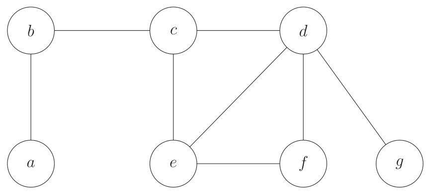
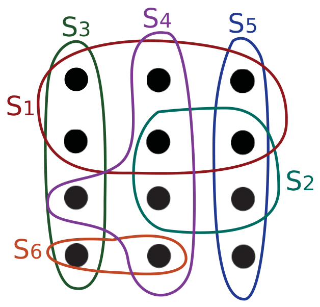
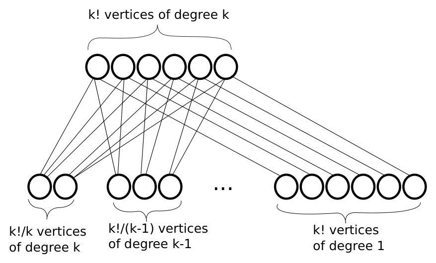

<!-- ===== PDF p1 ===== -->

<span style="color:#c0392b">**讲次 17（Lecture 17）：近似算法（Approximation Algorithms）**</span> <span style="color:#7f8c8d;">（Spring 2015，2015 春季学期）</span>

本讲大纲：
- **定义（Definitions）**
- **顶点覆盖（Vertex Cover）**
- **集合覆盖（Set Cover）**
- **划分（Partition）**

<span style="color:#c0392b">**近似算法与方案（Approximation Algorithms and Schemes）**</span>

令 $C_{opt}$ 是规模为 $n$ 的问题的**最优算法**的代价。如果对**任意输入**，该问题的一个近似算法都能产生代价为 $C$ 的解，满足

```math
\max\!\left( \frac{C}{C_{opt}}, \; \frac{C_{opt}}{C} \right) \le Q(n)
```

那么这个近似算法具有**近似比（approximation ratio）** $Q(n)$。这样的算法称为 **$Q(n)$-近似算法（$Q(n)$-approximation algorithm）**。

以 $c > 0$ 作为输入、并对任意固定的 $c$ 都产生满足 $C = (1 + c) C_{opt}$ 的解的近似方案（approximation scheme），是一个 **$(1 + c)$-近似算法**。

**多项式时间近似方案（Polynomial Time Approximation Scheme, PTAS）**是一个运行时间关于**输入规模 $n$ 多项式**的近似算法。**完全多项式时间近似方案（Fully Polynomial Time Approximation Scheme, FPTAS）**是一个运行时间关于 **$n$ 和 $c$ 都是多项式**的近似算法。例如，一个 $O(n^{2/\varepsilon})$ 近似算法是 PTAS 但不是 FPTAS；一个 $O(n/\varepsilon^2)$ 近似算法是 FPTAS。

<span style="color:#c0392b">**顶点覆盖（Vertex Cover）**</span>

给定无向图 $G(V, E)$，找到子集 $V' \subseteq V$，使得对每条边 $(u, v) \in E$，都有 $u \in V'$ 或 $v \in V'$（或两者都在）。进一步，找到使 $|V'|$ **最小**的 $V'$。这是一个 **NP 完全**问题。

> <span style="color:#1e8449;">**[note] Note（译者注，近似比的定义）:**</span> 近似比用 $\max(C/C_{opt},\, C_{opt}/C)$ 而不是简单比值，是为了**同时覆盖最小化与最大化问题**：最小化问题有 $C \ge C_{opt}$（用 $C/C_{opt}$），最大化问题有 $C \le C_{opt}$（用 $C_{opt}/C$），取 $\max$ 保证两种情形下比值都 $\ge 1$。**近似算法与启发式（heuristic）的本质区别**是：启发式只求「通常表现好」，近似算法必须给出**对所有输入都成立的、可证明的最坏情形保证**（worst-case guarantee）。🎥 *Devadas 把两者的差别一句话讲清*："I'm going to use a heuristic... Or you could do approximation algorithms... I'm going to prove that this greedy heuristic, in every conceivable situation with respect to the inputs, is going to be within some factor of optimal."（翻译：我要用启发式……或者你也可以做近似算法——我要证明这个贪心启发式，对任何输入的任何可能情况，都落在最优解的某个因子之内。）这与你在讲次 16 学到的 NP 困难性直接衔接：正因为这些优化问题在 $P \ne NP$ 下无法多项式精确求解，我们退而求其次，追求「多项式时间 + 有保证的近似」。

> <span style="color:#1e8449;">**[note] Note（译者注，PTAS 与 FPTAS 的微妙分界）:**</span> PTAS 与 FPTAS 的差别在于 $1/\varepsilon$ 是否也进入多项式：**PTAS** 只要求「对**每个固定的** $\varepsilon$，运行时间关于 $n$ 是多项式」（$\varepsilon$ 可以指数地影响运行时间，如 $O(n^{1/\varepsilon})$ 甚至 $O(n^{e^{1/\varepsilon}})$ 都算 PTAS）；**FPTAS** 则要求关于 $n$ **和 $1/\varepsilon$** 都多项式。所以 $O(n^{2/\varepsilon})$ 是 PTAS 而非 FPTAS（$1/\varepsilon$ 出现在指数上），$O(n/\varepsilon^2)$ 是 FPTAS（$1/\varepsilon$ 只以多项式形式出现）。维基百科（Polynomial-time approximation scheme 词条）还给出层级关系：**除非 $P = NP$，否则 FPTAS ⊊ PTAS ⊊ APX**——即「有 FPTAS」比「有 PTAS」更稀缺，而 APX 是「有常数因子近似」的类。$\varepsilon$ 越小（答案越接近最优），FPTAS 越贵——这是**精度与效率的权衡**，和你大二上要学的凸优化里「迭代精度 vs 运行时间」是同一个思想。另注：原文用字母 $c$ 表示通常的 $\varepsilon$，本文翻译统一采用 $\varepsilon$。

<!-- ===== PDF p2 ===== -->

<span style="color:#c0392b">**顶点覆盖的近似算法（Approximation Algorithm for Vertex Cover）**</span>

这里我们定义算法 **Approx Vertex Cover**——顶点覆盖的一个近似算法。从一个空集 $V'$ 开始。只要 $E$ 中还有边，就**任取**一条边 $(u, v)$。把 $u$ 和 $v$ **都**加入 $V'$。删除**所有与 $u$ 或 $v$ 关联**的边。重复直到 $E$ 中不再有边。Approx Vertex Cover 在多项式时间内运行。

以如下图 $G$ 为例：



> <span style="color:#7f8c8d;">[原图说明] 原页附图：示例图 $G$，顶点 $a, b, c, d, e, f, g$ 及其边（矢量图，p2）。Approx Vertex Cover 可能依次选中边 $(b, c)$、$(e, f)$、$(d, g)$。此图将在统一裁剪阶段作为原图插回。</span>

Approx Vertex Cover 可能依次选中边 $(b, c)$、$(e, f)$ 和 $(d, g)$，从而 $V' = \{b, c, e, f, d, g\}$ 且 $|V'| = 6$。因此代价 $C = |V'| = 6$。这个例子的最优解是 $\{b, d, e\}$，故 $C_{opt} = 3$。

<span style="color:#2471a3;">**[claim]**</span> **论断（Claim）**：Approx Vertex Cover 是一个 **2-近似算法**。

<span style="color:#2471a3;">**[proof]**</span> **证明（Proof）**：令 $U \subseteq V$ 是 Approx Vertex Cover 所选中边的集合。最优顶点覆盖必须包含 $U$ 中每条边的**至少一个端点**（以及其他边）。此外，$U$ 中**没有两条边共享端点**。因此，$|U|$ 是 $C_{opt}$ 的一个下界，即 $C_{opt} \ge |U|$。Approx Vertex Cover 返回的 $V'$ 中顶点数是 $2 \cdot |U|$。因此，$C = |V'| = 2 \cdot |U| \le 2C_{opt}$。故 $C \le 2 \cdot C_{opt}$。$\square$

> <span style="color:#1e8449;">**[note] Note（译者注，2-近似证明的妙处）:**</span> 这个证明只用了两步，却很有代表性：**(1)** 选中的边集 $U$ 构成一个**匹配（matching）**——因为每次选边后所有关联边都被删除，后续选中的边不可能与之前的共享端点；**(2)** 最优覆盖必须为 $U$ 中每条边付出**至少一个**顶点（这些边互不共享端点，一个顶点盖不住两条），所以 $|U| \le C_{opt}$。而算法对每条边**付了两个**顶点（$u$ 和 $v$），于是 $C = 2|U| \le 2C_{opt}$。**「2」这个因子精确来自「一条边要盖住两端、而最优每边至少花一个」**。注意证明根本没用到图的具体结构——这正是最坏情形保证的含义：不管输入长什么样，比值都不超过 2。维基百科（Vertex cover 词条）补充：在**唯一博弈猜想（Unique Games Conjecture）**成立的前提下，顶点覆盖无法做到因子小于 2 的近似——所以这个朴素的 2-近似其实是**最优可能**；它还可以看作「半整数（half-integral）LP 的解」+「对偶 = 最大匹配」的产物，和你在讲次 15 学的 LP 对偶直接呼应。

<span style="color:#c0392b">**集合覆盖（Set Cover）**</span>

给定集合 $X$ 和一族（可能重叠的）子集 $S_1, S_2, \cdots, S_m \subseteq X$，满足 $\bigcup_{i=1}^{m} S_i = X$，找到集合 $P \subseteq \{1, 2, 3, \cdots, m\}$ 使得 $\bigcup_{i \in P} S_i = X$。进一步，找到使 $|P|$ **最小**的 $P$。

集合覆盖是一个 **NP 完全**问题。

---

<!-- ===== PDF p3 ===== -->

<span style="color:#c0392b">**集合覆盖（续）**</span>

<span style="color:#c0392b">**集合覆盖的近似算法（Approximation Algorithm for Set Cover）**</span>

这里我们定义算法 **Approx Set Cover**——集合覆盖的一个近似算法。先把集合 $P$ 初始化为空集。只要 $X$ 中还有元素，就**选取最大的集合 $S_i$** 并把 $i$ 加入 $P$。然后从 $X$ 和所有其他子集 $S_j$ 中删除 $S_i$ 中的所有元素。重复直到 $X$ 中不再有元素。Approx Set Cover 在多项式时间内运行。

在下面的例子中，每个点都是 $X$ 中的一个元素，每个 $S_i$ 都是 $X$ 的子集。



> <span style="color:#7f8c8d;">[原图说明] 原页附图：集合覆盖示例图，$S_1$ 至 $S_6$ 六个子集，圆内点表示元素（内含 4 张小图，p3）。Approx Set Cover 依次选中 $S_1, S_4, S_5, S_3$。此图将在统一裁剪阶段作为原图插回。</span>

Approx Set Cover 按顺序选取集合 $S_1, S_4, S_5, S_3$。因此它返回 $P = \{1, 4, 5, 3\}$，其代价 $C = |P| = 4$。最优解是 $P_{opt} = \{S_3, S_4, S_5\}$，$C_{opt} = |P_{opt}| = 3$。

<span style="color:#2471a3;">**[claim]**</span> **论断（Claim）**：Approx Set Cover 是一个 **$(\ln(n) + 1)$-近似算法**（其中 $n = |X|$）。

<span style="color:#2471a3;">**[proof]**</span> **证明（Proof）**：令最优覆盖为 $P_{opt}$，且 $C_{opt} = |P_{opt}| = t$。令 $X_k$ 为 Approx Set Cover 在第 $k$ 轮迭代中**剩余的元素集合**，于是 $X_0 = X$。那么：

- 对所有 $k$，$X_k$ 都能被 $t$ 个集合覆盖（来自最优解）。
- 其中有一个集合至少覆盖 $|X_k|/t$ 个元素。
- Approx Set Cover 会选取一个（当前）大小 $\ge |X_k|/t$ 的集合。

---

<!-- ===== PDF p4 ===== -->

<span style="color:#c0392b">**集合覆盖（续）**</span>

- 对所有 $k$，$|X_{k+1}| \le (1 - \frac{1}{t}) |X_k|$（更精细的分析（见 CLRS 第 35 章）把 $Q(n)$ 与**调和数（harmonic numbers）**联系起来。$t$ 应该收缩。）
- 对所有 $k$，$|X_{k+1}| \le (1 - \frac{1}{t})^k \cdot n \le e^{-k/t} \cdot n$（其中 $n = |X_0|$）

算法在 $|X_k| < 1$（即 $|X_k| = 0$）时终止，此时的代价为 $C = k$：

```math
e^{-k/t} \cdot n < 1 \quad \Rightarrow \quad e^{k/t} > n
```

因此算法在 $k > t \ln(n)$ 时终止。所以 $k = C \le t \ln(n) + 1$，于是

```math
\frac{C}{C_{opt}} = \frac{C}{t} \le \ln(n) + 1
```

因此 Approx Set Cover 是集合覆盖的一个 $(\ln(n) + 1)$-近似算法。$\square$

注意到对于更大的问题，近似比会变差，因为它随 $n$ 变化。

> <span style="color:#1e8449;">**[note] Note（译者注，集合覆盖的 $\ln n$ 分析与调和数）:**</span> 集合覆盖的贪心分析是「**每轮保证吃掉剩余元素的一定比例**」的典范。核心不等式 $|X_{k+1}| \le (1 - \frac{1}{t})|X_k|$ 的来由：剩余 $X_k$ 能被最优的 $t$ 个集合覆盖，故某个最优集合覆盖至少 $|X_k|/t$ 个剩余元素；贪心选的是**当前最大**的集合，选的集合至少这么大，所以每轮剩余元素至少缩小 $1/t$ 的比例。反复迭代得 $|X_k| \le (1-\frac{1}{t})^k n \le e^{-k/t} n$（用到 $1 - x \le e^{-x}$）。当 $e^{-k/t}n < 1$ 即 $k > t \ln n$ 时必清空，故迭代次数 $C \le t \ln n + 1$，比值 $C/C_{opt} \le \ln n + 1$。CLRS 第 35.3 节用**调和数** $H_n = 1 + \frac12 + \cdots + \frac1n \approx \ln n$ 做更精细的分析（把每轮「新覆盖的元素分摊成本」累加），得到同样量级的界。这个「每轮按最优比例收缩」的论证模板，与你在 6.006 学过的**势能/摊还分析**、以及讲次 12 贪心算法里的「交换论证」是同一族思维工具。集合覆盖还是 Karp 的 21 个 NP 完全问题之一（1972）。

<span style="color:#c0392b">**划分（Partition）**</span>

输入是一个由 $n$ 个物品组成的集合 $S = \{1, 2, \cdots, n\}$，权重为 $s_1, s_2, \cdots, s_n$。不失一般性，假设物品已按 $s_1 \ge s_2 \ge \cdots \ge s_n$ 排序。把 $S$ 划分成集合 $A$ 和 $B$，以**最小化 $\max(w(A), w(B))$**，其中 $w(A) = \sum_{i \in A} s_i$，$w(B) = \sum_{j \in B} s_j$。

定义 $2L = \sum_{i=1}^{n} s_i = w(S)$。那么最优解的代价按定义满足 $C_{opt} \ge L$。

划分问题是 **NP 完全**的。我们想要找到一个 **PTAS**（$(1 + \varepsilon)$-近似）。（注意此问题的 2-近似是平凡的。）此外，该问题也存在一个 **FPTAS**。

<!-- ===== PDF p5 ===== -->

<span style="color:#c0392b">**划分的近似算法（Approximation Algorithm for Partition）**</span>

这里我们定义 **Approx Partition**。定义 $m = \lfloor \frac{1}{\varepsilon} \rfloor - 1$。（$\varepsilon \approx \frac{1}{m+1}$。）算法分两个阶段进行。

**第一阶段（First Phase）**：找到 $s_1, \cdots, s_m$ 的最优划分 $A', B'$。这需要 $O(2^m)$ 时间。

**第二阶段（Second Phase）**：把集合 $A$ 和 $B$ 分别初始化为 $A'$ 和 $B'$。于是它们已经包含 $s_1, \cdots, s_m$ 的一个划分。然后对每个 $i$（$i$ 从 $m+1$ 到 $n$）：如果 $w(A) \le w(B)$，就把 $i$ 加入 $A$，否则加入 $B$。

---

<span style="color:#c0392b">**划分（续）**</span>

<span style="color:#2471a3;">**[claim]**</span> **论断（Claim）**：Approx Partition 是划分问题的一个 **PTAS**。

<span style="color:#2471a3;">**[proof]**</span> **证明（Proof）**：不失一般性，假设 $w(A) \ge w(B)$。那么近似比是 $\frac{C}{C_{opt}} = \frac{w(A)}{L}$。令 $k$ 是最后一个加入 $A$ 的物品。有两种情形：要么 $k$ 在第一阶段加入，要么在第二阶段加入。

**情形 1（Case 1）**：$k$ 在第一阶段加入 $A$。这意味着 $A = A'$。我们得到的是**最优划分**，因为当有 $n \ge m$ 个物品时，我们不可能比 $w(A')$ 做得更好，而我们知道 $w(A')$ 对那 $m$ 个物品是最优的。

**情形 2（Case 2）**：$k$ 在第二阶段加入 $A$。此时我们知道 $w(A) - s_k \le w(B)$，因为这正是 $k$ 被加入 $A$ 而非 $B$ 的原因。（注意在此最后一次加入 $A$ 之后，$w(B)$ 可能已经增加。）现在，因为 $w(A) + w(B) = 2L$，有 $w(A) - s_k \le w(B) = 2L - w(A)$。因此 $w(A) \le L + \frac{s_k}{2}$。由于 $s_1 \ge s_2 \ge \cdots \ge s_n$，我们可以说 $s_1, s_2, \cdots, s_m \ge s_k$。现在，因为 $k > m$，$2L \ge (m + 1) s_k$。于是

```math
\frac{w(A)}{L} \le \frac{L + \frac{s_k}{2}}{L}
= 1 + \frac{s_k}{2L}
\le 1 + \frac{s_k}{(m+1) s_k}
= 1 + \frac{1}{m+1}
= 1 + \varepsilon
```

因此 Approx Partition 是划分问题的一个 $(1 + \varepsilon)$-近似。$\square$

> <span style="color:#1e8449;">**[note] Note（译者注，PTAS 的设计模板：「前 $m$ 个穷举 + 其余贪心」）:**</span> 这个 PTAS 的设计是一个可复用模板：**对「最大的」前 $m = \lfloor 1/\varepsilon \rfloor - 1$ 个物品做穷举（$O(2^m)$ 随 $\varepsilon$ 固定而固定），对剩下的物品做贪心**。为什么穷举「大的」而非「小的」？因为**大头在大的物品上**：排序保证 $s_1 \ge \cdots \ge s_n$，前 $m$ 个物品的总权重占整体的大头，把它们精确分配好，剩余小物品的贪心误差就被压住了。证明的链条很紧凑：第二阶段每次把物品放到**当前较轻的一侧**，所以最后一个进 $A$ 的 $k$ 满足「加入前 $A$ 不重」（$w(A) - s_k \le w(B)$）；结合总量守恒 $w(A) + w(B) = 2L$ 推出 $w(A) \le L + s_k/2$；而由 $k > m$ 得 $s_1, \ldots, s_{m+1} \ge s_k$，故 $\sum_{i=1}^{m+1} s_i \ge (m+1)s_k$，又 $\sum_{i=1}^{m+1} s_i \le 2L$（它们只是全集 $2L$ 的一部分），合起来正是 $(m+1)s_k \le 2L$。代进去恰好 $1 + \frac{s_k}{2L} \le 1 + \frac{1}{m+1} = 1 + \varepsilon$。**误差来源分析**：划分的误差只可能来自「最大物品 $s_k$ 的一半被放偏」，而 $s_k$ 相对总量 $2L$ 被前 $m+1$ 个物品压住了比例——这就是为什么 $m$ 随 $1/\varepsilon$ 增大。这个「大项穷举、小项贪心」的模板，与你在 6.006 学过的「分治/近似」以及讲次 12 的贪心思想一脉相承，也是许多调度/装箱 PTAS 的共同骨架。

<!-- ===== PDF p6 ===== -->

<span style="color:#c0392b">**自然的顶点覆盖近似（Natural Vertex Cover Approximation）**</span>

这里我们描述 **Approx Vertex Cover Natural**——顶点覆盖的另一个不同的近似算法。从一个空集 $V'$ 开始。只要 $E$ 中还有边，就选取**度数最大**的顶点 $v \in V$ 并把它加入 $V'$。然后从 $E$ 中删除 $v$ 及其所有关联边。重复直到 $E$ 中不再有边。最后返回 $V'$。

下面的例子展示了 Approx Vertex Cover Natural 的一个**坏例（bad-case example）**。在这个例子中，最优覆盖会选取**顶部的 $k!$ 个顶点**。



> <span style="color:#7f8c8d;">[原图说明] 原页附图（矢量图，p6）：最大度贪心的坏例分层图——顶部为 $k!$ 个度为 $k$ 的顶点（最优覆盖），向下依次为 $\frac{k!}{k}$ 个度为 $k$ 的顶点、$\frac{k!}{k-1}$ 个度为 $k-1$ 的顶点、……、直至底部 $k!$ 个度为 1 的顶点，中间以「…」表示更多层。此图将在统一裁剪阶段作为原图插回。</span>

Approx Vertex Cover Natural 可能**从左到右依次选走所有底部顶点**。因此代价可能是 $k! \cdot \left( \frac{1}{k} + \frac{1}{k-1} + \cdots + 1 \right) \approx k! \log k$。这比最优解差了 $\log k$ 倍。

<span style="color:#2471a3;">**[claim]**</span> **论断（Claim）**：Approx Vertex Cover Natural 是一个 **$(\log n)$-近似**。

<span style="color:#2471a3;">**[proof]**</span> **证明（Proof）**：令 $G_k$ 为算法第 $k$ 轮迭代后的图。令 $n$ 为图中**边**的条数，即 $|G| = n = |E|$。每一轮迭代，算法选取一个顶点，并把它连同所有关联边删除。令 $m = C_{opt}$ 为 $G$ 的最优顶点覆盖中的顶点数。那么考察算法的前 $m$ 轮迭代：$G_0 \to G_1 \to G_2 \to \cdots \to G_m$。

令 $d_i$ 为 $G_{i-1}$ 中最大度顶点的度数。那么算法删除该顶点的所有关联边得到 $G_i$。因此：

```math
|G_m| = |G_0| - \sum_{i=1}^{m} d_i
```

---

<!-- ===== PDF p7 ===== -->

<span style="color:#c0392b">**自然的顶点覆盖近似（续）**</span>

另外：

```math
\sum_{i=1}^{m} d_i \ge \sum_{i=1}^{m} \frac{|G_{i-1}|}{m}
```

这之所以成立，是因为给定 $|G_{i-1}|$ 条边可被 $m$ 个顶点覆盖，我们知道存在一个度数至少为 $\frac{|G_{i-1}|}{m}$ 的顶点。那么：

```math
\sum_{i=1}^{m} \frac{|G_{i-1}|}{m} \ge \frac{|G_m|}{m} \cdot m = |G_m|
```

这之所以成立，是因为对所有 $i$ 有 $|G_i| \le |G_{i-1}|$。于是可以推出：

```math
|G_0| - |G_m| \ge |G_m|
```

即每 $m$ 轮迭代至少删除图的一半边（或从 $G_0$ 中删除更多边）。一般地，由于**每 $m$ 轮迭代都会把图里的边数减半**，在 $m \cdot \log |G_0|$ 轮迭代后，它将删除所有边。又因为每轮迭代向覆盖中加入 1 个顶点，它最终会得到一个大小为 $m \cdot \log |G_0| = m \cdot \log n$ 的顶点覆盖。由于我们假设 $m$ 是最优顶点覆盖的大小，有

```math
\frac{C}{C_{opt}} = \frac{m \log n}{m} = \log n
```

因此 Approx Vertex Cover Natural 是一个 $(\log n)$-近似。$\square$

注意到由于在图例中 $n \approx k! \log k$，最坏情形例子的比值约为 $\log k \approx \log \log n$，但**我们只证明了 $O(\log n)$ 近似**（即证明的界不紧）。

> <span style="color:#1e8449;">**[note] Note（译者注，最大度贪心的坏例与界的不紧性）:**</span> 这个坏例演示了「**最大度贪心**」为何只能保证 $O(\log n)$：图被构造成「顶部 $k!$ 个度为 $k$ 的顶点（最优覆盖就选它们），往下逐层度数递减、数量递减」，且边安排得让**平局（tie）**出现——贪心遇到多个度数相同的顶点时可能选错（🎥 *Devadas 点破*："if you have ties, in terms of maximum degree, you may end up doing the wrong thing."（翻译：如果最大度数出现平局，你可能就会做错。））。于是贪心可能从底部的度 1 顶点开始从左到右横扫，付出 $k! \cdot (1/k + 1/(k-1) + \cdots + 1) \approx k! \log k$ 的代价，而最优只要 $k!$。**有趣的是界不紧**：$k! = n$（顶点数即输入规模）时，坏例的实际比值 $\log k \approx \log \log n$，比证明的 $\log n$ 界小得多——🎥 *Devadas 在课上当场纠正口误*："I kept saying log n, log n. But that's not completely correct... this is log k where k factorial equals n. So think of it approximately as log log n approximation."（翻译：我一直说 log n、log n，但这不完全对……这是 log k，而 k 的阶乘等于 n，所以大致可以把它想成 log log n 近似。）——**证明只给出上界，坏例给出下界，两者不必吻合**。对照之下，Approx Vertex Cover（任选边）给出常数 2-近似，说明「聪明的贪心」未必优于「简单任意选择」——近似算法的设计常常反直觉。

> <span style="color:#1e8449;">**[note] Note（译者注，减半论证（halving argument））:**</span> 证明的核心是**减半论证**：前 $m = C_{opt}$ 轮迭代里，被删除的总边数 $\sum d_i$ 至少等于剩余边数的下界 $|G_m|$，于是 $|G_0| - |G_m| = \sum d_i \ge |G_m|$，推出 $|G_m| \le |G_0|/2$——**每 $m$ 轮边数至少减半**。重复 $O(\log n)$ 次「减半周期」就清空所有边，而每个周期花 $m$ 个顶点，总顶点数 $\le m \log n = C_{opt} \log n$。关键的中间不等式 $\sum_{i=1}^m d_i \ge \sum_{i=1}^m |G_{i-1}|/m$ 依赖一个事实：**最优覆盖的 $m$ 个顶点始终能盖住 $G_{i-1}$**（子图的最优覆盖下界仍为 $m$），所以 $|G_{i-1}|$ 条边被 $m$ 个点覆盖时，必有一个点度数 $\ge |G_{i-1}|/m$（鸽巢原理），而 $d_i$ 取的是**最大**度。这个「用最优下界按平均值压低每步损耗」的手法，与集合覆盖证明里的 $|X_k|/t$ 如出一辙——**两个 $\log$ 界都来自同一个「最优解按平均分摊」的论证模板**，值得作为可复用的证明策略记住。

---

<!-- ===== PDF p8 ===== -->

<span style="color:#7f8c8d;">**MIT OpenCourseWare**</span>

<span style="color:#7f8c8d;">http://ocw.mit.edu</span>

<span style="color:#7f8c8d;">**6.046J / 18.410J 算法设计与分析（Design and Analysis of Algorithms）**</span>

<span style="color:#7f8c8d;">Spring 2015（2015 春季学期）</span>

<span style="color:#7f8c8d;">有关引用这些材料的信息或我们的使用条款（Terms of Use），请访问：http://ocw.mit.edu/terms。</span>
