<!-- ===== PDF p1 ===== -->

**讲次 19（Lecture 19）：同步分布式算法（Synchronous Distributed Algorithms）——对称破缺（Symmetry-Breaking）、最短路生成树（Shortest-Paths Spanning Trees）** （6.046J, Spring 2015，Nancy Lynch 主讲）

**分布式算法（Distributed Algorithms）**

<!-- ===== PDF p2 ===== -->

**什么是分布式算法？（What are Distributed Algorithms?）**

- 运行在**联网的处理器**上，或运行在**共享内存的多处理器**上的算法。
- 它们求解许多种问题：
  - 通信（Communication）
  - 数据管理（Data management）
  - 资源管理（Resource management）
  - 同步（Synchronization）
  - 达成共识（Reaching consensus）
  - ……
- 它们在**困难的环境中**工作：
  - 许多处理位置上的**并发活动（Concurrent activity）**
  - **时间、事件顺序、输入的不确定性（Uncertainty）**
  - **处理器、信道的故障与恢复（Failure and recovery）**
- 所以它们可能**很复杂**：
  - 难以设计、证明正确性，也难以分析。

> **[note] Note（译者注，分布式算法的背景）:** 分布式算法与你在 CSAPP 里学过的**并发与多线程**直接相关，但视角完全不同：CSAPP 关注**单机内**的线程同步（互斥、信号量），而分布式算法关注**网络上的多台机器**——每台机器只有**局部信息**，只能通过**消息传递**协作，且可能面对**故障、时序不确定**。这一讲（Nancy Lynch 主讲）是「同步分布式算法」：所有进程按**统一的时钟分轮（round）**推进，相对简单；下一讲（Lec 20）处理**异步**模型，困难得多。Lynch 是分布式计算领域的奠基人之一（MIT，著有 *Distributed Algorithms* 教科书），她强调分布式算法的三大挑战：**并发**、**不确定性**（时序/输入）、**故障**——这三者叠加，使得分布式算法「难以设计、难以证明、难以分析」，也因此催生了一套独立的证明方法（不变式 + 归纳），本讲将逐一展示。

<!-- ===== PDF p3 ===== -->

**分布式算法（续）**

- 自 **1967** 年起研究，始于 **Dijkstra** 和 **Lamport**。
  - Edsger Dijkstra：**1972 年图灵奖**得主
  - Leslie Lamport：**2013 年图灵奖**得主
- 一些参考资料：
  - Lynch, *Distributed Algorithms*
  - Attiya 和 Welch, *Distributed Computing: Fundamentals, Simulations, and Advanced Topics*
  - Morgan Claypool 的分布式计算理论系列专著
  - 会议：
    - 分布式计算原理（Principles of Distributed Computing, PODC）
    - 分布式计算（Distributed Computing, DISC）

> **[note] Note（译者注，历史）:** 分布式计算领域的两位泰斗都拿了图灵奖：**Dijkstra**（1972）以结构化编程、最短路算法等闻名，也是第一个分布式互斥问题的提出者；**Lamport**（2013）以**逻辑时钟（logical clocks）**、**面包店算法（bakery algorithm）**、**Paxos 共识协议**闻名——你在 CSAPP 学过的「事件排序」概念在分布式里需要**逻辑时钟**来定序，这正是 Lamport 的开创性贡献。PODC 与 DISC 是分布式计算的两大旗舰会议；Lamport 因其在 PODC 上的杰出论文还获得了以 Dijkstra 命名的 **Dijkstra 奖（Dijkstra Prize）**——分布式领域最权威的奖项之一（本讲后面提到的 GHS 最小生成树算法也是该奖得主）。

<!-- ===== PDF p4 ===== -->

**本周（This Week）**

- 一个快速入门：
  - 两种常见的**分布式计算模型**，
  - 几个**基础算法**，以及
  - **分析算法**的技术。
- **同步分布式算法**：
  - 领导者选举（Leader Election）
  - 极大独立集（Maximal Independent Set）
  - 广度优先生成树（Breadth-First Spanning Trees）
  - 最短路生成树（Shortest Paths Trees）
- **异步分布式算法**：
  - 广度优先生成树
  - 最短路生成树

<!-- ===== PDF p5 ===== -->

**建模、证明与分析（Modeling, Proofs, Analysis）**

- 对分布式算法**至关重要**，因为它们**复杂且易错**。
- **无穷状态交互状态机（Infinite-state interacting state machines）**。
- 证明使用**不变式（invariants）**，用**归纳（induction）**证明。
- **抽象关系（Abstraction relations）**。
- 新的**复杂度度量**：
  - **时间复杂度**：轮数（Rounds），或实时。
  - **通信复杂度（Communication complexity）**：消息数（Messages），或比特数（bits）。

> **[note] Note（译者注，分布式证明方法）:** 分布式算法复杂易错，所以证明方法比串行算法更重要。核心工具是**不变式 + 归纳**——这与你在 6.042J 学过的数学归纳法、以及本课之前的算法正确性证明一脉相承，但分布式里**每个进程都是一个状态机**，不变式要同时描述「每个进程的状态」与「信道上在途的消息」，通常按**轮**做归纳（本讲 BFS 的「$r$ 轮后恰好距离 $< r$ 的顶点被标记」就是典型例子）。复杂度度量也变了：串行算法看时间与空间，分布式看**轮数**（时间）与**消息数/比特数**（通信）——本地计算通常忽略不计，因为网络通信才是瓶颈。这套「**建模 → 不变式 → 归纳 → 复杂度**」的范式，是阅读 Lynch 教材的钥匙，也是理解本讲全部算法的框架。

<!-- ===== PDF p6 ===== -->

**分布式网络（Distributed Networks）**

- 基于一个**无向图** $G = (V, E)$。
  - $n = |V|$
  - $r(u)$：顶点 $u$ 的**邻居集合**。
  - $\deg u = |r(u)|$：顶点 $u$ 的**邻居数**。
- 把**一个进程**关联到**每个图顶点**。
  - 一个无穷状态自动机。
  - 有时把进程或顶点称为**节点（nodes）**。
- 把**两个有向通信信道**关联到**每条边**。
- 注意：**我们不考虑故障**。

<!-- ===== PDF p7 ===== -->

**同步分布式算法（Synchronous Distributed Algorithms）**

> [原图说明] 原页为章节分隔页（p7），仅标题「Synchronous Distributed Algorithms」。

<!-- ===== PDF p8 ===== -->

**同步网络模型（Synchronous Network Model）**

- 见 Lynch, *Distributed Algorithms* 第 2 章。
- 无向图**节点上的进程**通过**消息**通信。
- 每个进程有**输出端口（output ports）**、**输入端口（input ports）**，连接到通信信道。
  - 顶点 $u$ 上的进程**不知道**其端口的信道连到谁。
  - 只知道端口的**局部名字**，如 $1, 2, \ldots, k$，其中 $k = \deg u$。
- 进程**不必可区分（distinguishable）**。
  - 例如，它们不需要**唯一标识符（Unique Identifiers, UIDs）**。
  - 它们只知道**自己有多少端口**及其局部名字。

> **[note] Note（译者注，同步模型的两个关键设定）:** 同步模型的「同步」指**全局统一的分轮时钟**：每一轮里所有进程同时「发消息 → 等消息 → 更新状态」，一轮结束后同时进入下一轮。两个关键设定值得注意：**(1) 端口局部性**——进程不知道端口的远程身份，只知道本地编号 $1..k$，这模拟了真实网络中「我只知道我有条线，不知道线那头是谁」；**(2) 进程可不可区分**——不要求 UID，这意味着**图论上的对称性（symmetry）会直接变成算法上的死结**（本讲 p12-15 的核心内容）。这个「**进程不可区分 ⟹ 算法无法打破对称**」的结论，是分布式计算里最深刻的洞察之一，也是区分「为什么需要 UID 或随机性」的起点。

<!-- ===== PDF p9 ===== -->

**执行（Execution）**

- 算法在**同步轮（synchronous rounds）**中执行。
- 每一轮，每个进程根据其状态，决定要在**所有端口**上发送的消息。
  - 每轮每个端口**至多一条消息**。
- 每条消息被放入其信道，并**投递**到另一端的进程。
- 然后每个进程根据其**旧状态**和**到达的消息**计算**新状态**。
- 关于成本的说明：
  - 一般**忽略本地计算**的成本（时间与空间）。
  - 聚焦**时间**（轮数）与**通信**（消息数或总比特数）。

<!-- ===== PDF p10 ===== -->

**领导者选举（Leader Election）**

> [原图说明] 原页为章节分隔页（p10），仅标题「Leader Election」。

<!-- ===== PDF p11 ===== -->

**领导者选举（Leader Election）**

- $G = (V, E)$ 是任意**连通**（无向）图。
- 目标是让**恰好一个进程**输出一个特殊的**领导者信号（leader signal）**。
- 动机：领导者可以负责：
  - 通信
  - 协调数据处理
  - 分配资源
  - 调度任务
  - 达成共识
  - ……

> **[note] Note（译者注，领导者选举的意义）:** 领导者选举是分布式系统里的「**元问题**」：很多任务（协调、资源分配、共识）都需要一个「带头者」来组织。维基百科（Leader election 词条）指出该问题常归于 **LeLann** 的正式化（在令牌环网中丢失令牌时产生新令牌），而 **Gallager-Humblet-Spira（GHS）** 针对一般无向图的算法深刻影响了分布式算法设计并获 Dijkstra 奖。选举的难点不在「找出最强的」而在「**打破对称**」：若所有进程完全一样，谁都说不清谁该当领导——这正是下一组幻灯片（团网络）要证明的**不可能性**。注意「目标 = 恰好一个进程输出 leader 信号」，这要求算法必须**收敛到唯一解**，与你在讲次 16 学的 NP 判定问题「YES/NO」不同，是「唯一输出的分布式计算问题」。

<!-- ===== PDF p12 ===== -->

**简单情形：团网络（Simple case: Clique Network）**

- 所有顶点**两两直接相连**。
- **定理 1（Theorem 1）**：令 $G = (V, E)$ 是 $n$ 顶点**团（clique）**。那么**不存在**由**确定性的、不可区分的进程**组成的算法，能保证在 $G$ 中选举出一个领导者。
- **证明（Proof）**：
  - 例如，考虑 $n = 2$。
  - 两个**相同的、确定性的**进程。
  - 用**归纳**证明：这两个进程**永远保持相同状态**……

<!-- ===== PDF p13 ===== -->

**证明（Proof）**

- 用**反证法**。假设存在求解该问题的算法 $A$。
- 两个进程从**相同的初始状态**开始。
- 对完成的轮数 $r$ 做**归纳**：证明 $r$ 轮后两个进程处于**相同的状态**。
  - 生成相同的消息。
  - 收到相同的消息。
  - 做出相同的状态改变。
- 因为该算法求解领导者选举问题，**最终会有一个被选上**。
- 那么**两个都被选上**，矛盾。

> **[note] Note（译者注，对称性破缺的不可能性）:** 这个证明是「**对称性论证（symmetry argument）**」的原型，值得记成模板：**两个（或所有）进程若初始状态相同、每轮输入相同、所做选择相同，则它们永远相同**——归纳的三步（生成相同消息、收到相同消息、状态相同变化）正好对应同步模型的一轮执行。既然进程永远相同，一个被选为领导，另一个也必然被选为领导，与「恰好一个」矛盾。这里的本质是：**确定性 + 不可区分 + 对称的图 = 永远无法打破对称**。🎥 *Lynch 在课上点破*："So what you've just seen is one of the very basic problems for distributed algorithms, which is breaking symmetry among identical processes. And you see that deterministic, indistinguishable processes just can't do it. So we have to have something more."（翻译：你刚才看到的是分布式算法最基础的问题之一——在相同进程之间打破对称。你会发现确定性的、不可区分的进程就是做不到，所以我们必须加点什么。）这个「归纳保持相同」的模板，与你在大二概率论要学的「对称性/交换性论证」、以及 6.042J 的归纳法直接衔接。

<!-- ===== PDF p14 ===== -->

**团网络（Clique Network）**

- **定理 1（Theorem 1）**：令 $G = (V, E)$ 是 $n$ 顶点团。那么不存在由确定性、不可区分进程组成的算法能保证在 $G$ 中选举领导者。
- **证明（Proof）**：
  - 现在考虑 $n > 2$。
  - 进程有 $n-1$ 个输出端口和 $n-1$ 个输入端口，各编号为 $1, 2, \ldots, n-1$。
  - 假设端口「**一致地**」连接：一个进程的输出端口 $k$ 连接到另一端的输入端口 $k$。
  - 用**归纳**证明：所有进程**永远保持相同状态**……

<!-- ===== PDF p15 ===== -->

**证明（Proof）**

- 假设存在求解领导者选举问题的算法 $A$。
- 所有进程从相同的初始状态开始。
- 对完成的轮数 $r$ 做归纳：证明 $r$ 轮后**所有进程处于相同状态**。
  - 对每个 $k$，它们在端口 $k$ 上生成相同的消息。
  - 对每个 $k$，它们在端口 $k$ 上收到相同的消息。
  - 做出相同的状态改变。
- 因为该算法求解领导者选举问题，最终**某个**进程被选上。
- 那么**每个人**都被选上，矛盾。
- 分布式算法的一个**基本问题：打破对称（Breaking symmetry）**。
- 确定性、不可区分的进程**做不到**。
- 所以我们需要**更多的东西**……

<!-- ===== PDF p16 ===== -->

**所以我们需要更多的东西……（So we need something more…）**

- **唯一标识符（Unique Identifiers, UIDs）**
  - 假设进程有唯一的标识符（UIDs），它们「知道」自己的 UID，例如每个进程在某个特殊状态变量里保存自己的 UID。
  - UID 是某个**全序集合（totally-ordered set）**的元素，例如自然数。
  - 不同的 UID 可以出现在图的任意位置，但**每个 UID 只能出现一次**。
- **随机性（Randomness）**

> **[note] Note（译者注，两种破对称的手段）:** 定理 1 的不可能性说明：**对称性问题必须先被「注入」非对称性**。两种标准手段是 **UID**（确定性破对称：每个进程有个全世界唯一且可比大小的编号，用「最大者」当领导）与**随机性**（概率性破对称：靠随机数几乎必然不同来区分）。这与密码学里的「随机性与身份」思想相通（你会在讲次 21-22 学哈希与加密）。注意 UID 的设定细节：UID 来自**全序集**（如自然数），这是「比大小」的前提——若标识符不可比，即使唯一也选不出最大者。随机性则是「概率上几乎必然不同」，它把「确定性不可能」变成「概率 1 可能」，代价是引入失败概率（可任意小）。

<!-- ===== PDF p17 ===== -->

**使用 UID 的算法（Algorithm Using UIDs）**

- **定理 2（Theorem 2）**：令 $G = (V, E)$ 是 $n$ 顶点团。那么存在由带 UID 的确定性进程组成的算法，能保证在 $G$ 中选举领导者。
- 该算法**只需 1 轮**，只用 **$n$ 条点对点消息**。
- **算法（Algorithm）**：
  - 每个进程把自己的 UID 发送到**所有输出端口**，并收集在**所有输入端口**上收到的 UID。
  - **UID 最大的进程**把自己选举为领导者。

> **[note] Note（译者注，最大 UID 当选）:** 团网络里「全广播 + 取最大」只需 1 轮和 $n$ 条消息，是最简单的选举算法（每个进程向 $n-1$ 个邻居各发一条，共 $n(n-1)$ 条？——其实讲义说「$n$ 条点对点消息」指的可能是每条消息同时送达所有端口，或按「每进程发一条包含其 UID 的消息」计数；本质是**一轮内所有 UID 到达所有进程**）。「最大 UID 当选」利用了 UID 的全序性，正确性显然。这个算法虽然平凡，却示范了 UID 如何**一举打破对称**：只要 UID 不同，最大者就是唯一的。对比下一张幻灯片的**随机版**——随机版不需要预先分配的 UID，靠随机选择获得「几乎必然唯一」的身份，但需要更多轮（可能重复）。

<!-- ===== PDF p18 ===== -->

**使用随机性的算法（Algorithm Using Randomness）**

- **思想（Idea）**：进程从**足够大的集合**中**随机**选择 ID，使得**所有 ID 都不同**的可能性很大。然后像 UID 一样使用它们。
- **问（Q）**：什么是「足够大」的集合？
- **引理 3（Lemma 3）**：令 $\varepsilon$ 为实数，$0 < \varepsilon < 1$。假设 $n$ 个进程 $1, \ldots, n$ 独立地从 $\{1, \ldots, r\}$ 均匀随机地选择 id，其中 $r = \lceil n^2 / 2\varepsilon \rceil$。那么**以至少 $1 - \varepsilon$ 的概率**，所有选出的数都不同。
- **证明（Proof）**：任意两个特定进程选到相同数的概率是 $\frac{1}{r}$。对全部 $\binom{n}{2}$ 对取**并界（union bound）**，概率仍然 $< \varepsilon$。

> **[note] Note（译者注，并界与生日悖论）:** 引理 3 是**生日悖论（birthday paradox）**的精确化：$n$ 个数从 $r$ 个值中均匀随机选取，两两冲突的总概率用**并界（union bound）**上界化——对每个「对」算冲突概率 $\frac{1}{r}$，共 $\binom{n}{2} \approx n^2/2$ 对，总概率 $\le \frac{\binom{n}{2}}{r} \le \frac{n^2/2}{n^2/(2\varepsilon)} = \varepsilon$。所以取 $r = \lceil n^2/2\varepsilon \rceil$ 就能把冲突概率压到 $\varepsilon$ 以下。这个「**并界 + 均匀随机**」的技巧你在讲次 6（随机化、生日悖论）已见过，也是概率分析的基础工具：**用简单的「每对」概率 × 对数，替代复杂的「全局」分析**。注意 $r$ 需要 $n^2/\varepsilon$ 量级——比 $n$ 大得多，这正是「随机几乎唯一」的代价。

<!-- ===== PDF p19 ===== -->

**使用随机性的算法（Algorithm Using Randomness）**

- **定理 4（Theorem 4）**：令 $G = (V, E)$ 是 $n$ 顶点团。那么存在由**随机的、不可区分进程**组成的算法，能**以概率 1** 最终在 $G$ 中选举出领导者。
- 该算法的**期望时间 $< \frac{1}{1-\varepsilon}$**。
- 并且以概率 $> 1 - \varepsilon$，算法**仅用一轮**就完成。
- **算法（Algorithm）**：
  - 进程从足够大的空间中随机选择 id。
  - 交换 id；若**最大值唯一**，则最大值获胜。
  - 否则**重复**，需要多少次就多少次。

> **[note] Note（译者注，概率 1 收敛与期望轮数）:** 随机版把「确定性不可能」变成「概率 1 可能」：每轮以至少 $1-\varepsilon$ 的概率成功（所有 id 不同），失败则重来。**几何分布**给出期望轮数 $< \frac{1}{1-\varepsilon}$（每轮独立成功概率 $\ge 1-\varepsilon$），而**无限次重试永不成功的概率为 0**（$(1-\varepsilon)^\infty \to 0$），故「最终成功」的概率为 1。这里的「**概率 1 但不一定有限步**」是随机算法的标准语义（几乎必然终止 almost-sure termination），区别于确定算法的「必然有限步」。这个「**随机破对称 + 失败重试**」的模式，与讲次 6 随机化的思想一脉相承；你在概率论（Bertsekas）里学的**几何分布、期望、以及「几乎必然」**概念正是分析这类算法所需。

<!-- ===== PDF p20 ===== -->

**极大独立集（Maximal Independent Set）**

> [原图说明] 原页为章节分隔页（p20），仅标题「Maximal Independent Set」。

<!-- ===== PDF p21 ===== -->

**极大独立集（Maximal Independent Set, MIS）**

- 一般无向图网络：
- **问题（Problem）**：选择节点的一个子集 $S$，使它们构成一个**极大独立集**。
- **独立（Independent）**：集合中**没有两个节点互为邻居**。
- **极大（Maximal）**：在不破坏独立性的前提下，**不能再加入任何节点**。
- **每个节点要么在 $S$ 中，要么有一个邻居在 $S$ 中**。

> **[note] Note（译者注，MIS = 独立支配集）:** 极大独立集（MIS）的「极大」与「最大（maximum）」要分清：**极大**指「不能再扩展」（局部性质），**最大**指「基数最大」（全局性质）——任何极大独立集不一定是最大独立集，但所有最大独立集都是极大的。维基百科（Maximal independent set 词条）给出等价刻画：**MIS 恰是「独立支配集（independent dominating set）」**——每个顶点要么在 $S$ 里、要么有一个邻居在 $S$ 里（即 $S$ 同时是独立集和支配集）。「每个节点要么在 S 要么邻接 S」这条正是**支配性**，它保证了 $S$ 能「覆盖」整个网络（这对后文的通信应用至关重要）。寻找**最大**独立集是 NP 困难的（你在讲次 16 学的判定问题），而找**一个**极大独立集是平凡的（贪心即可）——本讲的分布式 MIS 要求的是「极大」，但要在**分布式、无 UID、确定性不可行**的约束下用随机算法完成。

<!-- ===== PDF p22 ===== -->

**分布式 MIS（Distributed MIS）**

- 假设：
  - 无 UID
  - 进程知道 $n$ 的一个**良好上界**。
- 要求：
  - 计算整个网络图的一个 **MIS $S$**。
  - $S$ 中每个进程应输出 in，其他进程输出 out。
- 在某些图中，**确定性算法不可解**。
- 所以考虑**随机算法**。
- 分布式 MIS 的应用：
  - 通信网络：被选中的进程可以负责通信，把信息传递给其邻居进程。
  - 发育生物学：区分果蝇神经系统中的细胞，使其成为「**感觉器官前体（Sensory Organ Precursor, SOP）**」细胞 [Afek, Alon, et al., *Science*]。

> **[note] Note（译者注，分布式 MIS 的现实应用）:** MIS 的应用横跨计算机与生物。**通信网络**：选中的节点作为「骨干」负责转发信息，MIS 的「每个节点要么在 S 要么邻接 S」保证信息能覆盖全网。**发育生物学**更奇妙：果蝇神经系统里的细胞如何「决定」谁变成感觉器官前体（SOP）细胞？——这本质上就是一个**分布式对称破缺 + MIS** 过程！细胞之间通过信号（相当于消息）竞争，随机+局部比较选出「领导者细胞」[Afek, Alon, et al., *Science*, 2011]。这个「生物系统天然实现了分布式 MIS 算法」的例子，是**跨学科连接**的绝佳素材：计算理论与发育生物学在「局部规则涌现全局结构」这一点上殊途同归。注意设定中「**无 UID**」与「知道 $n$ 的上界」——Luby 算法不需要 UID（靠随机数破对称），但需要 $n$ 的上界来选随机数范围。

<!-- ===== PDF p23 ===== -->

**Luby 的 MIS 算法（Luby's MIS Algorithm）**

- 以**2 轮阶段（2-round phases）**执行。
- 初始所有节点都是**活跃（active）**的。
- 每个阶段，一些活跃节点决定 in、一些决定 out，算法带着**更小的图**进入下一阶段。
- 重复直到所有节点都已决定。
- 活跃节点 $u$ 在阶段 ph 的行为：
  - **第 1 轮（Round 1）**：
    - 从 $\{1, 2, \ldots, n^5\}$ 中选一个随机值 $r$，发送给所有邻居。
    - 从所有活跃邻居处接收值。
    - 若 $r$ **严格大于**所有收到的值，则加入 MIS，输出 in。
  - **第 2 轮（Round 2）**：
    - 若你加入了 MIS，向所有（活跃）邻居广播该消息。
    - 若你收到这样的广播，则决定不加入 MIS，输出 out。
    - 若你在此阶段决定了（in 或 out），则变为不活跃。

> **[note] Note（译者注，Luby 算法的直觉）:** Luby 算法是**随机化分布式算法**的教科书范例（Michael Luby，1986；同思想的算法由 Alon-Babai-Itai 独立发现）。核心直觉：**每个活跃节点随机抽一个「力气」$r \in \{1..n^5\}$，谁在邻居里力气最大谁入集**——就像一群细胞喊出随机数字、最大的那个当「头」。这样保证：**(a) 独立性**——只有「局部最大」才入集，入集者与其所有邻居不可能同时入集；**(b) 极大性**——每个非入集节点要么自己入集、要么有邻居入集（被挤掉），最终每个节点都决定了；**(c) 快速终止**——每阶段有常数比例的「活跃边」被消灭（后面 Lemma 9），活跃图指数收缩，$O(\log n)$ 阶段内几乎必然结束。随机数范围取 $n^5$ 是为了让「严格大于」的比较几乎总是无并列（冲突概率被压到极低）。「**每个阶段图变小**」是分析的核心杠杆，与你在讲次 18 看到的「每轮图减半」论证、以及摊还分析的势能思想同源。

<!-- ===== PDF p24 ===== -->

**示例（Example）**

- 所有节点初始完全相同。

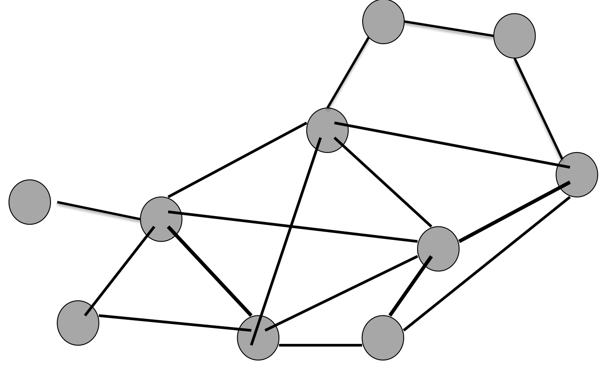

> [原图说明] 原页附图（p24）：MIS 示例起始状态——所有节点相同的初始图。此图将在统一裁剪阶段作为原图插回。

<!-- ===== PDF p25 ===== -->

**示例（Example）**

- 每个节点选择一个 ID（16、13、2、10、1、11、9、8、7、5 等）。

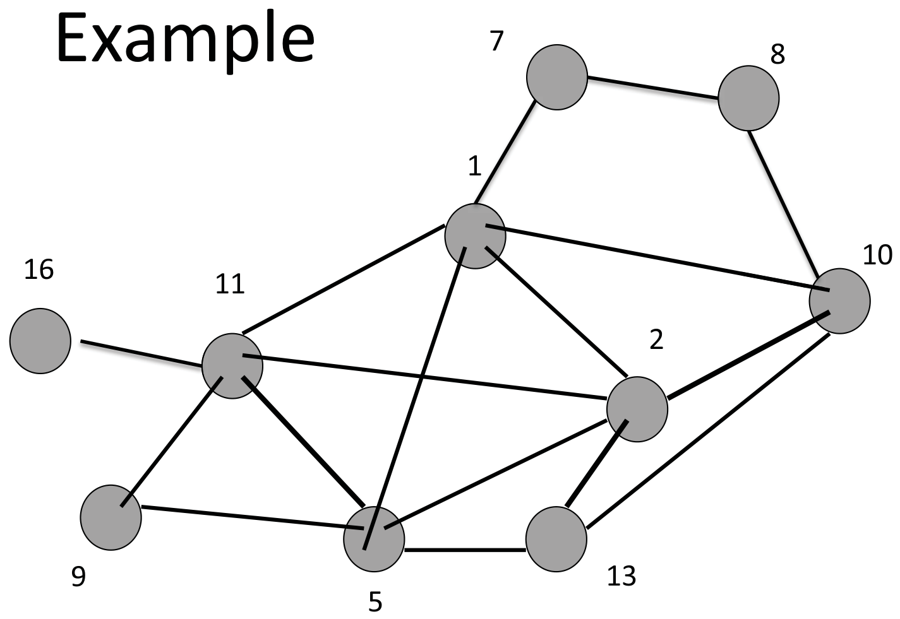

> [原图说明] 原页附图（p25）：所有节点各自选择随机 ID。此图将在统一裁剪阶段作为原图插回。

<!-- ===== PDF p26 ===== -->

**示例（Example）**

- 选择了 16 和 13 的进程 **in**。
- 选择了 11、5、2 和 10 的进程 **out**。

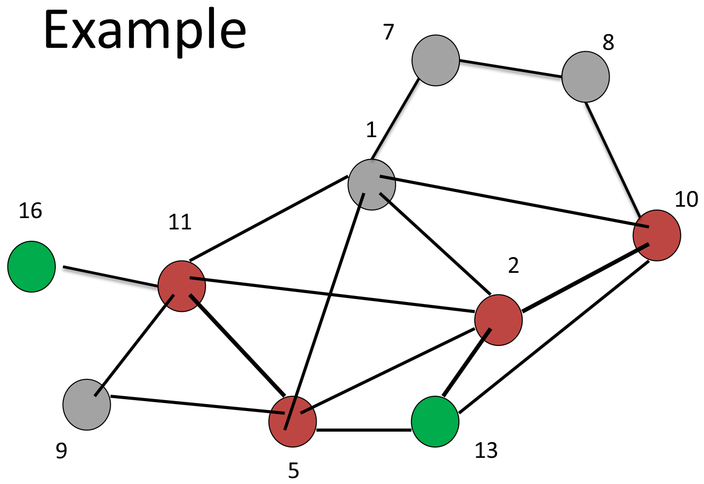

> [原图说明] 原页附图（p26）：局部最大者（16、13）入集，其邻居出局。此图将在统一裁剪阶段作为原图插回。

<!-- ===== PDF p27 ===== -->

**示例（Example）**

- 未决定（灰色）的进程选择新的 ID（4、18、7、12）。

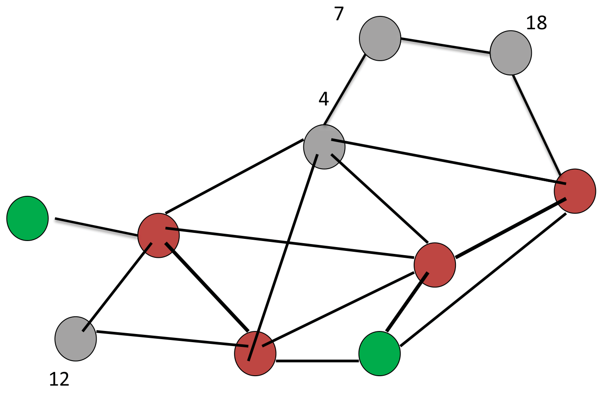

> [原图说明] 原页附图（p27）：未决定节点选择新 ID。此图将在统一裁剪阶段作为原图插回。

<!-- ===== PDF p28 ===== -->

**示例（Example）**

- 选择了 12 和 18 的进程 **in**。
- 选择了 7 的进程 **out**。

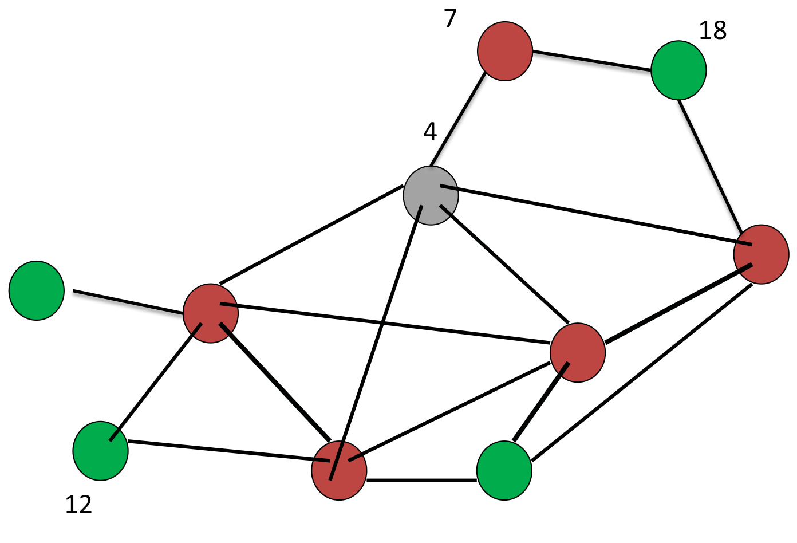

> [原图说明] 原页附图（p28）：第二轮局部最大者（12、18）入集、7 出局。此图将在统一裁剪阶段作为原图插回。

<!-- ===== PDF p29 ===== -->

**示例（Example）**

- 未决定（灰色）的进程选择新 ID（12）。

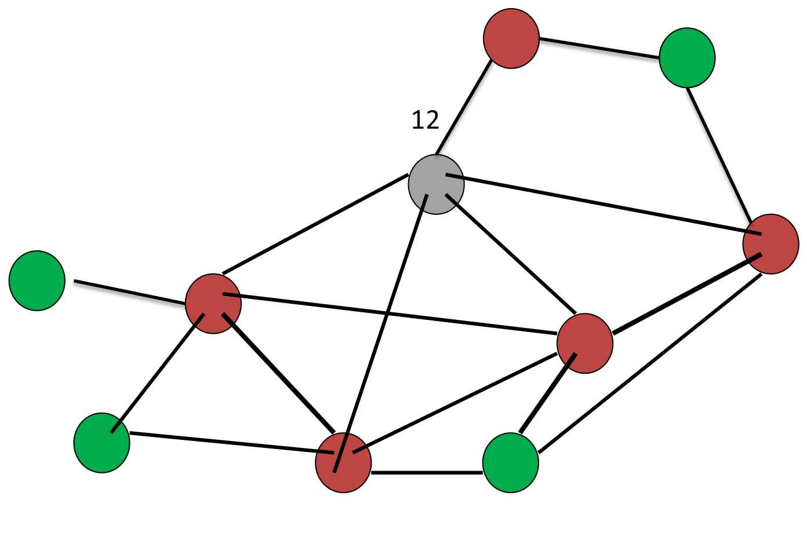

> [原图说明] 原页附图（p29）：最后一个未决定节点选择新 ID。此图将在统一裁剪阶段作为原图插回。

<!-- ===== PDF p30 ===== -->

**示例（Example）**

- 它 in。

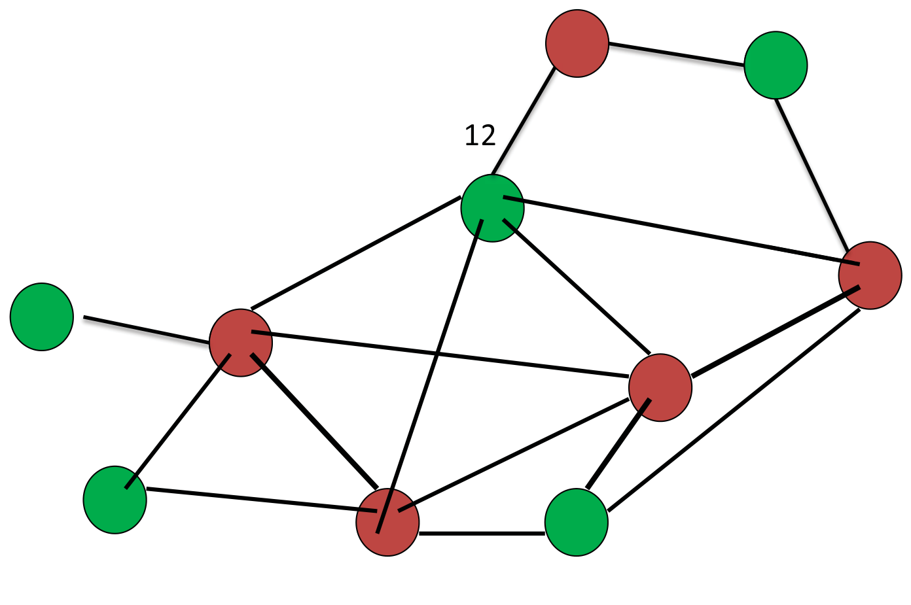

> [原图说明] 原页附图（p30）：最后节点入集，算法结束。此图将在统一裁剪阶段作为原图插回。

<!-- ===== PDF p31 ===== -->

**独立性（Independence）**

- **定理 5（Theorem 5）**：若 Luby 算法最终终止，则最终集合 $S$ 满足**独立性**。
- **证明（Proof）**：
  - 每个节点仅在**某个阶段**于其**邻域内具有唯一最大值**时才加入 $S$。
  - 当它加入时，其所有邻居都变为不活跃。

<!-- ===== PDF p32 ===== -->

**极大性（Maximality）**

- **定理 6（Theorem 6）**：若 Luby 算法最终终止，则最终集合 $S$ 满足**极大性**。
- **证明（Proof）**：
  - 一个节点仅在**自己加入 $S$ 或某邻居加入 $S$** 时才变为不活跃。
  - 我们持续直到**所有节点都不活跃**。

> **[note] Note（译者注，定理 5/6 的证明为何这么短）:** 独立性与极大性的证明都「短得惊人」，因为**算法规则本身就是为这两条性质设计的**：独立性来自「只有局部唯一最大才入集」（两个邻居不可能同时是彼此的局部最大）；极大性来自「出局 = 有邻居入集」（每个 inactive 节点要么自己 in、要么邻接 in，故每个节点都被 $S$ 覆盖——这正是支配性）。这类「**正确性几乎从算法规则直接读出**」的证明，在分布式随机算法里很常见：关键不在证明本身，而在**如何把规则设计得让不变式自动成立**。对比讲次 17 的近似算法证明（需要精巧的比值分析），分布式算法的证明往往更「结构性」——用不变式把整个系统的状态钉住。

<!-- ===== PDF p33 ===== -->

**终止性（Termination）**

- 以概率 1，Luby 的 MIS 算法**最终终止**。
- **定理 7（Theorem 7）**：以至少 $1 - \frac{1}{n}$ 的概率，所有节点在**$4 \log n$ 个阶段**内决定。
- 证明使用一个与之前类似的引理：
  - **引理 8（Lemma 8）**：以至少 $1 - \frac{1}{n}$ 的概率，在每个阶段 $1, \ldots, 4 \log n$ 中，所有节点选择**不同的随机值**。
- 所以我们可以**基本上假装**每个阶段的所有随机数都不同。
- **关键思想**：证明图在每个阶段都变得**充分「更小」**。
- **引理 9（Lemma 9）**：对每个阶段 ph，**活跃边（连接两个活跃节点的边）**在阶段结束时**期望数**至多为阶段开始时的一半。

<!-- ===== PDF p34 ===== -->

**终止性（Termination）**

- **引理 9（Lemma 9）**：对每个阶段 ph，活跃边在阶段后的**期望数**至多为阶段前的一半。
- **证明（Proof）**：
  - 若节点 $u$ 有某个邻居 $w$，其选择值**大于 $w$ 的所有邻居和 $u$ 的所有其他邻居**，则 $u$ 必须在阶段 ph 决定 out。
  - $w$ 选择这样值的概率**至少** $\frac{1}{\deg u + \deg w}$。
  - 那么节点 $u$ 被某个邻居以这种方式「杀死」的概率**至少** $\sum_{w \in r(u)} \frac{1}{\deg u + \deg w}$。
  - 现在考虑一条边 $(u, v)$。

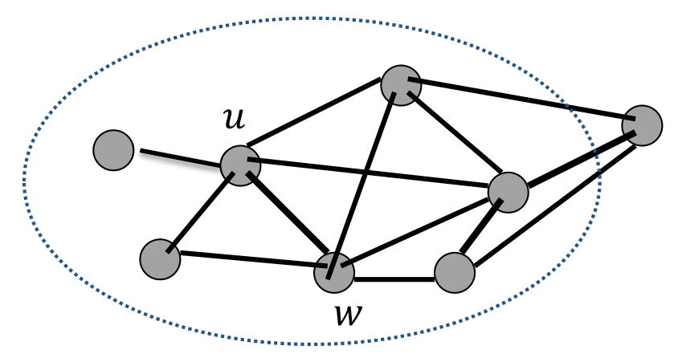

> [原图说明] 原页附图（p34）：节点 $u$ 与其邻居 $w$ 的示意图，用于分析「$u$ 被 $w$ 杀死」的概率。此图将在统一裁剪阶段作为原图插回。

<!-- ===== PDF p35 ===== -->

**终止性（续）（Termination, cont'd）**

- **证明（Proof）**：
  - 概率 $u$ 被杀死 $\ge \sum_{w \in r(u)} \frac{1}{\deg u + \deg w}$。
  - 边 $(u, v)$ 「**死亡**」（两端之一被杀死）的概率 $\ge \frac{1}{2}$（概率 $u$ 被杀 + 概率 $v$ 被杀）。
  - 所以期望死亡的边数 $\ge \frac{1}{2} \sum_{\{u,v\}}$（概率 $u$ 被杀 + 概率 $v$ 被杀）。
  - 这个和把每个节点 $u$ 的「被杀概率」恰好计了 $\deg u$ 次。
  - 所以把和重写为：$\frac{1}{2} \sum_u \deg u$（概率 $u$ 被杀）。
  - 代入概率下界：$\ge \frac{1}{2} \sum_u \deg u \sum_{w \in r(u)} \frac{1}{\deg u + \deg w} = \frac{1}{2} \sum_u \sum_{w \in r(u)} \frac{\deg u}{\deg u + \deg w}$。

<!-- ===== PDF p36 ===== -->

**终止性（续）**

- **证明（Proof）**：
  - 期望死亡的边数 $\ge \frac{1}{2} \sum_u \sum_{w \in r(u)} \frac{\deg u}{\deg u + \deg w}$。
  - 把这个表达式等价地写成对有向边 $(u, v)$ 的和：$\frac{1}{2} \sum_{(u,v)} \frac{\deg u}{\deg u + \deg v}$。
  - 这里每条无向边被计了两次（每个方向各一次），所以这等于对无向边 $\{u, v\}$ 的和：$\frac{1}{2} \sum_{\{u,v\}} \frac{\deg u + \deg v}{\deg u + \deg v}$。
  - 这恰是**无向边总数的一半**，如所需！
- **引理 9（Lemma 9）**：对每个阶段 ph，活跃边在阶段结束时的期望数至多为阶段开始时的一半。

> **[note] Note（译者注，引理 9 的「平均减半」论证）:** 引理 9 的证明是**概率 + 图论**的优美组合，值得拆解：**(1)「被杀」事件**——节点 $u$ 若存在一个邻居 $w$，$w$ 的值大于 $w$ 所有邻居和 $u$ 所有其他邻居的值，则 $w$ 必入集而 $u$ 出局（$u$ 被 $w$「杀死」）；对称地，$w$ 是「局部最大」的概率至少 $\frac{1}{\deg u + \deg w}$（$u$ 与 $w$ 的邻居们各自独立均匀随机，$w$ 的值要在 $\deg u + \deg w$ 个竞争者中最大）。**(2) 边的死亡**——边 $(u,v)$ 死亡概率 ≥ (prob $u$ killed + prob $v$ killed)/2；把「每节点的被杀概率按度数累计」后，**对称求和的魔力**出现：$\frac{\deg u}{\deg u+\deg w} + \frac{\deg w}{\deg u+\deg w} = 1$，每对邻居贡献恰好 1，于是期望死亡边数 ≥ 总边数的一半。这个「**对称性让复杂概率相消**」的技巧极漂亮——你在讲次 6 随机化、以及实分析的对称性论证里见过类似思想。

<!-- ===== PDF p37 ===== -->

**终止性（续）**

- **引理 9（Lemma 9）**：每个阶段后活跃边的期望数至多为阶段前的一半。
- **定理 7（Theorem 7）**：以至少 $1 - \frac{1}{n}$ 的概率，所有节点在 $4 \log n$ 个阶段内决定。
- **证明梗概（Proof sketch）**：
  - 引理 9 蕴含：$4 \log n$ 个阶段后仍活跃的边数期望至多为 $\frac{\binom{n}{2}}{2^{4 \log n}} = \frac{1}{n}$。
  - 那么仍有活跃边的概率 $< \frac{1}{n}$（**马尔可夫不等式 Markov**）。
  - 算法在 $4 \log n$ 个阶段内不终止的概率 $< \frac{1}{n} + \frac{1}{n} < \frac{2}{n}$。

> **[note] Note（译者注，定理 7 的证明：期望减半 + 马尔可夫）:** 定理 7 的证明把引理 9 用到极致：**每阶段活跃边期望减半 ⟹ $4\log n$ 阶段后期望只剩 $\binom{n}{2}/2^{4\log n} \approx n^2/n^4 = 1/n$**。然后用**马尔可夫不等式（Markov's inequality）**：非负随机变量 $X$ 有 $P(X \ge a) \le E[X]/a$，取 $a = 1$ 得「仍有活跃边概率 < 期望 = $1/n$」。再叠加引理 8（随机值不同的失败概率 $1/n$），总失败概率 $< 2/n$。这个「**期望每轮减半 + 马尔可夫化失败概率**」是随机算法的标准分析套路，你在讲次 6 的随机化分析、以及引理 3 的并界里都见过——三者合成一套完整的「**高概率终止**」论证。注意 $4\log n$ 阶段是「以高概率」而非「必然」——最坏情形下算法理论上可能永远跑不完，但概率为 0（几乎必然终止）。

<!-- ===== PDF p38 ===== -->

**广度优先生成树（Breadth-First Spanning Trees）**

> [原图说明] 原页为章节分隔页（p38），仅标题「Breadth-First Spanning Trees」。

<!-- ===== PDF p39 ===== -->

**广度优先生成树（Breadth-First Spanning Trees）**

- **新问题，新设定**。
- 假设图 $G = (V, E)$ 是连通的。
- $V$ 包含一个**特殊的顶点 $v_o$**，它将成为 BFS 树的**根（origin, root）**。
- 一般地，进程对图**没有任何知识**。
- 进程有 **UID**。
  - 每个进程知道自己的 UID。
  - $i_o$ 是根 $v_o$ 的 UID。
  - UID 为 $i_o$ 的进程知道自己在根上。
- 我们可以（WLOG）假设进程知道其**邻居的 UID**，并知道**每个输入/输出端口连到哪个邻居**。
- 算法将是**确定性的**（或非确定性的），但**不是随机化的**。

<!-- ===== PDF p40 ===== -->

**广度优先生成树（续）**

- 进程必须产生一棵**以顶点 $v_o$ 为根的广度优先生成树**。
- 分支是从 $v_o$ 出发的**有向路径**。
  - **生成（Spanning）**：分支到达所有顶点。
  - **广度优先（Breadth-first）**：距离 $v_o$ 为 $d$ 的顶点出现在树的**恰好深度 $d$** 处。
- **输出（Output）**：每个进程 $i \ne i_o$ 应输出**父节点 $j$**，表示 $j$ 的顶点是 $i$ 的顶点在 BFS 树中的父节点。

> **[note] Note（译者注，分布式 BFS 与串行 BFS 的对照）:** 这里要生成的是**广度优先生成树（BFS spanning tree）**：从根出发、按「距离层」生长的树，树中每个节点的深度 = 它到根的真实距离。这与你 6.006 学的**串行 BFS（CLRS §22.2）**目标一致，但约束完全不同：串行 BFS 有全局邻接表、能按队列逐层访问；分布式 BFS **每个进程只知道自己和邻居**，只能靠消息传递协作，且进程「对图没有任何知识」（不知道 $n$、不知道直径）。所以分布式 BFS 用**同步轮**天然实现「一层一层的生长」——每轮消息恰好前进一跳，距离 $d$ 的节点恰好在第 $d$ 轮被标记（这正是后面的正确性不变式）。**输出格式**「$i$ 输出父节点 $j$」意味着每棵树的边由子节点指向父节点（就像你熟悉的树结构中 child→parent 指针）。

<!-- ===== PDF p41 ===== -->

**示例（Example）**

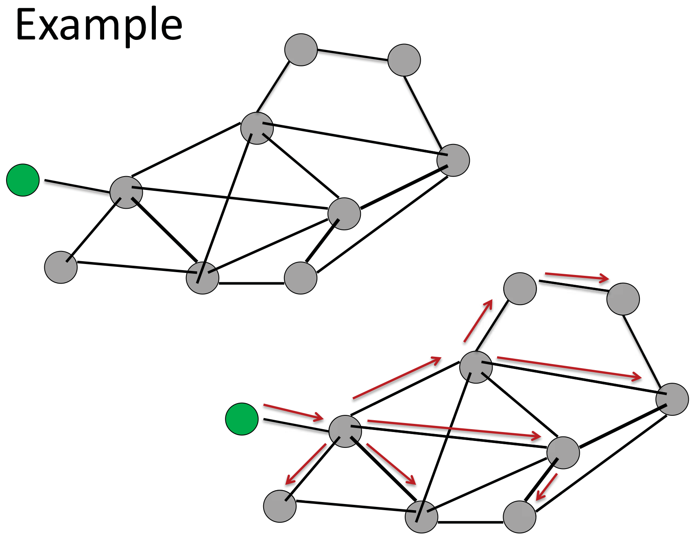

> [原图说明] 原页附图（p41）：BFS 生成树示例图（根 $v_o$ 及其生成树）。此图将在统一裁剪阶段作为原图插回。

<!-- ===== PDF p42 ===== -->

**简单 BFS 算法（Simple BFS Algorithm）**

- 进程在**被纳入树中**时标记自己。
- 初始只有 $i_0$ 被标记。
- 进程 $i$ 的算法：
  - **第 1 轮（Round 1）**：
    - 若 $i = i_0$，则进程 $i$ 向其邻居发送一条 **search（搜索）**消息。
    - 若进程 $i$ 收到消息，则它：
      - 标记自己。
      - 选择 $i_0$ 作为父节点，输出 parent $i_o$。
      - 计划在下一轮发送。
  - **第 $r > 1$ 轮（Round $r > 1$）**：
    - 若进程 $i$ 计划发送，则它向其邻居发送一条 search 消息。
    - 若进程 $i$ **未标记**且收到消息，则它：
      - 标记自己。
      - 选择某个发送者邻居 $j$ 作为父节点，输出 parent $j$。
      - 计划在下一轮发送。

> **[note] Note（译者注，简单 BFS 的「波前」思想）:** 简单 BFS 算法就是「**搜索波（wavefront）**」：根在第 1 轮向邻居广播 search，收到者标记自己并继续向自己的邻居广播，如此一层层向外扩散。每个进程在**第一次**收到 search 时被标记并选定父节点（先到先得），此后不再改变——这天然形成一棵树（每个非根进程恰有一个父节点）。与串行 BFS 的对应：串行 BFS 用队列保证「按层访问」，分布式用**同步轮的天然计时**保证「第 $r$ 轮只有距离恰为 $r$ 的新节点被标记」。这个「**同步计时即层数**」的优雅对应，是分布式算法的核心思想之一——时间本身携带信息。注意算法允许「收到多条消息时任意选一个父」，这就是 p43 要讨论的**非确定性**。

<!-- ===== PDF p43 ===== -->

**非确定性（Nondeterminism）**

- 算法**略微非确定**：一个进程可以在若干可能的父节点中**任意选择**。
- 我们可以通过使用默认规则（如「**总是选 UID 最小的发送者**」）使其**确定化**。
- 但**保持非确定性也没问题**。
- 对分布式算法而言，**非确定性的含义与串行算法不同**。
  - 一个分布式算法应在**所有**解决非确定性选择的方式下**都正确工作**。

> **[note] Note（译者注，分布式非确定性的语义）:** 这里点出分布式与串行对「非确定性」的不同态度：串行算法里的非确定性（如随机选择）通常被看作「需要消除的缺陷」或「需要分析的概率行为」；分布式算法里的非确定性（如「收到多条 search 时随便选一个父」）是**设计自由度**——因为系统本身就有不可预测的时序/顺序，算法必须**对任意一种选择都正确**。这类似于你在 6.042J 学过的「对任意/存在」的量化：分布式正确性要求的是「对所有非确定性解决方式都成立」的**全称保证**，而不是「存在一种幸运的执行」。这也是为什么「把非确定性规则确定化」（如最小 UID）总是可行但非必须——正确性从开始就不依赖具体选择。

<!-- ===== PDF p44 ===== -->

**简单 BFS 算法（Simple BFS Algorithm）**

- **问（Q）**：为什么这个算法产生 BFS 树？
- **答**：因为所有分支都是**同步创建**的，每轮增长一跳。
- **问（Q）**：为什么它最终覆盖所有节点？
- **答**：因为图是连通的，且任何被标记的节点都会向其邻居发送消息。

> **[note] Note（译者注，两个「为什么」）:** 这两个 Q&A 分别对应 BFS 树的**深度正确性**与**生成性**：**(1) 为什么是 BFS（深度 = 距离）**——同步轮保证消息每轮只前进一跳，所以距离根为 $d$ 的节点最早在第 $d$ 轮才收到 search（更早不可能，因为路径需要 $d$ 跳）；而第 $d$ 轮它必然收到（连通性 + 波前推进），故其深度恰为 $d$。**(2) 为什么生成所有节点**——连通图中从根出发的波前能沿路径到达每个顶点；每个标记节点继续广播，保证波前不中断。这两个论证合起来就是**正确性**的直觉骨架，p54 会把它形式化为不变式。这种「**同步轮数 = 图距离**」的观察，是同步模型最有力的免费午餐。

<!-- ===== PDF p45 ===== -->

**示例：简单 BFS（Example: Simple BFS）**

> [原图说明] 原页附图（p45）：BFS 示例起始图。此图将在统一裁剪阶段作为原图插回。

<!-- ===== PDF p46 ===== -->

**第 1 轮（Round 1）**

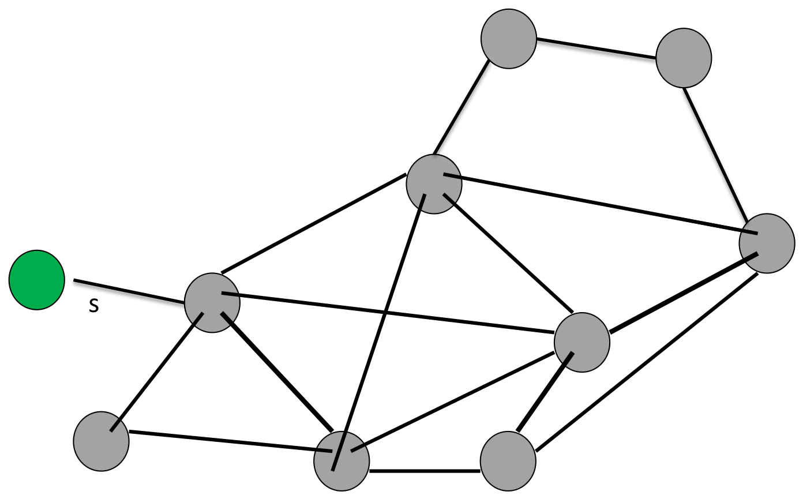

> [原图说明] 原页附图（p46）：第 1 轮——根 $s$ 向邻居发送 search 消息。此图将在统一裁剪阶段作为原图插回。

<!-- ===== PDF p47 ===== -->

**第 1 轮（Round 1）**

> [原图说明] 原页附图（p47）：第 1 轮后——根的直接邻居被标记并选定父节点。此图将在统一裁剪阶段作为原图插回。

<!-- ===== PDF p48 ===== -->

**第 2 轮（Round 2）**

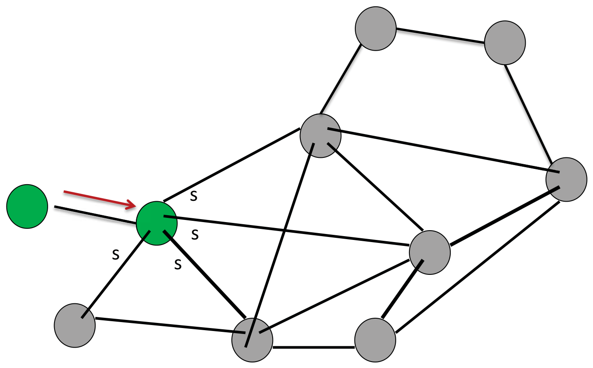

> [原图说明] 原页附图（p48）：第 2 轮——距离 1 的节点向邻居广播 search。此图将在统一裁剪阶段作为原图插回。

<!-- ===== PDF p49 ===== -->

**第 2 轮（Round 2）**

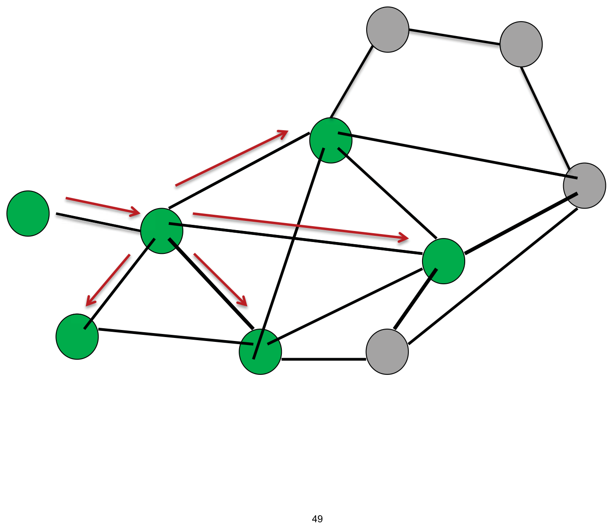

> [原图说明] 原页附图（p49）：第 2 轮后——距离 2 的节点被标记。此图将在统一裁剪阶段作为原图插回。

<!-- ===== PDF p50 ===== -->

**第 3 轮（Round 3）**

> [原图说明] 原页附图（p50）：第 3 轮——距离 2 的节点继续广播。此图将在统一裁剪阶段作为原图插回。

<!-- ===== PDF p51 ===== -->

**第 3 轮（Round 3）**

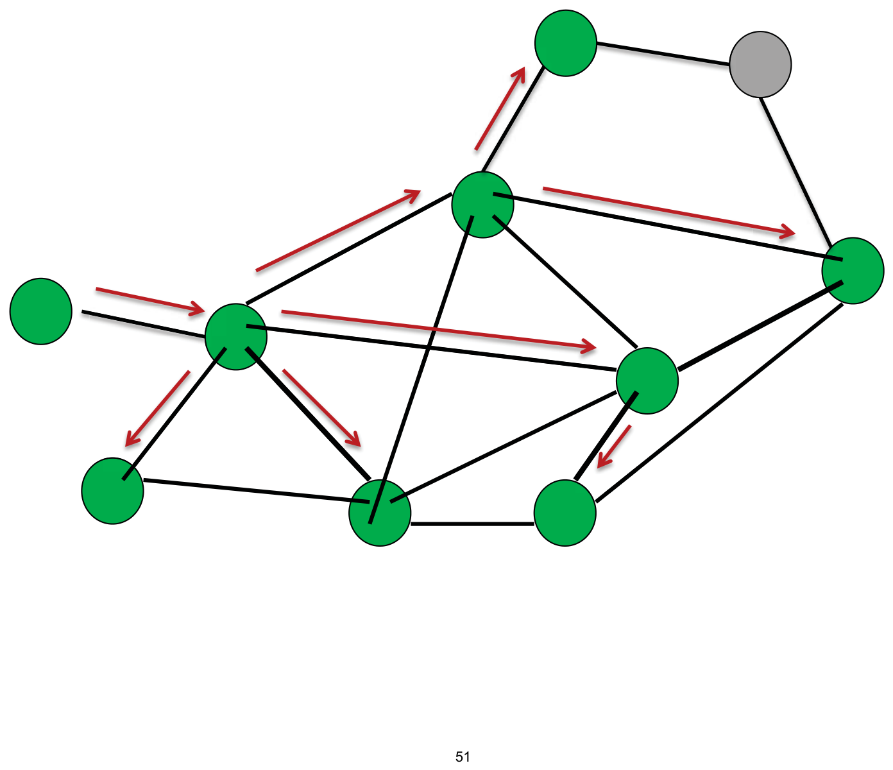

> [原图说明] 原页附图（p51）：第 3 轮后——距离 3 的节点被标记。此图将在统一裁剪阶段作为原图插回。

<!-- ===== PDF p52 ===== -->

**第 4 轮（Round 4）**

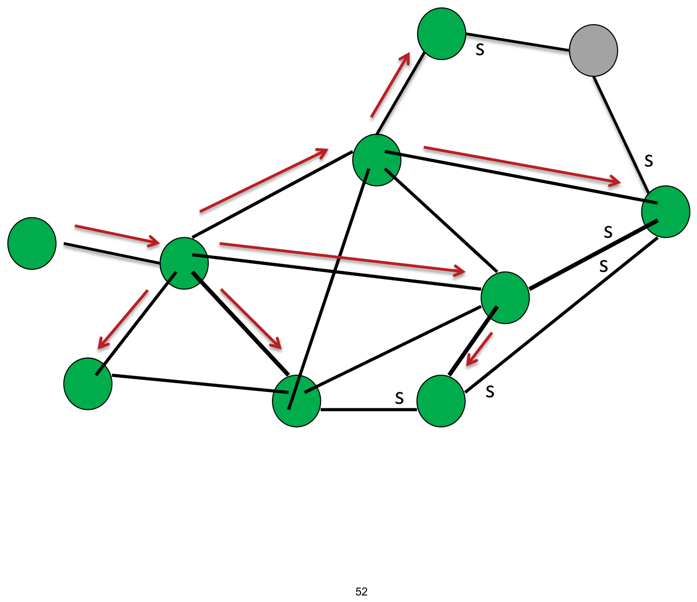

> [原图说明] 原页附图（p52）：第 4 轮——距离 3 的节点广播 search。此图将在统一裁剪阶段作为原图插回。

<!-- ===== PDF p53 ===== -->

**第 4 轮（Round 4）**

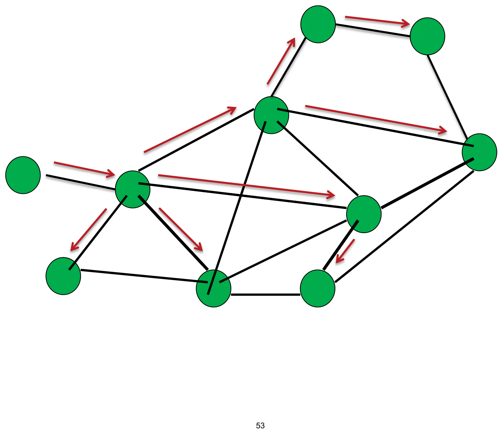

> [原图说明] 原页附图（p53）：第 4 轮后——距离 4 的节点被标记，全部节点标记完成。此图将在统一裁剪阶段作为原图插回。

<!-- ===== PDF p54 ===== -->

**正确性（Correctness）**

- **问（Q）**：描述 $r$ 轮后状态的**关键不变式**？
- 每个进程的状态变量：
  - `marked`，布尔，初始对 $i_o$ 为 true、对其他人 false
  - `parent`，UID 或 undefined
  - `send`，布尔，初始对 $i_o$ 为 true、对其他人 false
  - `uid`
- **不变式（Invariants）**：
  - $r$ 轮结束时，恰好**距离 $v_o$ 小于 $r$ 的进程**被标记。
  - 进程 $i \ne i_o$ 的 parent **有定义当且仅当**它被标记。
  - 对任何距离 $v_o$ 为 $d$ 的进程，若其 parent 有定义，则它是距离 $v_o$ 为 $d-1$ 的某个进程的 UID。
- 可用于正式的正确性证明。

> **[note] Note（译者注，BFS 不变式）:** 这三个不变式是分布式证明的范本，分别钉住**标记范围**（$r$ 轮后恰是距离 $< r$ 的节点）、**父节点合法性**（marked ⟺ 有 parent）、**深度正确性**（parent 的深度比子节点少 1）。第三条最精妙：它保证了**树中深度 = 图距离**，即「树确实是 BFS 树」。注意不变式用的是「距离 $< r$」而非「距离 $\le r$」——因为第 $r$ 轮结束标记的是「第 $r$ 轮才收到消息」的节点（距离恰为 $r-1$ 的已在上轮标记，距离 $r$ 的恰在本轮标记），这与你 6.006 的 BFS「第 $d$ 轮处理距离 $d$ 的节点」的层序完全对应。**「状态变量 + 不变式 + 归纳」三件套**正是 p5 强调的分布式证明方法。

<!-- ===== PDF p55 ===== -->

**复杂度（Complexity）**

- **时间复杂度**：
  - 直到所有节点输出其父节点信息所需的轮数。
  - 任何节点到 $v_o$ 的**最大距离**，即 $< \operatorname{diam}$。
- **消息复杂度**：
  - 整个执行期间所有进程发送的消息总数。
  - $O(|E|)$。

> **[note] Note（译者注，复杂度对比）:** 分布式 BFS 的复杂度与串行 BFS（$O(V+E)$ 时间、$O(V+E)$ 空间）结构相似但语义不同：**时间 = 轮数 ≈ 直径 $\operatorname{diam}$**（波前从根到最远点恰好需要直径轮）；**消息 = $O(|E|)$**（每条边至多若干条 search 消息）。注意「时间 = 直径」是分布式特有的：即使每个进程本地计算瞬间完成，**消息在网络上逐跳传播的物理延迟**决定了至少需要直径轮——这是「光速限制」的分布式版本。对比下一讲的 Bellman-Ford（时间 $n-1$ 轮），BFS 的 $\operatorname{diam}$ 轮（通常远小于 $n$）更优，但只在**无权图**适用。

<!-- ===== PDF p56 ===== -->

**锦上添花（Bells and Whistles）**

- **子指针（Child pointers）**：
  - 到目前为止，每个进程只知道自己的父节点，不知道自己的孩子。
  - 要添加子指针：每个收到 search 消息的人都**在下一轮**发回 parent 或 nonparent 响应。
- **距离（Distances）**：
  - 增强算法，使每个人还学习并输出**自己到 $v_o$ 的距离**。
  - 每个进程在一个新的 `dist` 变量中记录自己到 $v_o$ 的距离，初始对进程 $i_o$ 为 0，对其他人为 $\infty$。
  - 把 dist 值放入每条 search 消息；当未标记进程收到 search $d$ 消息时，把自己的 dist 设为 $d + 1$。

> **[note] Note（译者注，两个扩展）:** 这两个「锦上添花」把 BFS 树变成**双向可用**的结构：**(1) 子指针**——通过「收到 search 就回 parent/nonparent 响应」让每个父节点知道自己的子节点，树就从「子→父」变成「父子双向」，这是后续**广播与汇播（convergecast）**的基础；**(2) 距离**——search 消息携带「发送者的 dist」，接收者把 dist 设为 $d+1$，于是每个进程免费获得了自己到根的距离（这正是 BFS 的层信息）。这两个扩展都只增加 $O(1)$ 的额外消息与状态，却大幅扩展了树的功能——「**小改动换大功能**」的工程设计思想，与你在 CSAPP 里「用一点额外元数据换取关键能力」的思路一致。

<!-- ===== PDF p57 ===== -->

**终止性（Termination）**

- **问（Q）**：进程如何知道 BFS 树已完成？
- 若它们知道 $\operatorname{diam}$ 的上界，就可以**等到那么多轮过去**。
- **问（Q）**：若它们对图一无所知呢？
- **稍简单的问题**：进程 $i_o$ 应知道树何时完成。
- **终止算法（Termination algorithm）**：
  - 假设每条 search 消息都收到响应（parent 或 nonparent）。
  - 一个节点对其所有发出的 search 消息都收到响应后，就知道**谁是自己孩子**，并知道它们都已被标记。
  - **树的叶子**知道自己是叶子（它们只收到 nonparent 响应）。
  - 现在用**汇播（convergecast）**策略：

<!-- ===== PDF p58 ===== -->

**终止性（Termination）**

- **终止算法（Termination algorithm）**：
  - 一个节点对其所有 search 消息都收到响应后，就知道谁是自己孩子，并知道它们都被标记。
  - **树的叶子**知道自己是叶子。
  - 用**汇播（convergecast）**策略：
    - 从叶子开始，进程沿着 BFS 树把 **done 消息向 $i_0$ 扇入（fan in）**。
    - 进程 $i \ne i_o$ 在以下两个条件满足后，可向其父节点发送 done：
      - 它已收到所有 search 消息的响应（所以知道谁是自己孩子），并且
      - 它已收到所有孩子的 done 消息。
    - $i_o$ 在以下两个条件满足时，知道 BFS 树已完成：
      - 它已收到所有 search 消息的响应，并且
      - 它已收到所有孩子的 done 消息。

> **[note] Note（译者注，汇播 = 树上的自底向上聚合）:** **汇播（convergecast）**是分布式算法的核心模式：信息从**叶子向根**沿树聚合，每个节点**收集完所有孩子的信息**后才向上转发——就像并行归约（reduction）的分布式版。它本质上是「**子树完成 ⟹ 父节点才完成**」的自底向上归纳：叶子最先知道「我这棵子树 OK」，逐层向上，最终根确定整棵树完成。终止算法依赖「每个节点收到所有 search 响应」（知道自己孩子）与「收到所有孩子 done」（孩子子树完成）两个条件——合起来是「**整棵子树完成**」的递归定义。这个「**树结构上的双向信息流**（广播自上而下、汇播自下而上）」与你在大规模并行编程（MPI、MapReduce 的 reduce 阶段）里见的模式完全同构。

<!-- ===== PDF p59 ===== -->

**用汇播终止（Termination Using Convergecast）**

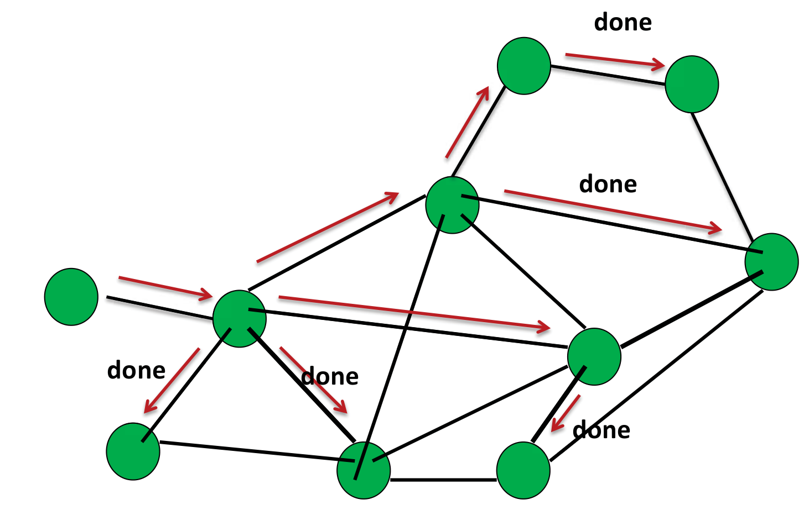

> [原图说明] 原页附图（p59）：汇播起始——各节点向父节点发送 done 消息。此图将在统一裁剪阶段作为原图插回。

<!-- ===== PDF p60 ===== -->

**用汇播终止（Termination Using Convergecast）**

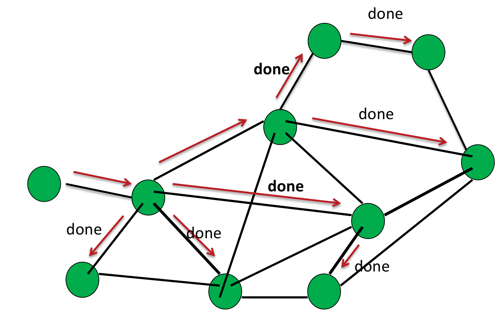

> [原图说明] 原页附图（p60）：汇播推进——done 消息沿树逐层向上。此图将在统一裁剪阶段作为原图插回。

<!-- ===== PDF p61 ===== -->

**用汇播终止（Termination Using Convergecast）**

> [原图说明] 原页附图（p61）：汇播推进——更高层节点收到所有孩子的 done 后继续上传。此图将在统一裁剪阶段作为原图插回。

<!-- ===== PDF p62 ===== -->

**用汇播终止（Termination Using Convergecast）**

> [原图说明] 原页附图（p62）：汇播推进——接近根。此图将在统一裁剪阶段作为原图插回。

<!-- ===== PDF p63 ===== -->

**用汇播终止（Termination Using Convergecast）**

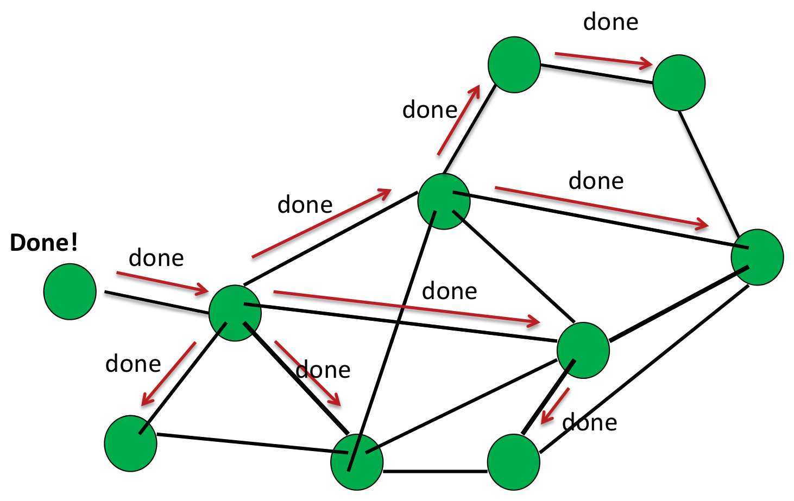

> [原图说明] 原页附图（p63）：Done!——根收到所有 done 消息，BFS 树完成。此图将在统一裁剪阶段作为原图插回。

<!-- ===== PDF p64 ===== -->

**终止的复杂度（Complexity for Termination）**

- 树完成后，done 信息传到 $i_o$ 需要 $< \operatorname{diam}$ 轮和 $n$ 条消息。
- **问（Q）**：如何让**所有**进程都知道 BFS 树已完成？
- 进程 $i_o$ 可以**沿树的边向所有人广播**一条消息。
- 需要**额外的 $\operatorname{diam}$ 轮和 $n$ 条消息**。

<!-- ===== PDF p65 ===== -->

**广度优先生成树的应用（Applications of Breadth-First Spanning Trees）**

- **消息广播（Message broadcast）**：
  - 进程 $i_o$ 可以用带子指针的 BFS 树向网络中所有进程广播一系列消息。
  - 每条需要 $\operatorname{diam}$ 轮和 $n$ 条消息。
  - 可以**流水线化（pipeline）**它们，使 $k$ 条消息只需 $\operatorname{diam} + k$ 轮，而非 $\operatorname{diam} \times k$。
- **全局计算（Global computation）**：
  - 假设每个进程以某个初始值开始，进程 $i_o$ 应确定**所有进程值的某个函数**的值。
  - min、max、sum、average……
  - 可以在 BFS 树上用**汇播**完成。
  - 代价是 $\operatorname{diam}$ 轮和 $n$ 条消息。
  - 一般而言消息可能很大，但对许多函数，沿途可以做一些**数据聚合（data aggregation）**。

> **[note] Note（译者注，BFS 树的应用与流水线）:** BFS 树建好后就是一个**全网的骨干网**：**广播**（根沿树向下传播，$\operatorname{diam}$ 轮 / $n$ 条消息）与**汇播/聚合**（叶子向上汇聚 min/max/sum 等，同样成本）覆盖了分布式系统最常见的两种通信原语。**流水线**细节很妙：$k$ 条消息逐条下发，第 1 条到第 $\operatorname{diam}$ 轮才到底，但第 2 条紧跟其后，最终 $k$ 条只需 $\operatorname{diam} + k - 1$ 轮——这是**流水线延迟 = 建立时间 + 吞吐×批量**的经典公式（与 CSAPP 处理器流水线的 $\text{latency} + \text{throughput}$ 分解完全同构）。「**沿途聚合**」则说明：算 sum/avg 不需要把所有人的原始值送到根，只需每层做局部归约——这正是 MapReduce reduce 阶段、以及神经网络梯度聚合的核心思想。

<!-- ===== PDF p66 ===== -->

**BFS 构造的应用（Application of the BFS construction）**

- **一般图中的领导者选举（Leader election in a general graph）**：
  - 没有特殊进程 $i_o$。
  - 进程对图一无所知。
  - **每个人都可以启动自己的 BFS**，充当根。
  - 用这个来确定**最大 UID**；拥有最大 UID 的进程就是领导者。
  - 代价是 **$O(\operatorname{diam})$ 轮、$O(n \cdot |E|)$ 消息**。

> **[note] Note（译者注，用 BFS 做一般图选举）:** 这页把 BFS 与领导者选举串起来：**每个进程各自发起一棵 BFS 树**（把自己当根），用它广播自己的 UID 并收集别人的 UID，最终**全网络比较出最大 UID** 的进程当选。代价 $O(\operatorname{diam})$ 轮（BFS 波前需要直径轮）与 $O(n \cdot |E|)$ 消息（$n$ 棵 BFS 树、每棵 $O(|E|)$）。这把 p12 团网络的「最大 UID 当选」推广到**任意连通图**——团网络只需 1 轮是因为完全图里一轮消息就到所有人；一般图里要用 BFS 树作为「多跳广播」的载体。**多棵 BFS 树并行广播**的代价也揭示了分布式算法的一个普遍现象：**「人人都想当根」很昂贵**（$n$ 倍开销），这也解释了为什么后面会专门研究「最小生成树」（GHS 等）这类更省的结构。

<!-- ===== PDF p67 ===== -->

**最短路生成树（Shortest Paths Trees）**

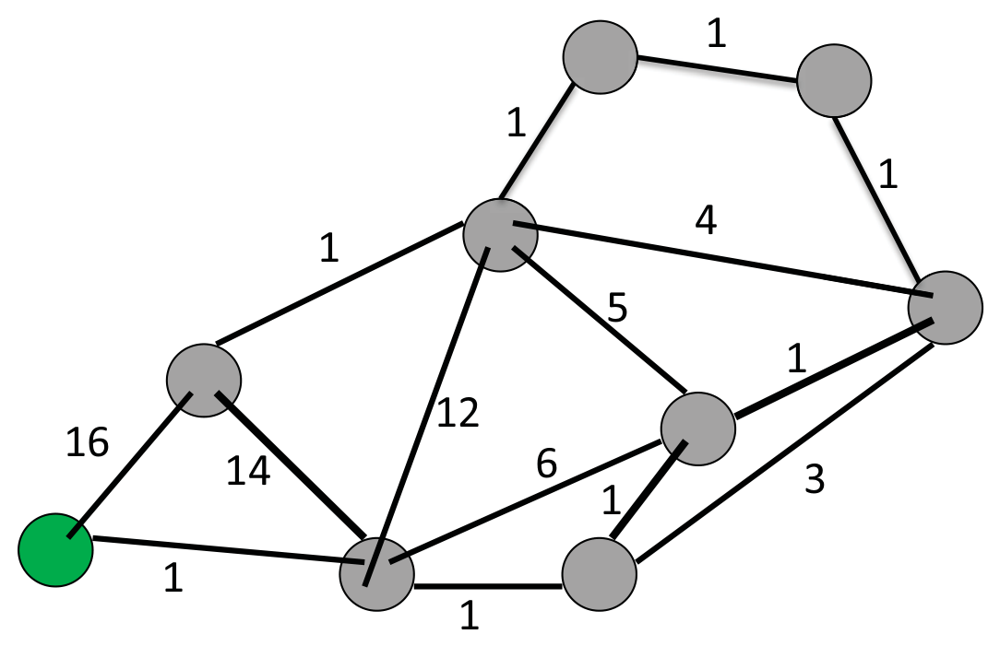

> [原图说明] 原页附图（p67）：最短路示例图——带权图（边权 1、3、4、5、6、12、14、16 等），根 $v_o$ 在左。此图将在统一裁剪阶段作为原图插回。

<!-- ===== PDF p68 ===== -->

**最短路（Shortest Paths）**

- 把 BFS 问题推广到**允许边带权**：边 $\{u, v\}$ 有权 $\operatorname{weight}(u, v)$。
- 连通图 $G = (V, E)$、根顶点 $v_o$、进程 $i_o$。
- 进程有 UID。
- 进程知道自己的**邻居**和**关联边的权**，但除此之外对图**没有任何知识**。

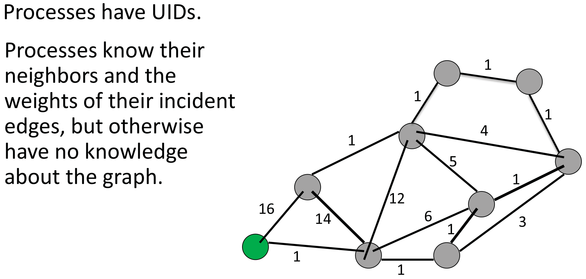

> [原图说明] 原页附图（p68）：最短路问题示例图（带权边，根 $v_o$）。此图将在统一裁剪阶段作为原图插回。

<!-- ===== PDF p69 ===== -->

**最短路（Shortest Paths）**

- 进程必须产生一棵**以顶点 $v_o$ 为根的最短路生成树**。
- 分支是从 $v_o$ 出发的**有向路径**。
  - **生成（Spanning）**：分支到达所有顶点。
  - **最短路（Shortest paths）**：到每个节点的树分支的**总权**是 $G$ 中从 $v_o$ 出发**任何路径的最小总权**。
- **输出（Output）**：每个进程 $i \ne i_o$ 应输出 **parent $j$, distance($d$)**，含义是：
  - $j$ 的顶点是 $i$ 的顶点在从 $v_o$ 出发的**最短路上的父节点**，
  - $d$ 是从 $v_o$ 到 $j$ 的**最短路的总权**。

> **[note] Note（译者注，最短路生成树 = 带权 BFS）:** 最短路生成树（Shortest Paths Spanning Tree）是 BFS 生成树的**带权推广**：BFS 保证「深度 = 跳数距离」，最短路保证「深度 = 权距离」。两者输出类似（父节点 + 距离），但算法完全不同——BFS 的「每轮一跳」在带权图中不成立（权为 100 的边只算一跳但距离 100）。所以最短路改用**松弛（relaxation）**思想：每个进程维护「已知最短距离 dist」，反复用「$d(u) + \operatorname{weight}(u,v) < d(v)$ 则更新」改进——这正是你在 6.006 学的 **Bellman-Ford**（CLRS §24.1）的分布式版。注意「进程知道邻居与边权、但不知图整体」的设定，让 Bellman-Ford 的**天然分布性**得以施展：松弛只依赖局部信息。

<!-- ===== PDF p70 ===== -->

**Bellman-Ford 最短路算法（Bellman-Ford Shortest Paths Algorithm）**

- **状态变量（State variables）**：
  - `dist`，非负实数或 $\infty$，表示**已知的从 $v_o$ 出发的最短距离**。初始对进程 $i_o$ 为 0、对其他人 $\infty$。
  - `parent`，UID 或 undefined，初始 undefined。
  - `uid`
- **进程 $i$ 的算法**：
  - 每一轮：
    - 向所有邻居发送一条 **distance(dist)** 消息。
    - 从邻居处接收消息；令 $d_j$ 为从邻居 $j$ 收到的距离。
    - 执行**松弛步骤（relaxation step）**：
      - $\operatorname{dist} := \min(\operatorname{dist},\; \min_j (d_j + \operatorname{weight}(i, j)))$
    - 若 dist 减小，则设 parent := $j$，其中 $j$ 是产生新 dist 的任意邻居。

> **[note] Note（译者注，分布式 Bellman-Ford）:** 这个算法就是 **Bellman-Ford 的分布式实现**：每轮所有进程同时向邻居广播自己当前的 dist 估计，然后做松弛 $\operatorname{dist} := \min(\operatorname{dist}, d_j + w(i,j))$——与串行 Bellman-Ford 的松弛 $\operatorname{dist}[v] = \min(\operatorname{dist}[v], \operatorname{dist}[u] + w(u,v))$ 完全同构，只是**所有边同时松弛**（同步轮 = 一轮松弛所有边）。这与你 6.006 学的 Bellman-Ford（CLRS §24.1，$|V|-1$ 轮）一一对应：一轮 = 一条「松弛波」沿图传播，$n-1$ 轮后所有最短距离稳定。**与讲次 15 LP 的连接**：最短路 LP 的三角不等式 $d(v) \le d(u) + w(u,v)$ 正是这里松弛的依据，Bellman-Ford 就是在这个可行域上「迭代求紧」。注意与 BFS 的对比：BFS 用「同步轮数 = 跳数」，Bellman-Ford 用「同步轮数 = 边数上界」，因为带权边打破了「一跳 = 一层」的对应。

<!-- ===== PDF p71 ===== -->

**示例：Bellman-Ford（Example: Bellman-Ford）**

- **初始（Initially）**：根 dist = 0，其他 $\infty$。

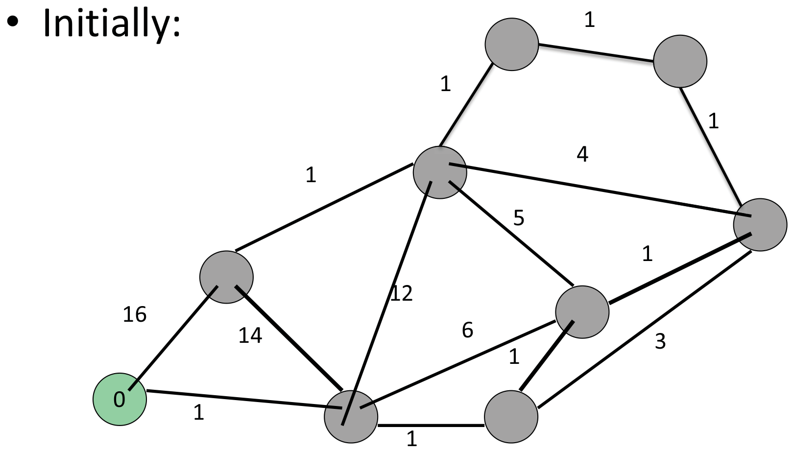

> [原图说明] 原页附图（p71）：初始状态——根节点 dist=0，其余为 ∞。此图将在统一裁剪阶段作为原图插回。

<!-- ===== PDF p72 ===== -->

**Bellman-Ford（Bellman-Ford）**

- **1 轮后（After 1 round）**：根的邻居收到 dist 0，更新为边权。

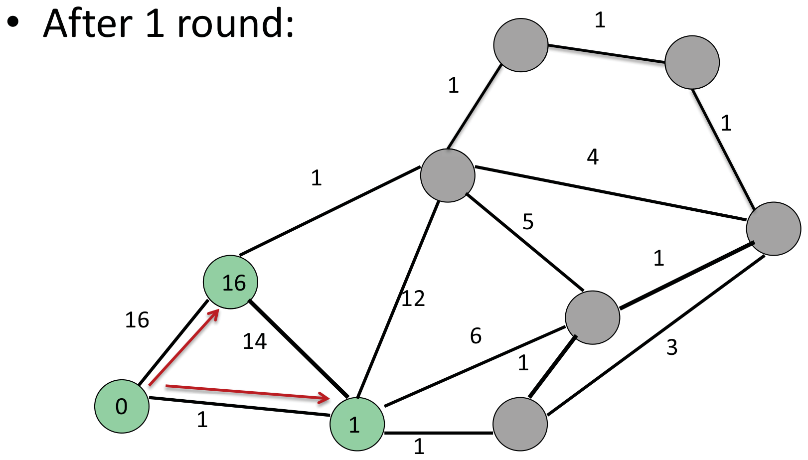

> [原图说明] 原页附图（p72）：1 轮后——根的直接邻居 dist 更新为各自边权（如 6、16 等）。此图将在统一裁剪阶段作为原图插回。

<!-- ===== PDF p73 ===== -->

**Bellman-Ford（Bellman-Ford）**

- **2 轮后（After 2 rounds）**：距离 2 跳的节点被更新。

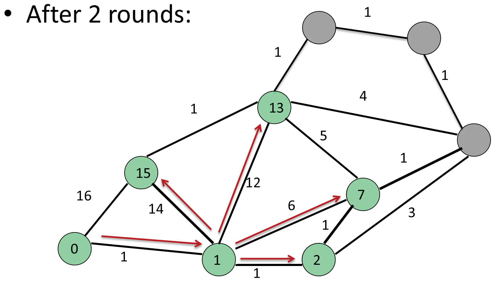

> [原图说明] 原页附图（p73）：2 轮后——更多节点 dist 更新（如 12、14、15 等）。此图将在统一裁剪阶段作为原图插回。

<!-- ===== PDF p74 ===== -->

**Bellman-Ford（Bellman-Ford）**

- **3 轮后（After 3 rounds）**。

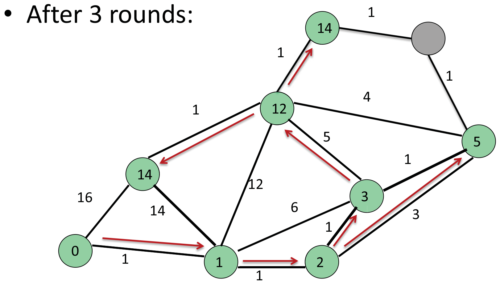

> [原图说明] 原页附图（p74）：3 轮后——dist 继续收敛。此图将在统一裁剪阶段作为原图插回。

<!-- ===== PDF p75 ===== -->

**Bellman-Ford（Bellman-Ford）**

- **4 轮后（After 4 rounds）**。

> [原图说明] 原页附图（p75）：4 轮后。此图将在统一裁剪阶段作为原图插回。

<!-- ===== PDF p76 ===== -->

**Bellman-Ford（Bellman-Ford）**

- **5 轮后（After 5 rounds）**。

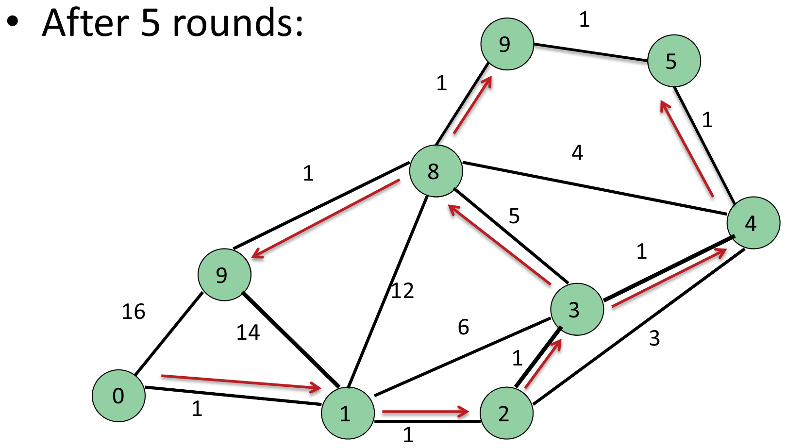

> [原图说明] 原页附图（p76）：5 轮后。此图将在统一裁剪阶段作为原图插回。

<!-- ===== PDF p77 ===== -->

**Bellman-Ford（Bellman-Ford）**

- **6 轮后（After 6 rounds）**。

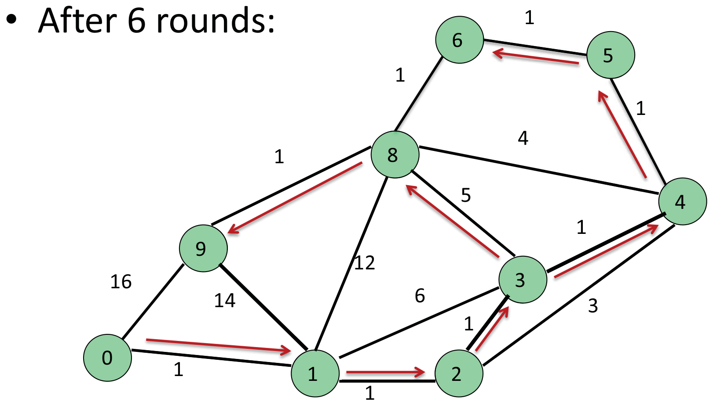

> [原图说明] 原页附图（p77）：6 轮后。此图将在统一裁剪阶段作为原图插回。

<!-- ===== PDF p78 ===== -->

**Bellman-Ford（Bellman-Ford）**

- **7 轮后（After 7 rounds）**。

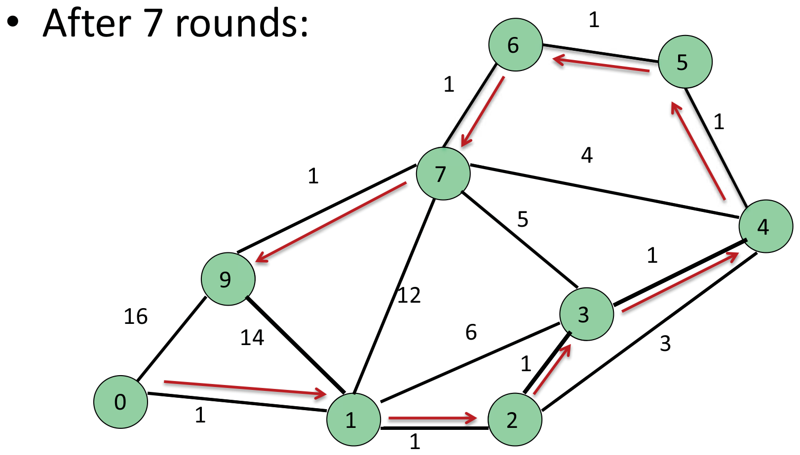

> [原图说明] 原页附图（p78）：7 轮后。此图将在统一裁剪阶段作为原图插回。

<!-- ===== PDF p79 ===== -->

**Bellman-Ford（Bellman-Ford）**

- **8 轮后（After 8 rounds）**：所有 dist 收敛到最短路。

> [原图说明] 原页附图（p79）：8 轮后——所有节点 dist 稳定为最短路权。此图将在统一裁剪阶段作为原图插回。

<!-- ===== PDF p80 ===== -->

**正确性（Correctness）**

- **论断（Claim）**：最终，每个进程 $i$ 都有：
  - $\operatorname{dist}$ = 从 $i_o$ 到 $i$ 的**路径最小权**，且
  - 若 $i \ne i_o$，$\operatorname{parent}$ = 从 $i_o$ 到 $i$ 的**某条最短路径上的前一节点**。
- **关键不变式（Key invariant）**：
  - 对每个 $r$，在 $r$ 轮结束时，每个进程 $i \ne i_o$ 的 dist 和 parent 对应**从 $i_o$ 到 $i$、由至多 $r$ 条边组成的最短路径**；若不存在这样的路径，则 $\operatorname{dist} = \infty$ 且 parent 未定义。

> **[note] Note（译者注，Bellman-Ford 不变式 = 「≤ r 条边的最短路」）:** 关键不变式的表述非常精确：**$r$ 轮后，每个进程的 dist 是「至多 $r$ 条边」的最短路**——不是「恰 $r$ 条边」，而是「≤ r 条边」。这正好对应 Bellman-Ford 的经典引理（CLRS §24.1）：**第 $r$ 轮松弛后，所有「至多 $r$ 条边的最短路」已被求出**。为什么是「至多」？因为最短路径可能不需要那么多边，而一旦找到就不会被更差的估计覆盖（松弛只减不增）。由于任何最短路径至多 $n-1$ 条边（无负环、连通图），$n-1$ 轮后必收敛——这就是 p81 的时间界。这个「**轮数 = 路径边数上界**」的对应，是 Bellman-Ford 不变式与 BFS 不变式的核心差异（BFS 用「距离 < r」，Bellman-Ford 用「≤ r 条边」）。

<!-- ===== PDF p81 ===== -->

**复杂度（Complexity）**

- **时间复杂度**：
  - 直到所有变量稳定到最终值所需的轮数。
  - **$n - 1$ 轮**
- **消息复杂度**：
  - 整个执行期间所有进程发送的消息总数。
  - **$O(n \cdot |E|)$**
- 比 BFS 更昂贵：
  - BFS：$\operatorname{diam}$ 轮，$O(|E|)$ 消息
- **问（Q）**：时间界真的依赖 $n$ 吗？

> **[note] Note（译者注，Bellman-Ford vs BFS 的复杂度对比）:** 对比鲜明：**BFS** 用 $\operatorname{diam}$ 轮（通常 $\ll n$）、$O(|E|)$ 消息；**Bellman-Ford** 用 $n-1$ 轮、$O(n|E|)$ 消息（每轮每条边被松弛一次、$n-1$ 轮，故 $O(n|E|)$ 消息）。为什么差这么多？因为带权图里「最短路径可能需要 $n-1$ 条边」，而 BFS 无权图里「最远也只需直径跳」。**「时间界真的依赖 $n$ 吗」**这个问题很尖锐：串行 Bellman-Ford 的 $O(V\cdot E)$ 时间界其实可以用**负环检测 / 实际收敛提前**改进，但**最坏情形**确实需要 $n-1$ 轮（构造一条 $n$ 节点的长链，最短路要沿链传播 $n-1$ 步）。这与你在 6.006 学的「Bellman-Ford 是 $O(VE)$，但实际常快得多」是同一个观察的分布式版本。

<!-- ===== PDF p82 ===== -->

**子指针（Child Pointers）**

- 忽略重复消息。
- 当进程 $i$ 收到一条**没有用来改进 dist** 的消息时，它用 nonparent 消息响应。
- 当进程 $i$ 收到一条**用来改进 dist** 的消息时，它用 parent 消息响应，并向**任何先前的父节点**也发 nonparent 消息。
- 进程 $i$ 把从它收到 parent 消息的节点记录在集合 `children` 中。
- 当进程 $i$ 从当前孩子处收到 nonparent 消息时，把它从 `children` 中移除。
- 当进程 $i$ 改进 dist 时，它清空 `children`。

> **[note] Note（译者注，动态树的子指针维护）:** 与 BFS 不同，最短路树的**父节点可能改变**（更好的路径出现时，进程会换父）。所以子指针的维护是**动态的**：收到「改进 dist」的消息 → 响 parent（新父确认）、并对旧父响 nonparent（告诉旧父「我不再是你孩子」）；收到「没改进」的消息 → 响 nonparent；改进 dist 时清空 children（旧孩子可能跟着换父）。这套**「父-子关系的动态维护」**比 BFS 的静态树复杂得多，也是下一张幻灯片「终止更难」的根源——**树结构本身在变**。这个「动态重组 + 撤销旧关系」的模式，与你在 CSAPP 学的动态内存管理、以及并查集/动态树的维护思想相通。

<!-- ===== PDF p83 ===== -->

**终止性（Termination）**

- **问（Q）**：进程如何知道最短路树已完成？
- **问（Q）**：进程如何知道自己可以输出自己的父节点和距离？
- 若进程知道 $n$ 的上界，它们可以**等到那么多轮过去**。
- 但若它们对图**一无所知**呢？
- 回顾 BFS 的终止：用了**汇播（convergecast）**。
- **问（Q）**：这里能用汇播吗？

<!-- ===== PDF p84 ===== -->

**终止性（Termination）**

- **问（Q）**：进程如何知道最短路树已完成？
- **问（Q）**：这里汇播能用吗？
- **能**，但**更棘手**，因为**树结构会变**。
- **关键思想（Key ideas）**：
  - 进程 $i \ne i_o$ 可以在以下条件满足后，向其**当前父节点**发送 done：
    - 它已收到所有 distance 消息的响应，所以它**相信自己知道谁是自己孩子**，且
    - 它已收到所有**这些孩子**的 done 消息。
  - **同一个进程可能多次参与汇播**，基于改进后的估计。

> **[note] Note（译者注，动态树上的终止更难）:** BFS 的汇播在**静态树**上做一次就行；最短路树的汇播要处理**树结构不断变化**：一个进程可能先被 A 选为父、后又被 B 选为父，它在不同「版本」的树上都要参与汇播。所以「收到所有响应 + 所有孩子 done」的条件必须在**当前（可能已改变）的树结构**上重新检查——进程可能多次向上发 done，父节点也要处理「旧 done 作废、新树重汇」的复杂情况。这个「**结构动态变化下的一致性终止**」是分布式算法里真正困难的问题之一（也是 Lynch 教材后半部分的重点）。直觉上：最终所有 dist 稳定后，树结构也稳定，汇播最终会成功——难点在于**进程无法提前知道「现在稳定了吗」**。这与「异步系统中如何检测终止」（下一讲 Lec 20）一脉相承。

<!-- ===== PDF p85 ===== -->

**MIT OpenCourseWare**

http://ocw.mit.edu

**6.046J / 18.410J 算法设计与分析（Design and Analysis of Algorithms）**

Spring 2015（2015 春季学期）

有关引用这些材料的信息或我们的使用条款（Terms of Use），请访问：http://ocw.mit.edu/terms。
