<!-- ===== PDF p1 ===== -->

**讲次 20（Lecture 20）：异步分布式算法（Asynchronous Distributed Algorithms）——最短路生成树（Shortest-Paths Spanning Trees）** （6.046J, Spring 2015，第二部分 Part 2，Nancy Lynch 主讲）

**分布式算法（Distributed Algorithms）**

<!-- ===== PDF p2 ===== -->

**本周（This Week）**

- **同步分布式算法**：
  - 领导者选举（Leader Election）
  - 极大独立集（Maximal Independent Set）
  - 广度优先生成树（Breadth-First Spanning Trees）
  - 最短路生成树（Shortest Paths Trees，开始）
  - 最短路生成树（完成）
- **异步分布式算法**：
  - 广度优先生成树
  - 最短路生成树

> **[note] Note（译者注，本讲定位）:** 本讲是 Nancy Lynch 分布式算法专题的**第二部分（Part 2）**：前 27 页**复习**讲次 19 的同步模型与算法（选举、Luby MIS、同步 BFS、同步 Bellman-Ford），从第 28 页起进入**本讲真正的新内容——异步模型**。异步分布式算法是分布式计算中最困难的部分：**没有统一时钟、没有轮、消息与步骤以任意顺序任意时刻发生**。理解本讲的关键是把「同步 vs 异步」当作对照：同步里「轮数 = 信息传播的自然计量」，异步里「没有轮，必须用抽象性质（不变式 + 时序性质）来推理」。Lynch 在 MIT 的研究生课程 **6.852/18.437（Distributed Algorithms）** 会系统覆盖本讲结尾提到的更高级内容（同步器、逻辑时间、全局快照、容错共识等）。

<!-- ===== PDF p3 ===== -->

**分布式网络（Distributed Networks）**

- 基于无向图 $G = (V, E)$。
  - $n = |V|$
  - $r(u)$：顶点 $u$ 的邻居集合。
  - $\deg u = |r(u)|$：顶点 $u$ 的邻居数。
- 把**一个进程**关联到**每个图顶点**。
- 把**两个有向通信信道**关联到**每条边**。

<!-- ===== PDF p4 ===== -->

**同步分布式算法（Synchronous Distributed Algorithms）**

> [原图说明] 原页为章节分隔页（p4），仅标题「Synchronous Distributed Algorithms」。

<!-- ===== PDF p5 ===== -->

**同步网络模型（Synchronous Network Model）**

- 图顶点上的进程通过消息通信。
- 每个进程有连接到通信信道的输出端口、输入端口。
- 算法以**同步轮**执行。
- 每一轮：
  - 每个进程在其端口上发送消息。
  - 每条消息被放入信道，投递到另一端的进程。
  - 每个进程根据到达的消息计算新状态。

> [回顾] 本页是讲次 19 同步模型的复习，详细译注见讲次 19 的 p8-9。

<!-- ===== PDF p6 ===== -->

**领导者选举（Leader Election）**

> [原图说明] 原页为章节分隔页（p6），仅标题「Leader Election」。

<!-- ===== PDF p7 ===== -->

**$n$ 顶点团（n-vertex Clique）**

- **定理（Theorem）**：不存在由确定性、不可区分进程组成的算法能保证在 $G$ 中选举领导者。
- **定理（Theorem）**：存在由带 UID 的确定性进程组成的算法能保证选举领导者。
  - 1 轮，$n$ 条消息。
- **定理（Theorem）**：存在由随机的、不可区分进程组成的算法能**以概率 1** 最终选举领导者。
  - 期望时间 $< \frac{1}{1-\varepsilon}$。
  - 以概率 $> 1 - \varepsilon$，一轮内完成。

> [回顾] 本页复习讲次 19 的 p12-19（团网络的三个定理），详细译注见该讲。

<!-- ===== PDF p8 ===== -->

**极大独立集（Maximal Independent Set, MIS）**

> [原图说明] 原页为章节分隔页（p8），仅标题「Maximal Independent Set (MIS)」。

<!-- ===== PDF p9 ===== -->

**MIS（MIS）**

- **独立（Independent）**：集合中没有两个节点互为邻居。
- **极大（Maximal）**：在不破坏独立性的前提下不能再加入节点。
- **每个节点要么在 $S$ 中，要么有一个邻居在 $S$ 中**。
- 假设：
  - 无 UID
  - 进程知道 $n$ 的一个良好上界。
- 要求：
  - 计算网络图的一个 **MIS $S$**。
  - $S$ 中每个进程输出 in，其他进程输出 out。

> [回顾] 本页复习讲次 19 的 p21-22（MIS 定义），详细译注见该讲。

<!-- ===== PDF p10 ===== -->

**Luby 算法（Luby's Algorithm）**

- 初始所有节点都是活跃的。
- 每个阶段，一些活跃节点决定 in、一些决定 out，其余进入下一阶段。
- 活跃节点在一个阶段的行为：
  - **第 1 轮**：从 $\{1, 2, \ldots, n^5\}$ 选随机值 $r$，发送给所有邻居；从所有活跃邻居接收值；若 $r$ **严格大于**所有收到的值，则加入 MIS，输出 in。
  - **第 2 轮**：若你加入 MIS，向所有（活跃）邻居广播；若收到这样的广播，则决定不加入 MIS，输出 out；若在本阶段已决定，则变为不活跃。

> [回顾] 本页复习讲次 19 的 p23（Luby 算法），详细译注见该讲。

<!-- ===== PDF p11 ===== -->

**Luby 算法（Luby's Algorithm）**

- **定理（Theorem）**：若 Luby 算法最终终止，则最终集合 $S$ 是一个 MIS。
- **定理（Theorem）**：以至少 $1 - \frac{1}{n}$ 的概率，所有节点在 $4 \log n$ 个阶段内决定。

> [回顾] 本页复习讲次 19 的 p31-37（Luby 正确性与终止），详细译注见该讲。

<!-- ===== PDF p12 ===== -->

**广度优先生成树（Breadth-First Spanning Trees）**

> [原图说明] 原页为章节分隔页（p12），仅标题「Breadth-First Spanning Trees」。

<!-- ===== PDF p13 ===== -->

**广度优先生成树（Breadth-First Spanning Trees）**

- 特殊顶点 $v_a$。
- 进程必须产生一棵**以顶点 $v_a$ 为根的广度优先生成树**。
- 假设：
  - 有 UID。
  - 进程对图没有知识。
- 输出：每个进程 $i \ne i_a$ 应输出 **parent $j$**。

> [回顾] 本页复习讲次 19 的 p39-40（BFS 问题设定），详细译注见该讲。

<!-- ===== PDF p14 ===== -->

**简单 BFS 算法（Simple BFS Algorithm）**

- 进程在**被纳入树中**时标记自己。
- 初始只有 $i_0$ 被标记。
- 进程 $i$ 的算法：
  - **第 1 轮**：若 $i = i_0$，向邻居发送 search 消息；若收到消息，则标记自己、选 $i_0$ 为父、计划下轮发送。
  - **第 $r > 1$ 轮**：若计划发送，则发送 search；若未标记且收到消息，则标记自己、选某个发送者为父、计划下轮发送。

> [回顾] 本页复习讲次 19 的 p42（简单 BFS 算法），详细译注见该讲。

<!-- ===== PDF p15 ===== -->

**正确性（Correctness）**

- 每个进程的状态变量：`marked`（初始对 $i_a$ true）、`parent`（UID 或 undefined）、`send`、`uid`。
- **不变式（Invariants）**：
  - $r$ 轮结束时，恰好**距离 $v_a$ 小于 $r$** 的进程被标记。
  - 进程 $i \ne i_a$ 的 parent 有定义当且仅当它被标记。
  - 对任何距离 $v_a$ 为 $d$ 的进程，若其 parent 有定义，则它是距离 $d-1$ 的某进程的 UID。

> [回顾] 本页复习讲次 19 的 p54（BFS 不变式），详细译注见该讲。

<!-- ===== PDF p16 ===== -->

**复杂度（Complexity）**

- **时间复杂度**：直到所有节点输出父节点信息所需的轮数 = 任何节点到 $v_a$ 的**最大距离**，即 $< \operatorname{diam}$。
- **消息复杂度**：整个执行期间的消息总数 = **$O(|E|)$**。

> [回顾] 本页复习讲次 19 的 p55（BFS 复杂度），详细译注见该讲。

<!-- ===== PDF p17 ===== -->

**锦上添花（Bells and Whistles）**

- **子指针**：对 search 消息发送 parent/nonparent 响应。
- **距离**：把距离搭载在 search 消息上。
- **终止**：从叶子开始的汇播（convergecast）。
- **应用**：从根的广播、全局计算。

> [回顾] 本页复习讲次 19 的 p56-66（扩展与应用），详细译注见该讲。

<!-- ===== PDF p18 ===== -->

**最短路生成树（Shortest Paths Trees）**

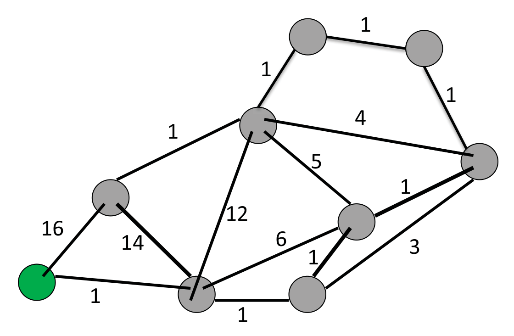

> [原图说明] 原页附图（p18）：最短路示例图（带权边，根 $v_o$）。此图将在统一裁剪阶段作为原图插回。

<!-- ===== PDF p19 ===== -->

**最短路（Shortest Paths）**

- 把 BFS 问题推广到**允许边带权**：边 $\{u, v\}$ 有权 $\operatorname{weight}(u, v)$。
- 连通图 $G = (V, E)$、根顶点 $v_a$、进程 $i_a$。
- 进程有 UID。
- 进程知道自己的**邻居**和**关联边的权**，但除此之外对图**没有任何知识**。

> [回顾] 本页复习讲次 19 的 p68（最短路问题设定），详细译注见该讲。

<!-- ===== PDF p20 ===== -->

**最短路（Shortest Paths）**

- 进程必须产生一棵**以顶点 $v_a$ 为根的最短路生成树**。
- 分支是从 $v_a$ 出发的有向路径。
  - **生成**：分支到达所有顶点。
  - **最短路**：到每个节点的树分支总权是 $G$ 中从 $v_a$ 出发任何路径的最小总权。
- 输出：每个进程 $i \ne i_a$ 应输出 **parent $j$, distance($d$)**，含义是 $j$ 的顶点是 $i$ 在最短路上的父节点、$d$ 是从 $v_a$ 到 $j$ 的最短路总权。

> [回顾] 本页复习讲次 19 的 p69（最短路生成树定义），详细译注见该讲。

<!-- ===== PDF p21 ===== -->

**Bellman-Ford 最短路算法（Bellman-Ford Shortest Paths Algorithm）**

- **状态变量**：`dist`（非负实数或 $\infty$，初始对 $i_a$ 为 0、其他人 $\infty$）、`parent`（初始 undefined）、`uid`。
- **进程 $i$ 的算法**：每轮向所有邻居发送 distance(dist)；接收后做**松弛**：$\operatorname{dist} := \min(\operatorname{dist}, \min_j(d_j + \operatorname{weight}(i,j)))$；若 dist 减小则设 parent 为产生新 dist 的邻居。

> [回顾] 本页复习讲次 19 的 p70（Bellman-Ford 算法），详细译注见该讲。

<!-- ===== PDF p22 ===== -->

**正确性（Correctness）**

- **论断（Claim）**：最终，每个进程 $i$ 有 dist = 从 $i_a$ 到 $i$ 的路径最小权，且 parent 为某条最短路上的前一节点。
- **关键不变式**：$r$ 轮结束时，每个进程的 dist/parent 对应**至多 $r$ 条边**的最短路；若无则 dist = $\infty$、parent undefined。

> [回顾] 本页复习讲次 19 的 p80（Bellman-Ford 不变式），详细译注见该讲。

<!-- ===== PDF p23 ===== -->

**复杂度（Complexity）**

- **时间复杂度**：$n-1$ 轮。
- **消息复杂度**：$O(n \cdot |E|)$。
- 比 BFS 更昂贵：BFS 是 $\operatorname{diam}$ 轮、$O(|E|)$ 消息。
- **问（Q）**：时间界真的依赖 $n$ 吗？

> [回顾] 本页复习讲次 19 的 p81（Bellman-Ford 复杂度），详细译注见该讲。

<!-- ===== PDF p24 ===== -->

**子指针（Child Pointers）**

- 忽略重复消息。
- 收到未改进 dist 的消息 → 响应 nonparent；收到改进 dist 的消息 → 响应 parent、并向旧父也发 nonparent。
- 收到 parent 消息的节点记入 `children`；收到当前孩子的 nonparent 则移除；改进 dist 时清空 `children`。

> [回顾] 本页复习讲次 19 的 p82（动态子指针维护），详细译注见该讲。

<!-- ===== PDF p25 ===== -->

**终止性（Termination）**

- **问（Q）**：进程如何知道最短路树已完成？如何知道自己可以输出父节点和距离？
- 若知道 $n$ 的上界，就等到那么多轮过去。
- 但若对图一无所知呢？
- 回顾 BFS 的终止：用了汇播。
- **问（Q）**：这里汇播能用吗？

> [回顾] 本页复习讲次 19 的 p83（终止问题），详细译注见该讲。

<!-- ===== PDF p26 ===== -->

**终止性（Termination）**

- **能**，但更棘手，因为**树结构会变**。
- **关键思想**：进程 $i \ne i_a$ 在「已收到所有 distance 消息的响应（相信知道自己孩子）」且「已收到所有孩子的 done」后，向**当前父节点**发送 done；**同一进程可能多次参与汇播**，基于改进后的估计。

> [回顾] 本页复习讲次 19 的 p84（动态树上的汇播终止），详细译注见该讲。

<!-- ===== PDF p27 ===== -->

**终止性（Termination）**

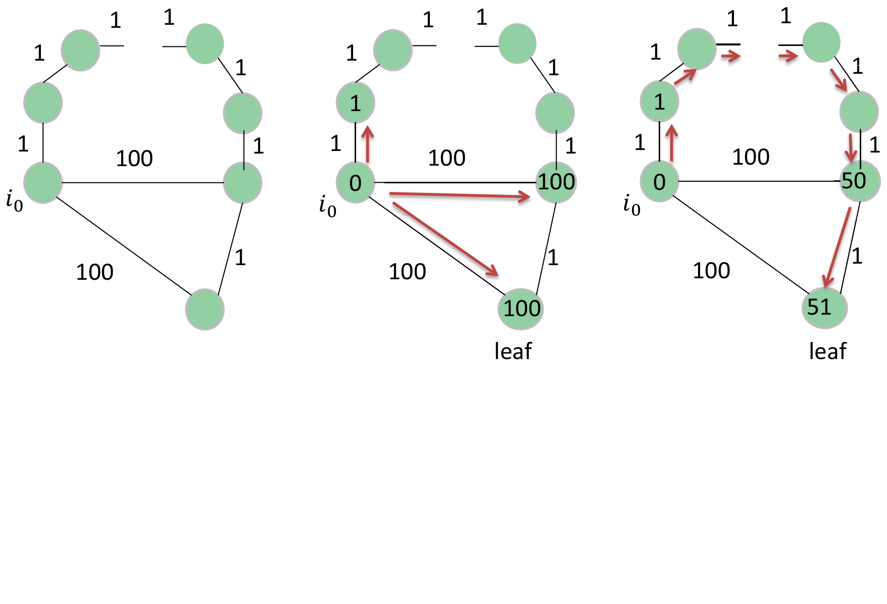

> [原图说明] 原页附图（p27）：动态最短路树上汇播终止的示例——边权含 100、1、50、51、5 等，标注 leaf（叶子）节点。此图将在统一裁剪阶段作为原图插回。

<!-- ===== PDF p28 ===== -->

**异步分布式算法（Asynchronous Distributed Algorithms）**

> [原图说明] 原页为章节分隔页（p28），仅标题「Asynchronous Distributed Algorithms」。

<!-- ===== PDF p29 ===== -->

**异步网络模型（Asynchronous Network Model）**

- **到目前为止的复杂性**：
  - 进程**并发**活动。
  - **一点点**非确定性。
- **现在情况糟得多**：
  - **没有轮**——进程步骤与消息投递发生在**任意时刻、任意顺序**。
  - 进程**失同步（get out of synch）**。
  - **多得多的非确定性**。
- **理解异步分布式算法很难**，因为我们**无法精确理解它们如何执行**。
- 相反，我们必须理解**执行的抽象性质**。

> **[note] Note（译者注，异步模型的根本困难）:** 这一页是本讲最重要的「认知转换」。同步模型里，你可以**精确**描述「$r$ 轮后系统的状态」（不变式直接按轮归纳）；异步模型里**这是不可能的**——没有全局的「轮」，每一步（某个进程的某次发送/接收）都在任意时刻发生，系统状态取决于执行的历史顺序，而可能的历史有无穷多种。所以 Lynch 给出方法论：**不要试图理解「精确执行」，而要理解「所有执行的共同抽象性质」**——即**不变式（invariants，对任意状态都成立）**与**时序性质（timing properties，如「到某时刻必已发生某事件」）**。这与你在 CSAPP 里「内存模型/一致性」的抽象层级、以及实分析里「对任意 ε 存在 δ」的量化思维是同一类思想：**当无法逐点刻画时，退到性质层面**。

<!-- ===== PDF p30 ===== -->

**异步网络模型（Aynchronous Network Model）**

- 见 Lynch, *Distributed Algorithms* 第 8 章。
- 无向图 $G = (V, E)$ 节点上的进程通过消息通信。
- 与边关联的通信信道（每条边每个方向一个）。
  - $e_{u,v}$：从顶点 $u$ 到顶点 $v$ 的信道。
- 每个进程有连接到其信道的输出端口和输入端口。
- 进程**不必可区分**。

> **[note] Note（译者注，异步模型的形式化基础）:** 异步模型的形式化用 **I/O 自动机（Input/Output automaton）**：每个组件（进程、信道）是一个状态机，其**迁移与命名动作（actions）**关联，动作分**输入（input）、输出（output）、内部（internal）**三类——输入动作来自环境（进程无法控制「何时收到消息」），输出动作由自动机自己发起（「何时发消息」）。这套模型由 **Lynch 与 Tuttle（1987）** 提出（维基百科 I/O automaton 词条），它精确刻画了「组件以**任意相对速度**运行」的异步性：两个进程之间没有共享时钟，唯一的信息交换是信道中的消息。信道的正式模型（下一张幻灯片）是 **FIFO 队列**：`send` 把消息入队、`receive` 弹出队头——「先进先出」保证**同一信道上消息不重排**，这是异步模型里少数能依赖的顺序性质之一。

<!-- ===== PDF p31 ===== -->

**信道自动机 $e_{u,v}$（Channel Automaton $e_{u,v}$）**

- 形式地，一个 **I/O 自动机**。
- **输入动作**：$\operatorname{send}(m)_{u,v}$
- **输出动作**：$\operatorname{receive}(m)_{u,v}$
- **状态变量**：
  - `mqueue`，一个 FIFO 队列，初始为空。
- **迁移（Transitions）**：
  - $\operatorname{send}(m)_{u,v}$：效果——把 $m$ 加入 `mqueue`。
  - $\operatorname{receive}(m)_{u,v}$：前提——$m = \operatorname{head}(\text{mqueue})$；效果——移除队头。

> **[note] Note（译者注，FIFO 信道自动机）:** 信道 $e_{u,v}$ 是一个**迷你状态机**：`send` 是输入（由发送方进程触发）、`receive` 是输出（把消息交给接收方进程），中间状态就是 FIFO 队列。关键点：**FIFO 保证同一信道内的消息按发送顺序投递**（队头先出），但**不同信道之间没有顺序保证**——这精确建模了真实网络：一条物理链路上的包不乱序，但不同链路的包可以交错。这个「**信道内有序、信道间无序**」的假设是许多异步算法正确性论证的地基。注意 `receive` 的前提「$m$ = 队头」强制了「必须先收最早的」——这是**公平性（fairness）**的一种局部形式：只要队列非空，接收迟早发生（下一张幻灯片 p35 会全局化这个假设）。

<!-- ===== PDF p32 ===== -->

**进程自动机 $P_u$（Process Automaton $P_u$）**

- 把进程自动机关联到 $G$ 的每个顶点。
- 为简化记号，令 $P_u$ 表示顶点 $u$ 处的进程自动机。
  - 但进程**「不知道」$u$**。
- $P_u$ 有 $\operatorname{send}(m)_{u,v}$ 输出和 $\operatorname{receive}(m)_{v,u}$ 输入。
- 也可能有外部输入和输出。
- 有状态变量。
- 持续执行步骤（最终）。

> **[note] Note（译者注，进程不知道自己是哪个顶点）:** 一个微妙但重要的设定：**进程自动机 $P_u$ 虽然「位于」顶点 $u$，但它不知道自己的身份 $u$**——它只知道自己的局部名字（端口号）和状态。这与讲次 19 的「端口局部性」一致，是「不可区分进程」的形式化。也正因如此，**初始状态必须对称**（所有 $P_u$ 相同），否则就隐式泄漏了身份。这个「**位置 ≠ 认知**」的区分是分布式算法设计的核心约束：任何算法只能基于**局部可见信息**（自己的状态、收到的消息）做决定。

<!-- ===== PDF p33 ===== -->

**示例：Max 进程自动机（Example: Max Process Automaton）**

- **输入动作**：$\operatorname{receive}(m)_{v,u}$
- **输出动作**：$\operatorname{send}(m)_{u,v}$
- **状态变量**：
  - `max`，自然数，初始为 $x_u$
  - 对每个邻居 $v$：`send(v)`，布尔，初始 true
- **迁移**：
  - $\operatorname{receive}(m)_{v,u}$：效果——若 $m > \max$ 则 $\max := m$，且对每个 $w$ 令 `send(w) := true`。
  - $\operatorname{send}(m)_{u,v}$：前提——`send(v) = true` 且 $m = \max$；效果——`send(v) := false`。

> **[note] Note（译者注，Max 自动机的「改进即重播」）:** 这个 Max 自动机演示了异步算法的一个**通用模板**：「**学到更大的值就向所有邻居重播**」。状态变量 `max` 保存当前已知最大值；收到更大的 $m$ 就更新 max 并把所有 `send(v)` 置 true（准备向所有人重发）；`send(v) = true` 表示「还有新值要发给 $v$」（发完置 false）。这实现了「最大值向全网传播」——无论消息以什么顺序到达，最终全局最大值都会到达每个节点（p36 会论证）。这个「**记录已知最好 + 改进则广播**」的模式，正是后面 BFS/Bellman-Ford 松弛算法的雏形，也是许多自稳定（self-stabilizing）算法的核心：**用「重新广播改进」补偿「不知道谁需要知道」**。

<!-- ===== PDF p34 ===== -->

**组合进程与信道（Combining Processes and Channels）**

- 无向图 $G = (V, E)$。
- 每个顶点 $u$ 处有进程 $P_u$。
- 每条边 $\{u, v\}$ 关联两个信道 $e_{u,v}$ 与 $e_{v,u}$。
- 进程 $P_u$ 的 $\operatorname{send}(m)_{u,v}$ 输出与信道 $e_{u,v}$ 的 $\operatorname{send}(m)_{u,v}$ 输入**等同（identified）**。
- 信道 $e_{v,u}$ 的 $\operatorname{receive}(m)_{v,u}$ 输出与进程 $P_u$ 的 $\operatorname{receive}(m)_{v,u}$ 输入等同。
- 涉及这种**共享动作**的步骤会同时引起一个进程和一个信道的状态迁移。

> **[note] Note（译者注，共享动作与组合系统）:** I/O 自动机的组合方式很优雅：**进程的输出动作与信道的输入动作「共享」同一个动作**——一次 `send` 步骤同时改变进程状态（如把 send(v) 置 false）与信道状态（消息入队）。这避免了「先进程发、再信道收」的两步建模，把整个系统看成**一个大的组合自动机**，其执行是「每一步选一个 enabled 动作执行」的序列。这种**组合式（compositional）**建模正是 Lynch 方法论的优势：可以分组件证明（每个组件的性质），再组合出全局性质。它与你在 CSAPP 学的「模块化 + 接口契约」、以及 6.042J 的「系统组成」思想一致。

<!-- ===== PDF p35 ===== -->

**执行（Execution）**

- **不再有同步轮**。
- 系统通过**一次一个、任意顺序**地执行 enabled 步骤来运行。
- 形式地，执行建模为**单个步骤的序列**。
- 这与同步模型不同——同步里所有进程每轮**并发**执行步骤。
- 假设 enabled 步骤**最终发生（fairness）**：
  - 每个信道总是**最终投递**其队列中的第一条消息。
  - 每个进程总是**最终执行**某个 enabled 步骤。

> **[note] Note（译者注，异步执行与公平性假设）:** 异步系统的执行是「**任意顺序的单步序列**」——同一个算法可以产生**指数多种不同的执行**（消息到达顺序不同、进程执行顺序不同），而算法必须**对所有这些执行都正确**。这就是为什么「理解抽象性质而非精确执行」是唯一可行的路径。**公平性（fairness）假设**是必要的：若允许「消息永远不投递」或「进程永远不执行」，任何算法都无法保证完成。这里的公平性很弱（「**最终**发生」，不要求「很快」发生）——它排除的只是「无限拖延」，允许任意长的延迟。这与你在 CSAPP 里「调度器保证每个线程最终获得 CPU」的公平性假设、以及操作系统的 progress 保证是同构的。

<!-- ===== PDF p36 ===== -->

**组合 Max 进程与信道（Combining Max Processes and Channels）**

- 每个进程 $Max_u$ 以初始值 $x_u$ 开始。
- 它们都发送初始值，并**传播自己的 max 值**，直到每个人都拥有全局最大值。
- 发送与接收步骤可以以**许多不同顺序**发生，但**所有情况下**全局最大值最终都会到达各处。

> **[note] Note（译者注，Max 系统的顺序无关性）:** Max 系统是理解异步「**最终一致性（eventual consistency）**」的最简单例子：发送/接收顺序怎么乱，**全局最大值最终都到达每个节点**。直觉：每个节点一旦知道更大的值就重播，这个「改进波」沿图的边推进，无论消息如何交错，最大值都会逐步扩散到所有节点。这背后是「**改进单调**」（max 只增不减）+「**公平性**」（消息最终投递）的组合：改进方向确定、传播不中断，最终收敛。这个「**顺序无关但最终一致**」的性质，是现代分布式系统（如最终一致的数据存储、区块链共识）的核心概念，值得作为第一性原理记牢：**只要改进单调 + 传播公平，顺序就无关紧要**。

<!-- ===== PDF p37 ===== -->

**Max 系统（Max System）**

> [原图说明] 原页附图（p37）：Max 系统初始状态——各节点初始值 5、3、4、10、7。此图将在统一裁剪阶段作为原图插回。

<!-- ===== PDF p38 ===== -->

**Max 系统（Max System）**

> [原图说明] 原页附图（p38）：Max 传播第一步。此图将在统一裁剪阶段作为原图插回。

<!-- ===== PDF p39 ===== -->

**Max 系统（Max System）**

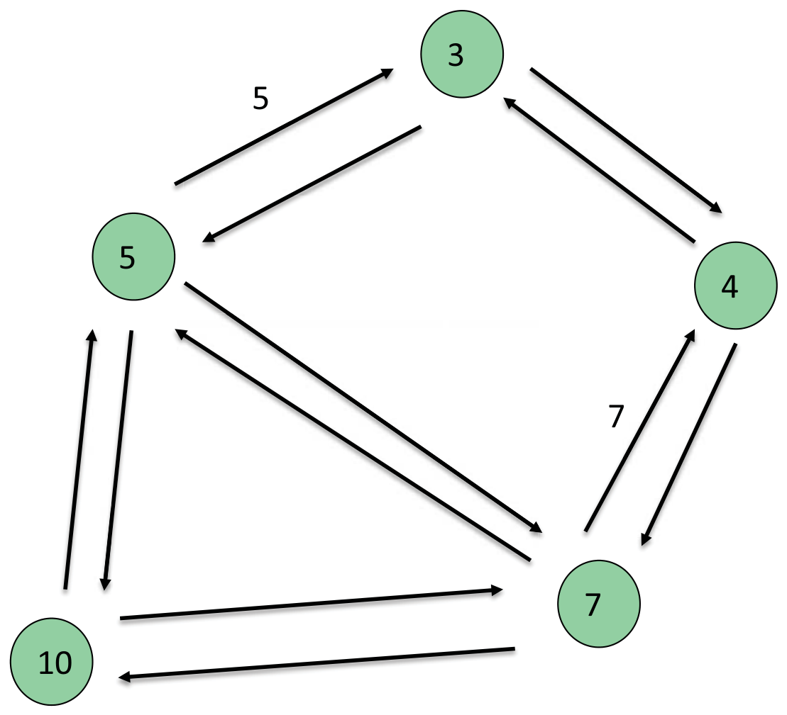

> [原图说明] 原页附图（p39）：Max 传播推进。此图将在统一裁剪阶段作为原图插回。

<!-- ===== PDF p40 ===== -->

**Max 系统（Max System）**

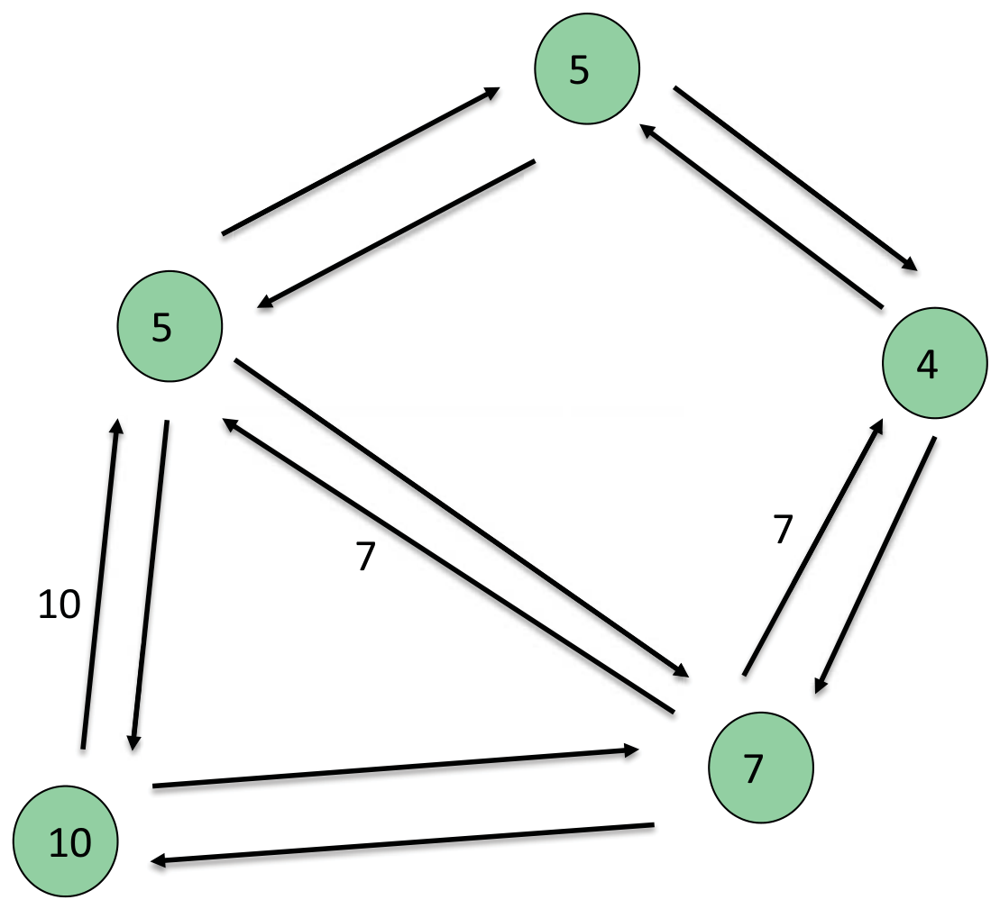

> [原图说明] 原页附图（p40）：Max 传播推进。此图将在统一裁剪阶段作为原图插回。

<!-- ===== PDF p41 ===== -->

**Max 系统（Max System）**

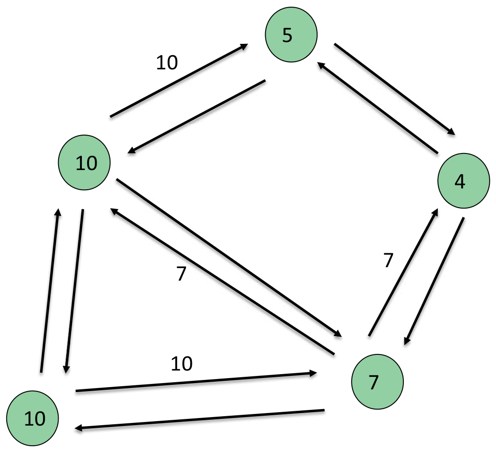

> [原图说明] 原页附图（p41）：Max 传播推进。此图将在统一裁剪阶段作为原图插回。

<!-- ===== PDF p42 ===== -->

**Max 系统（Max System）**

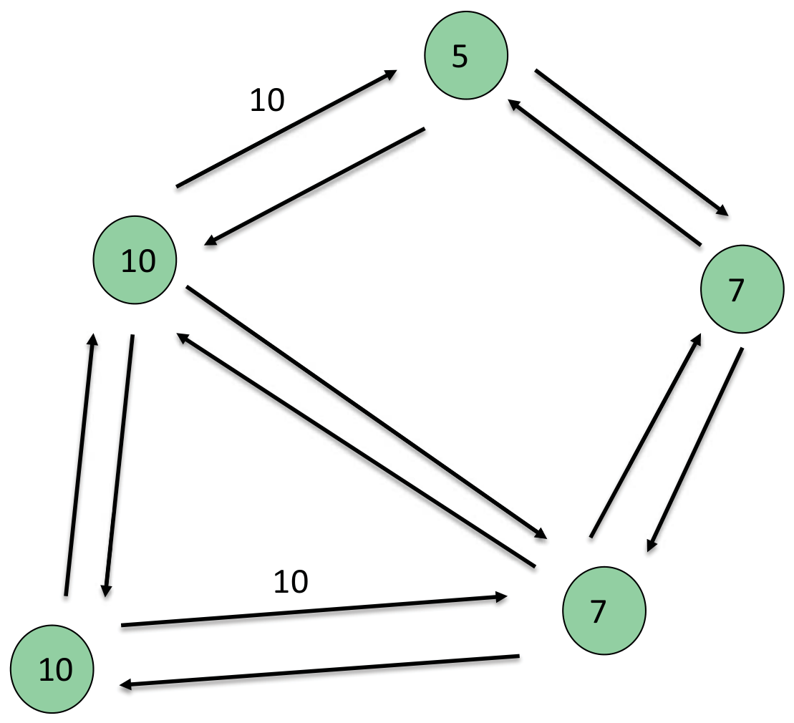

> [原图说明] 原页附图（p42）：Max 传播推进。此图将在统一裁剪阶段作为原图插回。

<!-- ===== PDF p43 ===== -->

**Max 系统（Max System）**

> [原图说明] 原页附图（p43）：Max 传播推进。此图将在统一裁剪阶段作为原图插回。

<!-- ===== PDF p44 ===== -->

**Max 系统（Max System）**

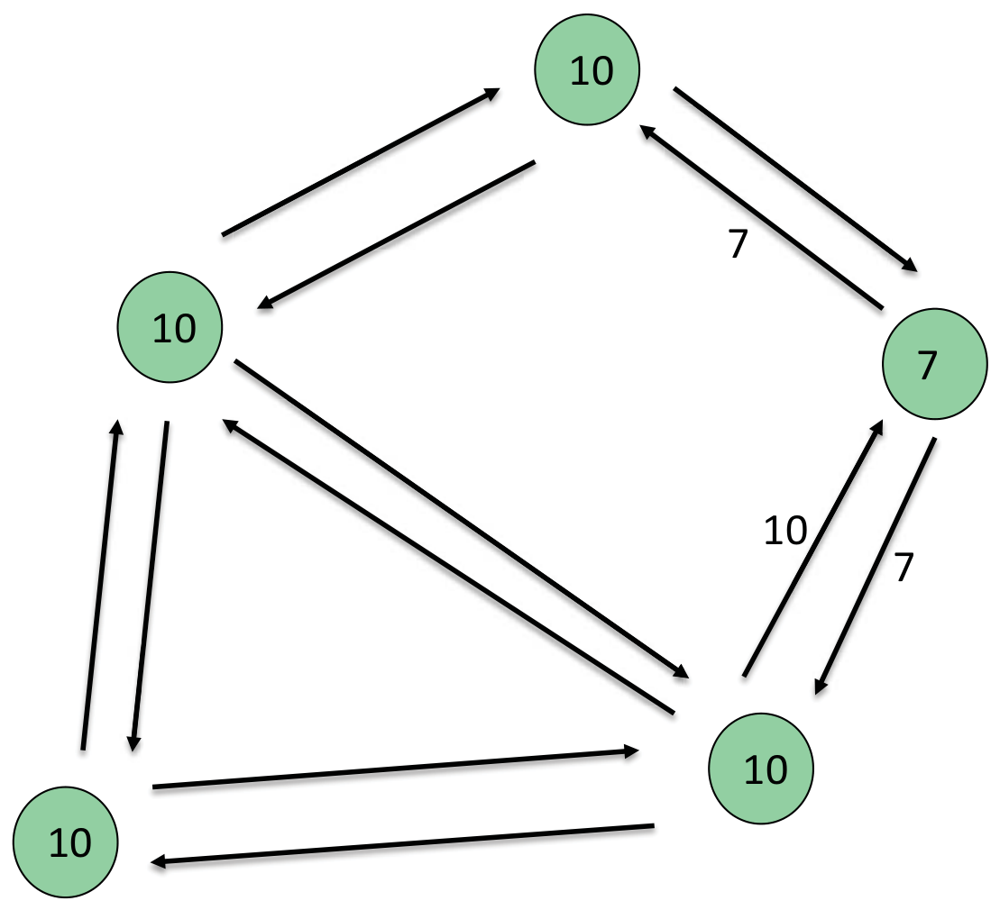

> [原图说明] 原页附图（p44）：Max 传播推进。此图将在统一裁剪阶段作为原图插回。

<!-- ===== PDF p45 ===== -->

**Max 系统（Max System）**

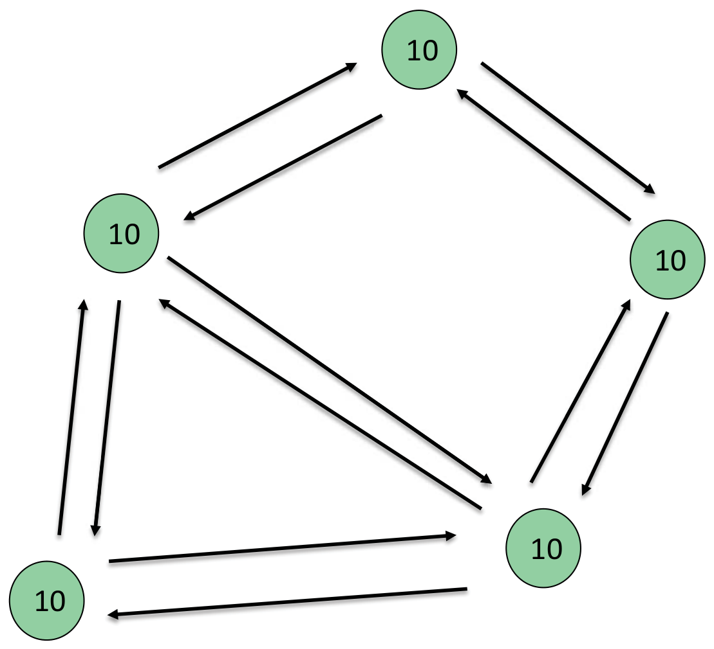

> [原图说明] 原页附图（p45）：Max 传播完成——所有节点收敛到全局最大值 10。此图将在统一裁剪阶段作为原图插回。

<!-- ===== PDF p46 ===== -->

**复杂度（Complexity）**

- **消息复杂度**：整个执行期间的消息总数 = **$O(n \cdot |E|)$**。
- **时间复杂度**：
  - **问（Q）**：应该量什么？
  - 不明显，因为各组件**以任意顺序**执行步骤——**没有「轮」**。
  - 一个常见方法：
    - 假设执行基本步骤的时间有**实时上界**：
      - $d$：信道投递下一条消息的时间
      - $l$：进程执行下一步的时间
  - 推断求解整体问题的**实时上界**。

> **[note] Note（译者注，异步复杂度度量）:** 异步系统没有「轮」，时间怎么量？Lynch 的答案：**给基本步骤假设实时上界**——信道投递消息至多 $d$、进程一步至多 $l$——然后推导整体实时上界。这套「**$d$/$l$ 模型**」是异步时间分析的行业标准（也见 Lynch 教材），它把「消息延迟」抽象成常数 $d$、「计算延迟」抽象成常数 $l$。直观上：$d$ 是「一跳消息的时延上界」，$l$ 是「本地计算的上界」。这样「$k$ 跳信息传播」就花「$k \cdot d$ 时间」，「$r$ 轮等价物」就能用 $d/l$ 表达成实时界。注意 $d$ 和 $l$ 只是**上界**（允许更快的实际执行），这保证推导出的上界对**所有**执行都成立。

<!-- ===== PDF p47 ===== -->

**复杂度（Complexity）**

- **时间复杂度**：假设 $d$（信道投递）与 $l$（进程一步）的上界，推断求解问题的实时上界。
- 对 **Max 系统**：
  - 忽略本地处理时间（$l = 0$），只考虑信道发送时间。
  - **朴素的（straightforward）上界：$O(\operatorname{diam} \cdot n \cdot d)$**
  - 考虑 max 沿图中一条最短路到达任意特定顶点 $u$ 的时间。
  - 最坏情况下，它要在路径上的每条信道里等待**所有其他值**，每条信道至多 $n \cdot d$ 时间。

> **[note] Note（译者注，$O(\operatorname{diam} \cdot n \cdot d)$ 的来由）:** Max 系统的上界 $O(\operatorname{diam} \cdot n \cdot d)$ 值得拆解：最大值沿一条最短路（至多 $\operatorname{diam}$ 跳）传播，**每跳**最坏要等「这条信道里可能堆积的所有消息」都先被投递——一条信道上可能堆积 $O(n)$ 条消息（每个节点至少贡献一条「自己的值」），每条投递至多 $d$ 时间，故每跳至多 $n \cdot d$，总计 $\operatorname{diam} \cdot n \cdot d$。这个「**每跳 × 每跳消息堆积 × 每消息时延**」的分解是异步时间分析的通用模板：**传播时间 = 跳数 × (堆积 × 单条时延)**。它比同步的「$\operatorname{diam}$ 轮」差一个 $n$ 因子——**异步的代价**，因为消息可能在信道里排队。你会在 p80-82 看到这个「堆积」因子如何失控成指数。

<!-- ===== PDF p48 ===== -->

**广度优先生成树（Breadth-First Spanning Trees）**

> [原图说明] 原页为章节分隔页（p48），仅标题「Breadth-First Spanning Trees」。

<!-- ===== PDF p49 ===== -->

**广度优先生成树（Breadth-First Spanning Trees）**

- **问题（Problem）**：在**异步网络**中计算一棵广度优先生成树。
- 连通图 $G = (V, E)$。
- 特殊根顶点 $v_a$。
- 进程对图没有知识。
- 进程有 UID：
  - $i_a$ 是根 $v_a$ 的 UID。
  - 进程知道邻居的 UID，知道哪个端口连到哪个邻居。
- 进程必须产生一棵以 $v_a$ 为根的 BFS 树。
- 每个进程 $i \ne i_a$ 应输出 parent $j$，表示 $j$ 的顶点是 $i$ 在 BFS 树中的父节点。

<!-- ===== PDF p50 ===== -->

**第一次尝试（First Attempt）**

- **直接把同步 BFS 算法异步地跑**。
- 进程 $i_a$ 发送 search 消息，每个人**第一次收到就转发**。
- 每个人都选**第一个**向它发送 search 消息的节点作为父节点。
- **非确定性**：
  - 进程决定中**不再有非确定性**（先到先得）。
  - 但出现了**大量新的非确定性**：消息投递顺序、进程步骤顺序。

> **[note] Note（译者注，「第一次尝试」的陷阱）:** 把同步算法异步跑是最自然的「偷懒」做法，但会掉进**异步的陷阱**：同步里「第 $r$ 轮到达 = 距离恰为 $r$」，异步里**没有轮计时**，一个「先到」的 search 消息可能走了**很长的路**（因为它沿着一条先被唤醒的路径快速传播），而真正最短路径上的消息可能还堵在信道里。于是「**先到先得**」会选出一个**非最短路**的父节点（p63 的异常 Anomaly 正式讨论）。这个教训是分布式的核心法则之一：**异步下「先到」不等于「最短」**，算法必须显式处理「迟到的更好消息」。对比之下，Max 系统为什么没事？因为 max 是「只增不减」的单调改进，迟到的大值仍会被采纳；而 BFS 的「先到先得」是**一次性决定**，无法挽回。

<!-- ===== PDF p51 ===== -->

**进程自动机 $P_u$（Process Automaton $P_u$）**

- **输入动作**：$\operatorname{receive}(\text{search})_{v,u}$
- **输出动作**：$\operatorname{send}(\text{search})_{u,v}$；$\operatorname{parent}(v)_u$
- **状态变量**：
  - `parent`：$r(u) \cup \{\bot\}$，初始 $\bot$
  - `reported`：布尔，初始 false
  - 对每个 $v \in r(u)$：
    - `send(v) ∈ {search, ⊥}`，初始：若 $u = v_a$ 则 search，否则 $\bot$
- **迁移**：
  - $\operatorname{receive}(\text{search})_{v,u}$：效果——若 $u \ne v_a$ 且 parent = $\bot$，则 parent := $v$，并对每个 $w$ 令 `send(w) := search`。

> **[note] Note（译者注，BFS 自动机的状态）:** 进程自动机把「先到先得」形式化：`parent` 初始 $\bot$（未定），第一次收到 search 就把它定为 parent（若 $u \ne v_a$），并把所有 `send(w)` 置 search（向所有邻居转发）。`send(v) = search` 表示「要向 $v$ 发一条 search 消息」（发完置 $\bot$ 防止重复）。注意**没有「重发」机制**——一旦选了父就不再改变，这正是「第一次尝试」的缺陷来源：它**忽略了迟到但更好的消息**（比如一条沿更短路径、但晚到的 search）。这个自动机的结构（输入/输出动作、状态变量、迁移）是 Lynch 模型的「组件蓝图」，读懂了它就能读懂后面所有自动机（p68、p77 的松弛版只是把「search + 先到先得」改成「带距离的松弛」）。

<!-- ===== PDF p52 ===== -->

**进程自动机 $P_u$（Process Automaton $P_u$）**

- **迁移**：
  - $\operatorname{receive}(\text{search})_{v,u}$：效果——若 $u \ne v_a$ 且 parent = $\bot$，则 parent := $v$，并对每个 $w$ 令 `send(w) := search`。
  - $\operatorname{send}(\text{search})_{u,v}$：前提——`send(v) = search`；效果——`send(v) := ⊥`。
  - $\operatorname{parent}(v)_u$：前提——parent = $v$ 且 `reported = false`；效果——`reported := true`。

<!-- ===== PDF p53 ===== -->

**异步运行简单 BFS（Running Simple BFS Asynchronously）**

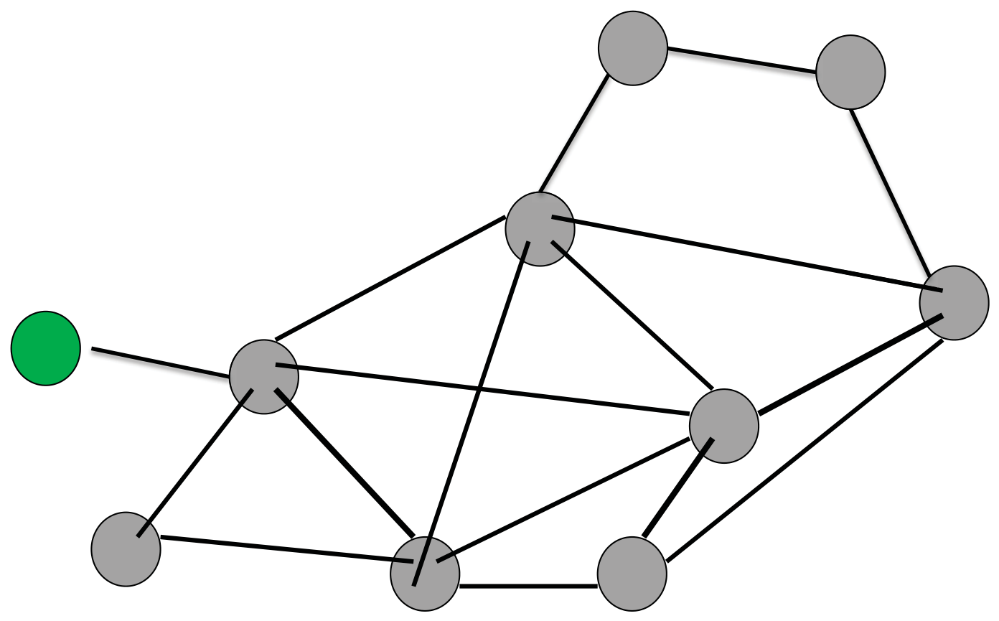

> [原图说明] 原页附图（p53）：异步运行简单 BFS 的起始。此图将在统一裁剪阶段作为原图插回。

<!-- ===== PDF p54 ===== -->

**异步运行简单 BFS（Running Simple BFS Asynchronously）**

> [原图说明] 原页附图（p54）：search 消息沿某条路径先传播。此图将在统一裁剪阶段作为原图插回。

<!-- ===== PDF p55 ===== -->

**异步运行简单 BFS（Running Simple BFS Asynchronously）**

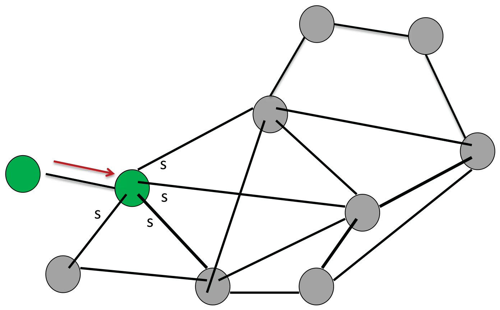

> [原图说明] 原页附图（p55）：search 沿长路径快速传播（s 标记）。此图将在统一裁剪阶段作为原图插回。

<!-- ===== PDF p56 ===== -->

**异步运行简单 BFS（Running Simple BFS Asynchronously）**

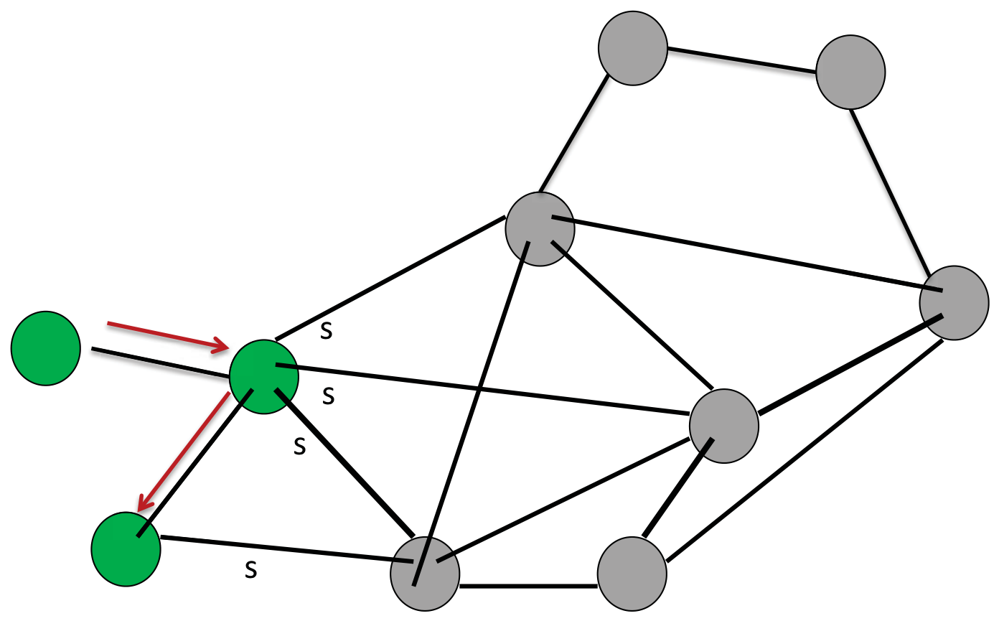

> [原图说明] 原页附图（p56）：更多节点沿长路径先被标记。此图将在统一裁剪阶段作为原图插回。

<!-- ===== PDF p57 ===== -->

**异步运行简单 BFS（Running Simple BFS Asynchronously）**

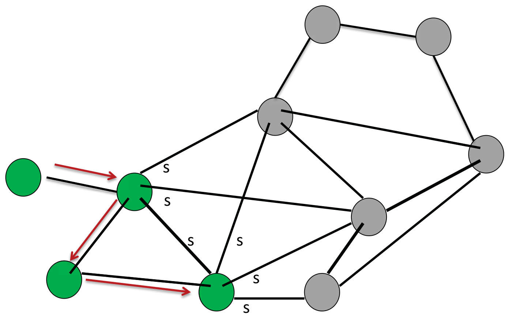

> [原图说明] 原页附图（p57）：长路径波前继续推进。此图将在统一裁剪阶段作为原图插回。

<!-- ===== PDF p58 ===== -->

**异步运行简单 BFS（Running Simple BFS Asynchronously）**

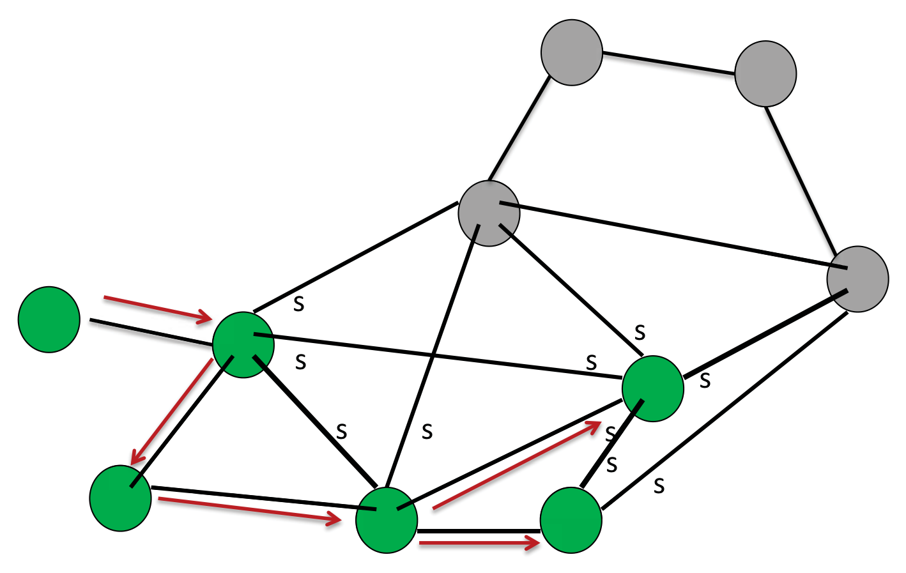

> [原图说明] 原页附图（p58）：大量节点被长路径标记。此图将在统一裁剪阶段作为原图插回。

<!-- ===== PDF p59 ===== -->

**异步运行简单 BFS（Running Simple BFS Asynchronously）**

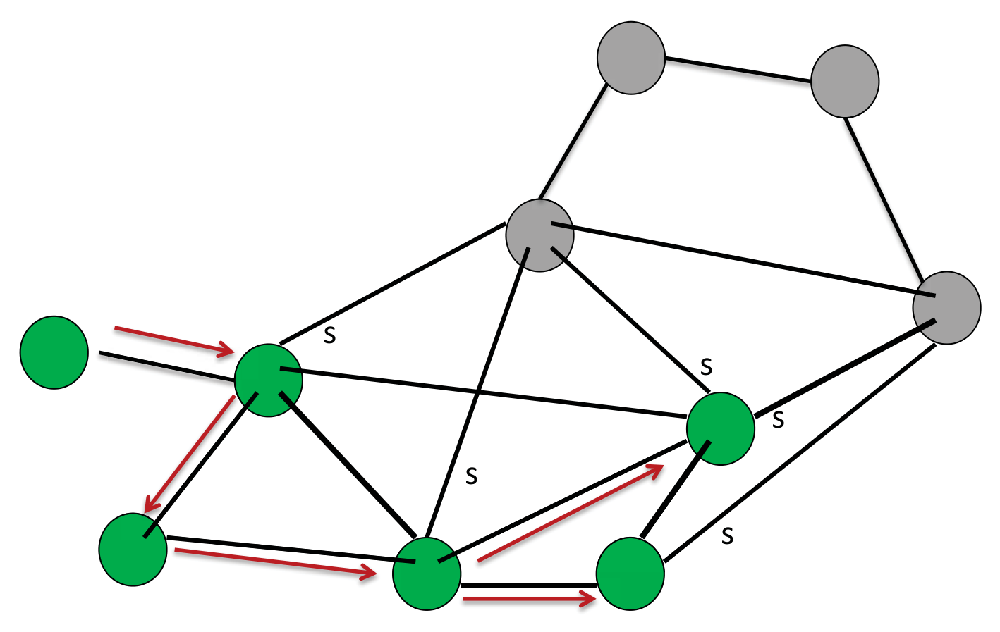

> [原图说明] 原页附图（p59）：短路径的消息此时才到达，但节点已被标记。此图将在统一裁剪阶段作为原图插回。

<!-- ===== PDF p60 ===== -->

**异步运行简单 BFS（Running Simple BFS Asynchronously）**

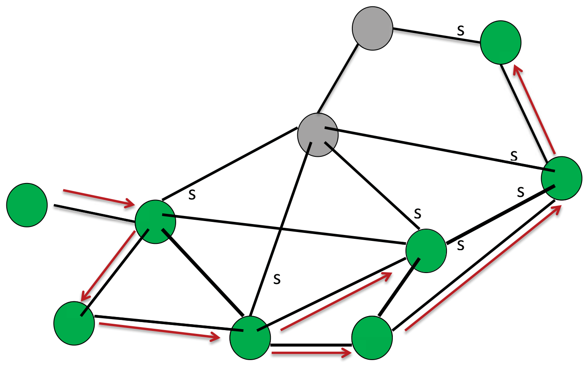

> [原图说明] 原页附图（p60）：最终全部节点被标记。此图将在统一裁剪阶段作为原图插回。

<!-- ===== PDF p61 ===== -->

**最终生成树（Final Spanning Tree）**

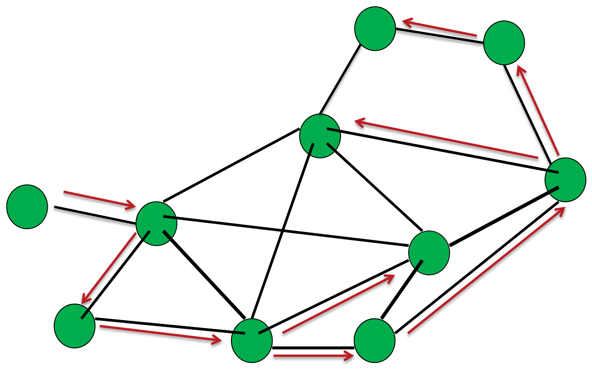

> [原图说明] 原页附图（p61）：第一次尝试产生的生成树（注意：可能不是 BFS 树）。此图将在统一裁剪阶段作为原图插回。

<!-- ===== PDF p62 ===== -->

**真实 BFS（Actual BFS）**

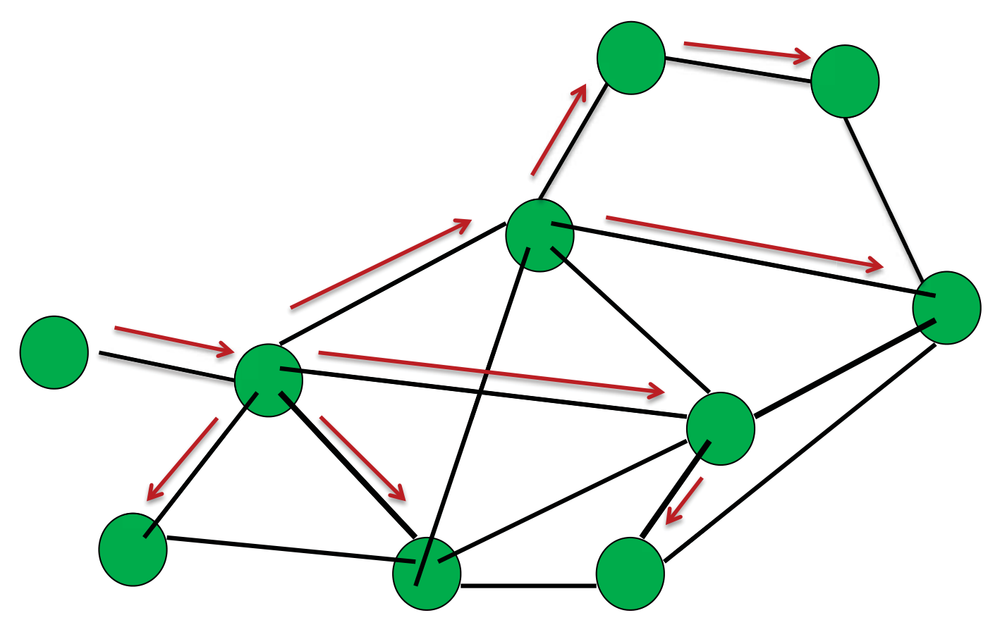

> [原图说明] 原页附图（p62）：对照真实 BFS 树（正确的按层结构）。此图将在统一裁剪阶段作为原图插回。

<!-- ===== PDF p63 ===== -->

**异常（Anomaly）**

- 算法产生的路径可能**比最短路径更长**。
- 因为在异步网络中，**消息可能沿更长的路径传播得更快**。

> **[note] Note（译者注，异步异常 Anomaly）:** 这个「异常」是理解异步 BFS 的核心：**长路径可以赢过短路径**。同步里「第 $r$ 轮 = 距离 $r$」的天然计时保证了波前按层推进；异步里没有这个计时，search 消息沿一条**长但畅通**的路径可以一路飞驰（每跳都不等），而沿**短但拥挤**的路径却要排队。于是「先到先得」选出长路径上的父节点，树的深度超过真实距离。注意这与图论事实无关（图里最短路径没变），纯粹是**异步执行顺序造成的偏差**。教训：**异步算法不能用「到达时间」作距离的代理**，必须显式传播并比较距离信息（这正是 p67 第二次尝试「松弛」要做的）。这个「先到 ≠ 最优」的原则，也在调度、路由等领域反复出现。

<!-- ===== PDF p64 ===== -->

**复杂度（Complexity）**

- **消息复杂度**：$O(|E|)$。
- **时间复杂度**：直到所有进程选好父节点的时间。
  - 忽略本地处理时间。
  - **$O(\operatorname{diam} \cdot d)$**
- **问（Q）**：既然有些路径更长，为什么是 $\operatorname{diam}$？
- **答**：一个节点收到 search 消息的时间**至多**等于沿最短路径传播所需的时间。

> **[note] Note（译者注，为什么时间仍是 $\operatorname{diam} \cdot d$）:** 这里有个精妙的论证：虽然**实际选出的路径**可能很长（异常），但**到达时间**的上界仍由**最短路径**决定——因为**对每条最短路径上的每条边，其消息转发是沿路径推进的**：根沿最短路第一跳的邻居至多 $d$ 时间收到、第二跳至多 $2d$、……第 $\operatorname{diam}$ 跳至多 $\operatorname{diam} \cdot d$。即使某个节点最终选了个长路径的父，它也**至多**等 $\operatorname{diam} \cdot d$ 就收到了**某条** search（沿最短路径的那条）。所以「最晚完成时间」由最短路径传播上界决定，而「**质量**」（树的深度）由实际选择决定——**时间上界与结构质量是两回事**，这正是本讲反复强调的区分。

<!-- ===== PDF p65 ===== -->

**扩展（Extensions）**

- **子指针**：与同步 BFS 一样——每个收到 search 的人发回 parent 或 nonparent 响应。
- **终止**：
  - 一个节点对其所有 search 消息都收到响应后，就知道谁是自己孩子、且它们都被标记。
  - 树的叶子知道自己是叶子。
  - 用汇播策略，如之前一样。
  - 时间复杂度：树完成后，done 信息传到 $i_a$ 需 $O(n \cdot d)$ 时间。
  - 消息复杂度：$O(n)$。

<!-- ===== PDF p66 ===== -->

**应用（Applications）**

- **消息广播**：进程 $i_a$ 用树（带子指针）广播消息。需 $O(n \cdot d)$ 时间和 $n$ 条消息。
- **全局计算**：每个进程以初始值开始，$i_a$ 确定所有进程值的某个函数。用树上的汇播。需 $O(n \cdot d)$ 时间和 $n$ 条消息。

<!-- ===== PDF p67 ===== -->

**第二次尝试（Second Attempt）**

- 一个**松弛算法**，像同步 Bellman-Ford。
- 之前（同步），我们**纠正了「多跳但低权」的路径**。
- 现在，我们转而**纠正异步造成的误差**。
- **策略（Strategy）**：
  - 每个进程**跟踪跳数距离**，当得知**更短路径**时**改变父节点**，并传播改进后的距离。
  - **最终稳定**到一棵广度优先生成树。

> **[note] Note（译者注，第二次尝试：用松弛对抗异步）:** 第二次尝试把「先到先得」改成「**松弛（relaxation）**」：每个进程维护到根的**跳数距离 dist**，收到消息若 $m+1 < \operatorname{dist}$ 则更新 dist、换父节点、并向所有邻居重播新距离。这直接修复了异常——即使先收到长路径的消息，后来沿短路径的「改进消息」仍能**推翻旧父、换新父**。与同步 Bellman-Ford 的对应：同步里松弛纠正「**多跳低权**」的路径（权距离），异步里松弛还要纠正「**先到但非最短**」的路径（跳数距离）——同一套松弛机制，修正两种不同的偏差。注意「**最终稳定**」：因为跳数距离只减不增（单调），改进次数有限，最终收敛到真实 BFS 树——这正是 p70 不变式与时序性质要证明的。

<!-- ===== PDF p68 ===== -->

**进程自动机 $P_u$（Process Automaton $P_u$）**

- **输入动作**：$\operatorname{receive}(m)_{v,u}$，$m$ 为非负整数
- **输出动作**：$\operatorname{send}(m)_{u,v}$，$m$ 为非负整数
- **状态变量**：
  - `parent`：$r(u) \cup \{\bot\}$，初始 $\bot$
  - `dist ∈ ℕ ∪ {∞}`：初始若 $u = v_a$ 则 0，否则 $\infty$
  - 对每个 $v \in r(u)$：`send(v)`，$\mathbb{N}$ 的 FIFO 队列，初始若 $u = v_a$ 则 (0)、否则空
- **迁移**：
  - $\operatorname{receive}(m)_{v,u}$：效果——若 $m + 1 < \operatorname{dist}$，则 $\operatorname{dist} := m+1$、parent := $v$、对每个 $w$ 把 $\operatorname{dist}$ 加入 `send(w)`。

> **[note] Note（译者注，松弛 BFS 自动机与消息队列）:** 与第一次尝试的关键差别：**(1)** `send(v)` 从「单值 search/⊥」升级为「**FIFO 队列**」——因为可能产生**多个不同版本的 dist** 要依次发送（改进一次就入队一个）；**(2)** 增加了 `dist` 变量（跳数距离）；**(3)** 收到消息是「若 $m+1 < \operatorname{dist}$ 则**更新并重播**」而非「先到先得」。`send(v)` 是 FIFO 队列保证了**消息按产生顺序发送**（信道 FIFO 再保证不重排），这避免了「新 dist 追过旧 dist」的乱序。**dist 只减不增**（单调性）是收敛的关键：每个节点的 dist 从 $\infty$ 一路下降到真实距离，改进次数有限（≤ $n$），最终稳定。

<!-- ===== PDF p69 ===== -->

**进程自动机 $P_u$（Process Automaton $P_u$）**

- **迁移**：
  - $\operatorname{receive}(m)_{v,u}$：效果——若 $m + 1 < \operatorname{dist}$，则 $\operatorname{dist} := m+1$、parent := $v$、对每个 $w$ 把 $m+1$ 加入 `send(w)`。
  - $\operatorname{send}(m)_{u,v}$：前提——$m = \operatorname{head}(\operatorname{send}(v))$；效果——移除队头。
  - **没有终止动作**……

> **[note] Note（译者注，「没有终止动作」的含义）:** 「没有终止动作」是个很妙的提示：**算法本身永不显式停机**——进程会持续执行 send/receive，只是**最终不再产生新的改进**（dist 稳定后，所有消息都是「$m+1 \ge \operatorname{dist}$」，被忽略、不再重播）。这就是「**自稳定（self-stabilizing）**」的雏形：算法不告诉任何人「我结束了」，只是**静默地不再改变**。要**检测**稳定（从而让进程知道自己可以输出最终答案），需要额外的终止机制（p72 的汇播）。这与你在讲次 18 看到的「终止判定」、以及分布式共识里「如何知道大家都达成一致」是同一类难题——**「安静」不等于「结束」，需要显式信号**。

<!-- ===== PDF p70 ===== -->

**正确性（Correctness）**

- 对同步 BFS，我们**精确刻画了 $r$ 轮后的情况**。
- **现在做不到**。
- 相反，陈述**抽象性质**，例如**不变式**与**时序性质**：
  - **不变式（Invariant）**：任意时刻，对任何节点 $u \ne v_a$，若其 $\operatorname{dist} \ne \infty$，则它是某条从 $v_a$ 到 $u$ 的路径上的**真实距离**，且其 parent 是这条路径上 $u$ 的前驱。
  - **时序性质（Timing property）**：对任何节点 $u$ 与任何 $r$（$0 < r < \operatorname{diam}$），若存在从 $v_a$ 到 $u$ 的至多 $r$ 跳路径，则**到 $r \cdot n \cdot d$ 时刻**，节点 $u$ 的 $\operatorname{dist} \le r$。

> **[note] Note（译者注，异步证明：不变式 + 时序性质）:** 这页是异步证明方法的范本。同步里「$r$ 轮后恰好……」（精确刻画）；异步里改为**两类抽象性质**：**(1) 不变式**——「dist 非 ∞ 时必是某真实路径的距离、parent 合法」（钉住「正确性」：dist 从不说谎）；**(2) 时序性质**——「$r$ 跳路径的节点到 $r \cdot n \cdot d$ 时刻必已有 dist ≤ r」（钉住「进展」：dist 不会拖到无限久）。合起来：**不变式保证「算出来的总是对的」，时序性质保证「对的迟早算出来」**——这就是异步算法正确性证明的标准二分。$r \cdot n \cdot d$ 里的 $n$ 因子来自「每条信道可能堆积 $n$ 条消息、每条至多 $d$ 时间」（p47 的堆积分析）。这套「**不变式（安全）+ 时序（活）**」的框架，与你在并发编程里学的「安全性与活性（safety/liveness）」一一对应。

<!-- ===== PDF p71 ===== -->

**复杂度（Complexity）**

- **消息复杂度**：$O(n \cdot |E|)$。
- **时间复杂度**：直到所有进程的 dist 与 parent 稳定。忽略本地处理时间。**$O(\operatorname{diam} \cdot n \cdot d)$**。
  - 每个节点沿最短路收到一条消息的时间，每条链路计 $O(n \cdot d)$ 时间。

> **[note] Note（译者注，松弛 BFS 复杂度 vs 第一次尝试）:** 对比两次尝试：第一次尝试（先到先得）消息 $O(|E|)$、时间 $O(\operatorname{diam} \cdot d)$，但**可能不是 BFS 树**；第二次尝试（松弛）消息 $O(n \cdot |E|)$、时间 $O(\operatorname{diam} \cdot n \cdot d)$，**保证是 BFS 树**。代价清晰：**用 $n$ 倍的消息/时间换取结构正确性**。多出来的消息来自「改进就重播」——每个节点可能改进多次（每次换父就广播）。这也再次印证 p47 的堆积分析：每跳最坏等 $O(n \cdot d)$（堆积 $O(n)$ 条消息 × 每条 $d$）。**「正确性要花钱」**是分布式算法设计的永恒权衡：想修复异步的异常，就得付出松弛重播的代价。

<!-- ===== PDF p72 ===== -->

**终止性（Termination）**

- **问（Q）**：进程如何知道树已完成？如何知道自己可以输出 dist 和 parent？
- 知道 $n$ 的界**在这里没用**：**不能用它数轮**（没有轮）。
- 可以用汇播，如同步 Bellman-Ford 那样：
  - 计算并**重算**子指针。
  - 进程 $i \ne v_a$ 在以下条件满足后向其**当前父节点**发送 done：
    - 它已收到所有消息的响应，所以**相信自己知道所有孩子**，且
    - 它已收到所有这些孩子的 done。
  - **同一进程可能多次参与**，基于改进后的估计。

> **[note] Note（译者注，异步终止更难）:** 注意「知道 $n$ 的界没用」——同步模型里可以「等 $n$ 轮」当作终止信号，但**异步没有轮**，等待无法映射到实时。所以终止只能靠**结构信号**：汇播（convergecast）——叶子确定「我无孩子」、逐层上传 done，根收到所有 done 即「整棵树完成」。但异步 + 松弛的组合让树**不断变化**（dist 改进会换父），所以子指针要**反复重算**、同一进程可能**多次**参与汇播（先以旧父参与、后来换父再参与一次）。这个「**动态树上的多轮汇播**」比同步难得多，也正是 p83 异步 Bellman-Ford 终止要再次强调的难点。

<!-- ===== PDF p73 ===== -->

**广度优先生成树的用途（Uses of Breadth-First Spanning Trees）**

- 与同步网络相同，例如：
  - 广播一系列消息
  - 全局函数计算
- 类似成本，但现在**把时间计成 $d$ 而不是一轮**。

<!-- ===== PDF p74 ===== -->

**最短路生成树（Shortest Paths Trees）**

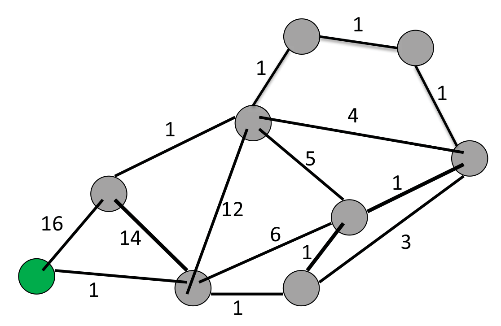

> [原图说明] 原页附图（p74）：最短路示例图（带权边，根 $v_o$）。此图将在统一裁剪阶段作为原图插回。

<!-- ===== PDF p75 ===== -->

**最短路（Shortest Paths）**

- **问题（Problem）**：在异步网络中计算一棵最短路生成树。
- 连通**加权**图，根顶点 $v_a$。边 $\{u, v\}$ 有权 $\operatorname{weight}(u, v)$。
- 进程对图没有知识，**只知道关联边的权**。
- 有 UID。
- 进程必须产生一棵以 $v_a$ 为根的最短路生成树。
- 每个进程 $u \ne v_a$ 应输出自己的距离和树中的父节点。

<!-- ===== PDF p76 ===== -->

**最短路（Shortest Paths）**

- 再次使用**松弛算法**。
- **异步 Bellman-Ford**。
- 现在，它处理**两类修正**：
  - 因为**长而低权**的路径（如同步 Bellman-Ford）。
  - 因为**异步**（如异步广度优先搜索）。
- 组合导致**出奇高的消息与时间复杂度**，比任何一类修正单独造成的都糟得多（**指数级**）。

> **[note] Note（译者注，两类修正叠加 = 指数灾难）:** 这是本讲的**高潮与警示**：异步 Bellman-Ford 要同时修正**两类**偏差——「多跳低权路径」（同步 Bellman-Ford 也修）与「异步导致的先到非最优」（异步 BFS 也修）。直觉上「两个修正加起来」似乎只是多花点消息，但**叠加会指数爆炸**：因为改进波可能**反复来回**——一个节点的 dist 因长路径改进、又因异步乱序改回、又因新路径再改进……每条信道上会堆积**指数多条**消息。这揭示了分布式算法的一个深层规律：**两个「温和」的困难来源叠加，可能产生指数级的复杂性**（类似实分析里「两个收敛序列的交互」）。Lynch 用 p80-82 的具体构造（$2^{n/2}$ 条消息）证明这个上界**真的可达**——不是空谈的松界。

<!-- ===== PDF p77 ===== -->

**异步 Bellman-Ford，进程 $P_u$（Asynch Bellman-Ford, Process $P_u$）**

- **输入动作**：$\operatorname{receive}(m)_{v,u}$，$m$ 为非负整数
- **输出动作**：$\operatorname{send}(m)_{u,v}$，$m$ 为非负整数
- **状态变量**：
  - `parent`：$r(u) \cup \{\bot\}$，初始 $\bot$
  - `dist ∈ ℕ ∪ {∞}`：初始若 $u = v_a$ 则 0，否则 $\infty$
  - 对每个 $v \in r(u)$：`send(v)`，$\mathbb{N}$ 的 FIFO 队列，初始若 $u = v_a$ 则 (0)、否则空
- **迁移**：
  - $\operatorname{receive}(m)_{v,u}$：效果——若 $m + \operatorname{weight}(v,u) < \operatorname{dist}$，则 $\operatorname{dist} := m + \operatorname{weight}(v,u)$、parent := $v$、对每个 $w$ 把 $\operatorname{dist}$ 加入 `send(w)`。

> **[note] Note（译者注，异步 Bellman-Ford 与 BFS 的唯一差别）:** 对比 p68 的异步 BFS 自动机：**唯一差别**是松弛条件从「$m+1 < \operatorname{dist}$」变成「$m + \operatorname{weight}(v,u) < \operatorname{dist}$」——跳数距离换成**权距离**。这个「只改一个数字」的优雅对照，说明 BFS 就是「所有边权为 1 的最短路」，Bellman-Ford 是它的带权推广（与你在 6.006 学的对应一致）。但**后果天差地别**：权可以悬殊（如边权 1 与 100），使「改进-回退-再改进」的振荡更频繁、更剧烈，消息堆积失控成指数。**一个数字之差，复杂度从多项式变指数**——这是分布式算法最生动的警示之一。

<!-- ===== PDF p78 ===== -->

**异步 Bellman-Ford，进程 $P_u$（Asynch Bellman-Ford, Process $P_u$）**

- **迁移**：
  - $\operatorname{receive}(m)_{v,u}$：效果——若 $m + \operatorname{weight}(v,u) < \operatorname{dist}$，则更新 dist、parent、入队重播。
  - $\operatorname{send}(m)_{u,v}$：前提——$m = \operatorname{head}(\operatorname{send}(v))$；效果——移除队头。
  - **没有终止动作**……

<!-- ===== PDF p79 ===== -->

**正确性：不变式与时序性质（Correctness: Invariants and Timing Properties）**

- **不变式（Invariant）**：任意时刻，对任何节点 $u \ne v_a$，若其 $\operatorname{dist} \ne \infty$，则它是某条从 $v_a$ 到 $u$ 的路径上的真实距离，且 parent 是该路径上前驱。
- **时序性质（Timing property）**：对任何节点 $u$ 与任何 $r$（$0 < r < \operatorname{diam}$），若 $p$ 是从 $v_a$ 到 $u$ 的任意至多 $r$ 跳路径，则到时刻 ???，节点 $u$ 的 dist $\le$ $p$ 的总权。
- **问（Q）**：??? 是什么？
- 它取决于**一条信道上可能堆积多少消息**。
- 这**可能很多**！

> **[note] Note（译者注，「???」与消息堆积的失控）:** 正确性证明的时序性质里出现「???」——这是**诚实的技术难点**：要给「$r$ 跳路径的 dist 何时必达」一个上界，必须知道「一条信道上可能堆积多少消息」，而异步 Bellman-Ford 里这个数**没有多项式上界**（改进波反复来回，可能堆积指数多条）。所以 **??? 是指数级**，时序性质依然成立（最终会到），但**进展保证以指数时间为代价**——这解释了为什么正确性没问题、复杂度却爆炸。这个「**正确但指数慢**」的现象是理论界的著名警钟：**别把「算法正确」等同于「算法实用」**。你会在 6.852 研究生课学到**同步器（synchronizers，Awerbuch 的 α/β/γ）**等更聪明的技术来驯服异步。

<!-- ===== PDF p80 ===== -->

**复杂度（Complexity）**

- 从 $v_0$ 到任何其他节点 $u$ 的**简单路径数**是 $O(n!)$，即 $O(n^n)$。
- 所以任何信道上发送的消息数是 **$O(n^n)$**。
- **消息复杂度**：$O(n^n \cdot |E|)$。
- **时间复杂度**：$O(n^n \cdot n \cdot d)$。
- **问（Q）**：这样的指数界真的能实现吗？

> [原图说明] 原页附图（p80）：用于证明指数界可达的示例图——$v_{-1}, v_0, v_1, \ldots, v_k, \ldots, v_{L-1}$ 链，边权为 $2^k, 2^{k-1}, \ldots, 2^0, 0$ 等。此图将在统一裁剪阶段作为原图插回。

> **[note] Note（译者注，$O(n!)$ 与 $O(n^n)$ 的来由）:** 指数上界从**路径计数**而来：从根到某节点最多有 $O(n!)$ 条**简单路径**（排列数），每条路径都可能让该节点的 dist「改进一次」（每条简单路径给出一个候选距离），而每次改进都会触发重播。于是任何信道上可能堆积的消息数被 $O(n!)$ 量级的「不同 dist 版本」撑爆，约等于 $O(n^n)$（用斯特林公式 $\log n! \approx n \log n$ 可得 $n! \approx (n/e)^n$，故 $O(n!)$ 是 $O(n^n)$ 的弱界）。这个论证把「**路径多样性**」与「**消息堆积**」直接挂钩——**图中路径越多，松弛的振荡越剧烈**。真正的「坏」不来自单条路径，而来自**指数多条路径的相互干扰**。

<!-- ===== PDF p81 ===== -->

**复杂度（Complexity）**

- **问（Q）**：这样的指数界真的能实现吗？
- **例（Example）**：
  - 存在下面网络的**一个执行**，其中节点 $v_k$ 向节点 $v_{k+1}$ 发送 **$2^k \approx 2^{n/2}$** 条消息。
  - **消息复杂度是 $O(2^{n/2})$**。
  - **时间复杂度是 $O(2^{n/2} \cdot d)$**。

> [原图说明] 原页附图（p81）：指数可达性示例链——$v_{-1} \to v_0 \to v_1 \to \cdots \to v_k \to \cdots \to v_{L-1}$，边权 $2^k, 2^{k-1}, \ldots, 2^0, 0$。此图将在统一裁剪阶段作为原图插回。

> **[note] Note（译者注，指数界可达性的直觉）:** 这个构造是「**权值递减的阶梯**」：路径上边的权 $2^k, 2^{k-1}, \ldots, 2^0, 0$ 递减，使得「从 $v_k$ 出发经过不同数量的高权/低权边」产生**指数多种不同的候选距离**。关键机制（p82 详述）：$v_k$ 的 dist 估计可以**按二进制倒序逐一经历** $2^k - 1, 2^k - 2, \ldots, 0$——先是上链的高权消息给出 $2^k-1$，然后一条迟到的低权消息把它降到 $2^k-2$，再一条更迟的把它降……每次「倒计一个二进制位」都触发一次重播，最终 $v_k$ 向 $v_{k+1}$ 发出 $2^k$ 条消息。这个「**二进制倒计时 = 指数多条消息**」的构造，把「边权悬殊 + 异步乱序」的叠加效应显式化了。

<!-- ===== PDF p82 ===== -->

**复杂度（Complexity）**

- 存在节点 $v_k$ 向 $v_{k+1}$ 发送 $2^k$ 条消息的执行。
- $v_k$ 可能的距离估计是 $2^k - 1, 2^k - 2, \ldots, 0$。
- 而且，$v_k$ 可以**按顺序经历所有这些估计**：
  - 首先，消息沿上链传播，给出 $2^k - 1$。
  - 然后最后一条下链消息到达 $v_k$，给出 $2^k - 2$。
  - 然后 $v_{k-2} \to v_{k-1}$ 的下链消息到达，把 $v_{k-1}$ 的估计减 2，$v_{k-1} \to v_k$ 的消息沿上链到达，给出 $2^k - 3$。
  - 依此类推。**按二进制倒计数**。
  - 若这发生得很快，就在信道 $e_{v_{k-1}, v_k}$ 里堆积 $2^k$ 条 search 消息。

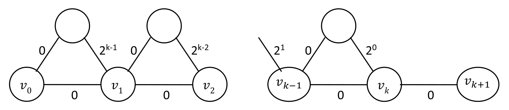

> [原图说明] 原页附图（p82）：二进制倒计时的消息路径示意（上链/下链交替）。此图将在统一裁剪阶段作为原图插回。

> **[note] Note（译者注，二进制倒计时的机制）:** 这个构造的精妙在「**上链下链交替、逐位倒计**」：$v_k$ 的 dist 先被上链（高权边）消息设为 $2^k-1$，随后一条**迟到的**下链（低权边）消息把它降到 $2^k-2$，再一条迟到的更下链消息把邻居减 2 后传上来给出 $2^k-3$……每个「降一个整数」都对应一次新的 dist 更新与重播。**为什么是二进制？**因为 $2^k$ 个不同的估计 $2^k-1, \ldots, 0$ 每个都可能被「用新路径重算」一次，而每次重算在路径传播的延迟窗口内又触发新的改进——消息在信道上**堆叠（pileup）**成 $2^k$ 条。这个「**改进波在传播延迟内反复追上自己**」的现象，是异步+权值悬殊导致指数复杂度的本质机制。

<!-- ===== PDF p83 ===== -->

**终止性（Termination）**

- **问（Q）**：进程如何知道树已完成？如何知道自己可以输出 dist 和 parent？
- **又是汇播（Convergecast, once again）**：
  - 计算并**重算**子指针。
  - 进程 $i \ne v_a$ 在「已收到所有消息响应（相信自己知道所有孩子）」且「已收到所有孩子 done」后，向其**当前父节点**发送 done。
  - **同一进程可能多次（很多次）参与**，基于改进后的估计。

> **[note] Note（译者注，指数次汇播）:** 异步 Bellman-Ford 的终止汇播与 p72 的异步 BFS 相同，但**参与次数可以是指数级**——因为 dist 可能改进指数多次（p81-82 的构造），每次改进都让进程「换父」并**重新参与一轮汇播**（先向旧父确认「我不再是你孩子」、再向新父发起 done 流程）。所以「终止本身」也可能花指数时间。这引出了 p84 的**道德（moral）**：**不加约束的异步会出问题**——算法的正确性保住了，但效率被异步的自由度彻底摧毁。这为下一讲的「同步器（synchronizer）」等驯服异步的技术埋下伏笔（Awerbuch 的同步器把异步算法「模拟」成同步执行，恢复可控的复杂度）。

<!-- ===== PDF p84 ===== -->

**最短路（Shortest Paths）**

- **道德（Moral）**：**不加约束的异步可能引发问题**。
- **怎么办（What to do）**？
- **去 6.852/18.437 分布式算法课找答案！**

> **[note] Note（译者注，本讲道德）:** 本讲以一句「道德」收束异步部分的主题：**不加约束的异步 = 指数级灾难**。三条主线呼应：**① 先到先得**的异步 BFS 产生非最短路树（质量错）；**② 松弛**的异步 BFS 修复质量但消息×$n$（代价高）；**③ 异步 Bellman-Ford** 叠加两类修正直接指数爆炸（代价失控）。「怎么办」的完整答案在研究生课程 6.852：**同步器（synchronizers，Awerbuch 1985 的 α/β/γ）**把异步系统「模拟」成同步轮次（用「消息到达即进入下一轮」的握手把乱序重新对齐）、**逻辑时间（logical time，Lamport 时钟）**给事件一个一致的全局顺序、**全局快照（global snapshot）**在无全局时钟下拍出一致的系统状态——这些技术本质上都在**给异步注入结构**，把「自由」换回「可控」。

<!-- ===== PDF p85 ===== -->

**接下来是什么？（What's Next?）**

- **6.852/18.437 分布式算法（Distributed Algorithms）**
  - 基础研究生课程。
  - 覆盖同步、异步与时序型算法。
- **同步算法**：
  - 领导者选举
  - 构造各种生成树
  - 极大独立集与其他网络结构
  - 容错（Fault tolerance）
  - 容错共识、提交及相关问题

<!-- ===== PDF p86 ===== -->

**异步算法（Asynchronous Algorithms）**

- 异步网络模型
- 领导者选举、网络结构。
- **算法设计技术**：
  - 同步器（Synchronizers）
  - 逻辑时间（Logical time）
  - 全局快照、稳定性质检测（Global snapshots, stable property detection）。
- **异步共享内存模型**
  - 互斥、资源分配
- 容错
  - 容错共识及相关问题
- 原子数据对象、原子快照
- 模型之间的变换。
- **自稳定算法（Self-stabilizing algorithms）**

> **[note] Note（译者注，研究生课程预告）:** 这张幻灯片是 6.852 的大纲预告，与本讲内容直接咬合的几个主题值得记下：**同步器（synchronizers）**——本讲 p84 的「怎么办」答案，把异步模拟成同步；**逻辑时间（logical time）**——Lamport 时钟，为无全局时钟的事件定义一致的偏序（你在 CSAPP 学的「事件排序」在分布式里就靠它）；**全局快照（global snapshots）**——Chandy-Lamport 快照算法，在异步下拍出「一致的系统状态」（如一致检查点）；**自稳定（self-stabilizing）**——本讲「没有终止动作」的算法最终静默收敛，正是自稳定思想；**容错共识**——FLP 不可能性（异步下确定性容错共识不可能）是分布式理论最著名的负面结果。这些概念与你后续的分布式系统课程、以及大二上的网络课（CS144）都会交汇。

<!-- ===== PDF p87 ===== -->

**以及更多（And More）**

- **时序型算法（Timing-based algorithms）**
  - 模型
  - 重访某些问题
  - 新问题，如**时钟同步（clock synchronization）**。
- **更新的工作（也许）**：
  - 动态网络算法
  - 无线网络
  - **昆虫群落算法**与其他**生物分布式算法**

> **[note] Note（译者注，生物分布式算法）:** 结尾再次出现「生物分布式算法」——与讲次 19 的果蝇 SOP 细胞 MIS 呼应。**昆虫群落算法（insect colony algorithms）**（如蚁群、蜂群的觅食/分工）是「无中心协调下的全局智能」的天然例子：单个蚂蚁只做局部随机决策，整个蚁群却涌现出高效寻路——这正是分布式算法的生物版。Lynch 的团队（及其合作者）研究这类「自然分布式算法」，把它当作「分布式计算与生物学交叉」的前沿。这类「**局部规则 → 全局涌现**」的案例，与你方舟计划的跨学科连接（生物 × 算法）直接相关，也是「算法即自然法则」这一第一性原理的最佳注脚。

<!-- ===== PDF p88 ===== -->

**MIT OpenCourseWare**

http://ocw.mit.edu

**6.046J / 18.410J 算法设计与分析（Design and Analysis of Algorithms）**

Spring 2015（2015 春季学期）

有关引用这些材料的信息或我们的使用条款（Terms of Use），请访问：http://ocw.mit.edu/terms。
