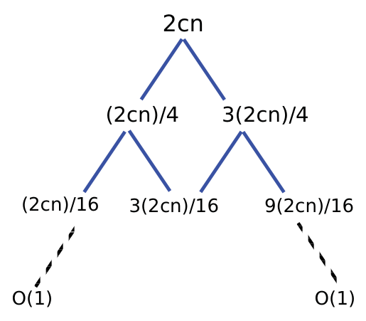

<!-- ===== PDF p1 ===== -->

<span style="color:#c0392b;">**讲次 6（Lecture 6）：随机化算法（Randomized Algorithms）**</span> <span style="color:#7f8c8d;">（Spring 2015，2015 春季学期）</span>

本讲大纲：
- 校验矩阵乘法（Check matrix multiplication）
- 快速排序（Quicksort）

<span style="color:#2471a3;">**[section]**</span> <span style="color:#00838f;">**随机化算法或概率算法（Randomized or Probabilistic Algorithms）**</span>

什么是随机化算法（randomized algorithm）？

- 生成一个随机数 $r \in \{1, \ldots, R\}$，并根据 $r$ 的值做出决策的算法。
- 对同样的输入、不同的执行（executions），随机化算法可能：
  - 运行不同的步数（Run a different number of steps）
  - 产生不同的输出（Produce a different output）

随机化算法可以大致分为两类——**Monte Carlo** 与 **Las Vegas**。

| Monte Carlo | Las Vegas |
|:---|:---|
| 总是多项式时间运行（runs in polynomial time always） | 期望多项式时间运行（runs in expected polynomial time） |
| 输出以高概率正确（output is correct with high probability） | 输出总是正确（output always correct） |

> <span style="color:#1e8449;">**[note] Note（译者注）:**</span> Monte Carlo 与 Las Vegas 的区分是本讲最需要记牢的概念骨架，用一句话概括：**Monte Carlo 是「时间确定、答案可能错」；Las Vegas 是「答案必对、时间可能慢（但期望受控）」**。前者是「赌答案」（如 Freivalds 算法：错误概率 $\le 1/2$，可迭代压低），后者是「赌时间」（如随机化快排：答案总是对的，只是偶尔慢）。两者的互补关系很妙：若你有一个「验证器」能检查 Monte Carlo 的输出是否正确，那么反复运行直到验证通过，就得到一个 Las Vegas 算法——把「错答案的风险」转化成「重复运行的时间」。Wiki 查证：这两个术语中 **Las Vegas 由 László Babai 于 1979 年在图同构（graph isomorphism）问题的背景下提出**，作为 Monte Carlo 的对偶；而 **「Monte Carlo」一词由 Nicholas Metropolis 于 1947 年引入**（源自摩纳哥赌场名）。本讲两个主角正好各占一类：Freivalds 校验是 Monte Carlo（答案可能错），随机化快排是 Las Vegas（答案必对）。

<span style="color:#2471a3;">**[section]**</span> <span style="color:#00838f;">**矩阵乘积（Matrix Product）**</span>

```math
C = A \times B
```

- 简单算法（Simple algorithm）：$O(n^3)$ 次乘法。
- **Strassen**：用 7 次乘法乘两个 $2 \times 2$ 矩阵：$O(n^{\log_2 7}) = O(n^{2.81})$
- **Coppersmith-Winograd**：$O(n^{2.376})$

> <span style="color:#1e8449;">**[note] Note（译者注）:**</span> 这里的矩阵乘法复杂度谱系值得记住：朴素 $O(n^3)$ → Strassen $O(n^{2.81})$（1969，用 7 次而非 8 次乘法乘 $2\times 2$ 块）→ Coppersmith-Winograd $O(n^{2.376})$（1987/1990）→ 后续用张量方法（tensor methods）持续改进：$O(n^{2.3728596})$（2021 年 Alman–Williams）→ 约 $O(n^{2.371})$（2024–2026 年间的最新记录，仍在缓慢下降）。这条曲线你会在 18.065/Strang 里看到它的线性代数侧面（张量分解 tensor decomposition），但本讲的重点不是「更快地算矩阵乘法」，而是「**更省地验证**矩阵乘法是否算对」——这正是下一页 Freivalds 算法的用武之地：**验证可能比计算容易得多**。这个「验证容易、求解难」的落差，与讲次 1 里 NP 中「验证容易」的思想一脉相承。

---

<!-- ===== PDF p2 ===== -->

<span style="color:#c0392b;">**矩阵乘积校验器（Matrix Product Checker）**</span>

给定 $n \times n$ 矩阵 $A, B, C$，目标是检查 $A \times B = C$ 是否成立。

**问题（Question）**：我们能做得比完整执行乘法更好吗？

我们将看到一个 $O(n^2)$ 的算法，它满足：
- 若 $A \times B = C$，则 $\Pr[\text{output} = \text{YES}] = 1$。
- 若 $A \times B \ne C$，则 $\Pr[\text{output} = \text{YES}] \le \frac{1}{2}$。

我们将假设矩阵中的元素属于 $\{0, 1\}$，且算术在 **mod 2** 下进行。

<span style="color:#2471a3;">**[section]**</span> <span style="color:#00838f;">**Freivalds 算法（Freivalds' Algorithm）**</span>

选择一个随机二进制向量（random binary vector）$r[1 \ldots n]$，使得对 $i = 1, \ldots, n$ 独立地有 $\Pr[r_i = 1] = \frac{1}{2}$。若 $A(Br) = Cr$，算法输出 **'YES'**；否则输出 **'NO'**。

**观察（Observation）**：该算法需要 $O(n^2)$ 时间，因为有 3 次「$n \times n$ 矩阵 × $n \times 1$ 矩阵」的乘法：$Br$、$A(Br)$ 与 $Cr$。

> <span style="color:#1e8449;">**[note] Note（译者注）:**</span> Freivalds 算法的核心是把「验证 $AB = C$」这个**矩阵级问题**投影（project）到**一个随机向量**上：先算 $Br$（$O(n^2)$），再算 $A(Br)$（$O(n^2)$），最后算 $Cr$（$O(n^2)$）——利用**结合律 $A(Br) = (AB)r$**，我们永远不用真正算出 $AB$。为什么是「投影」？因为 $AB = C$ 当且仅当对所有向量 $r$ 都有 $(AB)r = Cr$；随机选一个 $r$ 就是在高维空间里随机抽一个方向做检测。算法巧妙在**只算向量而不是矩阵**：本来 $O(n^3)$ 的矩阵乘法被替换成 3 次「矩阵×向量」（各 $O(n^2)$）。这个「**用随机投影替代全量计算**」的思想极其通用——你在之后的 Johnson-Lindenstrauss 引理、流式算法（streaming）、机器学习里的随机特征映射（random features）中都会反复遇到。Wiki 查证：这是拉脱维亚计算机科学家 Rūsiņš Mārtiņš Freivalds 提出的算法，是随机化算法课的经典第一课。

---

<span style="color:#2471a3;">**[section]**</span> <span style="color:#00838f;">**正确性分析（Analysis of Correctness if $AB \ne C$）**</span>

<span style="color:#2471a3;">**[claim]**</span> 声明（Claim）：若 $AB \ne C$，则 $\Pr[ABr = Cr] \ge \frac{1}{2}$。

设 $D = AB - C$。我们的假设是 $D \ne 0$。显然，存在某个 $r$ 使得 $Dr \ne 0$。

我们的目标是证明**存在很多 $r$ 使得 $Dr \ne 0$**。具体地，对随机选取的 $r$，$\Pr[Dr \ne 0] \ge \frac{1}{2}$。

$D = AB - C \ne 0 \Rightarrow \exists\ i, j$ 使得 $d_{ij} \ne 0$。固定向量 $v$：除了 $v_j = 1$ 外其余坐标全为 0。$(Dv)_i = d_{ij} \ne 0$，意味着 $Dv \ne 0$。取算法可能选出的任意 $r$。我们考虑 $Dr = 0$ 的情形。令 $r' = r + v$。

由于 $v$ 除 $v_j$ 外处处为 0，$r'$ 与 $r$ 相同，除了 $r'_j = (r_j + v_j) \bmod 2$。于是 $Dr' = D(r + v) = Dr + Dv = 0 + Dv \ne 0$。我们看到 $r$ 与 $r'$ 之间存在**一一对应**（1 to 1 correspondence）：若 $r + v = r'' + v$，则 $r = r''$。这意味着：

```math
\text{使 } Dr' \ne 0 \text{ 的 } r' \text{ 的个数} \ge \text{使 } Dr = 0 \text{ 的 } r \text{ 的个数}
```

由此我们得出结论：$\Pr[Dr \ne 0] \ge \frac{1}{2}$。

> <span style="color:#1e8449;">**[note] Note（译者注）:**</span> 这个「配对论证（pairing argument）」是随机化证明的经典模板，值得拆解成三步记忆：**① 定位**——既然 $D \ne 0$，必有某个非零元 $d_{ij}$，用它构造一个「探测向量」$v$（只在 $j$ 位为 1）；**② 配对**——对任意 $r$，构造 $r' = r + v$，使得 $Dr$ 与 $Dr'$ 不可能**同时**为零（因为 $Dr' = Dr + Dv$，而 $Dv \ne 0$）；**③ 计数**——「坏向量 $r$（使 $Dr = 0$）」与「好向量 $r'$（使 $Dr' \ne 0$）」一一配对，所以好向量至少和坏向量一样多，故 $\Pr[Dr \ne 0] \ge 1/2$。整个论证只用了一次「$Dv \ne 0$」的线性性质，就推出「**至多一半的 $r$ 会让错误逃逸**」。注意「mod 2」假设在此处的关键作用：$r_j + v_j \bmod 2$ 把「翻转一位」变成「配对操作」，而 $Dv \ne 0$ 用的是「$v$ 只在 $j$ 位为 1 时 $(Dv)_i = d_{ij}$」——这是你在 6.042J 学过的线性代数（矩阵×标准基向量 = 取列）的又一次应用。

---

<!-- ===== PDF p3 ===== -->

<span style="color:#c0392b;">**快速排序（Quicksort）**</span>

分治算法，但**主要工作在分解（divide）步骤**而不是合并（combine）步骤。

像插入排序（insertion sort）一样**原地（in place）排序**，而不同于归并排序（mergesort，它需要 $O(n)$ 辅助空间）。

不同的变体（variants）：
- **基本版（Basic）**：平均情形下表现良好
- **基于中位数的枢纽选取（Median-based pivoting）**：使用中位数查找
- **随机版（Random）**：对所有输入在期望意义下都良好（Las Vegas 算法）

**快速排序的步骤：**
- **Divide（分解）**：在 $A$ 中选一个枢纽元素（pivot element）$x$，把数组划分为子数组：$L$（所有 $< x$ 的元素）、$G$（所有 $> x$ 的元素）、$E$（所有 $= x$ 的元素）。
- **Conquer（征服）**：递归排序子数组 $L$ 和 $G$。
- **Combine（合并）**：平凡（trivial）。

**基本快速排序（Basic Quicksort）**

围绕 $x = A[1]$ 或 $A[n]$（第一个或最后一个元素）作为枢纽：
- 依次从 $A$ 中移除每个元素 $y$
- 根据与枢纽 $x$ 的比较，把 $y$ 插入 $L$、$E$ 或 $G$
- 每次插入与移除需要 $O(1)$ 时间
- 划分步骤需要 $O(n)$ 时间
- 原地实现的细节：见 CLRS p.171

> <span style="color:#1e8449;">**[note] Note（译者注）:**</span> 快速排序与归并排序的「重心」对比是本讲的第一个洞察：归并排序的合并步骤是重点（$O(n)$ 每层），而快速排序的**划分步骤**才是重点——一旦枢轴把数组分成 $L$（小于）与 $G$（大于）两部分，剩下的「合并」根本无事可做（左半边全小于右半边，天然有序拼接）。这也是为什么快速排序能**原地**运行：划分通过交换就地完成，不需要归并那种额外的 $O(n)$ 辅助数组。你在 6.006 学过快速排序，但这里引入了一个此前没有的视角——**随机化如何驯服快速排序的坏情形**。CLRS p.171 提到的原地划分（Lomuto/Hoare partition）是你在 CSAPP 里写过/见过的数组交换的经典应用。

---

<!-- ===== PDF p4 ===== -->

<span style="color:#c0392b;">**基本快速排序分析（Basic Quicksort Analysis）**</span>

若输入已排序或逆序排序，那么我们每次都在围绕最小或最大元素划分。这意味着 $L$ 或 $G$ 之一有 $n-1$ 个元素，另一个有 0 个。这给出：

```math
T(n) = T(0) + T(n-1) + \Theta(n) = \Theta(1) + T(n-1) + \Theta(n) = \Theta(n^2)
```

然而，该算法在**实际中的随机输入**上表现良好。

<span style="color:#2471a3;">**[section]**</span> <span style="color:#00838f;">**用中位数查找选择枢纽（Pivot Selection Using Median Finding）**</span>

可以用**秩/中位数选择算法**（rank/median selection algorithm，$\Theta(n)$ 时间）保证 $L$ 与 $G$ 平衡。下面的第一个 $\Theta(n)$ 用于枢纽选择，第二个用于划分步骤：

```math
T(n) = 2T\!\left(\frac{n}{2}\right) + \Theta(n) + \Theta(n) = \Theta(n \log n)
```

这个算法在实践中很慢（slow in practice），**输给归并排序**。

> <span style="color:#1e8449;">**[note] Note（译者注）:**</span> 中位数枢纽把递归变成完美的平衡分治 $T(n) = 2T(n/2) + \Theta(n)$，渐近上是 $O(n \log n)$ 且是**最坏情形**保证——但代价是每层都要调用一次 $O(n)$ 的中位数查找（讲次 2 的 median of medians），常数因子很大，实际反而输给归并排序。这个教训值得记住：**渐近复杂度相同的算法，常数因子可以天差地别**——「理论最优」不等于「实践最优」。这也是为什么实际库几乎都用「三点取中 + 插入排序兜底」的混合策略（如 C++ std::sort 的 introsort、Java 基本类型数组排序的 DualPivotQuicksort），而不是调用昂贵的中位数算法。你在 CSAPP 里学过的「常数因子也是复杂度的一部分」在这里具象化。

<span style="color:#2471a3;">**[section]**</span> <span style="color:#00838f;">**随机化快速排序（Randomized Quicksort）**</span>

$x$ 从数组 $A$ 中**随机**选择（每次递归时都做一次随机选择）。

对所有输入数组 $A$，**期望时间**为 $O(n \log n)$。该算法的分析见 CLRS p.181–184；我们将分析它的一种变体。

<span style="color:#2471a3;">**[section]**</span> <span style="color:#00838f;">**「偏执」快速排序（"Paranoid" Quicksort）**</span>

```
Repeat（重复）
    选择枢纽为 A 的随机元素
    执行划分 Partition
Until（直到）
    结果划分满足 |L| ≤ (3/4)|A| 且 |G| ≤ (3/4)|A|
Recurse on L and G（递归处理 L 和 G）
```

🎥 *Devadas 在视频中[解释「偏执」名字的由来]*："This quicksort is paranoid in the sense that it's going to be afraid of getting unbalanced partitions, and it's going to keep trying to get balanced partitions."（翻译：这个快速排序之所以「偏执」，是因为它害怕得到不平衡的划分，于是会不断重试直到获得平衡划分。）——算法不再接受任何划分结果，而是**坚持要求**两边都不超过 $\frac{3}{4}n$，否则重掷枢轴。

---

<!-- ===== PDF p5 ===== -->

<span style="color:#c0392b;">**「偏执」快速排序分析（"Paranoid" Quicksort Analysis）**</span>

让我们定义「好枢纽」（good pivot）与「坏枢纽」（bad pivot）：

- **好枢纽（Good pivot）**：$L$ 和 $G$ 的大小都 $\le \frac{3}{4}n$。
- **坏枢纽（Bad pivot）**：$L$ 或 $G$ 之一的大小 $> \frac{3}{4}n$（即有一边过大）。



> <span style="color:#7f8c8d;">[原图说明] 原页附图：把数组按枢纽位置分为 bad / good / bad 三段——左边 $\frac{n}{4}$ 与右边 $\frac{n}{4}$ 是「坏枢纽」位置（会导致某边 > 3n/4），中间 $\frac{n}{2}$ 是「好枢纽」位置。</span>

我们看到，一个枢纽是好的概率 $> \frac{1}{2}$。

设 $T(n)$ 是对任意规模为 $n$ 的数组的**期望运行时间上界**。$T(n)$ 由以下部分组成：
- 排序左子数组所需时间
- 排序右子数组所需时间
- 获得一次好调用（good call）所需的迭代次数。把划分步骤的成本记为 $c \cdot n$。

**期望（Expectations）**

```math
T(n) \le \max_{\frac{n}{4} \le i \le \frac{3n}{4}} \left( T(i) + T(n - i) \right) + E(\#\text{iterations}) \cdot cn
```

现在，由于好枢纽的概率 $> \frac{1}{2}$，有 $E(\#\text{iterations}) \le 2$。

> <span style="color:#7f8c8d;">[原图说明] 原页附图：期望代价的树状示意——根层 $2cn$，好枢纽概率 $>1/2$ 使下一层出现 $2cn/4$ 与 $3(2cn)/4$ 等分支，逐层递推，最终 $O(1)$。图注列出各层分支的期望代价。</span>

> <span style="color:#1e8449;">**[note] Note（译者注）:**</span> 「偏执」快速排序的分析核心是两个漂亮的概率事实：**① 好枢纽概率 > 1/2**——从数轴看，$\frac{n}{4}$ 到 $\frac{3n}{4}$ 之间的位置构成「好」区段，占比恰好 $\frac{1}{2}$，且因为 $\le \frac{3n}{4}$ 是「至多」，所以严格来说好概率 $\ge 1/2$（含端点），讲义写 $> 1/2$ 是保守估计；**② 几何重试**——每次尝试是好枢纽的概率 $> 1/2$，所以期望重试次数 $E[\#\text{iterations}] \le 2$（几何分布期望 $1/p < 2$）。这个「**用重试把坏情形过滤掉，期望代价是几何级数**」的模板，就是后面跳表（skip list，讲次 7）随机层数、以及各类「随机化再试」算法的共同骨架。注意它把「单次最坏」变成「期望受控」：任何一次枢纽选择仍可能极差（概率指数小），但期望上每次划分都会把问题缩小到 $\le \frac{3}{4}n$。

---

<!-- ===== PDF p6 ===== -->

<span style="color:#c0392b;">**「偏执」快速排序分析（续）**</span>

```math
T(n) \le T\!\left(\frac{n}{4}\right) + T\!\left(\frac{3n}{4}\right) + 2cn
```

我们在图中看到：无论沿哪条分支走到底，树的高度至多为 $\log_{\frac{4}{3}}(2cn)$。在每一层，我们总共做 $2cn$ 的工作。因此，期望运行时间为 $T(n) = \Theta(n \log n)$。

> <span style="color:#1e8449;">**[note] Note（译者注）:**</span> 收尾的递推 $T(n) \le T(n/4) + T(3n/4) + 2cn$ 是**非对称分治**的典型——两边规模之和是 $n$，但最深的「最长路径」每层乘以 $\frac{3}{4}$（不是 $\frac{1}{2}$），所以树高是 $\log_{4/3} n$ 而不是 $\log_2 n$。关键结论：**即使分治不平衡，只要两边有「固定分数」的削减（$\frac{3}{4}n$ 而非 $n-1$），总代价仍是 $O(n \log n)$**——只是对数底变了（$\log_{4/3} n$ vs $\log_2 n$），常数稍大但渐近相同。这与基本快速排序 $T(n) = T(n-1) + \Theta(n) = \Theta(n^2)$ 形成鲜明对照：**「减法式」退化（每层只减少 1）导致平方，而「乘法式」缩减（每层乘以分数）保持对数**。这个「减法 vs 乘法」的分水岭，是你在 6.006 的欧几里得算法（减法版 vs 取模版）、以及二分搜索（每次减半）里反复看到的母题。

---

<!-- ===== PDF p7 ===== -->

<span style="color:#7f8c8d;">**MIT OpenCourseWare**</span>

<span style="color:#7f8c8d;">http://ocw.mit.edu</span>

<span style="color:#7f8c8d;">**6.046J / 18.410J 算法设计与分析（Design and Analysis of Algorithms）**</span>

<span style="color:#7f8c8d;">Spring 2015（2015 春季学期）</span>

<span style="color:#7f8c8d;">有关引用这些材料的信息或我们的使用条款（Terms of Use），请访问：http://ocw.mit.edu/terms。</span>
