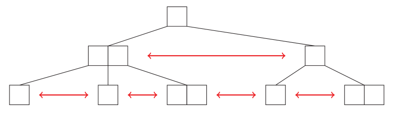

<!-- ===== PDF p1 ===== -->

<span style="color:#c0392b;">**讲次 9（Lecture 9）：数据结构增强（Augmentation）**</span> <span style="color:#7f8c8d;">（Spring 2015，2015 春季学期）</span>

本讲涵盖数据结构的**增强（augmentation）**，包括：
- 简单树增强（easy tree augmentation）
- 序统计树（order-statistics trees）
- 指搜索树（finger search trees），以及
- 范围树（range trees）

**核心思想**：修改「现成的」（off-the-shelf）常见数据结构，以存储（并更新）附加信息（additional information）。

🎥 *Devadas 在视频中[引入增强概念]*："We'll start out with a very simple one, which I call easy tree augmentation, which will include subtree size as a special case."（翻译：我们先从一个非常简单的开始，我称之为「简单树增强」，它会包含「子树大小」作为特例。）——本讲从最简单、最实用的增强（子树大小）出发，逐步走向更复杂的结构。

> <span style="color:#1e8449;">**[note] Note（译者注）:**</span> 「增强」是数据结构设计里最实用的通用技巧之一：**不从头设计新结构，而是在已有结构（AVL 树、2-3 树、B 树）的每个节点上多存一个字段**，让这个字段携带「子树信息」以支持新查询。本讲四个例子展示了增强的四个难度层次：简单增强（存子树大小）→ 序统计树（支持 rank/select）→ 指搜索树（支持从任意节点出发的快速搜索）→ 范围树（支持多维正交范围查询）。贯穿始终的设计问题只有一个：**新增的字段能否在 $O(1)$ 时间用孩子信息更新**？能，增强就是「免费的」；不能，就要付出额外代价。这与你 CSAPP 里「用空间换时间」的缓存思想一脉相承：多存一点信息，换来查询能力的质变。

---

<span style="color:#2471a3;">**[section]**</span> <span style="color:#00838f;">**简单树增强（Easy Tree Augmentation）**</span>

这里的目标是在每个节点 $x$ 存储 $x.f$，它是该节点的一个函数，即 $f($ 以 $x$ 为根的子树 $)$。假设 $x.f$ 可以由 $x$、孩子（children）以及 children.f **在 $O(1)$ 时间内**计算（更新）。那么，修改一个节点集合 $S$ 需要 $O(\#$ 的祖先数$)$ 时间来更新 $x.f$，因为我们需要沿树上行到根（walk up the tree to the root）。$O(\lg n)$ 更新的两个例子是：
- **AVL 树**：旋转（rotating）两个节点后，先更新新的底层节点，再更新新的顶层节点
- **2-3 树**：分裂（splitting）一个节点后，更新两个新节点
- 两种情况都要继续沿树上行更新

> <span style="color:#1e8449;">**[note] Note（译者注）:**</span> 简单树增强的核心约束是「**$O(1)$ 可组合**」：$f(\text{子树})$ 必须能由「节点自身的值 + 孩子各自的 $f$」在常数时间拼出来。为什么这能保证总代价 $O(\lg n)$？因为一次修改只影响「从修改点到根」路径上的 $O(\lg n)$ 个祖先，每个祖先的 $f$ 用孩子的 $f$ 重算只要 $O(1)$。这个「**沿祖先链传播更新**」的模式是树增强的通用骨架。旋转/分裂的处理细节值得注意：AVL 旋转会改变父子关系，必须先更新新子树底部的节点（它的孩子没变）、再更新新顶部节点；2-3 树分裂产生两个新节点也要先各自算好 $f$ 再上行——**顺序必须自底向上**，否则会用到过期的孩子信息。

---

<span style="color:#2471a3;">**[section]**</span> <span style="color:#00838f;">**序统计树（Order-Statistics Trees）（来自 6.006）**</span>

序统计树的目标是设计一个**抽象数据类型（ADT）接口**，支持以下操作：
- insert($x$)、delete($x$)、successor($x$)，
- **rank($x$)**：找 $x$ 在排序顺序中的索引，即 $< x$ 的元素个数，
- **select($i$)**：找 rank 为 $i$ 的元素。

> <span style="color:#1e8449;">**[note] Note（译者注）:**</span> rank 与 select 是「互为逆运算」的一对查询：rank 从**元素**到**序数**（它在排序列表里排第几），select 从**序数**到**元素**（第 $i$ 小的元素是谁）。它们在数据库（找第 $k$ 大）、统计（中位数 = select(⌊n/2⌋)）、以及本讲后续的指搜索树分析里都反复出现。你要对比讲次 2 的「median finding」：那里是**一次性**在数组里找第 $k$ 小（$O(n)$），而序统计树是**动态**地支持任意次 rank/select（$O(\lg n)$ 每次）——一静一动，复杂度来源完全不同。Wiki 查证：序统计树是「在平衡搜索树节点里存子树大小」的标准增强，select/rank 在最坏情形 $O(\log n)$。

---

<!-- ===== PDF p2 ===== -->

<span style="color:#c0392b">**序统计树（续）**</span>

我们可以用 AVL 树（或 2-3 树）上的简单树增强来实现上述 ADT，存储**子树大小（subtree size）**：$f($ 子树 $) = $ 其中的节点数。于是

```math
x.\mathrm{size} = 1 + \sum_{c \in x.\mathrm{children}} c.\mathrm{size}
```

作为对比，我们**不能**为每个节点存储 rank。因为 insert($-\infty$) 会改变**所有**节点的 rank。

**rank($x$)** 可以如下计算：
- 初始化 rank $= x.\mathrm{left}.\mathrm{size} + 1$（若下标从 0 开始则省略 $+1$ 项）
- 从 $x$ 沿树上行到根，每当做一次**左移**（$x \to x'$，即 $x$ 是 $x'$ 的右孩子、上移到 $x$ 左侧的祖先），rank $+$ $x'.\mathrm{left}.\mathrm{size} + 1$

**select($i$)** 可以如下实现：
- $x = $ root
- rank $= x.\mathrm{left}.\mathrm{size} + 1$
- 若 $i = $ rank：返回 $x$
- 若 $i < $ rank：$x = x.\mathrm{left}$
- 若 $i > $ rank：$x = x.\mathrm{right}$，$i -= $ rank

> <span style="color:#1e8449;">**[note] Note（译者注）:**</span> 为什么「不能给每个节点存 rank」？因为 rank 是**全局**属性：插入一个 $-\infty$（最小的键）会让所有其他节点的 rank 全部 +1——一次插入要改 $O(n)$ 个节点的字段，增强就退化了。而子树大小是**局部**属性：它只依赖孩子的子树大小，一次插入只影响 $O(\lg n)$ 个祖先。这个「**选对增强字段：局部可组合 vs 全局需传播**」的教训是本讲最重要的设计判断：增强字段必须满足「$O(1)$ 用孩子信息更新」的局部性。rank 的计算技巧值得记忆：**「上移到更小祖先时累加」**——从 $x$ 上行的过程中，每当 $x$ 是某个祖先 $x'$ 的**右孩子**（即上移到 $x$ 左侧的祖先 $x'$，说明 $x'$ 及其左子树都 $\le x$），就把「$x'$ 的左子树大小 + 1」累加上去；最终得到「严格小于 $x$ 的元素数 + 1」= rank。这与你在 6.042J 学过的「树遍历的计数器」思想一致。

---

<span style="color:#2471a3;">**[section]**</span> <span style="color:#00838f;">**指搜索树（Finger Search Trees）**</span>

**指搜索树** [Brown and Tarjan, 1980] 的目标是：若我们已经有了节点 $y$，希望在 $O(\lg |\mathrm{rank}(y) - \mathrm{rank}(x)|)$ 时间内**从 $y$ 出发**搜索 $x$。直觉上，我们希望：若已经有一个**靠近 $x$** 的节点 $y$，那么对 $x$ 的搜索应该很快。

一个想法是使用**层链接的 2-3 树（level-linked 2-3 trees）**，其中每个节点有指向**同层下一个节点**和**同层上一个节点**的指针。

> <span style="color:#7f8c8d;">[说明] 原文脚注 1、2：若下标从 0 开始，则省略 rank 计算中的 $+1$ 项。</span>

> <span style="color:#1e8449;">**[note] Note（译者注）:**</span> 指搜索树重新审视了「搜索从哪开始」这个被默认忽略的假设：普通平衡树的搜索**总从根开始**，成本 $O(\lg n)$ 与目标位置无关；但实际应用中你常常「已经知道一个邻近元素」（如数据库游标、编辑器光标、数据流中刚访问过的键），这时从那个已知节点出发搜索会快得多。复杂度 $O(\lg |\mathrm{rank}(y) - \mathrm{rank}(x)|)$ 的精妙在于：**把「距离」从『到根的距离』换成『rank 差（元素个数差）』**——$x$ 离 $y$ 越近，搜索越快。这正是「手指（finger）」的比喻：你有一只手指放在 $y$ 上，在它附近的搜索都很快。Wiki 查证：指搜索树由 Guibas et al. 在 B 树基础上提出，本讲的「层链接 2-3 树」对应 Huddleston-Mehlhorn 的 level-linked B-tree 变体。

---

<!-- ===== PDF p3 ===== -->

<span style="color:#c0392b">**指搜索树（续）**</span>

层链接（level links）可以在分裂（split）与合并（merge）时维护。

我们在**叶子**中存储所有键。非叶子节点不存储键；相反，它们通过简单树增强存储子树的**最小与最大键**。

那么，原本的**自顶向下 search($x$)**（不给 $y$）可以如下实现：
- 从根开始，看每个孩子 $c_i$ 的 min 与 max
- 若 $c_i.\mathrm{min} \le x \le c_i.\mathrm{max}$，下到 $c_i$
- 若 $c_i.\mathrm{max} \le x \le c_{i+1}.\mathrm{min}$，返回 $c_i.\mathrm{max}$（作为前驱 predecessor）或 $c_{i+1}.\mathrm{min}$（作为后继 successor）

**从 $y$ 出发的 search($x$)** 可以如下实现。把 $v$ 初始化为包含 $y$ 的叶子节点（给定），然后循环：
- 若 $v.\mathrm{min} \le x \le v.\mathrm{max}$（说明 $x$ 在以 $v$ 为根的子树内），对 $x$ 做自顶向下搜索并返回
- 否则若 $x < v.\mathrm{min}$：$v = v.\mathrm{prev}$（本层的前一个节点）
- 否则若 $x > v.\mathrm{max}$：$v = v.\mathrm{next}$（本层的后一个节点）
- $v = v.\mathrm{parent}$

**分析（Analysis）**：我们从叶子层出发，每次迭代上移 1 层。在第 $i$ 步，高度 $i$ 的层链接大约跳过 $c^i$ 个键（rank），其中 $c \in [2, 3]$。因此，若 $|\mathrm{rank}(y) - \mathrm{rank}(x)| = k$，我们将在 $O(\lg k)$ 步内到达包含 $x$ 的子树，随后的自顶向下搜索也是 $O(\lg k)$。



> <span style="color:#7f8c8d;">[原图说明] 原页附图：层链接 2-3 树在 split（分裂出 new）、merge（合并）、delete（删除）时的层链接维护示意。</span>

> <span style="color:#1e8449;">**[note] Note（译者注）:**</span> 从 $y$ 出发搜索的正确性依赖一个巧妙的几何事实：**从叶子 $y$ 向上爬时，每层跨度按因子 $c \in [2,3]$ 增长**。第 $i$ 层的层链接跳过约 $c^i$ 个键——这是因为 2-3 树的每个内部节点有 2 或 3 个孩子，向上走一层，覆盖的叶子范围扩大 2–3 倍。若目标 $x$ 与 $y$ 相距 $k$ 个 rank，则到「包含 $x$ 的祖先」需要向上爬 $\log_c k = O(\lg k)$ 层（因为 $c^{\text{层数}} \ge k$ 时该层的范围已覆盖 $x$）。这个「**每层跨度指数增长 → 层数对数于距离**」的论证，与二分查找、跳跃表（讲次 7）的「对数于范围」如出一辙——**几何级数再次成为复杂度分析的主角**。

---

<!-- ===== PDF p4 ===== -->

<span style="color:#c0392b">**正交范围搜索与范围树（Orthogonal Range Searching and Range Trees）**</span>

假设 $d$ 维空间中有 $n$ 个点。我们希望有一个数据结构支持这些点上的**范围查询（range query）**：找出给定**轴对齐盒子（axis-aligned box）**内的所有点。轴对齐盒子在 1D 是区间（interval）、在 2D 是矩形（rectangle）、在 3D 是立方体（cube）。

更精确地，每个点 $x_i$（$i$ 从 1 到 $n$）是 $d$ 维向量 $x_i = (x_{i1}, x_{i2}, \ldots, x_{id})$。**Range-query($a$, $b$)** 接受两个点 $a = (a_1, a_2, \ldots, a_d)$ 与 $b = (b_1, b_2, \ldots, b_d)$，应返回一个索引集合 $\{i \mid \forall j,\ a_j \le x_{ij} \le b_j\}$。

**1D 情形（1D case）**：我们从 1D 点的简单情形开始，即所有 $x_i$ 与 $a$、$b$ 都是标量。那么，我们可以直接用**排序数组**（sorted array）。要执行 Range-query($a$, $b$)，只需分别对 $a$ 和 $b$ 做**两次二分搜索**，然后返回中间的所有点（设有 $k$ 个）。复杂度为 $O(\lg n + k)$。

排序数组对插入与删除效率低。对于支持范围查询的**动态**数据结构，我们可以用上一节的**指搜索树**。指搜索树支持高效的插入与删除。要执行 Range-query($a$, $b$)，先搜索 $a$，然后**不断做「向右 1 位」的指搜索**，直到超过 $b$。每次「向右 1 位」的指搜索需 $O(1)$，所以总复杂度也是 $O(\lg n + k)$。

然而，上述两种方法**都不能推广到高维**。这就是我们现在引入范围树的原因。

> <span style="color:#1e8449;">**[note] Note（译者注）:**</span> 1D 范围查询的两个 $O(\lg n + k)$ 方案各有取舍：排序数组**静态**高效（二分 + 顺序扫描），但不能插入删除；指搜索树**动态**高效（每次「向右 1 位」$O(1)$，因为相邻元素 rank 差 1），但实现复杂。关键观察是「**输出敏感（output-sensitive）**」：复杂度里必须带上 $k$（实际返回的点数），因为仅「报告 $k$ 个点」就至少需要 $O(k)$ 时间。这也解释了为什么范围查询的复杂度都是 $O(\text{查询} + k)$ 的形式——**$k$ 项是不可避免的输出代价**。「两种方法都无法推广到高维」的深层原因：1D 的「排序」建立的是**全序**（total order），而高维点只有**偏序**——「$a \le x \le b$」是每一维同时成立的与（AND），不能靠单一排序一次搞定。这引出了下页的范围树：用**分层**把多维查询分解成一维查询的组合。

---

<!-- ===== PDF p5 ===== -->

<span style="color:#c0392b">**1D 范围树（1D range trees）**</span>

1D 范围树是一棵**完全二叉搜索树**（complete binary search tree；动态情形用 AVL 树）。

**Range-query($a$, $b$)** 可以如下实现：
- search($a$)
- search($b$)
- 找到 $a$ 与 $b$ 的**最近公共祖先（least common ancestor, LCA）** $v_{\mathrm{split}}$
- 返回「中间」（in between）的节点与子树。有 $O(\lg n)$ 个节点与 $O(\lg n)$ 棵子树「在中间」。

**分析（Analysis）**：$O(\lg n)$ 隐式表示答案；$O(\lg n + k)$ 输出全部 $k$ 个答案；$O(\lg n)$ 通过子树大小增强报告 $k$。

> <span style="color:#7f8c8d;">[图 1 说明] 原页 Figure 1：1D 范围树。Range-query(a, b) 返回所有空心节点与阴影子树。图片来自 Wikipedia http://en.wikipedia.org/wiki/Range_tree。</span>

> <span style="color:#1e8449;">**[note] Note（译者注）:**</span> 1D 范围树的「$v_{\mathrm{split}}$ + 中间子树」技巧值得细品：在 BST 中搜索 $a$ 与 $b$ 的路径会在某个节点 $v_{\mathrm{split}}$ 分道扬镳——$a$ 向左、$b$ 向右（或反之）。**$[a, b]$ 区间内的所有元素，恰好是「$a$ 路径上所有右子树」与「$b$ 路径上所有左子树」的并集**，共 $O(\lg n)$ 棵子树 + $O(\lg n)$ 个单独节点。这个「用两棵子树并集表示区间」的分解，是把「连续区间」压缩成「$O(\lg n)$ 个不交子树」的经典手法——它让「报告 $k$ 个元素」不必逐个扫描，而是**先隐式定位 $O(\lg n)$ 棵子树、再对每棵子树输出**。这个「区间分解成对数个子树」的思想，是后面 2D/高维范围树、以及线段树（segment tree）的共同基石。

---

<span style="color:#c0392b">**2D 范围树（2D range trees）**</span>

2D 范围树由一棵**主 1D 范围树**与许多**次 1D 范围树**（secondary 1D range trees）组成。主范围树存储所有点，按**第一坐标**为键。主范围树中的每个节点 $v$ 把 $v$ 子树中的所有点存储在一棵**按第二坐标**为键的次范围树中。

**Range-query($a$, $b$)** 可以如下实现：
- 用主范围树找出所有「第一坐标在正确范围内」的点。只隐式表示答案，所以这需要 $O(\lg n)$。
- 对 $O(\lg n)$ 个**节点**，手动检查它们的第二坐标是否在正确范围内。
- 对 $O(\lg n)$ 棵**子树**，用它们的次范围树找出所有「第二坐标在正确范围内」的点。

**分析（Analysis）**：$O(\lg^2 n)$ 隐式表示答案，因为我们要在次范围树中找到 $O(\lg^2 n)$ 个节点与子树。$O(\lg^2 n + k)$ 输出全部 $k$ 个答案。$O(\lg^2 n)$ 通过子树大小增强报告 $k$。

**空间复杂度为 $O(n \lg n)$**：主子树是 $O(n)$。每个点在次子树中被复制至多 $O(\lg n)$ 次，每棵祖先一次。

> <span style="color:#1e8449;">**[note] Note（译者注）:**</span> 2D 范围树是「**用空间换查询时间**」的经典：主树在 $x$ 维做「区间分解」（$O(\lg n)$ 棵子树），对每棵被选中的子树，再在 $y$ 维用它的次树做「区间分解」（$O(\lg n)$）——**每层分解乘一次 $\lg n$，所以 2D 查询是 $\lg^2 n$**。空间 $O(n \lg n)$ 的来源值得注意：**每个点被复制到它所有祖先的次树里**——一个点在主树的每条祖先链上出现一次，链长 $O(\lg n)$，所以总复制 $O(n \lg n)$。这个「主树分维 + 次树滤维」的递归结构是范围树的精髓：**每一维对应一层树，$d$ 维就是 $d$ 层嵌套**，这也解释了为什么 $d$ 维查询是 $O(\lg^d n)$。这种「按维逐层处理」的思想在计算几何（computational geometry）的多维查询中反复出现，是你在后续课程可以留意的模式。

---

<!-- ===== PDF p6 ===== -->

<span style="color:#c0392b">**$d$ 维范围树（d-D range trees）**</span>

直接**递归**：主 1D 范围树 → 次 1D 范围树 → 三次 1D 范围树 → $\cdots$

**Range-query 复杂度**：$O(\lg^d n + k)$。
**空间复杂度**：$O(n \lg^{d-1} n)$。

**Chazelle 的改进结果**（见 6.851）：Range-query 复杂度 $O(\lg^{d-1} n + k)$，空间复杂度 $O\left(n \left(\frac{\lg n}{\lg \lg n}\right)^{d-1}\right)$。

> <span style="color:#1e8449;">**[note] Note（译者注）:**</span> $d$ 维范围树的推广是「逐维递归」的机械操作：每加一维就嵌套一层 1D 范围树，查询时间从 $\lg^d n$ 增长（每层一个 $\lg n$），空间从 $n \lg^{d-1} n$ 增长（每个点被复制到每维祖先的次树）。**Chazelle 1990 的改进**把查询从 $O(\lg^d n)$ 降到 $O(\lg^{d-1} n)$——少掉的那个 $\lg n$ 因子来自「在一维上用更精妙的结构替代朴素范围树」。Wiki 查证：范围树由 **Jon Louis Bentley 于 1979 年**发明（Lueker、Lee-Wong、Willard 独立发现）；**Chazelle 1990** 给出 $O(\lg^{d-1} n + k)$ 查询与 $O(n(\lg n/\lg\lg n)^{d-1})$ 空间。省对数因子的具体技术是**分数级联（fractional cascading）**——它是 6.851（高级数据结构）的核心主题之一，你在后续学习中可以留意**对数因子优化**（去一个 $\lg$ 或 $\lg\lg$）这条贯穿高级数据结构的分析主线。

---

<!-- ===== PDF p7 ===== -->

<span style="color:#7f8c8d;">**MIT OpenCourseWare**</span>

<span style="color:#7f8c8d;">http://ocw.mit.edu</span>

<span style="color:#7f8c8d;">**6.046J / 18.410J 算法设计与分析（Design and Analysis of Algorithms）**</span>

<span style="color:#7f8c8d;">Spring 2015（2015 春季学期）</span>

<span style="color:#7f8c8d;">有关引用这些材料的信息或我们的使用条款（Terms of Use），请访问：http://ocw.mit.edu/terms。</span>
