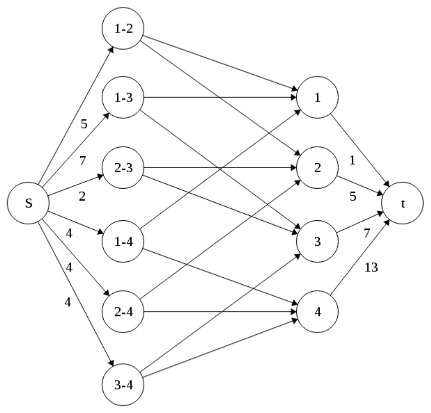

<!-- ===== PDF p1 ===== -->

<span style="color:#c0392b">**讲次 14（Lecture 14）：棒球淘汰（Baseball Elimination）**</span> <span style="color:#7f8c8d;">（Spring 2015，2015 春季学期）</span>

本讲我们将研究如何用**最大流算法**计算联赛中运动队的淘汰（elimination）情况。具体地，考虑 1996 年 8 月 30 日美国职业棒球大联盟（Major League Baseball）**美联东区（AL Eastern Division）**的积分榜，不含底特律（Detroit）的战绩。^1

**表 1（Table 1）**：1996 年 8 月 30 日美联东区积分榜。

| 球队（Team） | 胜（Wins, $w_i$） | 负（Losses, $f_i$） | 待赛（To Play, $r_i$） | 相互对阵场次（Games against each other） |
|:---|:---:|:---:|:---:|:---|
| NY | 75 | 59 | 28 | – 5 7 4 3 |
| Baltimore | 71 | 63 | 28 | 5 – 2 4 4 |
| Boston | 69 | 65 | 28 | 7 2 – 4 0 |
| Toronto | 63 | 71 | 28 | 4 4 4 – 0 |
| Detroit | ? | ? | 28 | 3 4 0 0 – |

> <span style="color:#7f8c8d;">[表格说明] 相互对阵场次表：行/列分别为 NY、Ba（Baltimore）、Bo（Boston）、T（Toronto）、D（Detroit），第 $i$ 行第 $j$ 列表示 $i$ 队与 $j$ 队剩余的对阵场数（对称）。例如 NY 与 Baltimore 还有 5 场、与 Boston 还有 7 场、与 Toronto 还有 4 场、与 Detroit 还有 3 场。</span>

从这个表，我们怎么判断一支球队是否被淘汰？一个**天真的体育记者（naive sports writer）**只会计算：若存在某个 $j$ 使 $w_i + r_i < w_j$，则球队 $i$ 被淘汰。例如，若底特律的战绩是 $w_5 = 46$，那么底特律**肯定**被淘汰，因为 $w_5 + r_5 = 46 + 28 < 75 = w_1$。

然而，这个条件是**充分但不必要**的（sufficient, but not necessary）。例如，考虑 $w_5 = 47$。虽然 $w_5 + r_5 = 75$，但 NY 或 Baltimore 之一将达到 76 胜，因为**它们相互之间还有 5 场比赛**。对任意 $w_5$ 值，我们如何判断底特律是否被淘汰？

为了回答这个问题，我们可以用**最大流（max-flow）**。考虑图 1：$s$ 到节点 $i-j$ 的容量是球队 $i$ 与 $j$ 之间**剩余的比赛数**；节点 $i-j$ 到节点 $k = 1, 2, 3, 4$ 的容量是**无穷大**；节点 $k$ 到 $t$ 的容量是 $w_5 + r_5 - w_k$。

构造这个图的直觉是：我们**假设底特律赢下所有 $r_5$ 场比赛**，并试图让**每支球队的胜场数不超过底特律可能的总胜场数**（$\le w_5 + r_5$）。

<span style="color:#2471a3;">**[theorem]**</span> **定理 1（Theorem 1）**：球队 5（底特律）被淘汰，**当且仅当（iff）**最大流**没有饱和**所有离开源 $s$ 的边，即最大流值 $< 26$。

**证明（Proof）**：边容量的饱和（saturation）对应「**打完所有剩余比赛**」。若在保持每支球队总胜场数 $\le w_5 + r_5$ 的前提下**无法打完所有比赛**，则球队 5 被淘汰。

> <span style="color:#7f8c8d;">^1 大致而言！（roughly speaking!）</span>

> <span style="color:#7f8c8d;">[译注] 1996 赛季美联东区的这场淘汰分析是棒球淘汰问题的经典教学案例，常被用作最大流应用的范例（讲义正文未明说，此处为译者补注）。</span>

> <span style="color:#1e8449;">**[note] Note（译者注）:**</span> 棒球淘汰问题展示了「**天真条件 vs 流判据**」的差距：天真的「$w_i + r_i < w_j$」只检查「某队不可能追上单个对手」，但真正的淘汰可能来自「**一群球队联合的天花板**」——即使 $w_5 + r_5$ 追平了单个最高胜场，那两支（或多支）球队之间还要互打，**其中至少一支的最终胜场必然超过底特律的上限**（因为它们的比赛总有一方要赢）。这就是为什么需要最大流：它把「所有球队互赛的联合约束」编码进流网络。流网络的三层结构（源→比赛节点→球队节点→汇）是「**二分匹配式归约**」的变体：比赛节点代表「要分配的胜场」，球队节点代表「胜场上限 $w_5 + r_5 - w_k$」，流满 = 所有比赛都能在不超上限的情况下打完。这个「把可行性问题编码成流」的手法，是讲次 14A 预告的应用的完整版。

---

<!-- ===== PDF p2 ===== -->

<span style="color:#c0392b">**棒球淘汰（续）**</span>

**图 1（Figure 1）**：判断球队 5 是否被淘汰的流网络。



> <span style="color:#7f8c8d;">[图注说明] 原页附图：判断底特律（队 5）是否被淘汰的流网络。源 $s$ → 每对球队 $(i,j)$ 的比赛节点（容量 = 两队剩余比赛数）→ 每支球队节点 $k$（容量 ∞）→ 汇 $t$（容量 $w_5 + r_5 - w_k$）。图中标注最小割。</span>

在图 1 中，最小割 $(S, T)$ 是 $S = \{s, 1-2, 1-3, 2-3, 1, 2, 3\}$ 且 $T = \{1-4, 2-4, 3-4, 4, t\}$。最小割的容量

```math
c(S, T) = 4 + 4 + 4 + 1 + 5 + 7 = 25 < 26
```

因此，球队 5（底特律）被淘汰。

**另一种解释（Alternate explanation）**：注意最大流会找出**淘汰球队 5 的球队子集**。在这个例子中，考虑子集「球队 1、2、3」。这 3 支球队之间的总胜场数是 215 胜，它们相互之间还有 14 场比赛要打。那么常规赛结束时总共有 229 胜。这意味着**至少存在一支球队赢得 $\lceil 229/3 \rceil = 77$ 场**。

因此，若底特律只有 48 胜，那么它**肯定**被淘汰（$48 + 28 = 76 < 77$）。我们可以用最大流和最大流最小割定理找出这样的集合。

> <span style="color:#1e8449;">**[note] Note（译者注）:**</span> 两种解释互为表里：**最大流视角**（图 1）用「打不完所有比赛 ⇒ 淘汰」；**计数视角**（另一种解释）更直白——若「淘汰者集合」$W$ 里所有队的总胜场（当前胜场 + 内部剩余比赛产生的胜场）除以队数**超过**底特律的上限 $w_5 + r_5$，则 $W$ 中至少一队必然超过底特律，底特律被淘汰。数学上：$W$ 队最终总胜场 $= \sum_{i \in W} w_i + (\text{内部比赛数})$，平均每队 $= \frac{\sum_{i \in W} w_i + \text{内部比赛数}}{|W|}$；若这个平均值 $> w_5 + r_5$，则至少一队 $> w_5 + r_5$。例子：$\frac{215 + 14}{3} = \frac{229}{3} \approx 76.3$，向上取整 77，超过底特律的 76（$48 + 28$）。**最大流最小割定理**保证：这样的「淘汰集合」正是最小割 $S$ 中对应的球队集合——**流判据与计数判据是同一个事实的两面**。这个「多队联合上限淘汰单队」的思想，是体育淘汰分析（以及更一般的「资源竞争可行性」问题）的普适模型。

---

<!-- ===== PDF p3 ===== -->

<span style="color:#7f8c8d;">**MIT OpenCourseWare**</span>

<span style="color:#7f8c8d;">http://ocw.mit.edu</span>

<span style="color:#7f8c8d;">**6.046J / 18.410J 算法设计与分析（Design and Analysis of Algorithms）**</span>

<span style="color:#7f8c8d;">Spring 2015（2015 春季学期）</span>

<span style="color:#7f8c8d;">有关引用这些材料的信息或我们的使用条款（Terms of Use），请访问：http://ocw.mit.edu/terms。</span>
