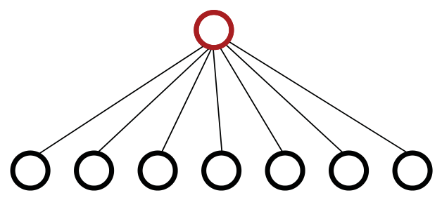
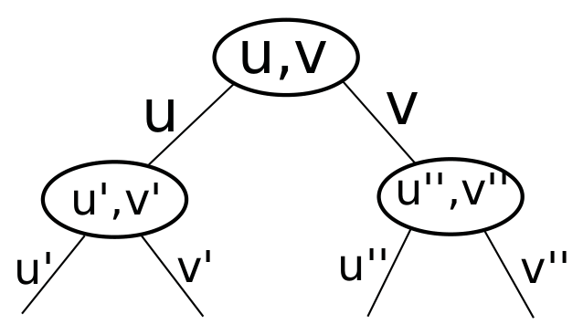

<!-- ===== PDF p1 ===== -->

<span style="color:#c0392b">**讲次 18（Lecture 18）：固定参数算法（Fixed-Parameter Algorithms）**</span> <span style="color:#7f8c8d;">（Spring 2015，2015 春季学期）</span>

本讲大纲：
- **顶点覆盖（Vertex Cover）**
- **固定参数可解性（Fixed-Parameter Tractability）**
- **核化（Kernelization）**
- **与近似的联系（Connection to Approximation）**

<span style="color:#c0392b">**固定参数算法（Fixed Parameter Algorithms）**</span>

固定参数算法是**应对 NP 困难问题**的另一种途径，与近似算法互补。一个算法有三个一般性的期望特征：

1. 求解（NP-）困难问题
2. **多项式时间**运行（快）
3. 得到**精确解**

一般而言，除非 $P = NP$，一个算法只能拥有这三个特征中的**两个**，而无法三者兼得。拥有特征 2 和 3 的算法是 $P$ 中的算法（多项式时间 + 精确）。近似算法拥有特征 1 和 2：它求解困难问题、运行很快，但不给出精确解。固定参数算法将拥有特征 1 和 3：它求解困难问题并给出精确解，但**运行不会很快**。

**思想（Idea）**：目标是得到一个**精确算法**，但把**指数项隔离到某个特定参数（parameter）上**。当这个参数的值较小时，算法就能快速处理实例。希望这个参数在实践中比较小。

**参数（Parameter）**：参数是一个非负整数 $k(x)$，其中 $x$ 是问题输入。通常，参数是问题的一个**自然性质（natural property）**（输入中的某个 $k$）。它**不一定能高效计算**（例如 OPT）。

**参数化问题（Parameterized Problem）**：参数化问题就是「问题 + 参数」，或者说「就参数而言看待的问题」。对任何给定问题，都可能存在许多有趣的参数化方式。

> <span style="color:#1e8449;">**[note] Note（译者注，「三选二」的不可能性）:**</span> 「困难、快速、精确——任选两个」是本讲的**总纲**，也解释了近三讲的整体布局：**$P$ 类算法**拥有「快速 + 精确」（讲次 1–15 的所有多项式算法）；**近似算法**拥有「困难 + 快速」（讲次 17，放弃精确）；**固定参数算法**拥有「困难 + 精确」（本讲，放弃「关于输入规模的多项式时间」——改为「关于参数指数、关于输入多项式」）。🎥 *Devadas 用 MIT 的经典梗点破*："This is a bastardization of a joke which is—sleep, friends, work—pick any two. That's the MIT motto. Here in algorithms—hard, fast, exact—pick any two."（翻译：这是一个玩笑的变体——睡眠、朋友、工作，任选两个，那是 MIT 的校训。在算法里就是——困难、快速、精确，任选两个。）这个「三选二」框架的价值在于：它把上一讲的近似算法（放弃精确）与本讲的固定参数算法（放弃「纯多项式」）放进了同一个坐标系，让你看清**面对 NP 困难，选择不是单一的**。

> <span style="color:#1e8449;">**[note] Note（译者注，参数化的思想）:**</span> 固定参数的核心承诺是：**把指数复杂性「压缩」进一个小参数 $k$，换取关于输入规模 $n$ 的多项式时间**。这要求算法的运行时间形如 $f(k) \cdot n^{O(1)}$——$k$ 进指数、$n$ 进多项式，二者分离。之所以可行，是因为许多现实问题中 $k$ 天然很小（如顶点覆盖的最优覆盖大小、错误的个数、社团大小），而 $n$ 很大。参数化复杂度（parameterized complexity）正是**把一维的复杂度理论变成二维**：横轴是输入规模、纵轴是参数（维基百科 Parameterized complexity 词条的原话「two-dimensional complexity theory」），系统化开创于 Downey & Fellows（1999）的专著，先驱工作可追溯到 Gurevich、Stockmeyer & Vishkin（1984）。注意参数「不一定高效可算」（如 OPT 本身就是我们要找的）——参数只需**定义**，不必**先求出**；这与你大二要学的统计学习里「正则化参数 / 模型复杂度」的用法有神似之处：把一个很难的全局量当作「外部给定的标尺」。

---

<!-- ===== PDF p2 ===== -->

<span style="color:#c0392b">**固定参数算法（续）**</span>

**目标（Goal）**：固定参数算法的目标，是拥有一个**关于问题规模 $n$ 多项式、但可能关于参数 $k$ 指数**的算法，并且仍然得到**精确解**。

<span style="color:#c0392b">**$k$-顶点覆盖（$k$-Vertex Cover）**</span>

给定图 $G = (V, E)$ 和一个非负整数 $k$，是否存在一个大小至多为 $k$ 的顶点集合 $S \subseteq V$（$|S| \le k$）**覆盖所有边**？这是顶点覆盖的判定问题，也是 **NP 困难**的。我们将用 $k$ 作为参数，为 $k$-顶点覆盖开发一个固定参数算法。注意我们可以有 $k \ll |V|$，如下图所示：

<span style="color:#c0392b">**暴力解（坏）（Brute-force solution）**</span>



> <span style="color:#7f8c8d;">[原图说明] 原页附图（矢量图，p2）：暴力枚举示意——「Try all $\binom{v}{0} + \binom{v}{1} + \cdots + \binom{v}{k}$ sets of $\le k$ vertices」，即尝试所有大小 $\le k$ 的顶点集合。此图将在统一裁剪阶段作为原图插回。</span>

尝试所有大小 $\le k$ 的集合：

```math
\binom{v}{0} + \binom{v}{1} + \cdots + \binom{v}{k}
```

可以**跳过所有小于 $k$ 的项**，因为更大的集合覆盖能力更强。测试覆盖需要 $O(m)$ 时间，其中 $m$ 是边数。因此，总运行时间是 $O(V^k |E|)$。它对**固定的 $k$** 是多项式的，但**对不同 $k$ 不是同一个多项式**。在大多数情况下它效率低下。因此我们把 $n^{f(k)}$ 定义为**坏的（bad）**，其中 $n = |V| + |E|$ 是输入规模。

> <span style="color:#1e8449;">**[note] Note（译者注，为什么 $n^{f(k)}$ 是「坏」的）:**</span> 暴力解 $O(V^k |E|)$ 的「坏」很微妙：对**任意固定的** $k$（如 $k = 3$），$O(V^3 |E|)$ 确实是 $n$ 的多项式——所以它其实是一个（运行时间依赖 $k$ 的）多项式算法。但**$k$ 一变，多项式的次数就变**（$k=3$ 时是三次、$k=10$ 时是十次），因此不存在「一个」关于 $n$ 的多项式同时适用于所有 $k$。形式化地，暴力解是 $n^{f(k)}$（$k$ 在**指数**里），而 FPT 要求的是 $f(k) \cdot n^{O(1)}$（$k$ 只在**系数**里，$n$ 的指数是**不依赖 $k$ 的常数**）。「跳过所有小于 $k$ 的项」的理由：若存在大小 $< k$ 的覆盖，把它扩充到大小恰为 $k$ 仍是覆盖（覆盖是单调的——多加点不会破坏覆盖性），所以只需检查大小恰为 $k$ 的 $\binom{V}{k}$ 个集合。这是「单调性归约」思想的一个微缩应用，与你在讲次 12 贪心证明里反复用的单调性一脉相承。

<span style="color:#c0392b">**有界搜索树算法（好）（Bounded search-tree algorithm）**</span>

这是一个用于改进暴力搜索的**通用技术**。它的工作方式如下：

- **任取**一条边 $e = (u, v)$
- 我们知道**要么 $u \in S$，要么 $v \in S$**（或两者），但不知道是哪个
- **猜测**是哪一个：尝试两种可能性
  1. 把 $u$ 加入 $S$，从 $G$ 中删除 $u$ 及其关联边，并用 $k' = k-1$ 递归。
  2. 对 $v$ 做同样的事（替换 $u$）。
  3. 返回两个结果的 **OR**。

---

<!-- ===== PDF p3 ===== -->

<span style="color:#c0392b">**有界搜索树算法（续）**</span>

这就像动态规划里的**猜测（guessing）**，但**记忆化（memoization）在这里没有帮助**。递归树如下所示：



> <span style="color:#7f8c8d;">[原图说明] 原页附图（矢量图，p3）：二分递归树——根为边 $(u,v)$，分支出「选 $u$」与「选 $v$」两条路径，各自再递归到下一层边 $(u',v')$、$(u'',v'')$，形成满二叉树，深度为 $k$、叶数 $2^k$。此图将在统一裁剪阶段作为原图插回。</span>

在叶子（$k = 0$）处，若 $|E| = 0$（所有边都被覆盖）则返回 YES。删除 $u$ 或 $v$ 需要 $O(V)$ 时间。因此总运行时间为 $O(2^k |V|)$。

- 对固定 $k$：$O(V)$ 多项式
- **多项式的次数与 $k$ 无关**
- 对 $k = O(\lg |V|)$ 也是多项式
- 对例如 $k \le 32$ 是实用的
- 因此我们把 $f(k) \cdot n^{O(1)}$ 定义为**好的（good）**

<span style="color:#c0392b">**固定参数可解性（Fixed Parameter Tractability）**</span>

如果存在一个运行时间 $\le f(k) \cdot n^{O(1)}$ 的算法，其中 $f: \mathbb{N} \to \mathbb{N}$（非负）、$k$ 是参数、且多项式的 $O(1)$ 次与 $k$ 和 $n$ **无关**，那么这个参数化问题是**固定参数可解的（fixed-parameter tractable, FPT）**。

**问题（Question）**：为什么是 $f(k) \cdot n^{O(1)}$ 而不是 $f(k) + n^c$？

<span style="color:#2471a3;">**[theorem]**</span> **定理（Theorem）**：存在 $f(k) \cdot n^c$ 算法 **$\iff$** 存在 $f'(k) + n^c$ 算法。

<span style="color:#2471a3;">**[proof]**</span> **证明（Proof）**：

- **（$\Leftarrow$）**：平凡（假设 $f'(k)$ 和 $n^c$ 都 $\ge 1$）。
- **（$\Rightarrow$）**：
  - 若 $n \le f(k)$，则 $f(k) \cdot n^c \le f(k)^{c+1}$
  - 若 $f(k) \le n$，则 $f(k) \cdot n^c \le n^{c+1}$
  - 因此 $f(k) \cdot n^c \le \max(f(k)^{c+1},\, n^{c+1}) = f'(k) + n^{c'}$ $\square$

另外，由于 $xy \le x^2 + y^2$，可以直接令 $f'(k) = (f(k))^2$ 且 $c' = 2c$。

**例（Example）**：$O(2^k \cdot n) \le O(4^k + n^2)$。

> <span style="color:#1e8449;">**[note] Note（译者注，有界搜索树的二分分支）:**</span> 有界搜索树（bounded search tree）的威力来自一个简单的观察：**任取一条边，它的两个端点中至少有一个必须在覆盖里**——于是「找覆盖」变成「在每条冲突边上做二选一的分支」。每次分支消耗 1 个预算（$k' = k-1$），树深 $k$、满二叉，叶数 $2^k$；每层删除顶点及其关联边花 $O(V)$，总时间 $O(2^k V)$。这个「**分支 + 减预算**」的模板是有界搜索树的核心：分支因子 × 深度决定了指数底（这里是 2），后续的改进都在减小分支因子或利用更聪明的剪枝。**为什么记忆化没用**？动态规划的「子问题重叠」在这里不存在——每条被删的边 $(u,v)$ 在两条分支里都是不同的边，子问题（剩余图）几乎从不重合，缓存命中率为零。这与你讲次 10 学过的「DP 靠重叠子问题省时间」正好构成对照：**记忆化在子问题不重叠时毫无收益**。$\binom{V}{k}$ 暴力 vs $2^k$ 搜索树的对比也很有教学意义：**把「组合选择」重新表述成「序列化决策」**，往往能把 $n^k$（$k$ 在指数且依赖 $k$）压成 $2^k \cdot n^{O(1)}$（$k$ 只进指数系数）——这正是 FPT 的本质。

> <span style="color:#1e8449;">**[note] Note（译者注，为什么用乘积 $f(k) \cdot n^{O(1)}$ 而不用和 $f(k)+n^c$）:**</span> 这个定理说明**乘积形式与和形式在 FPT 意义下等价**，于是定义用乘积是「正则化」而非「更强」。$(\Leftarrow)$ 平凡：$f'(k) + n^c \le 2 \max(f'(k), n^c) \le 2 f'(k) \cdot n^c = f(k) \cdot n^c$。$(\Rightarrow)$ 用**取最大值分情况**：要么 $n$ 相对小（$n \le f(k)$，整个乘积被 $f(k)^{c+1}$ 压住）、要么 $f(k)$ 相对小（$f(k) \le n$，被 $n^{c+1}$ 压住），二者取 max 再拆成和。而 $xy \le x^2 + y^2$ 给出了更简洁的替代（$f'(k) = f(k)^2, c' = 2c$）——这是「乘积放缩成平方和」的经典技巧，与实分析里 $\epsilon$ 放缩、以及你学过的 $2ab \le a^2 + b^2$（来自 $(a-b)^2 \ge 0$）同源。例子里 $O(2^k \cdot n) \le O(4^k + n^2)$ 就是取 $f(k) = 2^k, c = 1$：当 $n \le 2^k$ 时 $2^k \cdot n \le 4^k$，当 $2^k \le n$ 时 $2^k \cdot n \le n^2$。**两种写法描述的是同一个算法类**，定义选乘积只是因为它更贴近「参数进指数、规模进多项式」的直觉。

---

<!-- ===== PDF p4 ===== -->

<span style="color:#c0392b">**核化（Kernelization）**</span>

**核化**是一种**简化性的自归约（simplifying self-reduction）**。它是一个**多项式时间算法**，把输入 $(x, k)$ 转换为一个**小且等价**的输入 $(x', k')$。这里「小」指 $|x'| \le f(k)$，「等价」指对 $x$ 的答案与对 $x'$ 的答案**相同**。

<span style="color:#2471a3;">**[theorem]**</span> **定理（Theorem）**：一个问题属于 FPT **$\iff$** 存在核化。

<span style="color:#2471a3;">**[proof]**</span> **证明（Proof）**：

- **（$\Leftarrow$）**：核化后得 $n' \le f(k)$；运行任意有限算法 $g(n')$；总时间 $n^{O(1)} + g(f(k))$。
- **（$\Rightarrow$）**：令 $A$ 是 $f(k) \cdot n^c$ 算法，假设 $k$ 已知：
  - 若 $n \le f(k)$，它已经被核化了。
  - 若 $f(k) \le n$，则：
    1. 运行 $A$ → 只需 $f(k) \cdot n^c \le n^{c+1}$ 时间
    2. 输出一个 $O(1)$ 大小的 YES/NO 实例（作为核化结果）
  - 若 $k$ 未知：运行 $A$ 达 $n^{c+1}$ 时间，若仍未结束，就知道它已被核化。

于是我们知道（指数大小的）核**存在**。近期工作旨在在可能时找到**多项式（甚至线性）核**。

<span style="color:#c0392b">**$k$-顶点覆盖的多项式核（Polynomial kernel for $k$-Vertex Cover）**</span>

为 $k$-顶点覆盖创建核，算法遵循以下步骤：

- 通过删除所有**自环（self loops）**和**重边（multi-edges）**使图**简单化**。
- **度数 $> k$ 的任何顶点**必然在覆盖中（否则需要加入 $> k$ 个顶点才能覆盖其关联边）。

---

<!-- ===== PDF p5 ===== -->

<span style="color:#c0392b">**核化（续）**</span>

- 一次一个地删除这样的顶点（及其关联边），并相应减小 $k$。
- 剩余图的最大度数 $\le k$。
- 每个剩余顶点覆盖 $\le k$ 条边。
- 若剩余边数 $> k^2$，回答 NO 并输出一个**规范 NO 实例（canonical NO instance）**。
- 否则，$|E'| \le k^2$。
- 删除所有**孤立顶点（isolated vertices）**（度为 0 的顶点）。
- 于是 $|V'| \le 2k^2$。
- 输入已被约简为规模 **$O(k^2)$** 的实例 $(V', E')$。

核化算法的运行时间是朴素的 $O(VE)$。（多费些功夫可做到 $O(V + E)$。）之后，我们可以对核应用暴力算法，得到总体运行时间 $O(V + E + \binom{2k^2}{k} \cdot k^2) = O(V + E + 2^k k^{2k+2})$；或者应用有界搜索树解，得到 $O(V + E + 2^k k^2)$。迄今最好的算法：**$O(kV + 1.274^k)$**，出自 [Chen, Kanj, Xia - TCS 2010]。

> <span style="color:#1e8449;">**[note] Note（译者注，核化三步走：规约规则 → 尺寸界 → 组合）:**</span> $k$-顶点覆盖的多项式核是核化的标准范例，它的**规约规则（reduction rules）**值得逐一品味：**(1) 简单化**——自环/重边不影响覆盖决策（自环必被该顶点覆盖、重边与单边等价），删掉不改变答案；**(2) 高度规则（high-degree rule）**——度数 $> k$ 的顶点**必须**进覆盖（否则要花 $> k$ 个顶点去盖它的关联边，超过预算），这是最关键的剪枝；**(3) 边数/孤立点处理**——剩余图最大度 $\le k$，若边数 $> k^2$ 则矛盾（$k$ 个点最多盖 $k^2$ 条边）直接判 NO，剩余图至多 $k^2$ 条边、至多 $2k^2$ 个顶点，于是得到 $O(k^2)$ 大小的核。维基百科（Kernelization 词条）指出，这正是 **Buss 提出的顶点覆盖核化**（经典规约规则）。核 + 搜索树的组合：暴力 $O(\binom{2k^2}{k} k^2) = O(2^k k^{2k+2})$ 或有界搜索树 $O(2^k k^2)$——**核把 $n$ 彻底赶出指数**。指标演进（$1.274^k$）是参数化算法研究的主线，最好的顶点覆盖算法族（基于「皇冠分解 crown decomposition / 分支规则」）把常数压到约 $1.274^k$（Chen-Kanj-Xia，TCS 2010）——注意它仍是 $f(k) \cdot \mathrm{poly}(n)$ 形式，但底数不断变小。

<span style="color:#c0392b">**与近似算法的联系（Connection to Approximation Algorithms）**</span>

取一个优化问题（其 OPT 为整数），考虑其关联判定问题：「**OPT $\le k$？**」并以 $k$ 为参数。

<span style="color:#2471a3;">**[theorem]**</span> **定理（Theorem）**：优化问题有 **EPTAS**（EPTAS：**高效 PTAS**，$f(\frac{1}{\varepsilon}) \cdot n^{O(1)}$，例如讲次 17 的 ApproxPartition）**$\Rightarrow$** 判定问题是 **FPT**。

<span style="color:#2471a3;">**[proof]**</span> **证明（Proof）**：（类似于 FPTAS / 伪多项式算法的论证。）

- 设这是最大化问题（且是 $\le k$ 判定）。
- 用 $\varepsilon = \frac{1}{2k}$ 运行 EPTAS，时间 $f(2k) \cdot n^{O(1)}$。
- 相对误差 $\le \frac{1}{2k} < \frac{1}{k}$。
- $\Rightarrow$ 若 $OPT \le k$，**绝对误差 $< 1$**。

---

<!-- ===== PDF p6 ===== -->

<span style="color:#c0392b">**与近似的联系（续）**</span>

- 因此若我们找到一个值 $\le k$ 的解，则 $OPT \le \left(1 + \frac{1}{2k}\right) \cdot k = k + \frac{1}{2} < k + 1$。
- **OPT 为整数** $\Rightarrow OPT \le k \Rightarrow$ **YES**。
- 否则 $OPT > k$（NO）。

$\square$

另外：**$=$、$\le$、$\ge$ 判定问题在 FPT 意义下是等价的**。（可以用这个关系在某些情形下证明 EPTAS 不存在。）

> <span style="color:#1e8449;">**[note] Note（译者注，EPTAS ⇒ FPT：近似与精确的桥）:**</span> 这个定理建立了**近似算法与固定参数算法之间的桥梁**：只要一个优化问题有 EPTAS，它的「OPT ≤ k?」判定问题就是 FPT。论证的精髓在**用「充分小的近似误差」换取「精确判定」**：把 EPTAS 的精度设到 $\varepsilon = \frac{1}{2k}$（时间 $f(2k) \cdot n^{O(1)}$，仍是 FPT 形式），那么当 $OPT \le k$ 时，返回的解 $s$ 满足 $OPT \le (1+\varepsilon) s$ 且 $s \ge \frac{OPT}{1+\varepsilon} > OPT - \frac12$（因为 $OPT \cdot \varepsilon \le \frac12$），故 $|s - OPT| < 1$；又 $OPT$ 与 $s$ 都是整数，**$s = OPT$ 恰好相等**。于是「$s \le k$」⇔「$OPT \le k$」——近似解直接给出精确判定，运行时间 $f(2k) \cdot n^{O(1)}$ 正是 FPT。这个「**把近似误差压到 1 以下，靠整数性升华为精确**」的技巧，与 FPTAS 中「误差 < 1/2 时靠整数舍入」、以及伪多项式 DP（讲次 16）同源。**反之**：FPT 并不自动给出 EPTAS（从精确判定到近似解通常需要更多结构），所以讲义末尾「$=, \le, \ge$ 判定在 FPT 下等价」给出的是**判定问题之间的归约**，常用来**反证 EPTAS 不存在**（若某判定问题是 W[1]-困难而非 FPT，则该优化问题无 EPTAS）——这预告了参数化复杂度的 W 层级（W-hierarchy），是你进一步深挖的入口。

---

<!-- ===== PDF p7 ===== -->

<span style="color:#7f8c8d;">**MIT OpenCourseWare**</span>

<span style="color:#7f8c8d;">http://ocw.mit.edu</span>

<span style="color:#7f8c8d;">**6.046J / 18.410J 算法设计与分析（Design and Analysis of Algorithms）**</span>

<span style="color:#7f8c8d;">Spring 2015（2015 春季学期）</span>

<span style="color:#7f8c8d;">有关引用这些材料的信息或我们的使用条款（Terms of Use），请访问：http://ocw.mit.edu/terms。</span>
