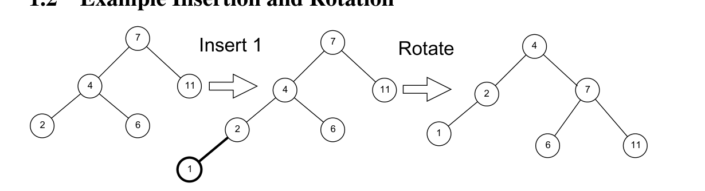
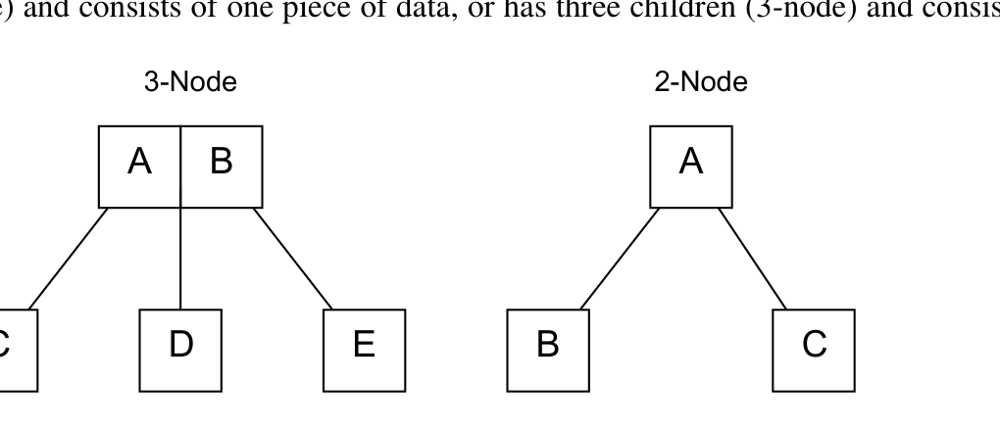
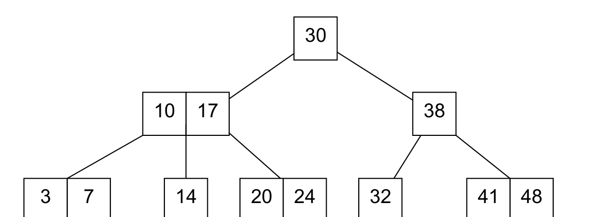
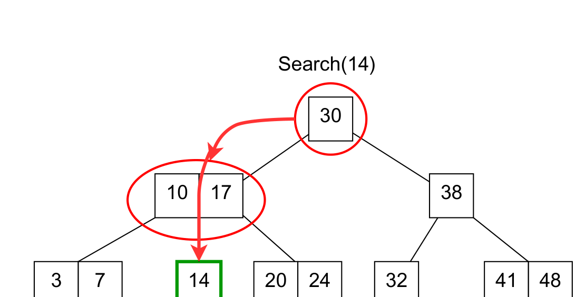
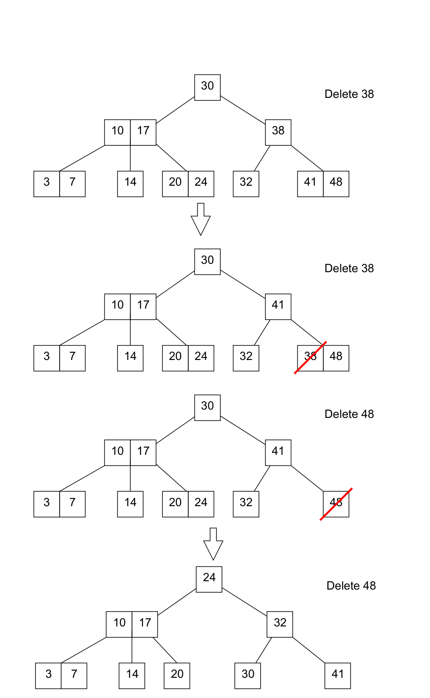
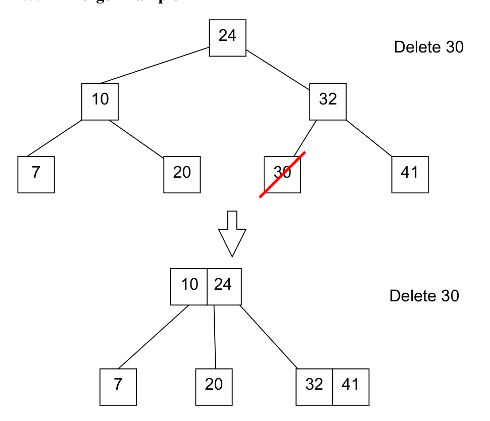

<!-- ===== PDF p1 ===== -->

**6.046J / 18.410J　算法设计与分析（Design and Analysis of Algorithms）**

**Recitation 2（复习课 2）：2-3 Trees and B-Trees（2-3 树与 B 树）** （2015 年 2 月 13 日 · Massachusetts Institute of Technology · Profs. Erik Demaine, Srini Devadas and Nancy Lynch）

---

**[section]** **1　Recap（回顾）**

**[section]** **1.1　Balanced Binary Search Trees（平衡二叉搜索树）**

在 Insert（插入）与 Delete（删除）操作之后通过 rebalancing（再平衡）来保证高度为 $O(\log n)$ 的 Binary Search Trees（二叉搜索树，简称 BST）。

**[section]** **1.2　Example Insertion and Rotation（插入与旋转示例）**

Figure 1（图 1）：向二叉搜索树插入键 1（Insert 1）导致失衡，再通过一次旋转（Rotate）恢复平衡。

图中演示了一个具体的平衡维护过程：在由键 $7、4、11、6、2$ 构成的二叉搜索树中 Insert 1（插入 1）之后，树沿 $7 \to 4 \to 2 \to 1$ 这条路径过度左倾而失衡；随后执行一次 Rotate（旋转），以键 $4$ 作为新的子树根，将 $2$、$7$ 分置为它的左右孩子，并把 $1$ 挂到 $2$ 的左侧、$6$ 与 $11$ 挂到 $7$ 的两侧，从而恢复二叉搜索树的平衡性质。

> **[note]**  旋转（rotation）是所有自平衡二叉搜索树——如 AVL 树、红黑树（red-black tree）——共用的基本重组原语（restructuring primitive）：它不改变中序遍历（inorder traversal）得到的键序列，只是更换子树的根，从而把过高的子树整体「搬运」到另一侧来恢复平衡。而 2-3 树走了一条完全不同的路：允许节点容纳两个键、三个孩子，于是插入造成的「溢出」不再靠旋转消除，而是靠分裂（split）把中间键上推到父节点，树高只会在根节点被分裂时增加 1。理解「旋转在水平方向上调整、分裂在垂直方向上生长」这一对照，是读懂本讲乃至 CLRS 第 18 章 B 树的关键直觉。

---

**[section]** **2　2-3 Trees（2-3 树）**

**[section]** **2.1　Properties（性质）**

2-3 Trees 是 balanced search trees（平衡搜索树）。每个有孩子的节点（non-leaf，非叶子）要么有两个孩子（称为 2-node（2 节点））并包含一个数据项（piece of data），要么有三个孩子（称为 3-node（3 节点））并包含两个数据项。

Figure 2（图 2）：2-node 与 3-node 的结构示意。左：3-node 含 2 个键（A、B）与 3 个孩子（C、D、E）；右：2-node 含 1 个键（A）与 2 个孩子（B、C）。

- 每个非叶子（non-leaf）节点都是 2-node（2 节点）或 3-node（3 节点）
- 所有叶子（leaves）都在同一层（at the same level）
- 所有非叶子节点都继续分支（branch）

> **[note]**  2-3 树的两条核心不变量——「所有叶子在同一层」与「每个内部节点至少有 2 个孩子」——共同保证了树高至多为 $\lg n$：若树高为 $h$，则最底层至少有 $2^h$ 个叶子，而 $n$ 个键至少需要 $n$ 个叶子位，故 $n \ge 2^h$，即 $h \le \lg n$。相比之下，最坏情况下 BST 会退化成一条链、高度为 $n$，这正是讲义称 2-3 树「比 BST 更稠密（more dense）」的原因——同样的键数下它能长成更矮更宽的树。把「2 个孩子/1 个键、3 个孩子/2 个键」统一推广为「至多 $B$ 个孩子/至多 $B-1$ 个键」，就得到第 3 节的 B 树；而每个节点至多 4 个孩子、至多 3 个键的 2-3-4 树则是 $B = 2$ 的特例，你在 6.006 中已经见过它的等价形式——红黑树。

<!-- ===== PDF p2 ===== -->

**（续）**

- 所有数据都按有序（sorted）保存
- 每个叶子节点将包含 1 或 2 个字段（fields，即数据项）
- 高度（Height）$\le \lg n$——比 BST 更稠密（more dense）

**[section]** **2.2　Example 2-3 Tree（2-3 树示例）**

Figure 3（图 3）：一棵示例 2-3 树（Example 2-3 Tree），其中包含键（keys）3、7、10、14、17、20、24、30、32、38、41、48。

**[section]** **2.3　Search（查找）**

查找与 Binary Search（二分查找）非常相似（very similar）：从根节点（root node）开始，按顺序（in order）沿树向下遍历。树是排好序的（sorted），因此树的每一层只需考察一个节点。正因如此，Search（查找）的运行时间为 $O(\lg n)$。

Figure 4（图 4）：在示例 2-3 树上执行 Search(14)（查找 14）的搜索路径。

> **[note]**  2-3 树的查找几乎就是二分查找（binary search）的树形版本：每到一个内部节点，把目标键与该节点的 1 或 2 个键比较，决定进入左、中、右哪一棵子树；由于所有叶子同层且每个内部节点至少有 2 个孩子，树高至多为 $\lg n$，而每一层只做 $O(1)$ 次键比较，所以总代价为 $O(\lg n)$。这段推导把「层数」与「每层工作量」分开来计数——到第 3 节的 B 树，同样的分解会变成「层数」与「每层磁盘块访问次数」，而后者才是数据库场景里真正要优化的指标。值得注意的是，2-3 树查找是纯静态的路径比较，不需要任何动态调整（不像 splay 树那样边查边旋转），这正是它实现简单的根源。

<!-- ===== PDF p3 ===== -->

**[section]** **2.4　Insert（插入）**

Insert(X)（插入 X）的步骤（Steps）：

1. 搜索（Search）元素 X 应当落入树中哪个叶子。
2. 把元素 X 插入（Insert）到它应去的位置。
3. 只要发生 overflow（溢出）——即一个节点含有多于 3 个元素——就把节点分裂（Split）成左半（left half）、中位数（median）与右半（right half）三部分，然后把中位数向上提升（promote）一层。若有父节点，就把它并入父节点；若没有父节点，则新建一个只含该中位数（median）的节点作为新的根（root）。
4. 运行时间为 $O(\lg n)$。

> **[note]**  插入的枢纽动作是处理 overflow（溢出）：向一个满节点（3-node，已含 2 个键）插入后节点暂有 3 个键，此时把它按「左半、中位数、右半」三等分，中位数上提到父节点；若父节点也随之溢出，就继续上提，直到根——当根也溢出时，中位数成为新根，树高增加 1。这是 2-3 树唯一让树长高的方式，也正因如此，「所有叶子在同一层」这一不变量在插入过程中始终不被破坏。更精确地说，正常 2-3 树节点只容纳 1 或 2 个键，原文「一个节点含有多于 3 个元素」应理解为「节点将要容纳 3 个键（超出容量上限 2）即触发分裂」。与之对照，CLRS 的 B-TREE-INSERT 采用自顶向下的预分裂（preemptive splitting），在查找插入位置的路上就把满节点先切开，从而免去回溯时的逐层分裂，但两者最终效果完全一致。

<!-- ===== PDF p4 ===== -->

**[section]** **2.5　Delete（删除）**

Delete(X)（删除 X）的步骤（Steps）：

1. 若待删元素不在叶子中，则把它与中序后继（inorder successor）交换（Swap）。
2. 若发生 underflow（下溢），则通过 redistribute（重分配）与 merge（合并）节点来恢复成正确的 2-3 树。
3. 运行时间为 $O(\lg n)$。

> **[note]**  删除是三种基本操作中最繁琐的。第一步先做「归约」：若待删键位于内部节点，就与它的中序后继（inorder successor，即右子树中的最小键）交换，使待删键落入叶子，从而把问题化为「删叶子中的键」。第二步处理 underflow（下溢）：删掉叶子中的键后，若某个节点一个键也不剩（键数降为 0），就需要修复——当兄弟节点有富余的键时做 redistribution（重分配/借用），否则做 merge（合并），而合并可能把下溢逐级向上传导，最终连根一起被合并、树高减少 1。这与插入完全对称：插入用分裂「长高」，删除用合并「变矮」，二者共同维护「所有叶子同层」这一不变量。下节两个示例正好分别演示了重分配与合并这两种修复手段。

<!-- ===== PDF p5 ===== -->

**[section]** **2.5.1　Redistribute Example（重分配示例）**

Figure 5（图 5）：Delete 38（删除 38）与 Delete 48（删除 48）中的重分配演示。自上而下四棵树依次为：原始 2-3 树 → 将 38 与其中序后继 41 交换后的树 → 删除叶中 38 后的树 → 处理 48 删除引起的下溢并经重分配调整后的树。

图中用连续的四棵树演示删除过程中的 redistribution（重分配）：先 Delete 38（删除 38）——由于 38 位于内部节点，先与它的中序后继 41 交换，使 38 落入叶子，再删除叶子中的 38；随后 Delete 48（删除 48）。每当删除使某个节点发生 underflow（下溢）时，就从兄弟节点重分配（redistribute）键，必要时逐级向上调整，使树始终保持 2-3 树的性质。

> **[note]**  重分配（redistribute）与合并（merge）是处理下溢的一对互补手段。重分配是「局部借用」：当兄弟节点键数多于最少要求时，把兄弟的一个键与父节点中夹在两者之间的键一起搬移，使两个节点都回到合法容量，树的结构与高度都不变。合并则是「吸收」：当兄弟节点也处于最小容量、无键可借时，把两个相邻节点连同父节点里的一个键合并成一个节点；合并可能把下溢沿路径向上传递，最终让树高减少 1。一句话记忆：插入的对偶操作是分裂（一个变两个，树变高），删除的对偶操作是合并（两个变一个，树变矮），而重分配只是两者之间的「水平调剂」。

<!-- ===== PDF p6 ===== -->

**[section]** **2.5.2　Merge Example（合并示例）**

Figure 6（图 6）：Delete 30（删除 30）中的合并演示。上方为删除前的树，下方为删除 30 后经合并（merge）调整得到的树。

图中演示的是 Delete 30（删除 30）时的合并修复：删除叶子中的 30 后，相关节点发生 underflow（下溢），由于兄弟节点没有富余的键可借，便把两个相邻节点与父节点中的一个键 merge（合并）成一个节点，树的结构随之更新（上、下两棵树分别对应删除前与删除并合并后的状态）。

---

**[section]** **3　B-Trees（B 树）**

B-Trees（B 树）是存储有序数据（sorted data）的树形数据结构（tree data structures）。B 树可以看作 Binary Search Trees（二叉搜索树）的 generalization（推广）：其中的节点可以含有多于一个的 key/value（键/值），并且可以有多于两个的 children（孩子）。与 BST 类似，B 树也支持在对数时间（logarithmic time）内完成查找、插入与删除。

**[section]** **3.1　Properties（性质）**

B 树有一个参数，称为 minimum degree（最小度）或 branching factor（分支因子）。为便于讨论，设分支因子为 $B$。

- 对任何非叶子节点，其孩子（children）数等于该节点的键（keys）数加 1
- 每个非根节点至少包含 $B - 1$ 个键。因此，所有 internal（内部，即非叶子且非根）节点至少有 $B$ 个孩子。
- 每个节点至多包含 $2B - 1$ 个键。因此，所有节点至多有 $2B$ 个孩子。
- 所有叶子（leaves）都在同一深度（at the same depth）

> **[note]**  B 树把 2-3 树的「2 或 3 个孩子」推广为「$B$ 到 $2B$ 个孩子」，对应每个节点的键数为 $B - 1$ 到 $2B - 1$。参数 $B$ 称为 minimum degree（最小度）或 branching factor（分支因子）；当 $B = 2$ 时节点含 1~3 个键、2~4 个孩子，恰为 2-3-4 树，$B = 3$ 时则含 2~5 个键、3~6 个孩子。$O(\lg n)$ 的复杂度由两条不变量推出：所有叶子同层 + 每个内部节点至少 $B$ 个孩子 $\Rightarrow$ 高度 $h \le \log_B n$，于是当 $B$ 是常数时高度为 $O(\lg n)$，这正是本节末尾「Search/Insert/Delete 时间为 $O(\lg n)$（当 $B = O(1)$）」的依据。注意「孩子数 = 键数 + 1」这条性质对所有非叶子节点都成立——它保证节点里的键恰好把键空间切成「键数 + 1」个区间，每个区间由一棵子树负责。

<!-- ===== PDF p7 ===== -->

**（续）**

B 树中的键以与 BST 类似的方式（in a similar fashion to BSTs）排序。考虑一个有 $C$ 个孩子的节点 $x$。设 $x$ 有键 $k_1 < k_2 < \cdots < k_C$。为记号简便，我们定义 $k_0 = \infty$ 与 $k_{n+1} = -\infty$。若 $K$ 属于 $x$ 的第 $i$（$1 \le i \le n+1$）个子树，则 $k_{i-1} \le K \le k_i$。

> **[note]**  这段记号包含两处需要说明的笔误。其一，一个有 $C$ 个孩子的节点 $x$ 只含 $C - 1$ 个键，原文「$x$ 有键 $k_1 < k_2 < \cdots < k_C$」应为 $k_1 < k_2 < \cdots < k_{C-1}$（后文改用一个统一的 $n$ 表示键数）。其二，按惯例应定义 $k_0 = -\infty$、$k_{n+1} = +\infty$，这样第 $i$ 棵子树（$1 \le i \le n+1$）中的任意键 $K$ 才满足 $k_{i-1} \le K \le k_i$：最左子树（$i = 1$）包含 $(-\infty, k_1]$ 中的键，最右子树（$i = n+1$）包含 $[k_n, +\infty)$ 中的键；原文把两个无穷界写反了，阅读时按此标准约定理解即可。这段内容的实质是：节点里的键把整个键空间划分成 $n + 1$ 个区间，每棵孩子子树恰好负责一个区间——这与你在 6.042J 中学过的区间划分思想、以及 BST 中「左子树全小于根、右子树全大于根」的排序不变量一脉相承。

- Search（查找）时间为 $O(\lg n)$
- 当 $B = O(1)$ 时，Insert/Delete（插入/删除）时间为 $O(\lg n)$

**[section]** **3.2　Why B-Trees（为什么用 B 树）**

- 缓存（Caches）按整块（whole blocks）读取数据，并希望整块数据都有用
- 把参数 $B$ 设为块大小（block size）
- 每次 Search（查找）、Insert（插入）、Delete（删除）操作需要 $O(\log_B n)$ 次块读取（block reads）

B 树被大多数数据库（databases）与文件系统（filesystems）使用：

- 数据库（Databases）：Sleepycat/BerkeleyDB、MySQL、SQLite
- 文件系统（Filesystems）：MacOS HFS/HFS+、ReiserFS、Windows NTFS、Linux ext3、shmfs

> **[note]**  B 树登上历史舞台的根本动因是磁盘 I/O 的巨大代价差：一次磁盘块读取（block read）比一次主存访问慢约 5 个数量级，而读取一个块与读取块内任意单个字节的开销几乎相同。因此把分支因子 $B$ 设为「一个磁盘块能容纳的键数」，每读一个块就能推进一整层搜索，一次 Search/Insert/Delete 只需 $O(\log_B n)$ 次块读取——当 $B$ 为几百时，$\log_B n$ 只有个位数，这远优于二叉搜索树的 $O(\log n)$ 次块读取。这正是绝大多数数据库与文件系统选用 B 树（或其变体 B+ 树）的原因：MySQL InnoDB 的索引与 SQLite 均基于 B+ 树，Sleepycat/BerkeleyDB 基于 B 树；文件系统方面，NTFS 用 B+ 树组织目录索引、HFS+ 用 B 树、Linux ext3/ext4 的目录索引采用 B 树变体 H-tree、ReiserFS 也基于 B+ 树。原文列出的 shmfs 疑为笔误（shmfs 是基于内存的共享内存文件系统，并非 B 树实现），同类的 XFS 等文件系统才是 B+ 树的实际用户。

<!-- ===== PDF p8 ===== -->

**MIT 开放课程（MIT OpenCourseWare）**

http://ocw.mit.edu

6.046J / 18.410J 算法设计与分析（Design and Analysis of Algorithms）· 2015 春季学期（Spring 2015）

如需了解如何引用这些材料或我们的使用条款（Terms of Use），请访问：http://ocw.mit.edu/terms。
