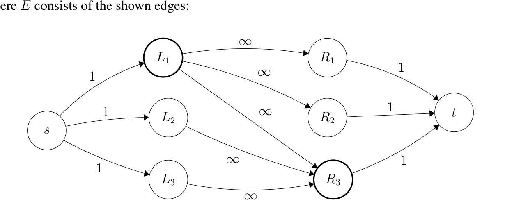
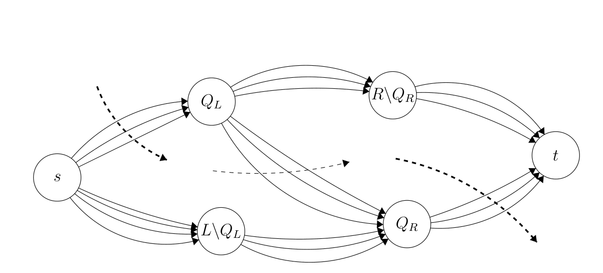
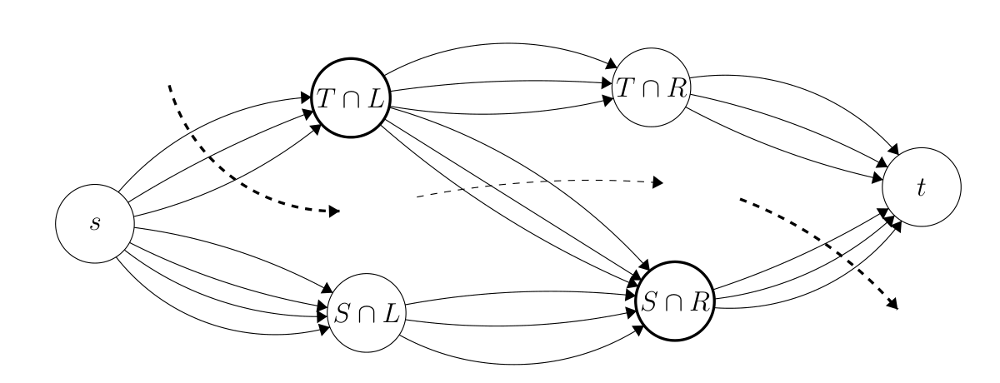

<!-- ===== PDF p1 ===== -->

<span style="color:#c0392b;">**6.046J / 18.410J　算法设计与分析（Design and Analysis of Algorithms）**</span>

<span style="color:#c0392b;">**Recitation 7（复习课 7）：Incremental Improvement: Applications of Network Flow & Matching（增量改进：网络流与匹配的应用）**</span> <span style="color:#7f8c8d;">（2015 年 4 月 3 日 · Massachusetts Institute of Technology（麻省理工学院），Profs. Erik Demaine, Srini Devadas and Nancy Lynch）</span>

<span style="color:#2471a3;">**[section]**</span> <span style="color:#c0392b;">**Edmonds-Karp Analysis（Edmonds-Karp 算法分析）**</span>

回顾（Recall）：Edmonds-Karp 是 Ford-Fulkerson method（福特-富尔克森方法）的一种高效实现，它在 residual graph（残余图）中选择最短的 augmenting paths（增广路径）。它为每条边赋予权重 1，并在 $G_f$ 上运行 BFS，找出从 $s$ 到 $t$ 的一条 breadth-first shortest path（广度优先最短路径）。

<span style="color:#2471a3;">**[theorem]**</span> <span style="color:#00838f;">**Monotonicity Lemma（单调性引理）.**</span> 设 $\delta(v) = \delta_f(s, v)$ 为在 $G_f$ 中从 $s$ 到 $v$ 的 breadth-first distance（广度优先距离）。在 Edmonds-Karp 算法运行过程中，$\delta(v)$ 单调递增（increases monotonically）。

<span style="color:#2471a3;">**[proof]**</span> **Proof（证明）.** 假设在 $G$ 上增广流量 $f$ 会产生新的流量 $f'$。令 $\delta'(v) = \delta_{f'}(s, v)$。我们将通过对 $\delta'(v)$ 作归纳（induction）来证明 $\delta'(v) \ge \delta(v)$。

**Base Case（基础情形）：** $\delta'(v) = 0$。这意味着 $v = s$；由于 $\delta(s) = 0$，且距离永远不可能为负（negative），因此有 $\delta'(s) \ge \delta(s)$。

**Inductive Case（归纳情形）：** 假设归纳假设（inductive hypothesis）对任意满足 $\delta'(u) < \delta'(v)$ 的 $u$ 成立，接下来我们证明它对 $v$ 也成立（原文此处拼写为 "hods"，应为 "holds"，系印刷笔误）。

考虑 $G_{f'}$ 中的一条广度优先路径 $s \to \cdots \to u \to v$。由于最短路径的子路径也是最短路径（subpaths of shortest paths are also shortest paths），必有 $\delta'(v) = \delta'(u) + 1$。同时注意到，由归纳假设（因为 $\delta'(u) < \delta'(v)$）有 $\delta'(u) \ge \delta(u)$。显然 $(u, v) \in E_{f'}$。下面我们在 $(u, v) \in E_f$ 与 $(u, v) \notin E_f$ 两种情形下分别证明 $\delta'(v) \ge \delta(v)$。

**Case 1（情形 1）：** $(u, v) \in E_f$。此时有：

```math
\begin{aligned}
\delta(v) &\leq \delta(u) + 1 && \text{(triangle inequality，三角不等式)} \\
&\leq \delta'(u) + 1 && \text{(inductive assumption，归纳假设)} \\
&= \delta'(v) && \text{(breadth-first path，广度优先路径)}
\end{aligned} \tag{1}
```

因此 $\delta'(v) \ge \delta(v)$，从而确立了 $\delta(v)$ 的单调性（monotonicity）。

---

<!-- ===== PDF p2 ===== -->

**（续）**

**Case 2（情形 2）：** $(u, v) \notin E_f$。此时 $(u, v) \in E_{f'}$ 的唯一可能是：产生 $f'$ 的增广路径 $p$ 一定包含了边 $(v, u)$。而且 $p$ 是 $G_f$ 中的一条广度优先路径：

```math
p = s \to \cdots \to v \to u
```

于是我们有：

```math
\begin{aligned}
\delta(v) &= \delta(u) - 1 && \text{(breadth-first path，广度优先路径)} \\
&\leq \delta'(u) - 1 && \text{(inductive assumption，归纳假设)} \\
&= \delta'(v) - 2 && \text{(breadth-first path，广度优先路径)} \\
&< \delta'(v)
\end{aligned} \tag{2}
```

从而这一情形下的单调性也得以确立。 $\square$

> <span style="color:#1e8449;">**[note]** </span> 关于单调性引理证明的第二情形：当 $(u, v) \notin E_f$ 时，$(u, v)$ 之所以能出现在残余图 $E_{f'}$ 中，唯一的原因就是本轮增广沿路径 $p$ 推过流量、从而「翻转」了反向边 $(v, u)$；这正是 residual reverse edge（残余反向边）机制的体现。式 (2) 的推导同时用到「$p$ 是最短路径」与归纳假设两层信息，最终得到 $\delta(v) \le \delta'(v) - 2 < \delta'(v)$，说明即便在这一最「坏」的情形下也依然有 $\delta(v) \le \delta'(v)$，即距离不会减小，$\delta(v)$ 的单调非减性（monotonicity）仍得到保证。该引理（Monotonicity Lemma，单调性引理）是整个 Edmonds-Karp 分析的基础：它断言各顶点的广度优先距离在算法过程中永不回落，从而在下一定理中才能把每条边成为 critical（关键边）的次数限制为 $O(V)$ 次。

<span style="color:#2471a3;">**[section]**</span> <span style="color:#c0392b;">**Counting Flow Augmentations（流量增广次数的计数）**</span>

<span style="color:#2471a3;">**[theorem]**</span> <span style="color:#00838f;">**Theorem（定理）.**</span> Edmonds-Karp 算法中 flow augmentations（流量增广）的次数为 $O(V E)$。

<span style="color:#2471a3;">**[proof]**</span> **Proof（证明）.** 对一条增广路径 $p$，定义 $c_f(p) = \min\{c_f(u, v) \mid (u, v) \in p\}$，即 $p$ 上各边 residual capacity（残余容量）的最小值。

设 $p$ 是一条增广路径，并假设对边 $(u, v) \in p$ 有 $c_f(p) = c_f(u, v)$。那么我们就称 $(u, v)$ 是 critical（关键边），并且它在流量增广后会从残余图中消失（disappear from the residual graph）。这是因为在增广过程中，路径 $p$ 上每条边的残余容量都会减少 $c_f(p)$，即有那么多新流量被推过这条增广路径；而由于 $c_f(u, v) - c_f(p) = 0$，该边在增广之后便消失了。

一条边 $(u, v)$ 第一次成为关键边时，因为 $p$ 是广度优先路径，我们有 $\delta(v) = \delta(u) + 1$。增广之后，我们必须等到 $(v, u)$ 出现在某条增广路径上，$(u, v)$ 才可能再次成为关键边。设 $\delta'$ 为 $(v, u)$ 位于增广路径上时 residual network（残余网络）中的距离函数，于是有：

```math
\begin{aligned}
\delta'(u) &= \delta'(v) + 1 && \text{(breadth-first path，广度优先路径)} \\
&\geq \delta(v) + 1 && \text{(monotonicity，单调性)} \\
&= \delta(u) + 2 && \text{(breadth-first path，广度优先路径)}
\end{aligned} \tag{3}
```

因此在边 $(u, v)$ 每次成为关键边的间隔之间，$\delta(u)$ 至少增加 2。由于 $\delta(u)$ 初始非负（non-negative），并且在顶点变得不可达（unreachable）之前至多为 $|V| - 1$，所以每条边至多成为关键边 $O(V)$ 次。又因为残余图中包含 $O(E)$ 条边，流量增广的总次数为 $O(V E)$。 $\square$

<span style="color:#2471a3;">**[theorem]**</span> <span style="color:#00838f;">**Corollary（推论）.**</span> Edmonds-Karp maximum-flow（最大流）算法在 $O(V E^2)$ 时间内运行。

<span style="color:#2471a3;">**[proof]**</span> **Proof（证明）.** 广度优先搜索（Breadth-First Search）运行时间为 $O(E)$，而增广次数为 $O(V E)$。其余所有 bookkeeping（簿记工作）每次增广为 $O(V)$。

> <span style="color:#1e8449;">**[note]** </span> 关于总时间 $O(V E^2)$：它由「每轮 BFS 的 $O(E)$ 时间 × $O(V E)$ 轮增广」直接相乘得到，其证明的关键正是单调性引理把每条边「消失后再复现」的次数限制在 $O(V)$ 次。与之对照，朴素的 Ford-Fulkerson method（福特-富尔克森方法）若随意挑选增广路径，在最坏情形下可能需要指数次增广（例如当容量含非整数或路径选择被刻意构造的病态实例）；而每次挑选最短增广路径就把总增广次数压到了多项式级。这一「每次取最短增广路径」的思想在后来的 Dinic's algorithm（Dinic 算法）中得到进一步发挥：它借助 level graph（分层图）与 blocking flow（阻塞流）把时间复杂度改进到 $O(V^2 E)$，在单位容量图（unit-capacity networks）上甚至更快。从渐近意义看，$O(V E^2)$ 这一界对稠密图（如 $E = \Theta(V^2)$）会退化为 $O(V^5)$，但仍远好于指数时间。

---

<!-- ===== PDF p3 ===== -->

<span style="color:#2471a3;">**[section]**</span> <span style="color:#c0392b;">**Applications of Network Flow（网络流的应用）**</span>

<span style="color:#2471a3;">**[section]**</span> <span style="color:#00838f;">**Vertex Cover（顶点覆盖）**</span>

给定一个无向图 $G = (V, E)$，若对于每条边 $(u, v) \in E$，集合 $S \subseteq V$ 都包含 $u$ 或 $v$ 中的至少一个，则称 $S$ 覆盖（covers）了 $G$。Vertex Cover problem（顶点覆盖问题）就是要求出覆盖 $G$ 且 $|S|$ 最小的集合 $S$。

Vertex Cover 在一般图（general graphs）上是 NP-Hard（NP 困难）的，但在二分图（bipartite graphs）上可在多项式时间内求解（polynomial time solvable）。

<span style="color:#2471a3;">**[section]**</span> <span style="color:#00838f;">**Bipartite Vertex Cover（二分顶点覆盖）**</span>

给定一个二分图 $G = (L \cup R,\ E \subseteq L \times R)$，求覆盖 $G$ 且 $|S|$ 最小的集合 $S$。

**Solution（解法）：** 给定 $G$，构造如下的 Flow Network（流网络）$H$：

- 新建一个源点（source vertex）$s$，并从 $s$ 到 $L$ 中每个顶点添加 capacity（容量）为 1 的边；
- 新建一个汇点（sink vertex）$t$，并从 $R$ 中每个顶点向 $t$ 添加容量为 1 的边；
- 把 $E$ 中所有边定向为从 $L$ 指向 $R$，并赋予每条边 $\infty$（无穷大）容量。

在 $H$ 上运行 Maximum Flow（最大流）并返回其值。

例如，考虑由 $G = (\{L_1, L_2, L_3\} \cup \{R_1, R_2, R_3\}, E)$ 构造的如下网络 $H$，其中 $E$ 由图中所示的边构成：



<span style="color:#7f8c8d;">**图（figure）**：流网络 $H$ 的示意：$s$ 分别以容量 1 连向 $L_1, L_2, L_3$；$L_i$ 与 $R_j$ 之间按 $E$ 中的边由 $L$ 指向 $R$、容量均为 $\infty$；$R_1, R_2, R_3$ 分别以容量 1 连向 $t$。</span>

在这个例子中，Maximum Flow（最大流）为 2，最小顶点覆盖（minimal vertex cover）为 $Q = \{L_1, R_3\}$ 且 $|Q| = 2$。

> <span style="color:#1e8449;">**[mathtip]** </span> 为什么 $s \to L$ 与 $R \to t$ 的边容量取 1？因为每个「左部-右部配对」在流网络中至多贡献 1 单位流量，取容量 1 就保证每个左部/右部顶点至多被选中一次，从而使最大流的值恰好等于二分图 maximum matching（最大匹配）的大小。而 $L \to R$ 的边取 $\infty$ 容量，是为了让最大流的瓶颈（bottleneck）只出现在源点与汇点一侧，保证「最大流值 = 匹配大小」这一对应关系不被中间边干扰——这正是下一节正确性证明（Claim 1 与 Claim 2）所依赖的结构。

---

<!-- ===== PDF p4 ===== -->

<span style="color:#2471a3;">**[section]**</span> <span style="color:#c0392b;">**Correctness of Bipartite Vertex Cover as Maximum Flow（二分顶点覆盖作为最大流的正确性）**</span>

<span style="color:#2471a3;">**[claim]**</span> <span style="color:#00838f;">**Claim 1（声明 1）.**</span> $H$ 的每个顶点覆盖 $Q$ 都对应定义一个有限值 $c(S, T)$ 的 cut（割）$(S, T)$。

<span style="color:#2471a3;">**[proof]**</span> **Proof（证明）.** 设 $Q = Q_L \cup Q_R$，其中 $Q_L = Q \cap L$，$Q_R = Q \cap R$。然后按如下方式定义割 $(S, T)$：

```math
\begin{aligned}
S &= \{s\} \cup Q_R \cup (L \setminus Q_L) \\
T &= \{t\} \cup Q_L \cup (R \setminus Q_R)
\end{aligned}
```

Proof by picture（用图证明）：



<span style="color:#7f8c8d;">**图（figure）**：割 $(S, T)$ 的示意：$S$ 侧包含 $s$、$Q_R$ 与 $L \setminus Q_L$；$T$ 侧包含 $t$、$Q_L$ 与 $R \setminus Q_R$。</span>

注意，不可能存在从 $L \setminus Q_L$ 指向 $R \setminus Q_R$ 的边，因为若存在这样的边，它的两个端点都未被覆盖，这就与「$Q$ 是合法顶点覆盖」相矛盾。从图中可以清楚地看出 $(S, T)$ 确实是 $H$ 中的一个割。同时也能清楚地看出 $c(S, T) = |Q_L| + |Q_R|$，因为跨越割 $(S, T)$ 的边只有从 $s$ 到 $Q_L$ 的所有边以及从 $Q_R$ 到 $t$ 的所有边，而它们每一条的容量都为 1。 $\square$

> <span style="color:#1e8449;">**[note]** </span> 原文此处写作 $c(S, T) = Q_L + Q_R$，其中 $Q_L$、$Q_R$ 应理解为集合的大小 $|Q_L|$、$|Q_R|$，因为割容量（cut capacity）是数值而集合不能直接相加，这是讲义中的记号简写。这一构造的直观含义是：把 $Q$ 中选入的左部顶点 $Q_L$ 与右部顶点 $Q_R$ 分别「留在 $T$ 侧」和「放入 $S$ 侧」，从而每条源点侧或汇点侧的容量 1 边恰好跨越割一次，割容量便精确等于 $|Q|$。

Claim 1 蕴含（implies）：$c(S^*, T^*) \le |Q^*|$，其中 $Q^*$ 是 $G$ 的 minimum Vertex Cover（最小顶点覆盖），$(S^*, T^*)$ 是 $H$ 中的 minimum cut（最小割）。

<span style="color:#2471a3;">**[claim]**</span> <span style="color:#00838f;">**Claim 2（声明 2）.**</span> 对 $H$ 中任意 finite cut（有限割）$(S, T)$，集合 $Q = (S \cap R) \cup (T \cap L)$ 都是 $G$ 的一个顶点覆盖。

<span style="color:#2471a3;">**[proof]**</span> **Proof（证明）.** 观察下图：



---

<!-- ===== PDF p5 ===== -->

**（续）**

<span style="color:#7f8c8d;">**图（figure）**：割 $(S, T)$ 的示意：$S$ 侧包含 $s$、$S \cap L$ 与 $S \cap R$；$T$ 侧包含 $t$、$T \cap L$ 与 $T \cap R$。</span>

注意，不可能存在从 $S \cap L$ 指向 $T \cap R$ 的边，因为那会使 $c(S, T)$ 变成无穷大，从而与「割必须是有限容量」的假设相矛盾。从图中可以清楚地看出，$G$ 中的每条边至少有一个端点在 $T \cap L$ 或 $S \cap R$ 之中，因此 $Q = (S \cap R) \cup (T \cap L)$ 确实覆盖了 $G$。同时也可以清楚地看出 $|Q| = |S \cap R| + |T \cap L| = c(S, T)$。 $\square$

Claim 2 蕴含：$|Q^*| \le c(S^*, T^*)$，其中 $(S^*, T^*)$ 是 $H$ 中的最小割，$Q^*$ 是 $G$ 的最小顶点覆盖。

<span style="color:#00838f;">**Punchline（点睛之笔）：**</span> 由 Claim 1 与 Claim 2 可知，$G$ 的最小顶点覆盖的大小 $|Q^*|$ 等于最小割 $(S^*, T^*)$ 的大小。又由于 Maximum Flow（最大流）等于 Minimum Cut（最小割），因此我们可以用前面描述的方式，借助最大流来求解 Bipartite Vertex Cover（二分顶点覆盖）。

> <span style="color:#1e8449;">**[note]** </span> 这一节本质上是在证明二分图版本的 Kőnig's theorem（柯尼希定理）：在二分图中，maximum matching（最大匹配）的大小恰好等于 minimum vertex cover（最小顶点覆盖）的大小。由于在 $H$ 中最大流的值等于最大匹配的大小（每个匹配对应对应一条 $s \to L_i \to R_j \to t$ 的单位流量路径），而由 Max-Flow Min-Cut Theorem（最大流-最小割定理）最小割又等于最小顶点覆盖，于是「最大流 = 最小割」这条对偶性（duality）一次性地把匹配与覆盖联系了起来。相比之下，一般图上的 Vertex Cover 是 NP-hard（NP 困难）的，已知最佳的多项式时间近似是 2-approximation（2 近似）算法，例如反复取一条未被覆盖边的两个端点加入解集（即基于 maximal matching（极大匹配）的贪心），它能保证解不超过最优值的两倍。掌握这一「构造流网络、把组合问题翻译成最大流」的套路，还可以用来解决 project selection（项目选择）、baseball elimination（棒球淘汰）等其他许多问题。

---

<!-- ===== PDF p6 ===== -->

<span style="color:#7f8c8d;">**MIT OpenCourseWare（麻省理工学院开放课程）**</span>

<span style="color:#7f8c8d;">http://ocw.mit.edu</span>

<span style="color:#7f8c8d;">6.046J / 18.410J Design and Analysis of Algorithms（算法设计与分析）　Spring 2015（2015 春季学期）</span>

<span style="color:#7f8c8d;">关于引用这些材料或我们的使用条款（Terms of Use）的信息，请访问：http://ocw.mit.edu/terms。</span>
