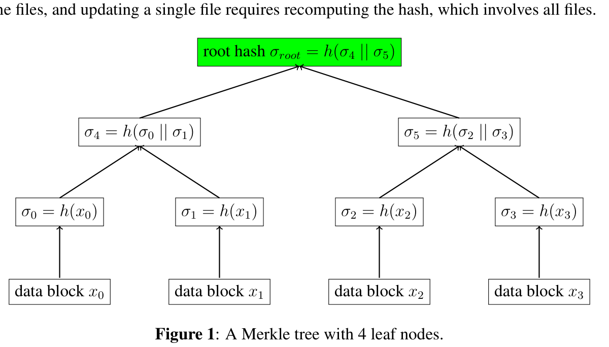

<!-- ===== PDF p1 ===== -->

<span style="color:#c0392b;">**6.046J / 18.410J　算法设计与分析（Design and Analysis of Algorithms）**</span>

<span style="color:#c0392b;">**Recitation 11（复习课 11）：Cryptography: More Primitives（密码学：更多原语）**</span> <span style="color:#7f8c8d;">（2015 年 5 月 8 日，Massachusetts Institute of Technology（麻省理工学院）；授课教授：Erik Demaine、Srini Devadas 与 Nancy Lynch）</span>

<span style="color:#2471a3;">**[section]**</span> <span style="color:#c0392b;">**1　Digital Signatures（数字签名）**</span>

在 lecture（讲课）中，我们曾把 digital signatures（数字签名）作为 hashing（哈希）的一种应用简要提及。现在，我们把 digital signatures（数字签名）作为一个独立的 primitive（原语）来介绍。

一个 digital signature scheme（数字签名方案）包含一对函数 Sign（签名）和 Verify（验证）：

```math
\sigma = \mathrm{Sign}(sk_A, m) \tag{1}
```

```math
b = \mathrm{Verify}(pk_A, m, \sigma) \tag{2}
```

第一步，Alice 用她的 secret key（私钥）$sk_A$ 对她想发送的消息 $m$ 签名，产生一个 digital signature（数字签名）$\sigma$。然后，我们希望任何从 Alice 处收到消息-签名对 $(m, \sigma)$ 的人，都能借助 Alice 的 public key（公钥）$pk_A$ 验证 $m$ 是否确实源自 Alice。

<span style="color:#2471a3;">**[section]**</span> <span style="color:#00838f;">**1.1　What properties do we want from digital signatures?（我们希望数字签名具备哪些性质？）**</span>

- **Correctness（正确性）**：若 $\sigma$ 是 $m$ 的一个签名，则 $b$ 应为 true（真）；否则 $b$ 应为 false（假）。
- **Unforgeability（不可伪造性）**：一个已经见过若干有效 message-signature pairs（消息-签名对）$(m_1, \sigma_1), (m_2, \sigma_2), \cdots, (m_t, \sigma_t)$ 的 adversary（敌手），不应能够为一条新消息构造出伪造，即 $(m^*, \sigma^*)$，其中 $m^* \neq m_i$（对 $i \in [1..t]$），使得 $\mathrm{Verify}(pk_A, m^*, \sigma^*)$ 输出 true（真）。

注意，没有任何（已知的）方法能阻止敌手转发他之前见过的有效 message-signature pair（消息-签名对）。这正是我们以上述方式定义 unforgeability（不可伪造性）要求的原因。

<span style="color:#2471a3;">**[section]**</span> <span style="color:#00838f;">**1.2　First attempt（第一次尝试）**</span>

在早期年代，研究者们提议把数字签名做成 public-key encryption（公钥加密）的逆运算：Sign 就是 decryption（解密），Verify 就是 encryption（加密）后再比较。以 RSA 为例，basic RSA signature scheme（基本 RSA 签名方案）的工作方式如下：

```math
\mathrm{Sign}: \sigma = m^d \bmod n
```

```math
\mathrm{Verify}: b = \sigma^e \stackrel{?}{\equiv} m \bmod n
```

其中 $d$ 是 RSA secret key（RSA 私钥），$(n, e)$ 是 RSA public key（RSA 公钥）。

<!-- ===== PDF p2 ===== -->

**（续）** 这一设计背后的希望是：(1) 把 $m$ 想象成 ciphertext（密文），如果我们解密它再重新加密，就会得到 $m$；(2) 要为 $m^*$ 伪造一个签名，敌手需要解密 $m^*$，而没有 secret key（私钥）他做不到。

（可以向全班同学发起挑战，试着攻破它。）问题之一在于 RSA 的 malleability（可展性，即 multiplicative homomorphism（乘法同态））。如果敌手见过两个有效的 message-signature pairs（消息-签名对）$(m_1, \sigma_1)$ 和 $(m_2, \sigma_2)$，他就能轻易构造出伪造 $(m_1 m_2, \sigma_1 \sigma_2)$：$\sigma_1 \sigma_2 = m_1^d m_2^d \equiv (m_1 m_2)^d \bmod n$ 是消息 $m_1 m_2$ 的一个有效签名。另一种攻击：选一个 $\sigma^*$，计算 $m^* = \sigma^{*e} \bmod n$，那么 $\sigma^*$ 就是 $m^*$ 的一个有效签名。

> <span style="color:#1e8449;">**[note]** </span> 直接对消息 $m$ 求 $d$ 次幂的"教科书式" RSA 签名，其根本弱点正源于 RSA 的 multiplicative homomorphism（乘法同态）性质 $\sigma_1 \sigma_2 = (m_1 m_2)^d \bmod n$。要抵御这类代数攻击，现代 RSA 签名标准都采用"哈希加填充"的方式，如 RSA-PSS（Probabilistic Signature Scheme，概率签名方案）：在哈希值中混入随机盐值并施加固定结构，破坏掉同态性。此外，第二种攻击本质上是 chosen-message attack（选择消息攻击）——敌手可以先选定 $\sigma^*$ 再"反推"出对应消息，说明"由签名反推消息"与"由消息构造签名"同样危险。

<span style="color:#2471a3;">**[section]**</span> <span style="color:#00838f;">**1.3　Second attempt（第二次尝试）**</span>

那么，直接采用 lecture（讲课）中提到的 hash-then-sign（先哈希后签名）方案如何，即把 (1) 和 (2) 中的 $m$ 替换为 $h(m)$？一个『好的』hash function（哈希函数）看起来确实能修复上述问题：它不应是 multiplicative（乘法性）的，从而阻止第一种攻击；它应当是 one-way（单向）的，从而阻止第二种攻击（若 $h(m^*) = \sigma^{*e}$，则没人能反推出 $m^*$）。当然，我们也已经看到，$h$ 还需要是 collision-resistant（抗碰撞）的；否则，组合而成的签名方案显然可以伪造。

的确，这样要好得多。事实上，已有与此思路类似的数字签名标准，即对带某种 padding（填充）的消息哈希值进行签名。例如，ANSI X9.31 标准对 $6bbb \cdots bbba \,\|\, h(m) \,\|\, 33cc$ 签名；PKCS #1 v1.5 标准对 $0001ff \cdots ff00 \,\|\, \mathrm{length}(h) \,\|\, h(m)$ 签名。

但我们怎么知道没有别的攻击呢？嗯，我们不知道。这正是这些设计的一个缺陷：它们建立在 ad-hoc security（特设的安全性）之上。我们不知道如何攻破它们，但我们也不知道如何证明它们的安全性。这正是现代密码学与这种思路分道扬镳之处：它试图把一个方案的安全性归约（reduce）到一个或几个简单、易于描述的假设之上。不过，现代密码学中的数字签名已超出 6.046 的范围。

<span style="color:#2471a3;">**[section]**</span> <span style="color:#c0392b;">**2　Message Authentication Codes（消息认证码）**</span>

到目前为止，我们已经见到了三种最常见的 cryptographic primitives（密码学原语）：public-key encryption（公钥加密）、private-key encryption（私钥加密）和 digital signatures（数字签名）。如果我们按『confidentiality（机密性）vs. integrity（完整性）』和『asymmetric（非对称）vs. symmetric（对称）』来分类，就有：

| | symmetric（对称） | asymmetric（非对称） |
|---|---|---|
| for confidentiality（用于机密性） | private-key encryption（私钥加密） | public-key encryption（公钥加密） |
| for integrity（用于完整性） | message authentication codes（消息认证码） | digital signatures（数字签名） |

剩下的那一格，即『symmetric integrity scheme（对称完整性方案）』，就是 Message Authentication Codes（消息认证码，MAC）。它的定义和要求与数字签名类似，区别仅在于它只有一个 key（密钥）$k$：

```math
\sigma = \mathrm{MAC}(k, m) \tag{3}
```

Verification（验证）只需检查是否 $\sigma \stackrel{?}{=} \mathrm{MAC}(k, m)$。Correctness（正确性）与 unforgeability（不可伪造性）的定义与数字签名中的类似。

<!-- ===== PDF p3 ===== -->

**（续）** **Q: Is a hash not a MAC（What's the relation/difference between a hash and a MAC）?（哈希难道不就是 MAC 吗——哈希与 MAC 的关系/区别是什么？）**

**A: No**，因为 hash（哈希）是一个人人都能计算的公开函数，所以 trivial（微不足道）地就能被伪造。但它很接近。一种流行的构造 MAC 的方法是用 keyed hash（带密钥的哈希）。最简单的一种（也是如今的标准做法）是在消息前拼上密钥，再用 SHA-3 哈希，即 $\sigma = \mathrm{SHA3}(k \,\|\, m)$；不过，并非每个 secure hash function（安全哈希函数）都能通过简单地前置密钥而变成一个 MAC。

> <span style="color:#1e8449;">**[note]** </span> MAC 与哈希的根本区别在于 MAC 引入了共享密钥：任何人都能计算哈希，但只有持有密钥的双方才能计算和验证 MAC，因此 MAC 不具备公开可验证性，这与数字签名"公钥可验证"的性质形成鲜明对比。除了本文提到的 keyed hash（带密钥哈希）外，业界更标准的构造是 HMAC（Hash-based Message Authentication Code，基于哈希的消息认证码），它通过 ipad/opad 双重哈希结构来抵御 length-extension attack（长度扩展攻击）。本文所说"直接把密钥前置"的 key-prefix 方案并非对一切哈希函数都安全，这正是 HMAC 采用更复杂结构的原因。

<span style="color:#2471a3;">**[section]**</span> <span style="color:#c0392b;">**3　Merkle Tree（Merkle 树）**</span>

现在考虑另一个需要完整性（integrity）的场景。Alice 在一台服务器（例如 Google Drive）上存放了一堆文件。Alice 如何验证她的文件没有被修改？在这个场景中，我们想要的是 freshness（新鲜性）：当 Alice 访问一个文件时，它应当是那个文件的最新版本（Alice 上次写入的内容）。

在这种情况下，MAC 和 digital signatures（数字签名）帮不上忙。攻击者（例如一个恶意的服务器）总能返回给 Alice 该文件的一个旧版本以及与之对应的 MAC/签名（回忆它们各自的 unforgeability（不可伪造性）定义）。对于这个应用，我们需要一个新的 primitive（原语）。

一个天真的方法（但在实践中或许合理）是让 Alice 在本地、在她自己的电脑上存储每个文件（最新版本）的一个哈希。假设 Alice 自己电脑上的数据不可能被敌手修改，那么 Alice 就能检测出对文件的任何修改。这里我们说 Alice 自己的电脑是 trusted storage（可信存储）或 local storage（本地存储）。如果 Alice 有 $n$ 个文件，她需要在本地存储 $n$ 个哈希，这需要 $O(n)$ 的 trusted storage（可信存储），可以说并不理想。另一种做法是，Alice 可以把她所有文件拼接在一起，产生一个单一的哈希，于是 trusted storage（可信存储）的需求降为 $O(1)$，但 time complexity（时间复杂度）变成 $O(n)$：验证一个文件需要下载全部文件，而更新一个文件需要重新计算哈希，这涉及所有文件。

```math
\sigma_{root} = h(\sigma_4 \,\|\, \sigma_5)
```

```math
\sigma_4 = h(\sigma_0 \,\|\, \sigma_1) \qquad \sigma_5 = h(\sigma_2 \,\|\, \sigma_3)
```

```math
\sigma_0 = h(x_0) \qquad \sigma_1 = h(x_1) \qquad \sigma_2 = h(x_2) \qquad \sigma_3 = h(x_3)
```

数据块（data block）$x_0$、$x_1$、$x_2$、$x_3$



<span style="color:#7f8c8d;">**Figure 1: A Merkle tree with 4 leaf nodes.（图 1：一棵含 4 个叶节点的 Merkle 树。）**</span>

Merkle tree（Merkle 树）或 hash tree（哈希树）[Merkle, 1980] 是这个问题的解决方案。在一棵 Merkle 树中，所有 data blocks（数据块）首先在 leaf nodes（叶节点）处被哈希。每个 intermediate node（中间节点）存储其子节点哈希拼接后的哈希，直到我们得到 root hash（根哈希），它被存储在 trusted storage（可信存储）中。

<!-- ===== PDF p4 ===== -->

**（续）** 所有的 intermediate hashes（中间哈希）和所有数据块都存放在 untrusted storage（不可信存储）中，可能被敌手修改。因此，一棵 Merkle 树只需 $O(1)$ 的 trusted storage（可信存储）。它的 verification（验证）与 updating（更新）时间复杂度为 $O(\lg n)$：验证/更新一个块，就是在哈希树中检查/更新一条 path（路径）。

如果底层的 hash function（哈希函数）是 collision-resistant（抗碰撞）的，那么这棵哈希树就是 collision-resistant（抗碰撞）的。直觉：若 $x_i$ 被修改，则 $\sigma_i$ 就会改变；否则就找到了一个 collision（碰撞）。若 $\sigma_i$ 改变，它的父节点就会改变；否则又找到一个碰撞……把同样的论证一路重复到根：要么根哈希改变，要么找到了一个碰撞。

> <span style="color:#1e8449;">**[note]** </span> Merkle tree（Merkle 树）由 Ralph Merkle 于 1980 年提出，如今是区块链、Git、Certificate Transparency（证书透明度）等系统中验证数据完整性的核心数据结构。它的关键优势在于：验证单个叶节点只需 $O(\lg n)$ 个哈希值和一条从叶到根的路径，无需下载全部数据。基于底层哈希函数的抗碰撞性，Merkle 树的抗碰撞性可以用反证法严格证明：若存在两个不同的树被哈希成同一个根，那么沿着它们产生差异的那条路径，必能构造出一个哈希碰撞。

<span style="color:#2471a3;">**[section]**</span> <span style="color:#c0392b;">**4　Review Knapsack Cryptosystems（回顾背包密码系统）**</span>

在这一部分，回顾 Merkle-Hellman cryptosystem（Merkle-Hellman 密码系统）（以 super-increasing knapsack（超递增背包）作为私钥，以 general knapsack（一般背包）作为公钥），并过一遍 lecture note（讲义）第 9 页上的例子。

<span style="color:#2471a3;">**[section]**</span> <span style="color:#00838f;">**4.1　Why is it broken?（它为什么被攻破？）**</span>

这个小节给出 intuition（直觉），而不是严格证明。设 trapdoor knapsack problem（陷门背包问题）为 $sk = \{u_1, u_2, \cdots, u_n\}$，变换后的 knapsack problem（背包问题）为 $pk = \{w_1, w_2, \cdots, w_n\}$，其中 $w_i = N u_i \bmod M$。

首先我们证明需要 $M > u_i$。设 $m_1 m_2 \cdots m_n$ 是输入消息 $m$ 的比特分解。对 $m$ 的加密得到 $S = \sum_i m_i w_i$。然后我们把这个和 $S$ 变换回 super-increasing knapsack problem（超递增背包问题）以便解密：

```math
T = N^{-1} S \bmod M
```

```math
= N^{-1} \sum_i m_i w_i \bmod M
```

```math
= N^{-1} \sum_i m_i N u_i \bmod M
```

```math
= \sum_i m_i u_i \bmod M
```

当且仅当 $M > u_i$ 时，求解 trapdoor knapsack problem（陷门背包问题）总是给出与求解 public-key knapsack（公钥背包）相同的结果。

> <span style="color:#1e8449;">**[note]** </span> 这里原文两处写的都是"$M > u_i$"，但正确的数学条件应为 $M > \sum_{i=1}^{n} u_i$，即模数 $M$ 必须大于超递增序列所有元素之和，才能使解码时 $\sum_i m_i u_i$（其中 $m_i \in \{0,1\}$）在 $[0, M)$ 内无歧义地还原出每个比特——这是 PDF 排版或提取时漏掉了求和号，属于印刷笔误。超递增背包的经典选参策略是让每个 $u_i$ 大于前面所有元素之和（例如 $u_i = 2^{i-1}t$ 量级），此时 $M > 2^{n-1} t$ 即可保证解码正确性。

接下来，我们还需要每个 $u_i$ 有足够大的取值范围供我们选择。如果范围太小，攻击者就能穷举每个 $u_i$ 的所有可能选择。一个合理的策略是：从 $[1, t]$ 中选 $u_1$，从 $[t+1, 2t]$ 中选 $u_2$，从 $[3t+1, 4t]$ 中选 $u_3$，从 $[(2^{i-1}-1)t + 1, 2^{i-1}t]$ 中选 $u_i$……那么，$M$ 应当大于 $2^{n-1}t$。注意，$w_i$ 中最大的元素会接近 $M$。于是 density（密度）为：

```math
d = \frac{n}{\max(\log_2 w_i)} \approx \frac{n}{\log_2 M} \approx \frac{n}{n - 1 + \log_2 t}
```

现在，我们面临一个两难困境。如果 $t$ 小，每个 $u_i$ 的取值范围就小，可能被穷举。

<!-- ===== PDF p5 ===== -->

**（续）** 作为参考，还有另一类攻击 [Shamir, 1984]：当 $t$ 小时，它能在 polynomial time（多项式时间）内以高概率找到一个不必然与 $sk$ 相同的 trapdoor knapsack（陷门背包）。如果 $t$ 大，density（密度）就低，针对 low-density knapsack problems（低密度背包问题）的攻击 [Lagarias and Odlyzko, 1985] 就会成功。多低的密度才算"低"？Lagarias 和 Odlyzko 猜想，当 $d < 0.645$ 时他们的攻击有很高的成功率，并且这个阈值后来被改进了。原始的 MH 方案 [Merkle and Hellman, 1978] 提议设 $t = 2n$，使 density（密度）约为 0.5，因此容易受到 low-density attacks（低密度攻击）的攻击。

> <span style="color:#1e8449;">**[note]** </span> Merkle-Hellman 背包密码系统被攻破的关键在于 density（密度）这一概念：低密度攻击把背包问题转化为在格中寻找最短向量的问题（CVP/SVP，最近向量问题/最短向量问题），再用 LLL 格基约化算法在多项式时间内求解；当密度 $d < 0.645$ 时攻击高概率成功。Shamir 在 1984 年更早地给出了针对原始参数的直接破解，而 MH 方案设 $t = 2n$ 使密度约为 0.5，正好落在可攻击的区间内。这段历史也是密码学史上一个著名教训：不能简单地把密码学建立在 NP-completeness（NP 完全性）之上，因为 NP 完全只保证 worst-case（最坏情形）困难，而密码学真正需要的是 average-case hardness（平均情形困难性）。

虽然大多数基于背包的密码系统都已被攻破，但也有少数至今抵抗住了所有攻击。它们仍然令人感兴趣，一是因为加解密速度快，二是因为我们渴望拥有多样化的密码系统（如果某一个被攻破了，我们还有另一个）。但基于背包的密码系统的最初动机被证明是不成功的：把密码学建立在 NP-completeness（NP 完全性）之上不太可能。NP-complete problems（NP 完全问题）可能只在 worst-case（最坏情形）下困难，而密码学需要的是 average-case hardness（平均情形困难性）。<sup>1</sup>

<span style="color:#2471a3;">**[section]**</span> <span style="color:#c0392b;">**A　A Clarification for the Lecture（对讲课内容的一点澄清）**</span>

判定一个整数 $N$ 是 prime（素数）还是 composite（合数）属于 $P$，这归功于 AKS primality algorithm（AKS 素性判定算法）[Agrawal, Kayal and Saxena, 2004]，它能在 polynomial time（多项式时间）内检查一个数是否为素数。而尚不知道是否属于 NPC（NP 完全类）的问题，是判定 $N$ 是否为合数且含有一个在某个范围内的因子。（讲义里保留了那个额外条件，但 Prof. Devadas 没有把它写在黑板上。）

> <span style="color:#1e8449;">**[note]** </span> AKS 素性判定算法（Agrawal–Kayal–Saxena，2004）是首个确定性的、多项式时间的素数判定算法，从而证明了素性判定问题属于 $P$。但要注意，素性判定属于 $P$ 并不意味着 integer factorization（整数分解）属于 $P$：分解问题至今没有已知的多项式时间算法，而这正是 RSA 等密码系统安全性的基础。文中澄清的是：真正未知是否属于 NPC 的，是"判定 $N$ 在给定范围内是否存在因子"这个受限问题，它与素性判定是两个完全不同的问题。

---
<span style="color:#7f8c8d;">**Footnote 1（脚注 1）：** 关于这个话题最好的综述可能是 Impagliazzo 的『five worlds（五个世界）』，出自他的 "A personal view of average-case complexity"（《平均情形复杂性的个人观点》），1995 年。</span>

<!-- ===== PDF p6 ===== -->

<span style="color:#7f8c8d;">**MIT OpenCourseWare（MIT 开放式课程）**</span>

<span style="color:#7f8c8d;">http://ocw.mit.edu</span>

<span style="color:#7f8c8d;">**6.046J / 18.410J Design and Analysis of Algorithms（算法设计与分析）**</span>

<span style="color:#7f8c8d;">**Spring 2015（2015 春季学期）**</span>

<span style="color:#7f8c8d;">关于引用这些材料或我们的 Terms of Use（使用条款）的信息，请访问：http://ocw.mit.edu/terms。</span>
