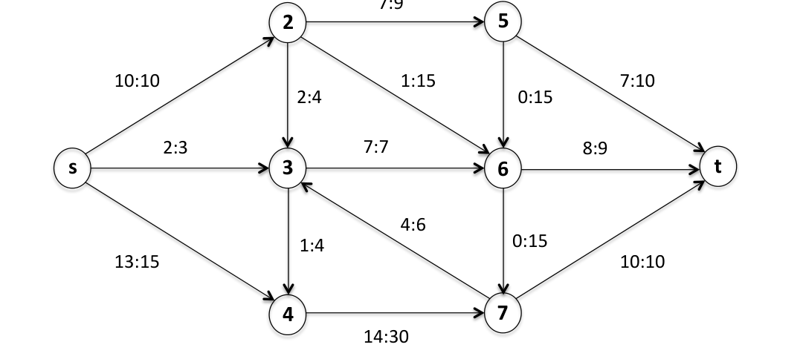
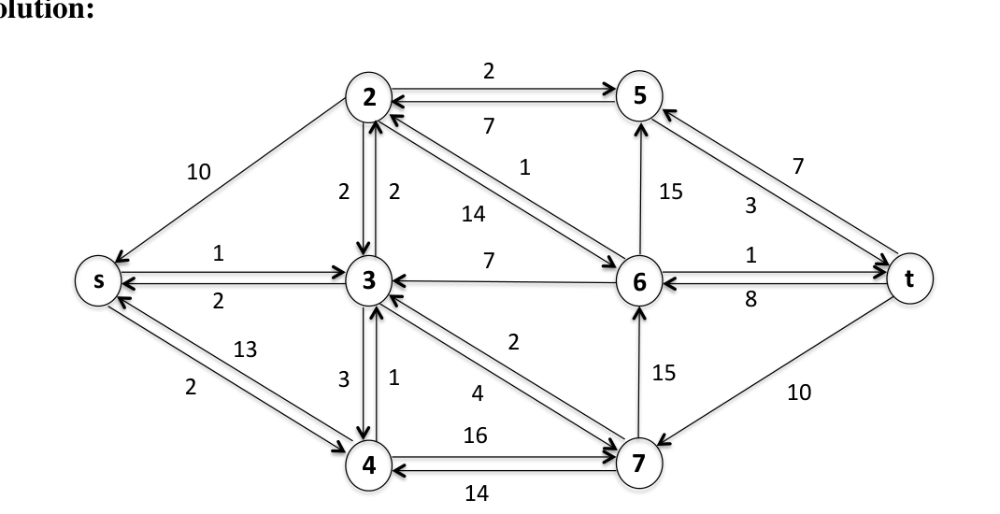
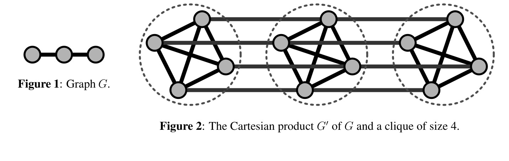

<!-- ===== PDF p1 ===== -->

<span style="color:#c0392b;">**6.046J / 18.410J　算法设计与分析（Design and Analysis of Algorithms）**</span>

<span style="color:#c0392b;">**期末解答（Final Solutions）**</span> <span style="color:#7f8c8d;">（2015 年 5 月 23 日 · Massachusetts Institute of Technology，麻省理工学院 · 6.046J/18.410J）</span>

<span style="color:#7f8c8d;">授课教授（Profs.）：Erik Demaine、Srini Devadas 与 Nancy Lynch</span>

**考试须知（Instructions）：**

- 在得到指示之前，请勿打开本试卷（exam booklet）。请先阅读所有说明。
- 本试卷包含 10 道题（problems），每题含多个小问（parts）。你有 180 分钟来争取 180 分。
- 本试卷共 20 页（pages），含本页。
- 本考试为闭卷（closed book）考试。你可以使用三张双面 letter（$8\frac{1}{2} \times 11''$）或 A4 尺寸的速查表（crib sheets）。不允许使用计算器或可编程设备（programmable devices）。手机必须收起。
- 不要在推导我们已研究过的事实上浪费时间，直接引用课堂上的结论（cite results from class）即可。
- 当考试要求你「给出算法（give an algorithm）」时，请用英文或伪代码（pseudocode）描述你的算法，并为正确性（correctness）与运行时间提供简短论证。除非有助于让解释更清晰，否则无需提供图示或示例。
- 不要在任一题上花费过多时间。通常，题目的分值（point value）即提示你应在其上花费多少分钟。
- 请展示你的解题过程（show your work），因为会给出部分得分（partial credit）。评分不仅看答案的正确性，也看你表达的清晰度。请保持整洁（be neat）。
- 祝好运（Good luck）！

<span style="color:#7f8c8d;">**分数表（Score Table）：**</span>

| 题号 Q | 标题（Title） | 分值（Points） | 小问数（Parts） | 得分（Grade） |
|---|---|---|---|---|
| 1 | True or False（判断正误） | 56 | 14 | |
| 2 | Überstructure（超级结构） | 10 | 1 | |
| 3 | Meancorp（均值公司） | 15 | 2 | |
| 4 | Forgetful Forrest（健忘的福雷斯特） | 15 | 3 | |
| 5 | Piano Recital（钢琴独奏会） | 15 | 3 | |
| 6 | Be the Computer（当一回计算机） | 14 | 3 | |
| 7 | Startups are Hard（创业艰难） | 20 | 3 | |
| 8 | Load Balancing（负载均衡） | 15 | 2 | |
| 9 | Distributed Coloring（分布式染色） | 20 | 3 | |
| 总计（Total） | | 180 | | |

姓名（Name）: ____

---

<!-- ===== PDF p2 ===== -->

<span style="color:#2471a3;">**[problem]**</span> <span style="color:#c0392b;">**Problem 1. True or False（判断正误）**</span> <span style="color:#7f8c8d;">[56 points（分）]（14 parts（小问））</span>

对下列每个陈述圈出 T 或 F，以表明该陈述为真（true）或假（false），并简要解释原因。

**（a）T F　<span style="color:#7f8c8d;">[4 points（分）]</span>** 假设算法 $A$ 有两个步骤，且只有当两个步骤都成功时 $A$ 才成功（succeeds）。若两个步骤分别以概率 $p_1$ 与 $p_2$ 成功，则 $A$ 以概率 $p_1 p_2$ 成功。

> <span style="color:#2471a3;">**[solution]**</span> **解答（Solution）：** 错误。除非这两个步骤相互独立（independent）。

---

**（b）T F　<span style="color:#7f8c8d;">[4 points（分）]</span>** 如果 divide-and-conquer（分治）convex hull（凸包）算法（来自 Lecture 2，第 2 讲）使用 $\Theta(n^2)$ 的策略来发现最大和最小切线（maximum and minimum tangents），那么整体算法将以 $\Theta(n^2 \log n)$ 时间运行。

> <span style="color:#2471a3;">**[solution]**</span> **解答（Solution）：** 错误。递推式（recurrence）将是 $T(n) = 2T(n/2) + \Theta(n^2)$，其解为 $T(n) = \Theta(n^2)$。

---

**（c）T F　<span style="color:#7f8c8d;">[4 points（分）]</span>** 为了获得「paranoid」（偏执型）quicksort（快速排序）（来自 Lecture 3，第 3 讲）的期望 $\Theta(n \log n)$ 运行时间，我们要求递归划分（divide）步骤把数组分成两个子数组（subarrays），每个子数组的大小至少为原数组的 $1/4$。

> <span style="color:#2471a3;">**[solution]**</span> **解答（Solution）：** 错误。只要它是原数组的一个常数比例（constant fraction），我们就能得到该界。

---

**（d）T F　<span style="color:#7f8c8d;">[4 points（分）]</span>** 一棵含 $n$ 个元素的 binary min-heap（二叉最小堆）支持 INSERT 在 $O(\log n)$ 摊还（amortized）时间内完成，并支持 DELETE-MIN 在 $O(1)$ 摊还时间内完成。

> <span style="color:#2471a3;">**[solution]**</span> **解答（Solution）：** 正确。与课堂上对 2-3 trees（2-3 树）中插入/删除所做的摊还分析相同。

> <span style="color:#1e8449;">**[note]** </span> 提取文本中此处作 "0 amortized time"，应为 $O(1)$ 的提取误差：由本题答案为 True 及课堂上对 2-3 树的摊还分析可知，DELETE-MIN 的摊还时间为 $O(1)$。

---

<!-- ===== PDF p3 ===== -->

**（e）T F　<span style="color:#7f8c8d;">[4 points（分）]</span>** 哈希族（hash family）$H = \{h_1, h_2\}$ 是 universal（全域的），其中 $h_1, h_2 : \{1, 2, 3\} \to \{0, 1\}$ 由下表定义：

| 键 | 1 | 2 | 3 |
|---|---|---|---|
| $h_1$ | 0 | 1 | 0 |
| $h_2$ | 1 | 0 | 1 |

（例如，$h_1(3) = 0$。）

> <span style="color:#2471a3;">**[solution]**</span> **解答（Solution）：** 错误。考虑元素 1 和 3：$h_1$ 与 $h_2$ 都会使二者发生碰撞（collision），因此尤其地，从 $H$ 中均匀随机（uniformly random）选取的哈希函数使 1 与 3 发生碰撞的概率为 1，大于 universal hashing（全域哈希）所允许的 $1/2$（因为共有 2 个哈希桶（hash buckets））。

---

**（f）T F　<span style="color:#7f8c8d;">[4 points（分）]</span>** 回顾用于计算 shortest paths（最短路径）的 $O(n^3 \lg n)$ 矩阵乘法算法，其中我们把矩阵乘法（matrix-multiplication）的算子对（operator pair）$(*, +)$ 替换为 $(+, \min)$。如果改而把算子对替换为 $(+, *)$，那么我们将计算每对顶点之间所有路径的权值之积。

> <span style="color:#2471a3;">**[solution]**</span> **解答（Solution）：** 错误。如果图中有环（cycle），则某些顶点对之间存在无穷多条路径，因此该乘积应为 $\pm\infty$；然而如果原矩阵的所有元素都是有限值（例如 clique（团）），矩阵乘法算法将计算出有限值。

---

**（g）T F　<span style="color:#7f8c8d;">[4 points（分）]</span>** 在带权无向图（weighted undirected graph）$G$ 中把所有边权取反（negating），然后求出 minimum spanning tree（最小生成树），所得即原图 $G$ 的最大权生成树（maximum-weight spanning tree）。

> <span style="color:#2471a3;">**[solution]**</span> **解答（Solution）：** 正确。

---

**（h）T F　<span style="color:#7f8c8d;">[4 points（分）]</span>** 在边权互不相同的（unique edge weights）图中，权重第二小（second-lowest）的生成树是唯一的。

> <span style="color:#2471a3;">**[solution]**</span> **解答（Solution）：** 错误，可以构造反例（counter-example）。

---

<!-- ===== PDF p4 ===== -->

**（i）T F　<span style="color:#7f8c8d;">[4 points（分）]</span>** 在 Floyd–Warshall 算法（弗洛伊德-沃舍尔算法）的递归（recursion）中：

```math
d_{uv}^{(k)} = \min\left\{d_{uv}^{(k-1)},\ d_{uk}^{(k-1)} + d_{kv}^{(k-1)}\right\},
```

$d_{uv}^{(k)}$ 表示从顶点 $u$ 到顶点 $v$、所含边数至多为 $k$ 的最短路径长度。

> <span style="color:#2471a3;">**[solution]**</span> **解答（Solution）：** 错误。$d_{uv}^{(k)}$ 是仅使用顶点 $\{1, 2, \cdots, k\}$ 作为中间节点（intermediate nodes）的、从顶点 $u$ 到顶点 $v$ 的最短路径长度。

---

**（j）T F　<span style="color:#7f8c8d;">[4 points（分）]</span>** 考虑一个基于任意无向图 $G = (V, E)$ 的进程网络，其中有一个特殊顶点 $v_0 \in V$。每个顶点 $v \in V$ 处的进程以一个正整数 $x_v$ 开始。目标是由 $v_0$ 处的进程计算最大值 $\max_{v \in V} x_v$。存在一个 asynchronous（异步）distributed algorithm（分布式算法），用 $O(\text{diam}^2 d)$ 时间和 $O(E + \text{diam} \cdot n)$ 条消息解决该问题。

> <span style="color:#2471a3;">**[solution]**</span> **解答（Solution）：** 正确。利用 Problem 10-2 中的算法，我们可以在给定的时间与消息界内构造一棵以 $v_0$ 为根的 BFS 树（BFS tree）。根进程可以广播（broadcast）一个信号，告知所有进程这棵树已经完成。然后各进程可以用这棵树向上汇聚（convergecast）各自的值，在消息沿树向上移动的过程中计算最大值。广播与汇聚两个阶段都不会超过 BFS 构造所用的界。

> <span style="color:#1e8449;">**[note]** </span> 提取文本中此时间界作 "O(diam2d)"，此处按字面还原为 $O(\text{diam}^2 d)$；其与消息界 $O(E + \text{diam} \cdot n)$ 配合，无论尾缀 "$d$" 是否为提取残留，都不影响本题"存在这样的算法"的判断结论。

---

**（k）T F　<span style="color:#7f8c8d;">[4 points（分）]</span>** 假设一台 file server（文件服务器）在存储文件内容之外，还存储每个文件的哈希（hash）。当你从服务器下载一个文件时，你同时下载其哈希并确认它与文件内容匹配。只要哈希函数具有 collision resistance（抗碰撞性），该系统就能安全地验证所下载文件未被 adversary（敌手）篡改。

> <span style="color:#2471a3;">**[solution]**</span> **解答（Solution）：** 错误。该方案并不安全，因为敌手可以简单地用任意文件及其对应的哈希替换原有文件与哈希，而你无法分辨出任何差别。

---

<!-- ===== PDF p5 ===== -->

**（l）T F　<span style="color:#7f8c8d;">[4 points（分）]</span>** 假设 Alice、Bob 和 Charlie 分别秘密生成 $a$、$b$ 和 $c$，并分别公开 $g^a \bmod p$、$g^b \bmod p$ 与 $g^c \bmod p$，其中 $p$ 为素数（prime）。那么 Alice、Bob 和 Charlie 都能计算出 $g^{abc} \bmod p$，作为只有他们三人知晓的 shared secret（共享秘密）。

> <span style="color:#2471a3;">**[solution]**</span> **解答（Solution）：** 错误。例如，Alice 只知道 $a$、$g^b$ 与 $g^c$，因此她能算出 $g^{ab}$ 和 $g^{ac}$，但无法算出 $g^{abc}$。

---

**（m）T F　<span style="color:#7f8c8d;">[4 points（分）]</span>** 最优 cache-oblivious（缓存无关）算法所使用的 memory transfers（内存传输）次数，总是至少等于同一问题的最优 external-memory（外部内存）算法所使用的内存传输次数。

> <span style="color:#2471a3;">**[solution]**</span> **解答（Solution）：** 正确。把隐式（implicit）的内存传输显式化（explicit），利用 LRU（最近最少使用，Least Recently Used）策略即可。

---

**（n）T F　<span style="color:#7f8c8d;">[4 points（分）]</span>** 如果一个问题存在 time-optimal（时间最优）的 divide-and-conquer（分治）算法，那么该算法在 cache-oblivious（缓存无关）模型下关于内存传输次数也是最优的。

> <span style="color:#2471a3;">**[solution]**</span> **解答（Solution）：** 错误。例如：binary search（二分查找）。

---

<!-- ===== PDF p6 ===== -->

<span style="color:#2471a3;">**[problem]**</span> <span style="color:#c0392b;">**Problem 2. Überstructure（超级结构）**</span> <span style="color:#7f8c8d;">[10 points（分）]（1 part（小问））</span>

设计一个 data structure（数据结构），在满足下列操作与时间界（time bounds）的前提下维护一个含 $n$ 个元素的动态集合（dynamic set）$S$：

| 操作（Operation） | 作用（Effect） | 时间界（Time Bound） |
|---|---|---|
| 1. INSERT($x$, $S$) | 把 $x$ 插入 $S$。 | $O(\log n)$ 期望摊还（expected amortized） |
| 2. DELETE($x$, $S$) | 从 $S$ 中删除 $x$。 | $O(\log n)$ 期望摊还 |
| 3. SUCCESSOR($x$, $S$) | 找出 $S$ 中大于 $x$ 的最小元素。 | $O(\log n)$ 最坏情况（worst-case） |
| 4. FIND-MIN($S$) | 返回 $S$ 中的最小元素。 | $O(1)$ 最坏情况 |
| 5. SEARCH($x$, $S$) | 若元素 $x$ 在 $S$ 中则返回 TRUE。 | $O(1)$ 期望（expected） |

描述这些操作如何在你的数据结构上实现，并论证它们的运行时间。

> <span style="color:#2471a3;">**[solution]**</span> **解答（Solution）：** 使用一棵 balanced binary search tree（平衡二叉搜索树）和一张 hash table（哈希表）。在平衡二叉搜索树的根上增广（augment）存储最小元素的值。
>
> **INSERT（插入）：** 把元素同时插入平衡二叉搜索树和哈希表。若该元素小于当前最小值，则更新根上存储的最小值。插入树需要 $O(\log n)$ 最坏情况时间，插入哈希表需要 $O(1)$ 期望摊还时间，总计为 $O(\log n)$ 期望摊还。（事实上，以高概率（with high probability），插入哈希表至多需要 $O(\log n)$。）
>
> **DELETE（删除）：** 在树和哈希表中找到该项，并从两者中删除。按需重新平衡（rebalance）树；若最小元素已被删除，则更新根上的最小值。删除（包括重新平衡）花费 $O(\log n)$，而利用二叉搜索树找到最小元素需要 $O(\log n)$。
>
> **FIND-MIN（求最小）：** 返回存储在根节点的最小值。这需要 $O(1)$ 最坏情况时间。
>
> **SEARCH（查找）：** 检查元素是否存在于哈希表中。这需要 $O(1)$ 期望时间。

---

<!-- ===== PDF p7 ===== -->

<span style="color:#2471a3;">**[problem]**</span> <span style="color:#c0392b;">**Problem 3. Meancorp（均值公司）**</span> <span style="color:#7f8c8d;">[15 points（分）]（2 parts（小问））</span>

你负责 Meancorp（均值公司）的工资数据库（salary database），它以 2-3 tree（2-3 树）按工资排序存储所有员工工资。Meancorp 定期向 Department of Fairness（公平部门）编制关于公司内低收入员工工资的报告。你被要求实现一个新的数据库操作 AVERAGE($x$)，它返回所有工资至多为 $x$ 的员工的平均工资。

**（a）　<span style="color:#7f8c8d;">[10 points（分）]</span>** 每个节点需要额外存储什么信息？描述如何利用这些额外信息在 $O(\lg n)$ 时间内回答一次 AVERAGE($x$) 查询。

> <span style="color:#2471a3;">**[solution]**</span> **解答（Solution）：** 每个节点 $x$ 应存储 $x.size$（以 $x$ 为根的子树的大小）与 $x.sum$（以 $x$ 为根的子树中所有键值之和）。对值 $x > 0$，设 $S_x$ 为所有小于等于 $x$ 的键的集合，设 $A_x$ 与 $B_x$ 分别为 $S_x$ 的和与大小。
>
> 我们可以如下计算 $A_x$。设 $u$ 为键大于 $x$ 的最小叶子（leaf）。利用 2-3 树中的 SEARCH，从根出发找到 $u$ 只需 $O(\lg n)$ 时间。现在考虑从树根到 $u$ 的路径。显然，$A_x$ 是该路径左侧所有叶子之和。因此，$A_x$ 可以通过对每个节点 $y$ 的 $y.sum$ 求和来计算，其中 $y$ 是路径中某个节点的左兄弟（left sibling）。由于这样的节点 $y$ 只有 $\lg n$ 个，计算 $A_x$ 只需 $O(\lg n)$ 时间。
>
> 计算 $B_x$ 与此类似：不再对 $y.sum$ 求和，而是对 $y.size$ 求和。因此，计算 $B_x$ 也只需 $O(\lg n)$ 时间。
>
> 因此，AVERAGE($x$)，即 $A_x / B_x$，可以在 $O(\lg n)$ 时间内回答。

**（b）　<span style="color:#7f8c8d;">[5 points（分）]</span>** 描述如何修改 INSERT 来维护这些信息。简要论证 INSERT 的最坏情况运行时间仍为 $O(\lg n)$。

> <span style="color:#2471a3;">**[solution]**</span> **解答（Solution）：** 维护 $x.size$ 与 recitation（复习课）和 homework（作业）中讲过的方法类似。维护 $x.sum$ 也完全相同：当节点 $x$ 被插入时，我们只需为 $x$ 的每个祖先（ancestor）$y$ 把 $y.sum$ 增加 $x.key$ 那么多。当一个节点发生分裂（split）时，我们为分裂出的节点及其父节点重新计算 $x.sum$ 属性。因此，INSERT 的最坏情况运行时间仍为 $O(\lg n)$。


<!-- ===== PDF p8 ===== -->

<span style="color:#2471a3;">**[problem]**</span> <span style="color:#c0392b;">**Problem 4. Forgetful Forrest（健忘的福雷斯特）**</span> <span style="color:#7f8c8d;">[15 分，3 部分]</span>

Forrest Gump 教授非常健忘，因此他为自己的约会使用自动日历提醒（automatic calendar reminders）。对于他收到的每个事件提醒，他有 50% 的几率真正记住该事件（由一次独立的掷硬币决定）。

**(a) [5 分]** 假设我们为 $n$ 个事件中的每一个发送 $k$ 条提醒。Forrest 能记住的约会的期望数（expected number）是多少？请用 $k$ 和 $n$ 表示你的答案。

> <span style="color:#2471a3;">**[solution]**</span> **解答（Solution）:** 这些都是相互独立的事件，因此可以应用期望的线性性质（linearity of expectation）。每个给定事件被记住的概率为 $1 - 2^{-k}$，因此期望上有 $n(1 - 2^{-k})$ 个约会会被记住。

**(b) [5 分]** 假设我们为单个事件发送 $k$ 条提醒。我们应该如何相对于 $n$ 设置 $k$，使得 Forrest 能以高概率（with high probability）记住该事件，即 $1 - 1/n^{\alpha}$？

> <span style="color:#2471a3;">**[solution]**</span> **解答（Solution）:** 这个问题等价于：必须掷多少次硬币才能以高概率得到一次正面。连续 $k$ 次出现反面的概率为 $1/2^k$。因此恰好 $\alpha \lg n$ 次掷硬币就足够了。

**(c) [5 分]** 假设我们为 $n$ 个事件中的每一个发送 $k$ 条提醒。我们应该如何相对于 $n$ 设置 $k$，使得 Forrest 能以高概率记住所有事件，即 $1 - 1/n^{\alpha}$？

> <span style="color:#2471a3;">**[solution]**</span> **解答（Solution）:** 我们必须至少发送 $k = \Omega(\lg n)$ 条提醒，因为以高概率记住一个事件就需要这么多提醒。如果我们发送 $k = (\alpha + 1) \lg n$ 条提醒，那么每个事件被记住的概率为 $1 - 1/n^{\alpha+1}$。由联合界（union bound），我们知道所有事件被记住的概率为 $1 - 1/n^{\alpha}$。因此，所需提醒的数量为 $k = O(\lg n)$。

---

<!-- ===== PDF p9 ===== -->

<span style="color:#2471a3;">**[problem]**</span> <span style="color:#c0392b;">**Problem 5. Piano Recital（钢琴独奏会）**</span> <span style="color:#7f8c8d;">[15 分，3 部分]</span>

Chopin 教授即将举办一场钢琴独奏会，为了准备，他想尽可能多地学习曲目。有 $m$ 首他可能学习的曲目。每首曲目 $i$ 需要 $p_i$ 小时来学习。Chopin 教授总共有 $T$ 小时可以自学（在感到厌倦之前）。此外，他有 $n$ 位钢琴老师。每位老师 $j$ 最多花 $t_j$ 小时教学。老师们非常严格，所以他们只会教 Chopin 教授一首曲子，而且只有当没有其他老师在教学他这首曲子时才会教。

因此，为了学习曲目 $i$，Chopin 教授可以 (1) 花 $p_i$ 小时自学，从 $T$ 小时的自学预算（self-learning budget）中支出；或者 (2) 选择一位独一无二的老师 $j$（没有被任何其他曲目选中的），一起学习 $\min\{p_i, t_j\}$ 小时，如果有剩余小时（$p_i > t_j$），再用 $p_i - t_j$ 小时的自学预算学习剩余部分。（只学习一首曲子的部分是没有用的。）

**(a) [6 分]** 假设 Chopin 教授决定恰好学习 $k$ 首曲子。证明他只需要考虑 $k$ 个最小的 $p_i$ 和 $k$ 个最大的 $t_j$。

> <span style="color:#2471a3;">**[solution]**</span> **解答（Solution）:** 假设存在一个用于学习 $k$ 首曲子的老师和曲目选择方案。设 $k$ 个最小曲目的集合为 $P_k$。如果我们的选择中存在一首曲子 $\notin P_k$，那么必然有 $P_k$ 中的一首曲子不在最终选择中。如果我们把花费较高（$\notin P_k$）的那首曲子与花费较低（$\in P_k$）的那首交换，那么由此产生的新选择仍然有效，因为如果之前的选择中较高的时间花费能够得到满足，那么新选择中较低的时间花费也仍然能够得到满足。用这种方式，我们可以不断交换曲子，直到它们全部 $\in P_k$。类似地，我们可以把老师换成价值更高的那些，直到它们成为时间最大的 $k$ 位老师。

---

<!-- ===== PDF p10 ===== -->

**(b) [5 分]** 在 (a) 的前提下，给出一个有效的贪心算法（greedy algorithm）来确定 Chopin 教授能否恰好学会 $k$ 首曲子。论证其正确性。

> <span style="color:#2471a3;">**[solution]**</span> **解答（Solution）:** 让我们事先把所有老师和曲目按递增顺序排序，称排序后的列表为 $P$ 和 $T$。我们注意到，如果存在一个解，那么也存在一个解使得 $P_1$ 与 $T_{n-k+1}$ 配对，$P_2$ 与 $T_{n-k+2}$ 配对，依此类推。因此，对每个 $1 \le i \le k$，贪心算法检查是否 $P_i \le T_{n-k+i}$。如果是，那么我们就不需要为这首曲子使用共享时间（shared time）。如果不是，我们需要使用 $T_{n-k+i} - P_i$ 的共享时间。我们可以把这些值累加起来。最后，如果所需的总共享时间 $> T$，我们返回 false；否则返回 true。除去最初的排序，这需要 $O(k)$ 时间。

**(c) [4 分]** 把 (b) 作为黑盒（black box），给出一个有效算法，找出 Chopin 教授最多能学会的曲目数。分析其运行时间。

> <span style="color:#2471a3;">**[solution]**</span> **解答（Solution）:** 注意到如果 $k_{\max}$ 是我们能学会的曲目数的最大值，那么对于任何 $k \le k_{\max}$，我们也能学会 $k$ 首曲子。这提示我们可以对 $k$ 的值进行二分搜索（binary search）。在二分搜索中我们尝试 $O(\log n)$ 个值，检查每个值需要 $O(n)$ 时间，因此总共需要 $O(n \log n)$ 时间。排序也花了 $O(n \log n)$ 时间，所以整个算法总共需要 $O(n \log n)$ 时间。

---

<!-- ===== PDF p11 ===== -->

<span style="color:#2471a3;">**[problem]**</span> <span style="color:#c0392b;">**Problem 6. Be the Computer（扮演计算机）**</span> <span style="color:#7f8c8d;">[14 分，3 部分]</span>

考虑如下流网络（flow network）及初始流（initial flow）$f$。我们将执行 Edmonds–Karp（埃德蒙兹–卡普）算法的一次迭代。



> <span style="color:#1e8449;">**[note]**</span> 原图位于 PDF 中：该流网络含节点 $s$、$4$、$t$、$5$、$6$、$2$、$3$、$7$，各边以「flow : capacity」（流量 : 容量）形式标注为 $10{:}10$、$13{:}15$、$0{:}15$、$10{:}10$、$14{:}30$、$4{:}6$、$1{:}4$、$2{:}4$、$7{:}9$、$7{:}10$、$8{:}9$、$1{:}15$、$0{:}15$、$2{:}3$、$7{:}7$。

**(a) [5 分]** 画出 $G$ 关于 $f$ 的残量图（residual graph）$G_f$。

> <span style="color:#2471a3;">**[solution]**</span> **解答（Solution）:** 残量图的各条边（以残量容量标注）为：$10$、$2$、$15$、$10$、$14$、$4$、$1$、$2$、$2$、$7$、$1$、$1$、$15$、$1$、$7$、$2$、$8$、$2$、$13$、$2$、$3$、$16$、$7$、$14$、$3$。



**(b) [4 分]** 列出最短增广路（augmenting path）上的顶点，即边数最少的增广路。

> <span style="color:#2471a3;">**[solution]**</span> **解答（Solution）:**
>
> ```math
> s \to 3 \to 2 \to 5 \to t
> ```
>
> 或
>
> ```math
> s \to 3 \to 2 \to 6 \to t
> ```

---

<!-- ===== PDF p12 ===== -->

**(c) [5 分]** 执行增广（augmentation）。得到的流的值（value）是多少？

> <span style="color:#2471a3;">**[solution]**</span> **解答（Solution）:** $26$。增广流的值为 $1$。

---

<!-- ===== PDF p13 ===== -->

<span style="color:#2471a3;">**[problem]**</span> <span style="color:#c0392b;">**Problem 7. Startups are Hard（创业很难）**</span> <span style="color:#7f8c8d;">[20 分，3 部分]</span>

为了你的新创业公司 Uber for Algorithms，你正试图把项目分派给员工。你有一个由 $n$ 个项目组成的集合 $P$，以及一个由 $m$ 名员工组成的集合 $E$。每名员工 $e$ 只能做一个项目，而每个项目 $p \in P$ 有一个必须分派给 $p$ 才能完成 $p$ 的员工子集 $E_p \subseteq E$。我们要解决的判定问题（decision problem）是：能否把员工分派给项目，使得我们能够完成（至少）$k$ 个项目。

**(a) [5 分]** 给出一个直接的算法，检查任意大小为 $k$ 的项目子集能否被完成，以求解该判定问题。用 $m$、$n$ 和 $k$ 分析其时间复杂度。

> <span style="color:#2471a3;">**[solution]**</span> **解答（Solution）:** 对每个 $\binom{n}{k}$ 个大小为 $k$ 的 $k$ 项目子集，检查是否有员工被多于一个项目所需要。这可以简单地通过遍历这 $k$ 个项目 $p$ 来实现：把 $E_p$ 中的员工标记为所需，如果任何员工被标记了两次，则该子集失败。如果任意大小为 $k$ 的项目子集能够被完成，输出「yes」，否则输出「no」。
>
> 时间复杂度为 $\binom{n}{k} \cdot m$，因为共有 $\binom{n}{k}$ 个大小为 $k$ 的子集，每个子集花费 $O(m)$ 时间（因为除一名员工外，其余员工只会被标记一次）。渐近地，这等于 $(n/k)^k m$。

**(b) [5 分]** 你在 (a) 中的算法是固定参数可解（fixed-parameter tractable，FPT）的吗？简要解释。

> <span style="color:#2471a3;">**[solution]**</span> **解答（Solution）:** 不是。FPT 算法要求时间复杂度为 $n^{O(1)} f(k)$。相比之下，在我们的运行时间中，$n$ 的指数会随着 $k$ 的增大而增大。

<!-- ===== PDF p14 ===== -->

**(c) [10 分]** 通过从三维匹配（3D matching）的归约证明该问题是 NP-hard（NP 困难）的。

回忆三维匹配问题：给定三个集合 $X$、$Y$、$Z$，每个大小为 $m$；一个三元组集合 $T \subseteq X \times Y \times Z$；以及一个整数 $k$。目标是确定是否存在一个由（至少）$k$ 个不相交三元组组成的子集 $S \subseteq T$。

> <span style="color:#2471a3;">**[solution]**</span> **解答（Solution）:** 每个 $(x, y, z) \in T$ 变成一个项目，它需要的员工为 $E_{(x,y,z)} = \{e_x, e_y, e_z\}$。因此 $n = |T|$，$E = X \cup Y \cup Z$，且 $m = |X| + |Y| + |Z|$。我们把 $k$ 在两个问题中设为相同的值。匹配的大小等于能够完成的项目数，因为两个问题都刻画了不相交性（disjointness）：如果 $k$ 个项目能被完成，就能找到大小为 $k$ 的子集 $S$，反之亦然。该归约需要多项式时间（polynomial time）。


<!-- ===== PDF p15 ===== -->

<span style="color:#2471a3;">**[problem]**</span> <span style="color:#c0392b;">**Problem 8. Load Balancing（负载均衡）**</span> <span style="color:#7f8c8d;">[15 points]（2 parts）</span>

假设你需要完成 $n$ 个任务（job），完成任务 $i$ 所需的时间为 $t_i$。给你 $m$ 台相同的机器（machine）$M_1, M_2, \ldots, M_m$ 来运行这些任务。每台机器一次只能运行一个任务，且每个任务必须完整地在单独一台机器上运行。如果你把一组任务 $J_j \subseteq \{1, 2, \ldots, n\}$ 分配给机器 $M_j$，那么它将需要 $T_j = \sum_{i \in J_j} t_i$ 的时间。你的目标是把这 $n$ 个任务划分（partition）到 $m$ 台机器上，使得 $\max_i T_i$ 最小。

<span style="color:#c0392b;">**(a) [5 points]**</span> 描述一个针对该问题的贪心近似算法（greedy approximation algorithm）。

> <span style="color:#2471a3;">**[solution]**</span> **Solution（解答）:** 令 $J_j$ 为机器 $M_j$ 将要运行的任务集合，$T_j$ 为机器 $M_j$ 忙碌的总时间（即 $T_j = \sum_{i \in J_j} t_i$）。初始时，对所有 $j$，$J_j = \emptyset$，$T_j = 0$。对 $i = 1, \ldots, n$，把任务 $i$ 分配给满足 $T_j = \min_{1 \le k \le m}(T_k)$ 的机器 $M_j$。也就是说，$J_j = J_j \cup \{i\}$，且 $T_j = T_j + t_i$。输出各个 $J_j$。
>
> 通过基于每台机器的当前总运行时间维护一个关于机器的最小堆（min-heap），该算法运行时间为 $O(n \lg m)$。

> <span style="color:#2471a3;">**[solution]**</span> **Solution（解答）— 备选解法（Alternate solution）:** 将任务按非递增顺序（non-increasing order）排序。不失一般性（without loss of generality），设按序排列后的任务为 $t_1, \ldots, t_n$。令 $J_j = \{t_k : k \equiv j \pmod m\}$。采用不同排序顺序与分配方式的该算法变体同样可行。排序任务需要 $O(n \lg n)$ 时间。

---

<!-- ===== PDF p16 ===== -->

<span style="color:#c0392b;">**(b) [10 points]**</span> 证明你在 (a) 中的算法是一个 2-近似算法（2-approximation algorithm）。

*Hint（提示）:* 确定最优解 OPT 的一个理想界（ideal bound）。然后考虑运行时间最长（$T_T$ 最大）的机器 $M_T$，以及最后加入它的那个任务 $i^*$。

> <span style="color:#2471a3;">**[solution]**</span> **Solution（解答）:** 最优解的一个下界（lower bound）是
>
> ```math
> L = \max\left(\frac{1}{m}\sum_{i=1}^{n} t_i,\ \max_{1 \le i \le n}(t_i)\right)
> ```
>
> 因为你最多只能把（分数意义上的）任务均匀划分，而且（最优调度）至少要运行与最长任务一样久。
>
> 现在令 $M_T$ 为运行时间最长的机器，令 $i^*$ 为使用贪心算法最后分配给 $M_T$ 的任务。令 $T_j^*$ 为在分配 $i^*$ 之前 $M_j$ 所有任务的总运行时间；于是 $T_T^* = \min_j T_j^*$。我们有
>
> ```math
> m \cdot T_T^* \le \sum_{1 \le j \le m} T_j^* = \sum_{1 \le i \le i^*} t_i \le \sum_{1 \le i \le n} t_i \le m \cdot L,
> ```
>
> <span style="color:#1e8449;">**[note]** </span> 上式中间那个等号应理解为 $\le$：因为贪心按 $i = 1, \ldots, n$ 的顺序分配任务，在加入 $i^*$ 之前各机器的负载 $T_j^*$ 之和只包含任务 $1$ 到 $i^* - 1$，即 $\sum_{j} T_j^* = \sum_{i=1}^{i^*-1} t_i \le \sum_{i=1}^{i^*} t_i$。原文写成等号是把 $t_{i^*}$ 也算进去了（多计一项，方向安全）。结论 $T_T^* \le L$ 不受影响。
>
> 这推出 $T_T^* \le L$。综合起来，我们有 $T_T = T_T^* + t_{i^*} \le L + t_{i^*} \le 2L \le 2\text{OPT}$。因此，这是一个 2-近似算法。

> <span style="color:#2471a3;">**[solution]**</span> **Solution（解答）— 备选解法证明（Proof for alternate solution）:** 令 $L$ 为上述定义的下界。考虑最长任务 $t_n$。令 $k \equiv n \pmod m$，并令 $S_k = T_k - t_n$。对所有 $j$，必有 $S_k \le T_j$：对 $j > k$，我们加入（到 $J_j$ 中）的元素每个都至少与 $S_k$ 的每个元素一样大；对 $j < k$，设有 $a = \lceil n/m \rceil$ 个任务，且由于任务已排序，$J_j$ 中最后 $a-1$ 个任务大于 $J_k$ 中前 $a-1$ 个任务，这同样说明 $S_k \le T_j$。于是
>
> ```math
> \sum_{i=1}^{n} t_i = t_n + S_k + \sum_{j \ne k} T_j \ge t_n + m S_k.
> ```
>
> 因此 $m S_k \le \sum_{i=1}^{n} t_i$，推出 $S_k \le L$。又由于 $t_n \le L$，我们得到 $t_n + S_k \le 2L \le 2\text{OPT}$。

> <span style="color:#1e8449;">**[note]** </span> 原文中备选解法的证明存在笔误/提取残缺：如「$a = \lceil n/m \rceil$ 个任务」在原 PDF 中残缺难辨；且「对 $j > k$ 分支声称 $S_k \le T_j$」的论证并非对所有情形严格成立——例如 $n = 7, m = 3$ 时，$J_2 = \{t_2, t_5\}$，其负载 $T_2 = t_2 + t_5$ 未必 $\ge S_1 = t_1 + t_4$（因 $t_1 \ge t_2$ 且 $t_4 \ge t_5$）。不过「按非递增序排序后按模 $m$ 轮转分配是 2-近似」这一结论本身正确，可由贪心列表调度（list scheduling）的经典论证得出。此处照实翻译原文。

---

<!-- ===== PDF p17 ===== -->

<span style="color:#2471a3;">**[problem]**</span> <span style="color:#c0392b;">**Problem 9. Distributed Coloring（分布式着色）**</span> <span style="color:#7f8c8d;">[20 points]（3 parts）</span>

考虑一个无向图（undirected graph）$G = (V, E)$，其中每个顶点的度（degree）至多为 $\Delta$。定义一个新图 $G' = (V', E')$，它是 $G$ 与一个大小为 $\Delta + 1$ 的团（clique）的笛卡尔积（Cartesian product）。具体地，$V'$ 是所有二元组 $(v, i)$ 的集合，其中 $v \in V$，$i$ 为满足 $0 \le i \le \Delta$ 的整数；$E'$ 由两类边组成：

1. 对每条边 $\{u, v\} \in E$，在 $E'$ 中，对所有 $0 \le i \le \Delta$，$(u, i)$ 与 $(v, i)$ 之间都有一条边。（因此，每个下标 $i$ 形成 $G$ 的一个副本。）
2. 对每个顶点 $v \in V$，在 $E'$ 中，对所有满足 $i \ne j$、$0 \le i, j \le \Delta$ 的 $(v, i)$ 与 $(v, j)$ 之间都有一条边。（因此，每个 $v$ 形成一个 $(\Delta + 1)$-团。）

以下是 $\Delta = 3$ 时该变换的一个例子：



<span style="color:#7f8c8d;">*Figure 1（图 1）：Graph $G$（图 $G$）。*</span>

<span style="color:#7f8c8d;">*Figure 2（图 2）：The Cartesian product $G'$ of $G$ and a clique of size 4（$G$ 与大小为 4 的团的笛卡尔积 $G'$）。*</span>

<span style="color:#c0392b;">**(a) [8 points]**</span> 令 $S$ 为 $G'$ 的任意极大独立集（maximal independent set，即把任何其他顶点加入 $S$ 都会破坏独立性）。证明：对每个顶点 $v \in V$，$S$ 恰好包含 $V'$ 中 $\Delta + 1$ 个形如 $(v, i)$ 的顶点中的一个。*Hint（提示）:* 使用鸽巢原理（Pigeonhole Principle）。

> <span style="color:#2471a3;">**[solution]**</span> **Solution（解答）:** $S$ 不可能包含多于一个这样的顶点，因为所有这些顶点在 $G'$ 中两两相连，若包含多个就会破坏独立性。
>
> 现在反设（为导出矛盾），对某个特定的 $u$，$S$ 不含任何形如 $(u, i)$ 的顶点。那么由极大性，每个形如 $(u, i)$ 的顶点都必须在 $S$ 中有某个 $G'$-邻居。由于该邻居不是 $(u, *)$ 形式的，它必是 $(v, i)$ 形式的，其中某个 $v$ 满足 $(u, v) \in E$。
>
> 因此，$\Delta + 1$ 个形如 $(u, i)$ 的顶点中，每一个都在 $S$ 中有某个形如 $(v, i)$ 的邻居，其中 $(u, v) \in E$。由于 $u$ 在 $G$ 中至多有 $\Delta$ 个邻居，由鸽巢原理，必有两个不同的 $i$ 值，设为 $i_1$ 和 $i_2$，使得存在同一个 $v$，满足 $(u, i_1)$ 是 $(v, i_1)$ 的 $G'$-邻居、$(u, i_2)$ 是 $(v, i_2)$ 的 $G'$-邻居，且 $(v, i_1)$ 与 $(v, i_2)$ 都在 $S$ 中。这是矛盾的，因为 $S$ 至多能包含一个形如 $(v, *)$ 的顶点。

---

<!-- ===== PDF p18 ===== -->

**（续）**

<span style="color:#c0392b;">**(b) [8 points]**</span> 现在考虑基于图 $G$ 的同步进程网络（synchronous network of processes），其中每个顶点都知道度的一个上界 $\Delta$。给出一个分布式算法（distributed algorithm），求 $G$ 的一个顶点 $(\Delta + 1)$-着色（vertex coloring），即从 $V$ 中顶点到颜色集合 $\{0, 1, \ldots, \Delta\}$ 的一个映射，使得相邻顶点颜色互不相同。与每个顶点关联的进程应输出它的颜色。论证其正确性。

*Hint（提示）:* 把 (a) 与 Luby 算法（Luby's algorithm）结合。

> <span style="color:#2471a3;">**[solution]**</span> **Solution（解答）:** 「颜色」将从 $\{0, 1, \ldots, \Delta\}$ 中选取。
>
> $G$ 的各个节点模拟针对 $G'$ 的一个 MIS（极大独立集）算法。具体地，与 $G$ 的顶点 $u$ 关联的节点，模拟 $G'$ 中与形如 $(u, i)$ 的顶点关联的 $\Delta + 1$ 个节点。该算法为 $G'$ 产出一个 MIS $S$，$G$ 的每个节点都会知道它所模拟的节点中哪些对应 $S$ 中的顶点。由 (a)，对 $G$ 的每个顶点 $u$，存在唯一的颜色 $i$ 使得 $(u, i) \in S$；与 $u$ 关联的节点就选择这个颜色 $i$。
>
> 显然，该策略至多使用 $\Delta + 1$ 种颜色。为说明 $G$ 中任意两个邻居不会被染成同一种颜色，反设邻居 $u$ 与 $v$ 被染成同一种颜色，设为 $i$。这意味着 $(u, i)$ 与 $(v, i)$ 都在 $S$ 中。但 $(u, i)$ 与 $(v, i)$ 在 $G'$ 中是邻居，这与 $S$ 的独立性矛盾。
>
> 许多学生写到的另一种解法是：依次在 $G$ 上直接执行 $\Delta + 1$ 遍 Luby 的 MIS。在第 $i$ 遍中，把胜者（winner）染成颜色 $i$；然后在执行下一遍之前，仅移除这些胜者。这样可行，但略去了有关同步相继各遍开始的某些细节；此外，其性能比上述推荐解法差不少。

<span style="color:#c0392b;">**(c) [4 points]**</span> 分析用这种方式解决着色问题所需的期望时间与通信开销（communication cost），包括 Luby 算法的开销。

> <span style="color:#2471a3;">**[solution]**</span> **Solution（解答）:** 开销恰等于在 $G'$ 上求解 MIS 的开销；最终决策是局部的（local），不需要任何额外轮次（round）。
>
> **Time（时间，即轮次数）:** 在 $G'$ 上求解 MIS 的期望时间是 $O(\lg (n \cdot \Delta))$，因为 $G'$ 中的节点数为 $n \cdot (\Delta + 1)$。$O(\lg (n \cdot \Delta))$ 这一界可以简化为 $O(\lg n)$。
>
> **Communication（通信，即消息数）:** 期望消息数为 $O(E \lg n)$，对应于 $O(\lg n)$ 轮，并且每一轮在所有边上（两个方向）发送消息。

---

<!-- ===== PDF p19 ===== -->

<span style="color:#7f8c8d;">**SCRATCH PAPER（草稿纸）**</span>

---

<!-- ===== PDF p20 ===== -->

<span style="color:#7f8c8d;">**SCRATCH PAPER（草稿纸）**</span>

---

<!-- ===== PDF p21 ===== -->

<span style="color:#7f8c8d;">**MIT OpenCourseWare**</span>
<span style="color:#7f8c8d;">http://ocw.mit.edu</span>
<span style="color:#7f8c8d;">**6.046J / 18.410J 算法设计与分析（Design and Analysis of Algorithms）**</span>
<span style="color:#7f8c8d;">2015 春季学期（Spring 2015）</span>
<span style="color:#7f8c8d;">关于引用这些材料或使用条款（Terms of Use）的信息，请访问：http://ocw.mit.edu/terms</span>
