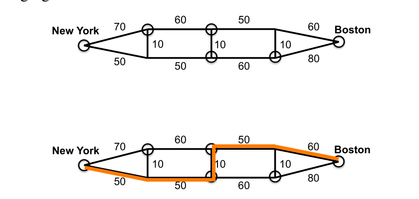
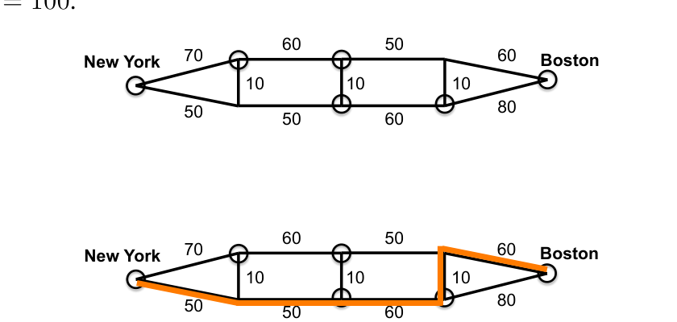
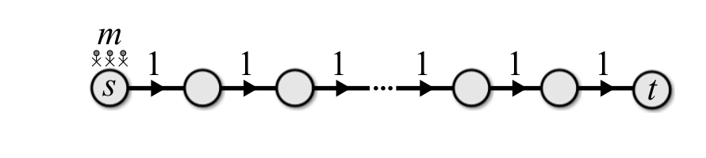

<!-- ===== PDF p1 ===== -->

<span style="color:#c0392b;">**6.046J / 18.410J　算法设计与分析（Design and Analysis of Algorithms）**</span>

<span style="color:#c0392b;">**Quiz 2 解答（Quiz 2 Solutions）**</span> <span style="color:#7f8c8d;">（Spring 2015，2015 春季学期）</span>

<span style="color:#7f8c8d;">麻省理工学院（Massachusetts Institute of Technology）· 2015 年 4 月 20 日（April 20, 2015）· Profs. Erik Demaine, Srini Devadas, and Nancy Lynch</span>

考试须知（Instructions）：

- 直到指示你开始之前，不要打开本测验册（quiz booklet）。请先阅读所有说明。
- 本测验包含 6 道大题，每题含多个小题。你有 120 分钟去赢得 120 分。
- 本测验册共 11 页，含本页。
- 本测验为闭卷（closed book）。允许使用两张双面 letter 纸（$8\frac{1}{2} \times 11''$）或 A4 速查表（crib sheet）。不允许使用计算器或可编程设备。手机必须收好。
- 不要把时间浪费在推导我们已经学过的结论上，直接引用课堂上的结果即可。
- 当本测验要求你「给出算法（give an algorithm）」时，用英文或伪代码（pseudocode）描述你的算法，并对正确性（correctness）和运行时间给出简短论证。除非有助于把你的解释讲得更清楚，否则无需提供图示或示例。
- 不要在任一题目上花费过多时间。通常，一题的分值即提示你该在上面花多少分钟。
- 请写出你的过程，因为会给予部分分（partial credit）。评分不仅看答案的正确性，也看你表达的清晰度。请保持整洁。
- 祝好运（Good luck）！

问题目录（Problem Table）：

| 题号 Problem | 标题 Title | 分值 Points | 小题数 Parts | 得分 Grade | 签名 Initials |
|---|---|---|---|---|---|
| 1 | True or False（判断题） | 40 | 10 |  |  |
| 2 | Who Charged the Electric Car?（谁给电动车充了电？） | 20 | 3 |  |  |
| 3 | Planning Ahead（提前规划） | 10 | 1 |  |  |
| 4 | Maze Marathoner（迷宫马拉松选手） | 20 | 3 |  |  |
| 5 | 6.046 Carpool（6.046 拼车） | 10 | 1 |  |  |
| 6 | Paths and/or Cycles（路径与/或环） | 20 | 2 |  |  |
| Total（合计） |  | 120 |  |  |  |

姓名（Name）:

<!-- ===== PDF p2 ===== -->

**（续）**

<span style="color:#2471a3;">**[problem]**</span> <span style="color:#c0392b;">**Problem 1. True or False（判断题）**</span> <span style="color:#7f8c8d;">[40 points]（40 分）(10 parts)（10 小题）</span>

对下列每个命题圈出 T 或 F，以表示该命题为真（true）或假（false），并简要说明原因。

**(a)** T F [4 points]（4 分）利用 Strassen 矩阵乘法算法（Strassen's matrix multiplication algorithm）中使用的类似技巧，Floyd–Warshall 算法的运行时间可以改进到 $O(V^{\log_2 7})$。

> <span style="color:#2471a3;">**[solution]**</span> **解答（Solution）：** 错误（False）。没有办法定义取负（negation）运算。

**(b)** T F [4 points]（4 分）对于满足 $E = O(V^{1.5})$ 的图 $G = (V, E)$，Johnson 算法（Johnson's algorithm）渐近地快于 Floyd–Warshall。

> <span style="color:#2471a3;">**[solution]**</span> **解答（Solution）：** 正确（True）。当 $E = o(V^2)$ 时，$O(VE + V^2 \log V) = o(V^3)$。

**(c)** T F [4 points]（4 分）考虑这样的有向图（directed graph）：每个顶点代表动态规划（dynamic programming）中的一个子问题（subproblem），当且仅当子问题 $p$ 依赖于（递归地调用）子问题 $q$ 时，存在从 $p$ 到 $q$ 的边。那么这个图是一棵有向根树（directed rooted tree）。

> <span style="color:#2471a3;">**[solution]**</span> **解答（Solution）：** 错误（False）。它是一个有向无环图（Directed Acyclic Graph，DAG）。

**(d)** T F [4 points]（4 分）在连通带权图（connected, weighted graph）中，每条权重最低的边（lowest weight edge）总是属于某棵最小生成树（minimum spanning tree）。

> <span style="color:#2471a3;">**[solution]**</span> **解答（Solution）：** 正确（True）。它可以成为 Kruskal 算法（Kruskal's algorithm）加入的第一条边。

**(e)** T F [4 points]（4 分）对于有 $n$ 个顶点且恰好有 $n$ 条边的连通带权图，可以在 $O(n)$ 时间内找到一棵最小生成树。

> <span style="color:#2471a3;">**[solution]**</span> **解答（Solution）：** 正确（True）。这种图只包含一个环（cycle），可以用 DFS（深度优先搜索，depth-first search）找到它。只需移除该环上最重的边即可。

<!-- ===== PDF p3 ===== -->

**（续）**

**(f)** T F [4 points]（4 分）对于每条边都具有整数容量（integer capacity）的流网络（flow network），Ford–Fulkerson 算法在 $O((V + E)|f|)$ 时间内运行，其中 $|f|$ 是最大流（maximum flow）。

> <span style="color:#2471a3;">**[solution]**</span> **解答（Solution）：** 正确（True）。迭代次数至多为 $O(|f|)$，因为每次迭代都会使流量至少增加 1。

**(g)** T F [4 points]（4 分）设 $C = (S, V \setminus S)$ 是流网络中的一个最小割（minimum cut）。如果我们严格增大跨越 $C$ 的每条边的容量，那么网络的最大流必定增大。

> <span style="color:#2471a3;">**[solution]**</span> **解答（Solution）：** 错误（False）。可能存在另一个容量不变的最小割，此时最大流保持不变。

**(h)** T F [4 points]（4 分）每个线性规划（linear program）都有唯一的最优解（optimal solution）。

> <span style="color:#2471a3;">**[solution]**</span> **解答（Solution）：** 错误（False）。如果目标函数（objective function）与某个约束（constraint）平行，那么可能存在许多最优解。
>
> 另解（Alternative solution）：错误（False）。也可能根本没有任何解。
>
> <span style="color:#7f8c8d;">（注：原 PDF 中「Alternative solution: False. There could be no solutions at all.」这一句重复出现两次，疑为排版重复，此处合并为一句。）</span>

**(i)** T F [4 points]（4 分）即使 $P = NP$，3SAT 也无法在多项式时间（polynomial time）内求解。

> <span style="color:#2471a3;">**[solution]**</span> **解答（Solution）：** 错误（False）。如果 $P = NP$，那么 $P$ 中的所有问题也都是 NP 难（NP-hard）的，而这些问题都有多项式时间算法。

**(j)** T F [4 points]（4 分）反复选取度数最大（maximum degree）的顶点并删除其关联的边，是顶点覆盖（Vertex Cover）问题的一个 2-近似算法（2-approximation algorithm）。

> <span style="color:#2471a3;">**[solution]**</span> **解答（Solution）：** 错误（False）：它可能差到只是 log-log 近似（approximation），参见 L17 讲义（notes）。

---

<!-- ===== PDF p4 ===== -->

<span style="color:#2471a3;">**[problem]**</span> <span style="color:#c0392b;">**Problem 2. Who Charged the Electric Car?（谁给电动车充了电？）**</span> <span style="color:#7f8c8d;">[20 points]（20 分）(3 parts)（3 小题）</span>

Musk 教授正驾驶他的 Nikola 电动车（electric car）从波士顿（Boston）开往纽约（New York）。他想走最短路径（shortest path），但他的车在需要充电之前只能行驶 $m$ 英里。幸运的是，从波士顿到纽约的路上设有 Furiouscharger 充电站（charging station），可以瞬间把电池充满。

道路网络（road network）以带权无向图（weighted undirected graph）$G = (V, E, w)$ 的形式给出，并附带拥有充电站的顶点子集 $C \subseteq V$。每条权重 $w(e)$ 表示道路 $e$ 的（正）长度。目标是找到一条从节点 $s \in V$ 到节点 $t \in V$ 的最短路径，使得在两个充电站之间的行驶不超过 $m$ 英里。假设 $s, t \in C$。

**(a)** [4 points]（4 分）在下面这个图中，画出 $m = \infty$ 时从 Boston 到 New York 的最短路径。充电站用圆圈（circle）标出。



<span style="color:#7f8c8d;">**【图】从 Boston 到 New York 的道路网络图（带权无向图）。各边权重为 $50, 70, 10, 10, 10, 50, 60, 80, 60, 50, 60$；充电站以圆圈标出。原图由后处理统一插入。</span>

> <span style="color:#2471a3;">**[solution]**</span> **解答（Solution）：** 在原图中画出从 Boston 到 New York 的最短路径（高亮标出，见解答图；原图由后处理统一插入）。

**(b)** [4 points]（4 分）在下面这个（相同的）图中，画出 $m = 100$ 时从 Boston 到 New York 的最短路径。



<span style="color:#7f8c8d;">**【图】与 (a) 相同的道路网络图。原图由后处理统一插入。</span>

> <span style="color:#2471a3;">**[solution]**</span> **解答（Solution）：** 在原图中画出满足充电约束的最短路径（高亮标出，见解答图；原图由后处理统一插入）。

**(c)** [12 points]（12 分）给出一个求解该问题的算法。要获得满分，你的算法应运行在 $O(VE + V^2 \log V)$ 时间内。

> <span style="color:#2471a3;">**[solution]**</span> **解答（Solution）：** 我们的算法分为两步——第一步在原图 $G$ 上运行 Johnson 算法（Johnson's algorithm），得到每一对顶点之间的最短路径长度。设 $\delta(u, v)$ 表示在 $G$ 中顶点 $u$ 与 $v$ 之间的最短路径长度。

<!-- ===== PDF p5 ===== -->

**（续）**

> 第二步，我们构造一个顶点集为 $C$ 的图 $G'$。在新图 $G'$ 中，对每一对顶点 $u$ 和 $v$，若 $\delta(u, v) \le m$，则在 $u$ 与 $v$ 之间画一条权重为 $\delta(u, v)$ 的边，否则权重为 $\infty$。
>
> 现在，在 $G'$ 上对 Boston 与 New York 运行 Dijkstra 算法（Dijkstra's algorithm），得到最短路径。（注意 New York 和 Boston 都有充电站，因此它们是图 $G'$ 中的顶点。）
>
> 在原图 $G$ 上运行 Johnson 算法耗时 $O(VE + V^2 \log V)$。构造图 $G'$ 耗时 $O(E)$，在 $G'$ 上运行 Dijkstra 算法耗时 $O(V^2 + V \log V)$；由此得到的总运行时间复杂度为 $O(VE + V^2 \log V)$。
>
> <span style="color:#1e8449;">**[note]** </span> 原文「构造 $G'$ 耗时 $O(E)$」并不精确：$G'$ 是以充电站集合 $C$ 为顶点集的完全图（clique），构造它需要对 $C$ 中每一对顶点逐对检查 $\delta(u,v) \le m$，因此时间是 $O(|C|^2) = O(V^2)$（多源 Dijkstra 的部分已经包含在 Johnson 的 $O(VE + V^2\log V)$ 里）。把这项并入后总复杂度仍为 $O(VE + V^2 \log V)$，结论不变。

---

<!-- ===== PDF p6 ===== -->

<span style="color:#2471a3;">**[problem]**</span> <span style="color:#c0392b;">**Problem 3. Planning Ahead（提前规划）**</span> <span style="color:#7f8c8d;">[10 points]（10 分）(1 part)（1 小题）</span>

你现在有 $N$ 个习题集（pset，problem set）到期，但你一个都还没开始做，所以它们全都将延迟（late）。每个 pset 需要 $d_i$ 天才能完成，并且每天有 $c_i$ 的成本惩罚（cost penalty）。因此，如果 pset $i$ 最终延迟 $t$ 天完成，它就会产生 $t \cdot c_i$ 的惩罚。假设一旦你开始做某个 pset，就必须一直做到完成，并且不能同时做多个 pset。

例如，假设你有三个习题集：6.003 需要 3 天，每天惩罚 12 分；6.046 需要 4 天，每天惩罚 20 分；6.006 需要 2 天，每天惩罚 4 分。那么最佳顺序是 6.046、6.003、6.006，产生的总惩罚为 $20 \cdot 4 + 12 \cdot (4 + 3) + 4 \cdot (3 + 4 + 2) = 200$ 分。

给出一个贪心算法（greedy algorithm），输出使所有 pset 的总惩罚最小的完成顺序。分析运行时间并证明正确性（correctness）。

> <span style="color:#2471a3;">**[solution]**</span> **解答（Solution）：** 按 $d_i/c_i$ 递增排序，并按该顺序完成各 pset。这需要 $O(N \log N)$ 时间。
>
> 证明（Proof）——若顺序未排序，则可以通过交换（swapping）来改进。若 $d_i/c_i > d_j/c_j$，则
>
> ```math
> \frac{d_i}{c_i} > \frac{d_j}{c_j} \;\Longrightarrow\; c_j d_i + (c_i d_i + c_j d_j) > c_i d_j + (c_i d_i + c_j d_j) \tag{1}
> ```
>
> ```math
> \Longrightarrow\; c_j(d_i + d_j) + c_i d_i > c_i(d_i + d_j) + c_j d_j \tag{2}
> ```

> <span style="color:#1e8449;">**[mathtip]**</span> 这里的交换论证（exchange argument）要点如下：只看相邻的 $i$、$j$ 两项，若 $i$ 先于 $j$，二者对总惩罚的贡献为 $c_i d_i + c_j(d_i + d_j)$；若 $j$ 先于 $i$，则为 $c_j d_j + c_i(d_i + d_j)$（其余 pset 的完成时间不受交换影响，故在比较中抵消）。由 $d_i/c_i > d_j/c_j$ 两边同乘 $c_i c_j > 0$ 可得 $c_j d_i > c_i d_j$，代入即知「$i$ 在前」的贡献更大——把比值更小的 pset 提前总是更优。反复交换可把任意顺序化为按 $d_i/c_i$ 递增的顺序，因此该贪心顺序即为最优。


<!-- ===== PDF p7 ===== -->

<span style="color:#2471a3;">**[problem]**</span> <span style="color:#c0392b;">**Problem 4. Maze Marathoner（迷宫马拉松选手）**</span> <span style="color:#7f8c8d;">[20 points]（20 分）(3 parts)（3 小题）</span>

一组 $m$ 名青少年（teens）需要逃离一个迷宫，迷宫用一个有向图（directed graph）$G = (V, E)$ 表示。所有青少年都从同一个公共顶点（vertex）$s \in V$ 出发，并且都需要到达 $t \in V$ 处的唯一出口（exit）。每个夜晚（night），每名青少年可以选择留在原地，或者沿一条边（edge）走到相邻顶点（走完恰好需要一夜）。然而，每条边 $e \in E$ 有一个关联的容量（capacity）$c(e)$，意思是同一夜至多有 $c(e)$ 名青少年可以穿过该边。目标是使所有青少年到达目标 $t$ 从而逃出所需的天数最少。

<span style="color:#c0392b;">**(a) [3 points]（3 分）**</span> 先看特殊情形：迷宫只是一条从 $s$ 到 $t$、长度为 $|E|$ 的简单路径（single path），并且所有边的容量均为 1（见下图）。青少年们逃出恰好需要多少个夜晚？

```text
s ── 1 ── 1 ── m ── 1 ── 1 ── 1 ── 1 ── t
```



<span style="color:#7f8c8d;">*图（Figure）：一条从 $s$ 到 $t$ 的单一路径，边上的标注为容量，中间的 m 表示处于中间位置的标注。*</span>

> <span style="color:#2471a3;">**[solution]**</span> **解答（Solution）：** $|E| + m - 1$（即 $|V| + m - 2$）。回答 $|E|m$ 或 $|V|m$ 可得部分分（partial credits）。

<span style="color:#c0392b;">**(b) [7 points]（7 分）**</span> 一般情形更复杂。暂时假设我们有一个「魔法（magic）」算法，它能算出所有青少年能否在 $\le k$ 个夜晚内全部逃出。该魔法算法在多项式时间（polynomial time）内运行：$k^{\alpha} T(V, E, m)$，其中 $\alpha = O(1)$。

给出一个算法，通过调用（calling）魔法算法来计算逃出的最少夜晚数。以 $V$、$E$、$m$、$\alpha$ 和 $T(V, E, m)$ 分析你的时间复杂度。

> <span style="color:#2471a3;">**[solution]**</span> **解答（Solution）：** 做二分查找（binary search）。顺序扫描（sequential scan）可得部分分。
>
> 最大夜晚数可以根据 (a) 界定为 $O(E + m)$（或 $O(V + m)$、$O(Em)$）。因此，我们需要运行「魔法」算法 $O(\log(E + m))$ 次。每次运行花费不超过 $O((E + m)^{\alpha} T(V, E, m))$ 时间。所以总运行时间为
>
> ```math
> O\left((E + m)^{\alpha} \log(E + m) \, T(V, E, m)\right).
> ```
>
> **常见错误 1（Common mistake 1）：** 运行时间为 $O(k^{\alpha} \log(E + m) T(V, E, m))$。$k$ 不应出现在运行时间中，你需要找出 $k$ 的上界。
>
> **常见错误 2（Common mistake 2）：** 用顺序扫描，运行时间为 $O((E + m)^{\alpha} T(V, E, m))$。其求和（summation）计算有误，应为
>
> ```math
> \sum_{i=1}^{n} i^{\alpha} = O(n^{\alpha+1}).
> ```

<!-- ===== PDF p8 ===== -->

**（续）**

<span style="color:#c0392b;">**(c) [10 points]（10 分）**</span> 现在给出「魔法」算法，并分析其时间复杂度。

*Hint（提示）：* 通过构造图 $G' = (V', E')$ 把问题转化为最大流（max-flow）问题，其中 $V' = \{(v, i) \mid v \in V,\ 0 \le i \le k\}$。$E'$ 应该是什么？

> <span style="color:#2471a3;">**[solution]**</span> **解答（Solution）：** 把这个问题建模为最大流问题。构造图 $G' = (V', E')$，其中 $V' = \{(v, i) \mid v \in V,\ 0 \le i \le k\}$。对所有 $0 \le i \le k-1$，用容量 $\infty$（或 $m$）连接 $(v, i)$ 到 $(v, i+1)$；这表示青少年可以在一个顶点上留宿一晚。对原图中的每条边 $(u, v)$，用容量 $c((u, v))$ 连接 $(u, i)$ 到 $(v, i+1)$；这表示 $c((u, v))$ 名青少年可以在一个夜晚从 $u$ 走到 $v$。
>
> 新的源点（source）$s'$ 是顶点 $(s, 0)$，新的汇点（sink）$t'$ 是顶点 $(t, k-1)$。如果从 $s'$ 到 $t'$ 的最大流不小于 $m$，那么人们可以在 $k$ 个夜晚内逃出。
>
> **运行时间（Runtime）：** 以下两种写法都被接受。
>
> $G'$ 中有 $|V'| = O(kV)$ 个顶点和 $|E'| = O(k(V + E))$ 条边。应用 Edmonds–Karp 算法，总时间复杂度为
>
> ```math
> O(V' E'^2) = O\left(k^3 V (V + E)^2\right).
> ```
>
> 若采用 Ford–Fulkerson 的复杂度，注意到当最大流达到 $m$ 时我们其实可以停止，因此至多需要 $m$ 次迭代（iteration）。运行时间可为
>
> ```math
> O\left(m(V' + E')\right) = O(mk(V + E)).
> ```
>
> **常见错误 1（Common mistake 1）：** 连接 $(v, i)$ 到 $(u, i)$，而不是 $(v, i)$ 到 $(u, i+1)$。
>
> **常见错误 2（Common mistake 2）：** 没有从 $(v, i)$ 到 $(v, i+1)$ 的边。
>
> 以上两种解法都等价于在原图上直接运行最大流，因为原图中可能存在非常长（$> k$）且容量很大（$> m$）的路径。在这种情况下，最大流会大于 $m$，但青少年们无法在 $k$ 个夜晚内逃出。

> <span style="color:#1e8449;">**[note]**</span> 原文此处作「There are $V = O(kV')$ vertices」，其中「$V = O(kV')$」应为 $V' = O(kV)$（指 $G'$ 的顶点数），属于原文笔误；代入 $V' = O(kV)$、$E' = O(k(V + E))$ 后，Edmonds–Karp 的 $O(V' E'^2)$ 即得 $O(k^3 V (V + E)^2)$，与原文结果一致。

---

<!-- ===== PDF p9 ===== -->

<span style="color:#2471a3;">**[problem]**</span> <span style="color:#c0392b;">**Problem 5. 6.046 Carpool（6.046 拼车）**</span> <span style="color:#7f8c8d;">[10 points]（10 分）(1 part)（1 小题）</span>

你宿舍的 $n$ 个人想在 6.046 的 $m$ 天里拼车（carpool）去 34-101 教室。在第 $i$ 天，某个子集（subset）$S_i$ 的人实际上想拼车（即来上课），司机（driver）$d_i$ 必须从 $S_i$ 中选出。每个人 $j$ 愿意开车的天数有一个上限 $f_j$。

给出一个算法，为每天 $i$ 找到司机指派（driver assignment）$d_i \in S_i$，使得没有人 $j$ 需要开车超过其上限 $f_j$。（如果不存在这样的指派，算法应输出「no」。）

*Hint（提示）：* 使用网络流（network flow）。

例如，对下面这个输入，其中 $n = 3$、$m = 3$，算法可以把 Penny 指派到第 1 天（Day 1）和第 2 天（Day 2），把 Leonard 指派到第 3 天（Day 3）。

| Person（人） | Day 1（第 1 天） | Day 2（第 2 天） | Day 3（第 3 天） | Driving limit（驾驶上限） |
|---|---|---|---|---|
| 1 (Penny) | X | X | X | 2 |
| 2 (Leonard) | X |  | X | 1 |
| 3 (Sheldon) |  | X | X | 0 |

> <span style="color:#2471a3;">**[solution]**</span> **解答（Solution）：** 首先，我们创建一个包含下列顶点的图（graph）：
>
> 1. 一个超级源点（super source）$s$ 和一个超级汇点（super sink）$t$；
> 2. 对每个想拼车的人，一个顶点 $p_i$；
> 3. 对上课的每一天，一个顶点 $d_j$。
>
> 然后创建下列边（edge）：
>
> 1. 从 $s$ 到 $p_i$，容量为 $f_j$；
> 2. 如果人 $i$ 在第 $j$ 天需要拼车，从 $p_i$ 到 $d_j$，容量为 1；
> 3. 对所有 $j$，从 $d_j$ 到 $t$，权重为 1。
>
> 最后，运行从 $s$ 到 $t$ 的最大流（max flow），得到 $f$。如果 $|f| = m$，那么当边 $(p_i, d_j)$ 上有非零流时，返回「人 $i$ 将在第 $j$ 天开车」。如果 $|f| < m$，则返回不存在有效指派（valid assignment）。
>
> 在高层面上，该图表示司机与其将要开车的日子之间的一个匹配（matching）。从 $s$ 到 $p_i$ 的容量确保任何 $p_i$ 开车不超过 $l_i$ 天（流守恒，flow conservation）。从 $p_i$ 到 $d_j$ 的非零流意味着 $p_i$ 将在第 $d_j$ 天开车。从 $d_j$ 到 $t$ 的容量确保某一天至多指派 1 名司机（流守恒）。如果 $|f| = m$，那么所有顶点 $d_j$ 都有入流（incoming flow），因此所有 $d_j$ 都有有效的司机指派。如果 $|f| < m$，那么至少有一个 $d_j$ 没有入流，因此没有司机被指派给它。由流的最大性（maximality），这意味着不存在有效的司机指派。
>
> Ford–Fulkerson 算法将运行 $O(nm^2)$ 时间，因为至多有 $nm + 2$ 条边（二分图，bipartite graph），且最大流以 $m$ 为上界。运行 Edmonds–Karp 将需要 $O((n + m)(nm)^2) = O(n^3 m^2 + n^2 m^3)$，在本例中更慢。

> <span style="color:#1e8449;">**[note]**</span> 原文在「从 $s$ 到 $p_i$」一条中把容量写作 $f_j$（应为人 $i$ 自己的驾驶上限，记作 $f_i$ 或 $l_i$），后文论证中又用 $l_i$ 表示「第 $i$ 个人最多开车的天数」。这是原文记号的笔误/前后不一致，含义均为「人 $i$ 的驾驶上限」，照此理解即可。

---

<!-- ===== PDF p10 ===== -->

<span style="color:#2471a3;">**[problem]**</span> <span style="color:#c0392b;">**Problem 6. Paths and/or Cycles（路径与/或环）**</span> <span style="color:#7f8c8d;">[20 points]（20 分）(2 parts)（2 小题）</span>

有向图（directed graph）$G = (V, E)$ 上的哈密顿路径（Hamiltonian path）是一条恰好访问（visit）$V$ 中每个顶点一次的路径。考虑哈密顿路径的下列变体（variant）：

<span style="color:#c0392b;">**(a) [10 points]（10 分）**</span> 给出一个多项式时间（polynomial-time）算法，判断有向图 $G$ 是否含有环（cycle）或哈密顿路径（或两者都有）。

> <span style="color:#2471a3;">**[solution]**</span> **解答（Solution）：** 解决该问题只需在 $G$ 上运行 DFS。如果存在环，DFS 会遍历某个顶点两次，并能报告该环。如果不存在环，则该图是一个 DAG（有向无环图，Directed Acyclic Graph）。
>
> 如果该图是 DAG，那么我们可以对图运行拓扑排序（topological sort）。如果图中每个顶点存在一个完整的（complete）、即唯一的（unique）排序，则该图具有哈密顿路径，我们接受（accept）该图。

<span style="color:#c0392b;">**(b) [10 points]（10 分）**</span> 通过给出从哈密顿路径问题（HAMILTONIAN PATH）的归约（reduction），证明判断有向图 $G'$ 是否同时含有环和哈密顿路径是 NP-hard 的：给定图 $G$，判断它是否有哈密顿路径。（回顾复习课（recitation）所学：哈密顿路径问题是 NP-complete 的。）

> <span style="color:#2471a3;">**[solution]**</span> **解答（Solution）：** 我们从 $G$ 构造图 $G' = (V', E')$，其中
>
> ```math
> V' = \{u_1, u_2, u_3\} \cup V
> ```
>
> ```math
> E' = \{(u_1, u_2), (u_2, u_3), (u_3, u_1)\} \cup \{(u_1, v) : v \in V\} \cup E
> ```
>
> $G'$ 总有一个长度为 3 的环——$(u_1, u_2, u_3)$。对 $G$ 中的任意哈密顿路径 $P$，$(u_2, u_3, u_1, P)$ 是 $G'$ 中的一条哈密顿路径。对 $G'$ 中的任意哈密顿路径 $P'$，$P'$ 必具有 $(u_2, u_3, u_1, P)$ 的形式，其中 $P$ 是 $G$ 的一条哈密顿路径。因此，在所有情形下，求解 $B(G')$（即判断 $G'$ 是否同时含环与哈密顿路径）等价于对 $G$ 求解哈密顿路径问题。
>
> **另一种解法（Alternate solution）：** 另一种解法把「环与哈密顿路径」算法用作神谕（oracle）。把哈密顿路径问题的输入图作为「环与哈密顿路径」算法的输入。如果「环与哈密顿路径」算法接受，那么原图也被接受。然而，如果该算法拒绝该输入，我们用 DFS 判断该图是否含有环，并结合 (a) 的「环或哈密顿路径」算法：如果 DFS 找不到环，但「环或哈密顿路径」算法接受，那么我们接受该图；否则拒绝该图。

> <span style="color:#1e8449;">**[note]**</span> 原文中 $E'$ 的构造写为「$\{(u_1, V) : v \in V\}$」，显然是笔误，应为 $\{(u_1, v) : v \in V\}$（即从 $u_1$ 连向 $V$ 中每个顶点的边），否则归约不成立。

---

<!-- ===== PDF p11 ===== -->

<span style="color:#7f8c8d;">**SCRATCH PAPER（草稿纸）**</span>

---

<!-- ===== PDF p12 ===== -->

<span style="color:#7f8c8d;">**MIT OpenCourseWare**</span>
<span style="color:#7f8c8d;">http://ocw.mit.edu</span>
<span style="color:#7f8c8d;">**6.046J / 18.410J 算法设计与分析（Design and Analysis of Algorithms）**</span>
<span style="color:#7f8c8d;">2015 春季学期（Spring 2015）</span>
<span style="color:#7f8c8d;">关于引用这些材料或使用条款（Terms of Use）的信息，请访问：http://ocw.mit.edu/terms</span>
